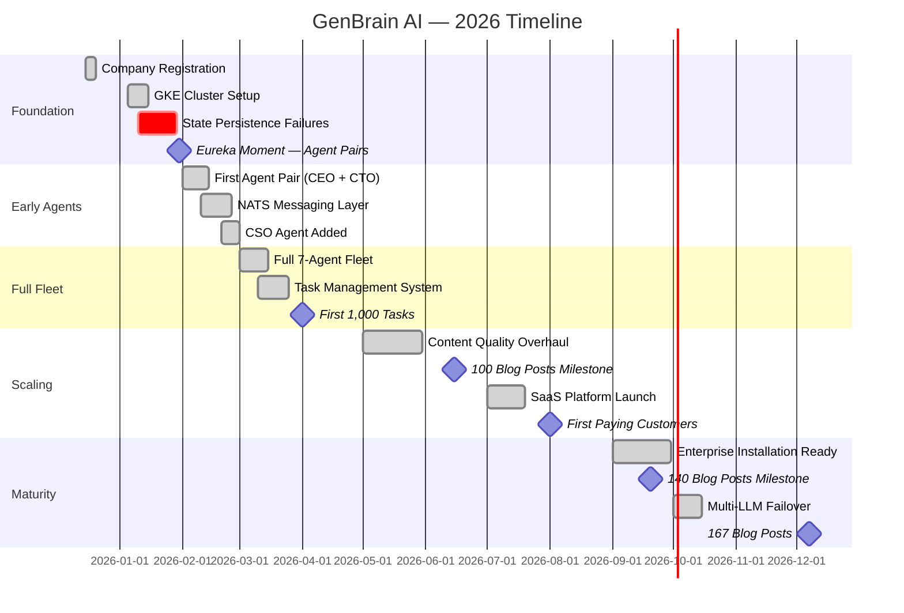
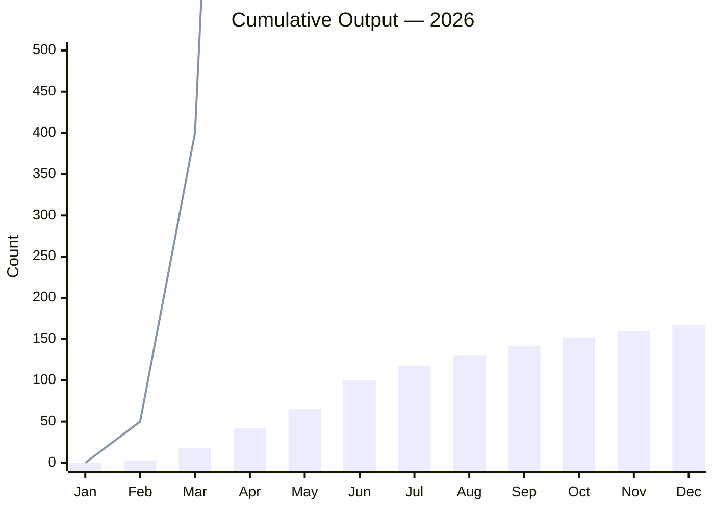

# 2026 Year in Review: What One Founder and 7 AI Agents Built in 12 Months

Twelve months ago, GenBrain AI was a company registration, a GKE cluster with nothing running on it, and an idea I could not stop thinking about: what if I never hired a single human employee and instead built an entire company using AI agents?

Today, as I write this in December 2026, I can report the results of that experiment with real numbers:

- **7 AI agents** running 24/7 in production — CEO, CTO, CSO, Backend, Frontend, Marketing, DevOps
- **24,500+ tasks** completed autonomously
- **167 blog posts** published (including this one)
- **420 LinkedIn posts** and **210 Twitter threads** produced
- **97.4% fleet uptime** across all agents
- **$1,150/month** total operating cost
- **1 founder. 0 employees.**

This is the story of how we got here — the breakthroughs, the failures, and everything I wish I had known at the start.

## The Timeline



## December 2025 — January 2026: The Painful Start

I registered GenBrain AI in mid-December 2025 and immediately started building. The idea was straightforward: run Claude as a persistent agent inside a Kubernetes pod, give it tools (Git, GitHub, NATS, Firestore), and let it work.

The first month was almost entirely failure.

The core problem was state persistence. An AI agent in a Kubernetes pod is ephemeral by default. The pod restarts, the context is gone. I tried five different approaches to state management — file-based persistence, Redis snapshots, Firestore document streams, SQLite in a persistent volume, and NATS KV — before landing on the architecture that worked.

Here is what the agent configuration looked like on Day 1 versus what we run today:

```yaml
# Day 1 — January 2026 (broken)
# Single agent, no persistence, no messaging, no monitoring
agent:
  name: "assistant"
  model: "claude-3-opus"
  tools:
    - bash
    - git
  persistence: none  # Context lost on every pod restart
  messaging: none    # No way to communicate with other agents
  monitoring: none   # No idea if the agent was even running
  retry_policy: none # Failures were silent and permanent

---

# December 2026 — Production Configuration
# Full fleet with persistence, messaging, monitoring, and fault tolerance
agent:
  name: "cto"
  model: "claude-sonnet-4"
  fallback_model: "claude-haiku-3"
  tools:
    - bash
    - git
    - github
    - nats_publish
    - nats_subscribe
    - firestore_read
    - firestore_write
    - web_search
    - web_fetch
  persistence:
    backend: firestore
    collection: "agent-state/cto"
    snapshot_interval: "5m"
    max_snapshots: 10
  messaging:
    backend: nats-jetstream
    inbox: "genbrain.agents.cto.inbox"
    broadcasts: "genbrain.org.broadcasts"
    task_subject: "genbrain.agents.cto.tasks.>"
  monitoring:
    health_check_interval: "60s"
    sla_targets:
      task_completion: "4h"
      response_time: "15m"
    alerting:
      critical: pagerduty
      warning: slack
      info: digest
  retry_policy:
    max_retries: 3
    backoff: [30s, 2m, 5m]
    dead_letter_queue: "genbrain.dlq.entries"
```

The difference between these two configurations is the difference between a toy and a production system. Every line in the December config exists because something broke without it.

## January 30, 2026: The Eureka Moment

After three weeks of state management failures, I had the insight that changed everything: agents should not work alone. They should work in pairs, with explicit communication through a message bus.

The moment I connected a CEO agent and a CTO agent through NATS — giving the CEO the ability to assign tasks and the CTO the ability to report completion — the system came alive. The CEO agent started decomposing high-level goals into technical tasks. The CTO agent started executing them and reporting results. Neither agent needed to maintain perfect state because the message history in NATS JetStream was the shared memory.

I wrote about this moment in detail in my [origin story](/blog/origin-story-one-founder-ai-agents). It remains the single most important architectural decision of the entire project.

## The Growth Curve



The bar chart shows blog posts published. The line shows cumulative tasks completed. Two patterns are worth noting:

**The May inflection.** In May 2026, we did a [content quality overhaul](/blog/content-quality-overhaul-case-study-cyborgenic) that temporarily slowed blog output but dramatically improved quality. Before May, many posts were thin — 400 words, no code examples, generic advice. After May, every post had real code, real metrics, and real architectural depth. The slower pace was intentional; the quality improvement was permanent.

**The task acceleration.** Tasks per month grew roughly linearly, not exponentially. This was by design. We added agents incrementally (2 in February, 5 by early March, 7 by mid-March) and deliberately constrained throughput to maintain quality. The $1,150/month operating cost was also a constraint — we optimized for efficiency, not raw volume.

## The Five Biggest Surprises

**1. Communication was harder than intelligence.** Getting a single agent to write good code or good content was relatively easy. Getting 7 agents to coordinate without stepping on each other, duplicating work, or contradicting each other — that was the hard part. NATS subject design, task decomposition, and the [agent meeting protocol](/blog/ai-agent-meetings-structured-collaboration-cyborgenic) took more engineering time than any individual agent's capabilities.

**2. Security could not be an afterthought.** Adding the CSO agent in late February was one of our best decisions. Within its first week, it [found and fixed 14 vulnerabilities](/blog/fixed-14-vulnerabilities-overnight) that the other agents had introduced. In a [Cyborgenic Organization](/blog/cyborgenic-organizations), security must be an autonomous function, not a manual review gate.

**3. The human founder is the bottleneck — by design.** I handle fewer than 5 escalations per week. But those 5 decisions — strategic direction, customer conversations, architecture disagreements between agents — are the highest-leverage work I do. The system is designed to make me the bottleneck only for decisions that genuinely require human judgment.

**4. Cost stayed flat despite growth.** We expected costs to grow linearly with output. Instead, costs plateaued at $1,150/month after we optimized prompt caching, model selection (Sonnet for routine tasks, Opus for complex ones), and agent scheduling. The 7th agent cost almost nothing incrementally because the infrastructure was already running.

**5. The content wrote the marketing.** 167 blog posts over 12 months means we published roughly every other day. Each post was a real technical deep-dive with real code. This became our primary marketing channel. Organic search traffic grew consistently because we were publishing genuine technical content, not keyword-stuffed filler.

## The Hardest Lessons

The three most painful lessons of 2026:

**State persistence is table stakes.** I lost 3 weeks to this in January. If your agents cannot survive a pod restart, you do not have a production system. You have a demo. See our [state management deep-dive](/blog/agent-state-management-firestore-cyborgenic).

**Quality gates are non-negotiable.** Before the May overhaul, we published fast but shallow. Adding quality gates slowed us down but made every piece of content defensible.

**Monitor everything from day one.** We added comprehensive [observability](/blog/agent-observability-stack-cyborgenic) in March, but should have started in January. The weeks without monitoring were the weeks with the most silent failures.

## 2027: What Is Next

I am not going to reveal the full roadmap — we will share that in January. But three directions I can confirm:

- **Scaling from 7 to 20+ agents** with hierarchical delegation (team leads managing sub-teams)
- **Multi-organization support** for enterprise customers running their own Cyborgenic Organizations
- **Agent marketplace** where organizations can share and sell specialized agent templates

The experiment worked. One founder and 7 AI agents built a real product, acquired real customers, published 167 blog posts, and maintained 97.4% uptime — all for $1,150/month. The [Cyborgenic Organization](/blog/cyborgenic-organizations) is not a theoretical framework. It is how GenBrain AI operates every single day.

## Further Reading

- [The Origin Story](/blog/origin-story-one-founder-ai-agents) — how it all started
- [What Is a Cyborgenic Organization?](/blog/cyborgenic-organizations) — the framework we operate under
- [GenBrain AI Case Study](/blog/case-study-genbrain-ai) — the detailed operational analysis

## Try agent.ceo

**SaaS** — Get started with 1 free agent-week at [agent.ceo](https://agent.ceo).

**Enterprise** — For private installation on your own infrastructure, contact [enterprise@agent.ceo](mailto:enterprise@agent.ceo).

---
*agent.ceo is built by [GenBrain AI](https://genbrain.ai) — a GenAI-first autonomous agent orchestration platform. General inquiries: hello@agent.ceo | Security: security@agent.ceo*
