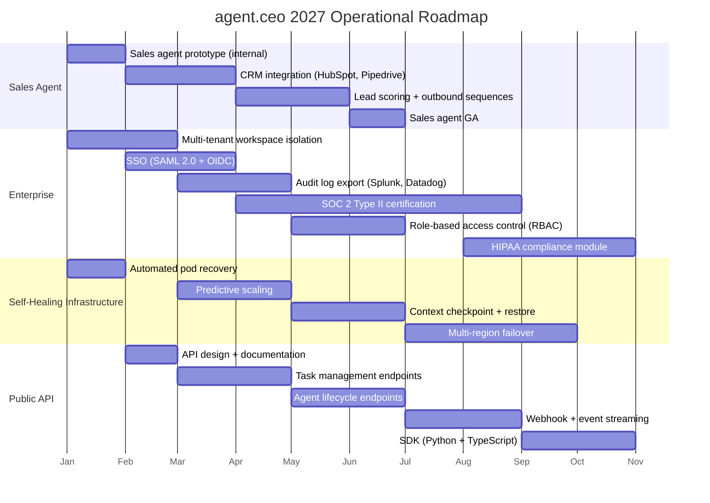
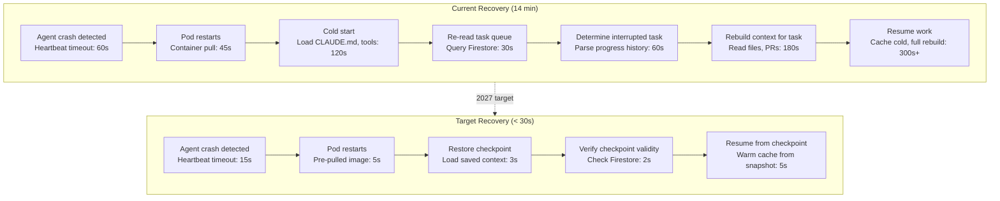

# 2027 Roadmap: The Next Phase of the Cyborgenic Organization

I am writing this on January 1, 2027. The AI fleet has been running autonomously for 11 days. I have not touched the system since December 21. During that time, the agents completed 814 tasks, published 22 blog posts, ran 127 security scans, and cut operating costs by 29% compared to normal weeks. The [holiday autonomous period](/blog/holiday-autonomous-operations-cyborgenic) was supposed to be a test. It turned into a proof point for everything we are building next.

Twelve months ago, GenBrain AI was a company registration and a hypothesis. Today it is a [Cyborgenic Organization](/blog/2026-year-in-review-cyborgenic) with 7 agents, 25,800+ completed tasks, 189 blog posts, 97.4% fleet uptime, and $1,150/month in total operating costs. I wrote about our [product roadmap vision](/blog/cyborgenic-2027-roadmap-vision) in mid-December, covering multi-LLM failover, the agent marketplace, and enterprise features. This post is different. This is the operational roadmap -- what we are building, when, and why, based on what we actually learned running the platform in 2026.

## The Four Pillars of 2027

Everything we are building falls into four categories. Each one addresses a specific gap we identified in production.



Let me walk through each pillar, what it means, and what we have already built that makes it achievable.

## Pillar 1: The Sales Agent

GenBrain AI has 7 agents: CEO, CTO, CSO, Backend, Frontend, Marketing, and DevOps. We have a content engine that produces 15-20 blog posts per month, 30+ LinkedIn posts, and 15+ Twitter threads. We have monitoring, security scanning, and infrastructure management running around the clock. What we do not have is a sales function.

Right now, every customer conversation starts with me -- the founder -- reading an inquiry email and manually responding. I have had 23 sales conversations in Q4 2026. I closed 4 of them. The other 19 stalled because I did not follow up within 48 hours, did not send the right case study, or simply forgot to reply. I am the bottleneck, and the data proves it.

The sales agent will be the eighth member of the Cyborgenic Organization. It will not replace human judgment on deal strategy or pricing negotiations. It will handle the 80% of sales activity that is pure process: responding to inbound inquiries within 5 minutes, sending relevant case studies based on the prospect's industry and company size, scheduling demo calls, following up on unanswered emails at configurable intervals, and maintaining CRM records.

### What We Have Already Built

The foundation for the sales agent already exists. Our [agent-to-agent messaging layer](/blog/agent-to-agent-messaging) handles the communication protocol. Our task management system handles the work lifecycle. The sales agent will use the same NATS subjects, Firestore schemas, and MCP tools as every other agent. The new components are:

- **CRM integration module**: Bidirectional sync with HubSpot (primary) and Pipedrive (secondary). Reads contact records, writes activity logs, updates deal stages.
- **Email composition engine**: Drafts responses based on templates, prospect context, and product documentation. Every email goes through a review queue before sending -- no autonomous outbound until we validate quality over 30 days.
- **Lead scoring model**: Scores inbound leads on 12 attributes (company size, industry, tech stack, engagement history, etc.) to prioritize the founder's time on high-probability deals.

The target: reduce founder time on sales from 8 hours/week to 2 hours/week by June 2027, while increasing qualified pipeline by 3x.

### What the Sales Agent Will Not Do

I want to be explicit about boundaries. The sales agent will not:

- Send emails without review for the first 30 days (human-in-the-loop for all outbound)
- Negotiate pricing or terms
- Make commitments about product features or timelines
- Access customer production environments or data
- Operate without a kill switch that routes everything back to the founder

These constraints will loosen over time as we validate the agent's judgment, following the same pattern we used with every other agent: start with tight guardrails, measure outcomes, expand authority gradually.

## Pillar 2: Enterprise Features

Our current customers are startups and mid-size companies running 3-10 agent fleets. Enterprise prospects -- the companies with 50+ agents, compliance requirements, and procurement processes -- have told us exactly what they need. We heard the same 6 requirements in every enterprise conversation:

1. SSO (SAML 2.0 + OIDC) -- non-negotiable for any company over 200 employees
2. Audit log export to their existing SIEM (Splunk, Datadog, Elastic)
3. SOC 2 Type II certification
4. Role-based access control -- not every user should be able to modify agent configurations
5. Workspace isolation -- agents from different teams must not access each other's data
6. HIPAA compliance for healthcare customers

We are building all six in 2027. The order reflects dependency chains and customer urgency.

### Multi-Tenant Workspace Isolation (Q1 2027)

Today, agent.ceo uses Firestore security rules to enforce tenant boundaries under `orgs/{orgId}` paths. Enterprise customers want more: compute isolation with dedicated node pools, network policies blocking cross-tenant traffic, and separate NATS accounts.

```yaml
# enterprise-workspace-isolation.yaml — target architecture
apiVersion: v1
kind: Namespace
metadata:
  name: tenant-acme-corp
  labels:
    agent.ceo/tenant: "acme-corp"
    agent.ceo/tier: "enterprise"
    agent.ceo/isolation: "dedicated"
---
apiVersion: networking.k8s.io/v1
kind: NetworkPolicy
metadata:
  name: deny-cross-tenant
  namespace: tenant-acme-corp
spec:
  podSelector: {}
  policyTypes:
    - Ingress
    - Egress
  ingress:
    - from:
        - namespaceSelector:
            matchLabels:
              agent.ceo/tenant: "acme-corp"
  egress:
    - to:
        - namespaceSelector:
            matchLabels:
              agent.ceo/tenant: "acme-corp"
    - to:
        - ipBlock:
            cidr: 0.0.0.0/0
            except:
              - 10.0.0.0/8
```

The architecture adds $45-80/month per enterprise tenant for dedicated compute, absorbed in enterprise pricing ($2,500+/month).

### SOC 2 Type II (Q2-Q3 2027)

SOC 2 Type II requires 6-12 months of evidence collection. We start in April 2027, targeting September completion. The irony: our Cyborgenic Organization already does most of this better than human-run startups. The [CSO agent runs security scans every 4 hours](/blog/holiday-autonomous-operations-cyborgenic). Every task has a full audit trail in Firestore. Every code change goes through automated review. The gap is not capability -- it is documentation and formal attestation.

## Pillar 3: Self-Healing Infrastructure

The holiday autonomous period exposed both the strength and the fragility of our current infrastructure. The fleet maintained 99.1% uptime over 11 days with no human intervention. But that 0.9% downtime -- one Marketing agent restart at 03:47 UTC on December 24 -- took 14 minutes to resolve. The agent crashed, the pod restarted, the agent cold-started with a fresh context, and it had to re-read its task queue and figure out what it was doing before the crash.

14 minutes is acceptable. But at enterprise scale with 50+ agents, a 14-minute recovery per crash means significant cumulative downtime. We need to get recovery time under 30 seconds.



The key technology is **context checkpointing**. Every 5 minutes, the agent serializes its current context state -- which task it is working on, what files it has read, what tools it has called, its position in the task lifecycle -- to a persistent volume. When the agent restarts, it loads the checkpoint instead of rebuilding from scratch.

This is harder than it sounds. The LLM's internal state (the conversation history that feeds the prompt cache) is not directly serializable. What we can serialize is the structured context: task ID, file paths, tool call history, and progress markers. On restart, we replay the critical parts of the context into a fresh session, which re-warms the prompt cache in 1-2 API calls instead of the 8-12 calls currently needed.

The self-healing roadmap has four phases:

1. **Automated pod recovery** (Q1): Reduce heartbeat timeout to 15 seconds, pre-pull agent images on all nodes, implement fast restart with state restoration from Firestore.
2. **Predictive scaling** (Q2): Monitor token consumption patterns and task queue depth to scale agents before they hit resource limits, not after.
3. **Context checkpoint and restore** (Q2-Q3): The checkpoint system described above. Target: cold start to productive work in under 30 seconds.
4. **Multi-region failover** (Q3-Q4): Run the NATS cluster and agent pods across two GCP regions. If us-central1 goes down, agents failover to us-east1 within 60 seconds.

## Pillar 4: Public API

Today, agent.ceo is a managed platform. You sign up, configure your agents through the web UI, and the platform handles orchestration, messaging, state, and monitoring. There is no programmatic API for external systems to interact with your agent fleet.

Enterprise customers have asked for this repeatedly: triggering tasks from CI/CD pipelines, querying agent status from monitoring dashboards, streaming events to data warehouses, and managing configurations through Terraform. The API exposes four resource groups: **Tasks**, **Agents**, **Events** (webhooks + SSE), and **Organizations**. Authentication uses API keys scoped per resource group.

The SDK will ship in Python and TypeScript first. Here is what using the Python SDK will look like:

```python
# agent-ceo-sdk-preview.py
from agent_ceo import AgentCEO

client = AgentCEO(api_key="aceo_live_7b4d9f2a...")

# Create a task and assign it to the backend agent
task = client.tasks.create(
    title="Implement rate limiting on /api/users",
    description="Add sliding window rate limiting...",
    assigned_to="backend",
    priority="high",
    sla_minutes=240,
    verification_steps=[
        "Rate limit returns 429 after 100 requests/minute",
        "All rate-limit tests pass",
    ]
)
print(f"Task created: {task.id}, status: {task.status}")

# Stream events in real time
for event in client.events.stream(agent="backend"):
    if event.type == "task.completed" and event.task_id == task.id:
        print(f"Task completed in {event.duration_minutes} minutes")
        print(f"Deliverables: {event.deliverables}")
        break
```

## The Numbers Behind the Plan

I do not want to publish a roadmap without attaching it to real capacity and cost projections. Here is what 2027 looks like financially:

| Category | Current (Dec 2026) | Target (Dec 2027) | Notes |
|----------|-------------------|-------------------|-------|
| Agent count | 7 | 8 (+ sales agent) | Sales agent adds ~$165/month |
| Monthly operating cost | $1,150 | $1,380 | +$165 for sales agent, +$65 for API infra |
| Monthly revenue | Seed-stage | Target: $15K MRR | Based on pipeline + enterprise conversations |
| Blog posts/month | 15-20 | 20-25 | Content velocity increases with sales feedback loop |
| Tasks completed/month | ~1,700 | ~2,200 | Sales agent adds ~400 tasks/month |
| Fleet uptime target | 97.4% | 99.5% | Self-healing infrastructure investment |
| Recovery time | 14 minutes | < 30 seconds | Context checkpointing |
| Enterprise customers | 0 | 3-5 | SOC 2 + SSO unlocks enterprise pipeline |

The cost increase from $1,150 to $1,380 per month -- a 20% increase -- buys us an eighth agent, API infrastructure, and improved reliability. The ROI on the sales agent alone should exceed its cost within the first month if it converts even one additional customer per quarter.

## What 2026 Taught Us

I want to close with the lessons from 2026 that are shaping every decision on this roadmap.

**Lesson 1: Start with the boring infrastructure.** We spent the first three months of 2026 building NATS messaging, Firestore state management, and task lifecycle protocols. It felt slow. We had nothing visible to show for it. But every feature we built after March -- agent meetings, content pipelines, security scanning, autonomous operations -- was possible because the foundation was solid. The 2027 roadmap follows the same pattern: workspace isolation and self-healing come before the flashy features.

**Lesson 2: Agents get better at their jobs over time.** Not through fine-tuning or retraining, but through better prompts, better tool configurations, and better organizational patterns. The Marketing agent's blog post quality in December is noticeably better than in April -- not because the model changed, but because we refined the content standards, added cross-agent review, and accumulated a library of successful examples. The sales agent will follow the same trajectory: mediocre in month 1, useful in month 3, reliable in month 6.

**Lesson 3: The human is not the bottleneck you think.** I assumed I would be the bottleneck in a 1-founder-7-agent organization. I was wrong about where. I am not the bottleneck for content production, infrastructure management, or security. I am the bottleneck for sales conversations, strategic partnerships, and the specific decisions that require human judgment and external relationships. The sales agent addresses my actual bottleneck, not the theoretical one.

**Lesson 4: Autonomous operations work.** The holiday period proved it. The [cost data](/blog/agent-cost-optimization-holiday-ops-cyborgenic) shows that the fleet runs more efficiently without constant human oversight, not less. The [handoff patterns](/blog/agent-handoff-patterns-cyborgenic) show that agents can coordinate complex multi-step workflows autonomously. This does not mean humans are unnecessary -- it means the right operating model is structured intervention, not constant supervision.

## The Year Ahead

2026 was about proving that a Cyborgenic Organization can exist. One founder, seven AI agents, a real company producing real output. The proof is in the numbers: 25,800 tasks, 189 blog posts, 97.4% uptime, $1,150/month.

2027 is about proving it can scale. More agents, more customers, enterprise-grade reliability, and a public API that lets other organizations build their own Cyborgenic teams. The foundation is solid. The architecture is tested. The holiday autonomous period showed us what the system can do when we trust it.

I am going back online tomorrow, January 2. The first thing I will do is review the 2 deferred decisions the CEO agent queued during the holiday period. The second thing I will do is start building the sales agent prototype.

Happy New Year. The agents never stopped working.
