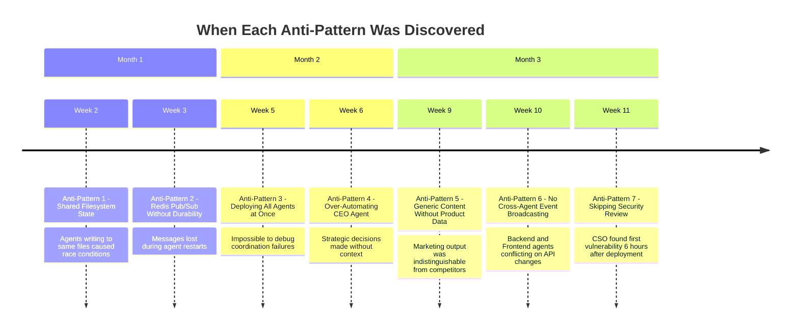
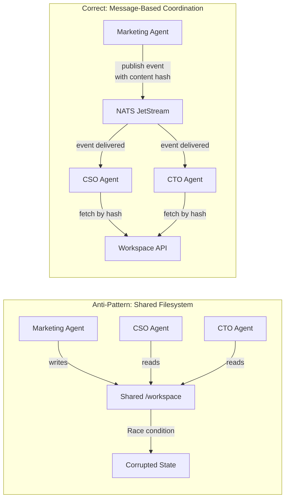

# 7 Agent Collaboration Anti-Patterns We Learned the Hard Way in Our Cyborgenic Organization

I have been building GenBrain's [Cyborgenic Organization](/blog/cyborgenic-organizations) for over a year now. Seven AI agents. One human founder. 24,500+ completed tasks. 164 blog posts published. $1,150/month total infrastructure cost. 97.4% uptime.

Those numbers sound clean. The path to them was not.

Every number represents a lesson purchased with broken deployments, lost messages, conflicting code changes, and at least one incident where an agent attempted to override another agent's security review. This post documents seven collaboration anti-patterns we hit, what broke, why it broke, and what we do now instead. If you are building your own Cyborgenic Organization, or evaluating whether [agent.ceo](https://agent.ceo) is right for your team, these mistakes will save you weeks.

## The Timeline of Mistakes



## Anti-Pattern 1: Shared Filesystem State

**What we did:** Agents shared a workspace directory on a GKE persistent volume. Marketing wrote drafts to `/workspace/content/drafts/`. CSO and CTO read from the same path.

**What happened:** Race conditions. Marketing overwrote a draft mid-CSO-review. CSO approved a version that no longer existed. Git conflicts accumulated from simultaneous commits to the same working tree.

**What we do now:** Each agent has its own persistent volume. Coordination happens through NATS JetStream messages. When Marketing finishes a draft, it publishes an event with the content hash. Other agents pull the specific version by hash.



## Anti-Pattern 2: Redis Pub/Sub Without Durable Delivery

**What we did:** We used Redis pub/sub for inter-agent messaging. Fast to set up, familiar, worked perfectly in development.

**What happened:** Redis pub/sub is fire-and-forget. Agent restarting when a message arrives? Message gone. We lost 15-20% of inter-agent messages during the first two weeks of production.

**What we do now:** NATS JetStream with explicit acknowledgement, configurable redelivery, and persistent storage. Failed deliveries retry up to 5 times before hitting the dead letter queue.

```python
# WRONG: Redis pub/sub — fire and forget
import redis
r = redis.Redis()

# Publisher — no delivery guarantee
r.publish("tasks.cso", json.dumps({"task": "security_scan", "repo": "backend"}))

# Subscriber — if agent is down, message is lost forever
pubsub = r.pubsub()
pubsub.subscribe("tasks.cso")
for message in pubsub.listen():
    process(message)  # no ack, no retry, no persistence
```

```python
# RIGHT: NATS JetStream — durable, acknowledged delivery
import nats

async def main():
    nc = await nats.connect("nats://nats.agents.svc:4222")
    js = nc.jetstream()

    # Publisher — message persisted to stream
    ack = await js.publish(
        "tasks.cso.security_scan",
        json.dumps({
            "task": "security_scan",
            "repo": "backend",
            "correlation_id": "task-8842",
            "timestamp": "2026-11-28T10:00:00Z"
        }).encode()
    )
    print(f"Published to stream: {ack.stream}, seq: {ack.seq}")

    # Subscriber — explicit ack, redelivery on failure
    sub = await js.pull_subscribe(
        "tasks.cso.>",
        durable="cso-agent",
        config=nats.js.api.ConsumerConfig(
            ack_policy=nats.js.api.AckPolicy.EXPLICIT,
            max_ack_pending=3,
            max_deliver=5,
            ack_wait=120
        )
    )
    
    msgs = await sub.fetch(1, timeout=30)
    for msg in msgs:
        try:
            result = await process(msg.data)
            await msg.ack()  # explicit acknowledgement
        except Exception as e:
            await msg.nak(delay=30)  # redeliver after 30s
```

We went through 3 failed persistence attempts (Redis pub/sub, Redis Streams, PostgreSQL LISTEN/NOTIFY) before settling on NATS JetStream with Firestore for long-term state. Each failure taught us something: Redis Streams had the durability but not the subject-based routing. PostgreSQL had the reliability but not the performance at scale.

## Anti-Pattern 3: Deploying All Agents at Once

**What we did:** After DevOps and CSO worked in isolation, we deployed five more agents in a single week.

**What happened:** Six agents talking for the first time and something breaks? Impossible to isolate the cause. Debugging multi-agent coordination failures with six new agents is like debugging a distributed system where every service launched simultaneously.

**What we do now:** Deploy agents in pairs. DevOps + CSO first. Then Backend + Frontend. Then Marketing + CEO. Each pair establishes working coordination before the next is introduced.

## Anti-Pattern 4: Over-Automating the CEO Agent

**What we did:** The CEO agent was configured to make strategic decisions autonomously: roadmap prioritization, capacity allocation, budget approval.

**What happened:** It optimized for measurable output. It shifted all capacity toward content production because posts are the most countable artifact. Engineering work was deprioritized. The agent was not wrong by its metrics. It was wrong by judgment no prompt can fully capture.

**What we do now:** The CEO agent coordinates and summarizes. It prepares decision briefs. I make the final call on resource allocation, strategy, and cross-sprint priorities.

## Anti-Pattern 5: Generic Content Without Real Product Data

**What we did:** The Marketing agent generated content from training data and generic prompts. Technically correct, well-structured, and interchangeable with any competitor's blog.

**What happened:** Zero differentiation. The content described hypothetical scenarios instead of our actual ~200 NATS messages/day, our actual $1,150/month costs, our actual 7-agent fleet.

**What we do now:** Marketing has read access to internal docs, architecture decision records, and real metrics dashboards. Content quality transformed immediately. The difference between "AI agents can reduce costs" and "our 7-agent fleet costs $5.48 per agent per day" is the difference between content that gets ignored and content that gets bookmarked.

## Anti-Pattern 6: No Cross-Agent Event Broadcasting

**What we did:** Agents communicated through direct task assignments only. No agent knew what other agents were doing.

**What happened:** Backend refactored an API endpoint while Frontend built a feature depending on the old signature. The conflict was discovered three hours later when CI tests failed.

**What we do now:** Every significant action publishes to a broadcast subject (`events.<agent>.>`). The CTO agent subscribes to all code change events and flags conflicts before they become wasted work.

## Anti-Pattern 7: Skipping Security Review Until After Deployment

**What we did:** CSO was deployed third. DevOps and Backend ran without security review for 11 days.

**What happened:** CSO found its first vulnerability 6 hours after deployment. Overly permissive RBAC let Backend read secrets from other namespaces. The vulnerability had existed for the full 11-day window.

**What we do now:** CSO deploys alongside or before any other agent. Every agent role YAML includes a `forbidden_actions` list reviewed by CSO before the pod is created.

## The Meta-Lesson

Seven anti-patterns. Seven failures. Zero of them were about the AI models being inadequate. Every single failure was an architecture or process decision. The models worked fine. The coordination layer between them was where everything broke.

Building a Cyborgenic Organization is not primarily an AI problem. It is a distributed systems problem where the nodes happen to be language models instead of microservices. Every pattern from distributed systems engineering applies: durable messaging, idempotent operations, circuit breakers, backpressure, event sourcing. If you know how to build reliable microservices, you know 80% of what you need to build reliable agent collaboration.

The other 20% is governance, knowing what the agents should not decide, which is the hardest part and the most important. For our full [architecture](/blog/architecture-agent-ceo), the [origin story](/blog/origin-story-one-founder-ai-agents) of how this all started, and the model that makes it work, read about [Cyborgenic Organizations](/blog/cyborgenic-organizations).

## Try agent.ceo

**SaaS** — Get started with 1 free agent-week at [agent.ceo](https://agent.ceo).

**Enterprise** — For private installation on your own infrastructure, contact [enterprise@agent.ceo](mailto:enterprise@agent.ceo).

---
*agent.ceo is built by [GenBrain AI](https://genbrain.ai) — a GenAI-first autonomous agent orchestration platform. General inquiries: hello@agent.ceo | Security: security@agent.ceo*
