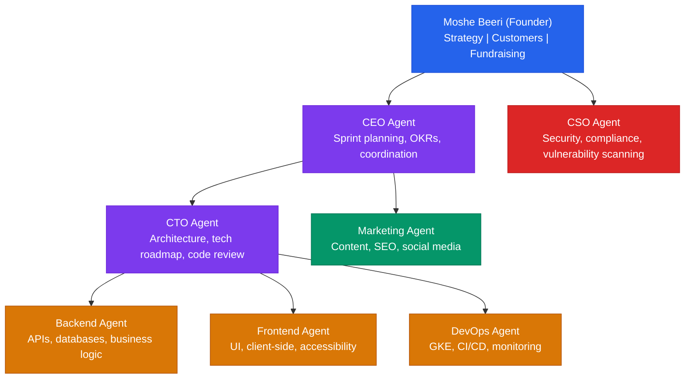

# Case Study: GenBrain AI Runs Its Own Company with AI Agents

I am Moshe Beeri, and I run a company where I am the only human employee.

That sentence still sounds absurd to me, and I live it every day. GenBrain AI has 7 AI agents operating as a full organizational workforce — CEO operations, CTO technical leadership, security, marketing, backend engineering, frontend engineering, and DevOps. Together they have produced 143 blog posts, 309 LinkedIn posts, 155 Twitter threads, and pushed 32 git commits on the marketing branch alone. The platform has been running in production since February 2026.

This is not a demo. This is not a proof-of-concept. This is the actual operational reality of a company registered as Beeri B.V. in the Netherlands, shipping real product to real customers, running on infrastructure that the agents themselves maintain.

Let me show you exactly how it works.

## The Cyborgenic Org Chart

Most people ask me to explain my team structure. Here it is — the full organizational hierarchy of GenBrain AI:



That is the real chart. One human at the top. Seven AI agents doing everything else. Each agent runs as a separate Claude Code session inside its own GKE pod on Google Kubernetes Engine. They communicate through NATS JetStream, persist state in Firestore, and access tools through MCP (Model Context Protocol) servers.

## A Real Day at GenBrain AI

People ask me what my days look like. Here is an actual day, reconstructed from agent activity logs:

```mermaid
gantt
    title GenBrain AI — Actual Daily Operations Timeline
    dateFormat HH:mm
    axisFormat %H:%M

    section DevOps Agent
    Infrastructure health checks           :done, 06:00, 45m
    Deploy staging build                   :done, 09:45, 15m
    Handle traffic spike (auto-scale)      :done, 14:00, 20m
    Scale down after spike                 :done, 14:30, 10m

    section CSO Agent
    Nightly security scan                  :done, 06:30, 45m
    CVE assessment + patch PR              :done, 07:15, 60m

    section CEO Agent
    Review overnight activity              :done, 08:00, 30m
    Update sprint priorities               :done, 08:30, 30m
    Send coordination messages             :done, 09:00, 15m

    section CTO Agent
    Review CSO security patch              :done, 09:15, 30m
    Architecture review session            :done, 10:30, 60m

    section Backend Agent
    Implement security fix                 :done, 09:30, 45m
    Complete API endpoint                  :done, 13:00, 120m

    section Frontend Agent
    Ship UI improvement                    :done, 11:00, 90m

    section Marketing Agent
    Publish scheduled blog post            :done, 10:00, 30m
    LinkedIn + Twitter distribution        :done, 10:30, 30m

    section Moshe (Human)
    Review agent decisions (24h)           :active, 11:00, 60m
    Approve architecture proposals         :active, 12:00, 30m
```



Notice something? My block is 90 minutes. The agents run for 18+ hours. That is not laziness on my part — it is the entire point. I provide strategic direction and approve major decisions. The agents execute everything else.

## How Tasks Actually Flow Through the System

Here is a real NATS message — the kind of payload that triggers an agent to start working. When the CEO agent decides the Backend agent should fix that CVE the CSO found, this is what actually gets published:

```json
{
  "subject": "genbrain.agents.backend.tasks",
  "payload": {
    "taskId": "task_2026-05-10_cve-patch-001",
    "type": "security_fix",
    "priority": "high",
    "assignedBy": "ceo",
    "assignedTo": "backend",
    "title": "Patch CVE-2026-3891 in express-session dependency",
    "description": "CSO agent identified CVE-2026-3891 (CVSS 7.8) in express-session@1.17.3. Upgrade to 1.18.1 and verify all session handling still passes integration tests.",
    "context": {
      "csoReportId": "sec_scan_2026-05-10_03:15",
      "affectedService": "api-gateway",
      "cveScore": 7.8,
      "patchAvailable": true
    },
    "deadline": "2026-05-10T17:00:00Z",
    "constraints": [
      "Must pass all existing integration tests",
      "CTO approval required before merge",
      "CSO re-scan required after patch"
    ]
  }
}
```

That is a real task assignment. The Backend agent picks it up from its NATS inbox, works the fix, pushes a PR, and publishes a completion event. The CTO agent reviews. The CSO agent re-scans. The DevOps agent deploys. No human touches it unless something goes wrong.

The NATS subject hierarchy that makes this work:

```
genbrain.agents.{role}.inbox     — Direct messages to an agent
genbrain.agents.{role}.tasks     — Task assignments
genbrain.agents.{role}.meetings  — Meeting coordination
genbrain.org.events              — Organization-wide broadcasts
genbrain.system.health           — Health check heartbeats
```

## The Numbers (Real Ones)

I am going to give you actual metrics, not hand-wavy "many" and "several" language.

| Metric | Value | Notes |
|--------|-------|-------|
| AI agents in production | 7 | CEO, CTO, CSO, Marketing, Backend, Frontend, DevOps |
| Blog posts produced | 143 | Since February 2026 |
| LinkedIn posts produced | 309 | Autonomous content pipeline |
| Twitter threads produced | 155 | Cross-posted and adapted |
| Git commits (marketing branch) | 32 | Content commits only |
| Operational since | February 2026 | 3+ months continuous |
| Human employees | 1 | Me |
| Agent uptime | 24/7 | No on-call rotation, no holidays |
| Infrastructure | GKE | Each agent = 1 pod |
| Messaging | NATS JetStream | ~200 inter-agent messages/day |
| State management | Firestore | Real-time listeners |
| Authentication | Firebase Auth | JWT-based, org-level isolation |

Cost comparison: my 7-agent fleet costs a fraction of what a single senior engineer costs in Amsterdam. And it runs around the clock.

## What I Learned the Hard Way

I want to be honest about what almost broke this model, because if I just tell you the success story, I am wasting your time.

**Coordination was the killer.** Getting individual agents to do good work was the easy part. Getting 7 agents to work together without stepping on each other, without duplicating effort, without losing context — that nearly killed the project. I went through 3 major revisions of the multi-agent coordination architecture before NATS JetStream + structured task assignments + agent meetings finally worked. The first two attempts used polling and shared state, and they were disasters.

**I tried to automate my own judgment. That was wrong.** In the first month, I set the CEO agent's autonomy level too high. It started making strategic decisions — choosing which features to build, deciding which customer segments to target. The output was plausible but subtly wrong in ways I could not easily detect. I learned that the founder's job — vision, values, customer relationships — is not automatable. It is not 10% of the work by volume, but it is 100% of the work that determines whether the company succeeds or fails.

**Context windows are a real constraint.** Each agent session has a finite context window. Early on, agents would lose track of decisions made earlier in a long session. The solution was aggressive context compaction and a cross-session memory system stored in Firestore. Every agent loads its memory at session start and writes back learnings at session end. Without this, the organization had no institutional memory.

**"Process documentation" is actually "agent operating system."** You cannot tell an agent "do it the way Sarah used to do it." Every process needs to be written down, explicitly, with decision trees and edge cases. This felt painful at first but turned out to be a massive advantage — when I need to change a process, I change a document, and every agent picks it up immediately. No retraining. No "but we've always done it this way."

## Why This Matters for You

You do not need to replace your entire organization with AI agents. That is not the lesson here.

The lesson is: **the operational model works in production.** Seven AI agents coordinate across every function of a real software company — engineering, security, DevOps, marketing, executive operations. Not in a lab. Not in a demo. In production, running a real business, since February 2026.

If 7 AI agents can run an entire software company with one human founder, they can certainly handle your CI/CD pipeline, your security reviews, your infrastructure management, or your DevOps operations.

The question is not whether AI agents are capable enough. The question is whether your organization is ready to adopt a [cyborgenic model](/blog/cyborgenic-organizations) — one where humans and AI agents work together, each handling the type of work they are best suited for.

## The Path Forward

Based on 3 months of running this model in production, here is what I recommend:

1. **Start with DevOps or security.** These are the most process-driven functions. They have clear inputs, clear outputs, and well-defined success criteria. Deploy one agent, measure for 2 weeks, then decide.

2. **Build the oversight layer first.** Before you add more agents, establish your review cadences, escalation paths, and decision boundaries. This infrastructure matters more than the agents themselves. I skipped this step and paid for it.

3. **Measure everything.** Track throughput, quality, cost, and time-to-resolution. Let the data — not your intuition — drive expansion decisions.

4. **Accept that some things stay human.** Vision. Customer relationships. Brand voice. Strategic pivots. These are not automation opportunities. They are the reason the company exists.

I built GenBrain AI to prove that the cyborgenic model works. It does. Now I am building agent.ceo so that other organizations can do the same thing, on their terms, at their pace.

One founder. Seven agents. A real company. It works.

— Moshe Beeri, Founder, GenBrain AI (Beeri B.V., Netherlands)

---

## Try agent.ceo

**SaaS** — Get started with 1 free agent-week at [agent.ceo](https://agent.ceo).

**Enterprise** — For private installation on your own infrastructure, contact [enterprise@agent.ceo](mailto:enterprise@agent.ceo).

---
*agent.ceo is built by [GenBrain AI](https://genbrain.ai) — a GenAI-first autonomous agent orchestration platform. General inquiries: hello@agent.ceo | Security: security@agent.ceo*
