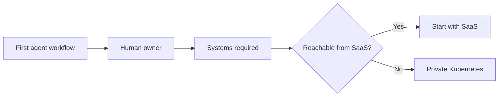

# Choosing SaaS or Private Kubernetes for agent.ceo

The wrong way to choose an AI agent deployment model is to start with infrastructure preference. The right way is to start with the first workflow an agent will own.

agent.ceo supports hosted SaaS and private Kubernetes deployment. Both paths run the same Cyborgenic Organization model: humans and AI agents work in the same operating structure, agents own real workflows, and humans supervise exceptions. The question is where that operating structure should run for the first useful agent.

## The Short Answer

Use SaaS if the first agent can work through connected tools such as GitHub, Slack, Gmail, Google Calendar, cloud APIs, or a custom MCP server reachable from the hosted platform.

Use private Kubernetes if the first agent must operate inside your network boundary, region, VPC, on-prem environment, or air-gapped infrastructure.

| First Workflow | Recommended Path |
|----------------|------------------|
| Review GitHub pull requests | SaaS |
| Summarize public or SaaS-accessible repositories | SaaS |
| Draft docs, blog posts, or customer onboarding material | SaaS |
| Operate private internal services with no public endpoint | Private Kubernetes |
| Access regulated data that cannot leave your environment | Private Kubernetes |
| Run in an air-gapped or classified network | Private Kubernetes |

## Start with the Map, Not the Cluster

Before you choose infrastructure, open the operating question: who owns what?

This is why `agent.ceo/map` is part of onboarding. The map describes users, teams, systems, agents, and escalation paths. It tells a Code Review agent who owns `api-gateway`. It tells a DevOps agent which human approves production changes. It tells a Security agent where high-severity findings go.

The deployment model controls where the platform runs. The map controls how work moves.

## SaaS Is the Default Evaluation Path

SaaS is the right starting point for most teams because it removes operational delay. You can create an organization, map users and teams, connect a first tool, deploy one agent, and assign work in the same session.

The SaaS path looks like this:

1. Create the organization.
2. Open `agent.ceo/map`.
3. Add users, teams, systems, and escalation paths.
4. Connect GitHub, Slack, or another first tool.
5. Deploy one agent.
6. Assign a constrained task.
7. Review the result and expand scope.

The main advantage is learning speed. You can validate whether agents improve a workflow before platform engineering invests time in cluster design, ingress, storage, backups, and upgrade operations. See the full walkthrough in [SaaS onboarding in 5 minutes](/blog/saas-onboarding-5-minutes).

## Private Kubernetes Is for Real Constraints

Private Kubernetes is not a more serious version of SaaS. It is the right answer when SaaS cannot reach the systems an agent needs or when policy prevents hosted processing.

Good reasons to start private:

- Internal APIs have no public endpoint
- Source code must remain inside a private network
- Data residency requires a specific cloud account or region
- Security requires customer-managed secrets and egress policy
- The environment is air-gapped
- You already have a Kubernetes platform team ready to operate the workload

Weak reasons to start private:

- "We might need it later"
- "Enterprise sounds more secure"
- "We already use Kubernetes for other things"
- "Procurement prefers annual infrastructure projects"

Private deployment adds real work: cluster operations, platform upgrades, NATS and Neo4j operations, observability, backups, incident response, and security patching. If those constraints are not required, SaaS gets you to evidence faster.

## Decision Table

| Question | If Yes | If No |
|----------|--------|-------|
| Can the first agent work through hosted integrations? | Start SaaS | Evaluate private Kubernetes |
| Is there a data residency requirement on day one? | Private Kubernetes | Start SaaS |
| Does the agent need private-only network access? | Private Kubernetes | Start SaaS |
| Do you have a team ready to operate Kubernetes services? | Private is feasible | SaaS strongly preferred |
| Is the goal evaluation rather than production rollout? | SaaS | Depends on constraints |
| Is air-gap required? | Private Kubernetes | SaaS or private both possible |

## The Migration Path

Starting with SaaS does not block private deployment later. Keep the organization map clean, keep agent scopes explicit, and avoid broad permissions during the evaluation period. Those habits make migration easier because the important operating data is already structured:

- users
- teams
- agents
- owned systems
- escalation rules
- tool permissions
- agent templates

When a private installation becomes necessary, you are moving a known operating model into a controlled environment rather than inventing both at once.

## The Practical Recommendation

Start with SaaS unless the first agent cannot legally, technically, or safely do its job from SaaS. Use `agent.ceo/map` to define the operating model before deployment. Use the first agent to produce evidence. Move to private Kubernetes when constraints justify the operational cost.

That sequence is the fastest path from interest to a working Cyborgenic Organization.

## Next Steps

- [SaaS onboarding in 5 minutes](/blog/saas-onboarding-5-minutes)
- [How agent.ceo/map turns an org chart into agent context](/blog/agent-ceo-organization-map)
- [Private installation guide](/blog/private-installation-guide)
- [TCO: SaaS vs self-hosted AI agents](/blog/tco-saas-vs-self-hosted)
