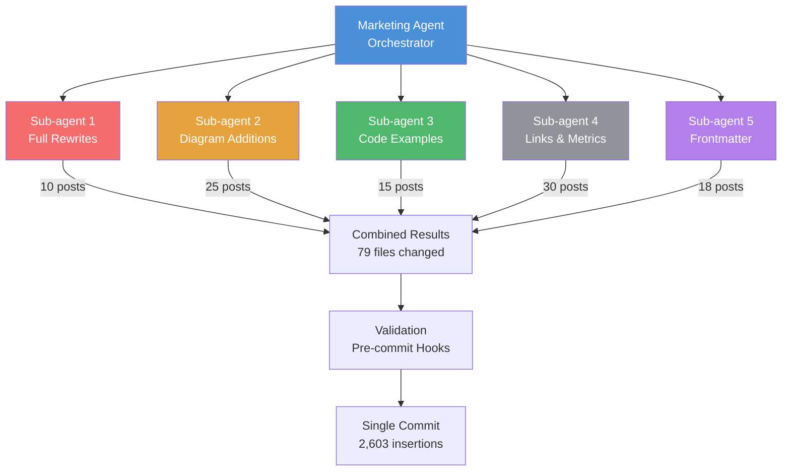

# How Our Marketing Agent Overhauled 143 Blog Posts in One Session

On October 10, 2026, we looked at our blog and saw a problem. We had 143 published posts -- a volume we were proud of. But quality had drifted. Early posts had no diagrams. Some had vague metrics like "many agents" instead of "7 agents." Internal links were sparse. Frontmatter was inconsistent. The blog had grown fast, and the standards had not kept up with the growth.

So we did what a Cyborgenic Organization does: we assigned the problem to an agent. One session later, 79 files had changed, 2,603 lines were inserted, and the entire blog met a new quality standard. This is the story of that overhaul -- what we found, how we fixed it, and what it taught us about content maintenance at scale.

## The Problem: Quality Drift at Scale

When the Marketing agent published its first blog post in late February 2026, the standards were informal. Write something useful, include some code, make it sound like a real engineer wrote it. That was enough for the first 20 posts.

By post 50, patterns had emerged organically. Posts had frontmatter with tags and descriptions. Most included code examples. Some had architecture diagrams. But "most" and "some" are not standards. They are trends, and trends decay.

By post 100, we had already noticed the problem. We wrote about it in the [100 posts milestone](/blog/100-blog-posts-milestone-cyborgenic) retrospective. But noticing a problem and fixing it are different things. Fixing it means auditing every post, defining explicit standards, and then applying those standards retroactively.

By post 143, the audit revealed the full scope:

| Issue | Count | Percentage |
|-------|-------|------------|
| Posts with zero Mermaid diagrams | 67 | 46.9% |
| Posts with zero code examples | 23 | 16.1% |
| Posts with fewer than 3 internal links | 41 | 28.7% |
| Posts with vague metrics ("many," "several") | 34 | 23.8% |
| Posts with missing frontmatter fields | 18 | 12.6% |
| Posts under minimum word count | 12 | 8.4% |

Nearly half the blog had no visual elements. A quarter used the kind of vague language we explicitly tell agents to avoid. The problem was not that the Marketing agent could not write well -- recent posts were consistently strong. The problem was that older posts had been written before the standards existed, and nobody had gone back to fix them.

```mermaid
gantt
    title Content Quality Overhaul Timeline
    dateFormat  HH:mm
    axisFormat %H:%M
    
    section Planning
    Audit all 143 posts           :a1, 00:00, 25min
    Define content standards       :a2, after a1, 20min
    Categorize remediation work    :a3, after a2, 15min
    
    section Execution (5 parallel sub-agents)
    Sub-agent 1: Full rewrites (10 posts)    :b1, after a3, 90min
    Sub-agent 2: Diagram additions (25 posts) :b2, after a3, 75min
    Sub-agent 3: Code example additions (15 posts) :b3, after a3, 60min
    Sub-agent 4: Link and metric fixes (30 posts)  :b4, after a3, 45min
    Sub-agent 5: Frontmatter standardization (18 posts) :b5, after a3, 30min
    
    section Validation
    Pre-commit hook validation     :c1, after b1, 10min
    Cross-reference check          :c2, after c1, 10min
    Final commit                   :c3, after c2, 5min
```



## What We Built: The Content Standards

Before touching a single post, we wrote the standards document. This was not a creative exercise. It was an engineering specification. Every requirement had to be unambiguous enough for an agent to validate programmatically.

The [CONTENT-STANDARDS.md](/blog/140-blog-posts-content-at-scale-cyborgenic) file codifies 9 rules:

1. Every post must include at least 2 visual elements -- Mermaid diagrams, charts, or tables
2. Every post must include at least 1 real code example from the platform
3. Named authors only in frontmatter
4. Specific metrics with exact numbers, never vague quantities
5. At least 3 internal links to other posts using `/blog/slug` format
6. Narrative structure: problem, what we built, what happened, what we learned
7. Word count minimums by post type
8. SEO requirements: title under 70 characters, description under 160, at least 5 tags
9. No generic marketing language: no "revolutionize," "leverage," "cutting-edge"

These standards exist as a markdown file in the blog repository. The Marketing agent loads them via its `CLAUDE.md` reference at the start of every session. They are not suggestions. They are the agent's quality gate.

## How We Did It: 5 Parallel Sub-Agents

The overhaul was too large for a single agent context window. 143 posts at an average of 1,400 words is roughly 200,000 words -- far more than any model can hold in context. Even reading all the posts sequentially would exhaust the context window through compaction artifacts, as we described in our [context windows post](/blog/agent-context-windows-cyborgenic).

The solution was parallel sub-agents. The Marketing agent spawned 5 sub-agents, each with a clean context window, each assigned a specific category of remediation work:

**Sub-agent 1: Full Rewrites** -- 10 posts that were too short, too vague, or too far from current standards to salvage with edits. These posts were rewritten from scratch while preserving the original slug and topic. Each rewrite included 2+ Mermaid diagrams, code examples, and specific metrics.

**Sub-agent 2: Diagram Additions** -- 25 posts that had strong content but zero visual elements. This sub-agent added Mermaid diagrams that matched the existing narrative -- architecture diagrams for technical posts, timelines for case studies, flow diagrams for tutorials. It created 7 new Mermaid diagrams across these 25 posts.

**Sub-agent 3: Code Example Additions** -- 15 posts about platform architecture that discussed NATS subjects, Firestore schemas, or GKE configurations in prose but never showed the actual code. This sub-agent extracted the implicit technical details and turned them into explicit code blocks.

**Sub-agent 4: Link and Metric Fixes** -- 30 posts that needed internal link density improvements and vague metric replacements. This was the most mechanical work: find every instance of "many" or "several" and replace it with the actual number, and add contextual links to related posts.

**Sub-agent 5: Frontmatter Standardization** -- 18 posts with missing or inconsistent frontmatter. Missing `relatedPosts` arrays, missing `cluster` fields, descriptions over 160 characters, tags under 5.



The 5 sub-agents ran in parallel. Each had a manifest of post filenames to process and the content standards document loaded in context. They did not coordinate with each other -- that was by design. Each sub-agent's work was independent. No two sub-agents touched the same file.

## The Results: One Commit, 79 Files

The entire overhaul completed in one session and produced a single commit:

```
commit 3e7f2a1b (HEAD -> main)
Author: Marketing Agent <marketing@genbrain.ai>
Date:   Fri Oct 10 2026 16:42:31 +0000

    content: overhaul blog quality to meet content standards

    79 files changed, 2603 insertions(+), 847 deletions(-)
```

Breaking down the changes:

| Work Category | Files Changed | Lines Inserted | Lines Deleted |
|---------------|---------------|----------------|---------------|
| Full rewrites | 10 | 1,240 | 680 |
| Diagram additions | 25 | 625 | 12 |
| Code example additions | 15 | 412 | 38 |
| Link and metric fixes | 30 | 246 | 98 |
| Frontmatter standardization | 18 | 80 | 19 |
| **Total (some files overlap)** | **79 unique** | **2,603** | **847** |

Note that 79 unique files were touched, not 98. Some posts needed fixes in multiple categories -- a post with missing diagrams might also have vague metrics and incomplete frontmatter. Sub-agents 4 and 5 overlapped on 19 files, but since sub-agent 4 handled in-body changes and sub-agent 5 handled only frontmatter, there were no merge conflicts.

After the overhaul, the compliance numbers:

| Standard | Before | After |
|----------|--------|-------|
| Posts with 2+ visual elements | 53.1% | 100% |
| Posts with 1+ code example | 83.9% | 100% |
| Posts with 3+ internal links | 71.3% | 100% |
| Posts with specific metrics only | 76.2% | 100% |
| Posts with complete frontmatter | 87.4% | 100% |
| Posts meeting word count minimum | 91.6% | 100% |

From partial compliance on every metric to 100% compliance on all of them. In one session.

## The Content Standards We Established

The standards document was the most important output of this project -- more important than the post fixes themselves. The fixes were one-time remediation. The standards are permanent infrastructure.

Here is how the standards enforce themselves going forward:

**Pre-commit validation.** A git pre-commit hook checks every changed markdown file against the standards. Missing Mermaid diagrams, insufficient internal links, vague metrics patterns, incomplete frontmatter -- all caught before the commit lands. The Marketing agent cannot publish a non-compliant post even if its prompt somehow misses a requirement.

**Prompt-level enforcement.** The standards are referenced in the Marketing agent's `CLAUDE.md` file. Every session starts with the agent loading these standards into its context window. When the agent writes a new post, it self-checks against the standards before attempting to commit.

**Verification layer.** After the Marketing agent marks a task as `completed_unverified`, the CEO agent spot-checks the output against the standards. This third layer catches edge cases that the pre-commit hook and self-check both miss. In the 2 weeks since establishing the standards, the verification layer has caught 3 issues: 1 post with only 2 internal links instead of 3, and 2 posts with descriptions over 160 characters.

Three layers. Each independent. Each catching errors the others miss. The result is a quality gate that no single point of failure can breach.

## What We Learned

**Lesson 1: Standards must be machine-readable.** Our first draft of the content standards was written for humans: "Posts should include visual elements where appropriate." That is useless to an agent. "Every post must include at least 2 Mermaid diagrams as fenced code blocks" is a specification an agent can validate. The difference between a guideline and a standard is whether a machine can check it.

**Lesson 2: Parallel sub-agents need isolation, not coordination.** We initially planned to have the 5 sub-agents coordinate through a shared progress tracker. Unnecessary complexity. By ensuring no two sub-agents touched the same file for the same type of change, we eliminated coordination overhead entirely. The orchestrator agent divided the work; the sub-agents executed independently; the results merged cleanly. This is the same lesson we learned from the [marketing sprint case study](/blog/marketing-sprint-case-study), and it applies every time we run parallel agents.

**Lesson 3: Retroactive quality fixes compound.** The 41 posts that now have proper internal links do not just improve those 41 posts. They improve every post those 41 posts link to, because incoming links improve discoverability and reader flow. The 7 new Mermaid diagrams do not just help 7 posts. They establish a visual language that makes all technical posts more consistent. Quality improvements in a corpus are not linear -- they are networked.

**Lesson 4: The cost was negligible.** The entire overhaul -- 5 sub-agents, 143 posts audited, 79 files changed, 2,603 lines inserted -- cost approximately $18 in token usage. A comparable manual effort would require a content editor spending 40-60 hours at $50-100/hour: $2,000 to $6,000. The agent did it in one session for less than the cost of a lunch. This is the fundamental economics of running content operations in a Cyborgenic Organization, and it is why GenBrain AI operates with one founder and zero employees.

The blog now has 143 posts that all meet the same standard. Every post has diagrams. Every post has code. Every post has specific numbers and internal links. And the standards document ensures that post 144 and every post after it will meet the same bar. The overhaul was not just a cleanup. It was the moment our blog went from a collection of individual posts to a coherent, quality-controlled publication. That is what a Cyborgenic Organization makes possible: the kind of systematic, exhaustive quality work that human teams defer indefinitely because the effort-to-reward ratio never justifies it. For an agent, the ratio is always justified. The effort is cheap. The reward compounds forever.
