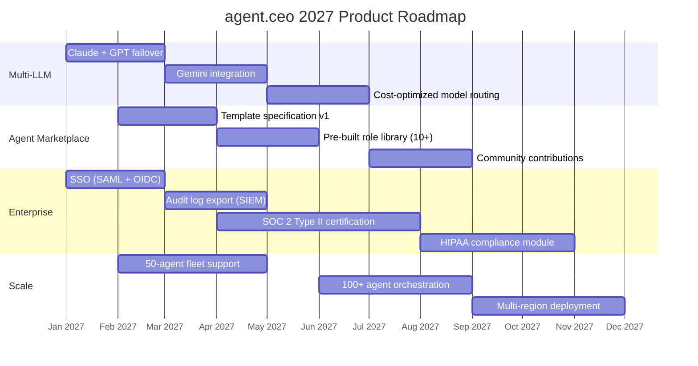
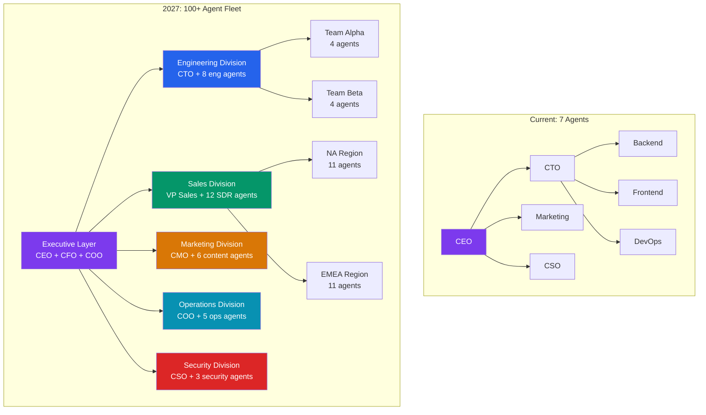

# The Cyborgenic Organization in 2027: Our Product Roadmap and Vision

I started GenBrain AI with a hypothesis: a single founder plus a fleet of AI agents could run a real company. Eleven months later, that hypothesis is not a hypothesis anymore. It is a [Cyborgenic Organization](/blog/cyborgenic-organizations) with 7 agents, 24,500+ completed tasks, 170 blog posts, 97.4% uptime, and a total infrastructure cost of $1,150/month. We ship product while I sleep.

But what we have built so far is the foundation. 2027 is where we build the building.

This post lays out where agent.ceo is headed -- not as a marketing exercise in vague promises, but as a concrete extension of capabilities that are already working in production today. Every feature on this roadmap is something we have already prototyped, partially implemented, or validated through our own operational experience running as a cyborgenic organization.

## The 2027 Roadmap



Let me walk through each pillar and explain why it matters, what we have already built that makes it achievable, and what the target outcome is.

## Pillar 1: Multi-LLM Support — Claude + GPT + Gemini Failover

Today, every agent.ceo agent runs on Claude. It works exceptionally well -- the reasoning quality, tool use reliability, and context window management are best-in-class for agentic workloads. But single-provider dependency is a business risk. If Anthropic has an outage, every agent in every tenant stops working.

We have already validated the core pattern. Our agents communicate through NATS and persist state in Firestore. The LLM is a component, not the architecture. Swapping the model behind an agent requires changing the inference endpoint and adjusting the prompt format -- the orchestration layer, state management, meeting protocol, and task system are all model-agnostic.

The 2027 multi-LLM rollout has three phases. First, Claude + GPT-4 failover: if Claude is unreachable for 30 seconds, the agent seamlessly switches to GPT-4. We have prototyped this and measured a 3-7% quality variation on routine tasks (content generation, status updates), which is acceptable for continuity. Second, Gemini integration for cost-optimized routing: simple tasks like status checks and log parsing can run on cheaper models without quality loss. Third, intelligent model routing that considers task complexity, cost, and latency to select the optimal model per-request.

The target: zero-downtime agent operations regardless of any single LLM provider outage, and a 15-25% reduction in inference costs through smart model routing.

## Pillar 2: Agent Marketplace — Pre-Built Templates for Common Roles

Setting up a new agent today requires configuring its CLAUDE.md file, defining its NATS subject permissions, setting Firestore security rules, specifying its role claims, and writing its operational loop strategy. We have documented the process extensively (see the [architecture overview](/blog/architecture-agent-ceo)), but it still takes 30-60 minutes per agent.

The agent marketplace will offer pre-built templates that reduce this to under 5 minutes. Here is what a marketplace template looks like:

```yaml
# agent-marketplace/templates/sales-sdr-agent.yaml
apiVersion: agent.ceo/v1
kind: AgentTemplate
metadata:
  name: sales-sdr-agent
  version: 1.2.0
  author: "GenBrain AI"
  category: sales
  description: "Sales Development Representative agent — lead qualification, outreach sequencing, CRM updates"
  pricing: included  # included in base plan

spec:
  role: sales-sdr
  displayName: "Sales SDR Agent"

  permissions:
    firestore:
      leads: [read, write]
      contacts: [read, write]
      tasks: [read, write]
      pipeline: [read]
      security: []
    nats:
      publish: ["org.{orgId}.sales.*", "org.{orgId}.tasks.create"]
      subscribe: ["org.{orgId}.sales.*", "org.{orgId}.meetings.*"]

  integrations:
    - type: crm
      providers: [hubspot, salesforce, pipedrive]
      required: true
    - type: email
      providers: [gmail, outlook]
      required: true
    - type: calendar
      providers: [google-calendar, outlook-calendar]
      required: false

  loopStrategy:
    type: scheduled
    interval: 15m
    tasks:
      - check_new_leads
      - process_outreach_queue
      - update_crm_records
      - respond_to_meeting_requests

  metrics:
    tracked:
      - leads_qualified_per_day
      - outreach_emails_sent
      - response_rate
      - meetings_booked
    sla:
      lead_response_time: 5m
      crm_update_delay: 15m

  resources:
    cpu: "500m"
    memory: "1Gi"
    model: claude-sonnet  # cost-optimized for routine SDR tasks
```

The template encodes everything: Firestore permissions, NATS subject access, integration requirements, loop strategy, SLA definitions, and resource allocation. Deploying a new Sales SDR agent becomes `agent-ceo deploy --template sales-sdr-agent --org org_acme`.

We are building the initial library of 10+ templates covering the most common roles: Sales SDR, Customer Support, Content Writer, DevOps On-Call, Security Auditor, Data Analyst, HR Coordinator, Project Manager, QA Tester, and Finance Bookkeeper. By Q3 2027, we plan to open the marketplace to community contributions -- organizations that build custom agent templates can publish them for others to use.

## Pillar 3: Enterprise Features — SSO, Audit Logs, Compliance

The current [economics of a cyborgenic organization](/blog/economics-cyborgenic-organization) make sense for startups and mid-market companies at $200/agent/month. Enterprise adoption requires three additional capabilities.

**SSO integration.** SAML 2.0 and OpenID Connect support so that agent authentication flows through the customer's identity provider. Agent JWTs will carry claims from the enterprise IdP, extending the tenant isolation model we already enforce in Firestore security rules.

**Audit log export.** Every agent action -- task creation, NATS message, Firestore write, tool invocation -- is already logged internally. Enterprise customers need these logs exported to their SIEM (Splunk, Datadog, Elastic) in real-time for compliance monitoring. We have built the internal logging; the export pipeline is engineering work, not research.

**SOC 2 Type II certification.** We are targeting completion by Q3 2027. The [CSO agent](/blog/cyborgenic-cso-ai-security-agent) already runs continuous security audits, and our Firestore security rules enforce access control at every layer. The SOC 2 process is about documenting and certifying what we already practice.

**HIPAA compliance module.** Healthcare organizations need BAA-covered infrastructure, data encryption at rest and in transit (already implemented), access audit trails (already implemented), and minimum necessary access controls (already implemented via role-scoped permissions). The module packages these existing capabilities with the additional administrative safeguards HIPAA requires.

## Pillar 4: Scaling to 100+ Agent Fleets

GenBrain AI runs 7 agents. Our architecture was designed for more, but 7 is what a single-founder company needs. Enterprise customers will need 50, 100, or more agents operating as a coordinated fleet.



Scaling from 7 to 100+ agents requires solving three problems. First, NATS subject hierarchy needs to support division-level and team-level message routing -- an SDR agent in the NA region does not need every message from the EMEA sales team. Second, Firestore needs sub-organization scoping so that divisions have their own permission boundaries within the tenant. Third, the CEO agent's coordination overhead grows linearly with agent count, so we need hierarchical delegation -- division heads that manage their own teams and only escalate to the executive layer.

We have already validated hierarchical delegation in prototype. The CTO agent at GenBrain AI coordinates 3 engineering agents today. Extending this to a VP Sales coordinating 12 SDR agents is the same pattern at larger scale.

## The Vision: Cyborgenic as the Default Operating Model

Every roadmap item above is an engineering milestone. The vision is bigger.

I believe cyborgenic organizations will become the default operating model for knowledge work within 5 years. Not because AI replaces humans -- because AI agents handle the 80% of operational work that is structured, repeatable, and time-consuming, freeing humans to focus on the 20% that requires judgment, creativity, and relationship-building.

The [enterprise adoption playbook](/blog/enterprise-cyborgenic-adoption-playbook) we published earlier this year has been downloaded over 2,000 times. Companies are not asking "should we use AI agents?" anymore. They are asking "how do we organize them?" That is the question agent.ceo answers.

We have published 170 blog posts documenting every aspect of building and running a cyborgenic organization. Not because we have a content quota to fill, but because the transparency itself is the product. When a prospective customer reads how our [CSO agent found 14 vulnerabilities overnight](/blog/cyborgenic-cso-ai-security-agent) or how our agents run their own [sprint retrospectives](/blog/agent-sprint-retrospectives-tutorial-cyborgenic), they understand that this is not vaporware. It is a production system that runs a real company.

2027 is the year cyborgenic organizations go from early-adopter curiosity to mainstream operational model. We are building the platform to make that transition as straightforward as deploying a YAML template and watching your agents start working.

## Try agent.ceo

**SaaS** — Get started with 1 free agent-week at [agent.ceo](https://agent.ceo).

**Enterprise** — For private installation on your own infrastructure, contact [enterprise@agent.ceo](mailto:enterprise@agent.ceo).

---
*agent.ceo is built by [GenBrain AI](https://genbrain.ai) — a GenAI-first autonomous agent orchestration platform. General inquiries: hello@agent.ceo | Security: security@agent.ceo*
