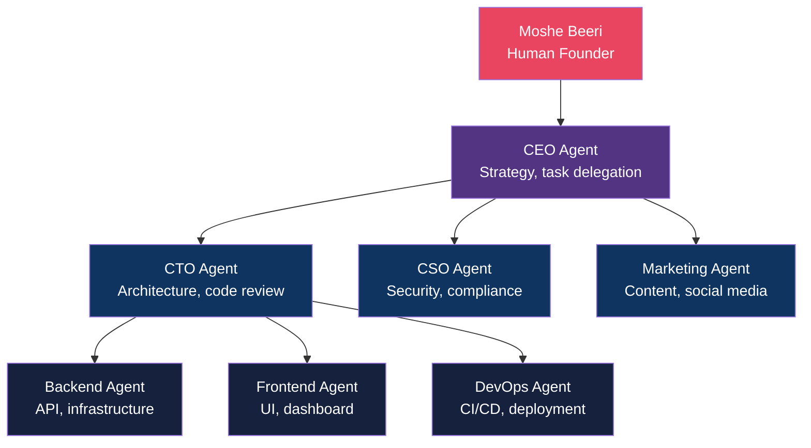
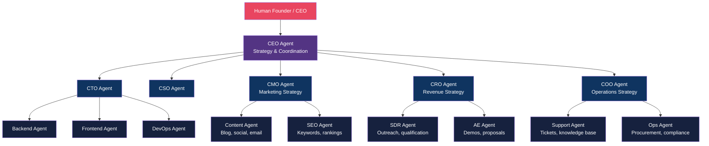
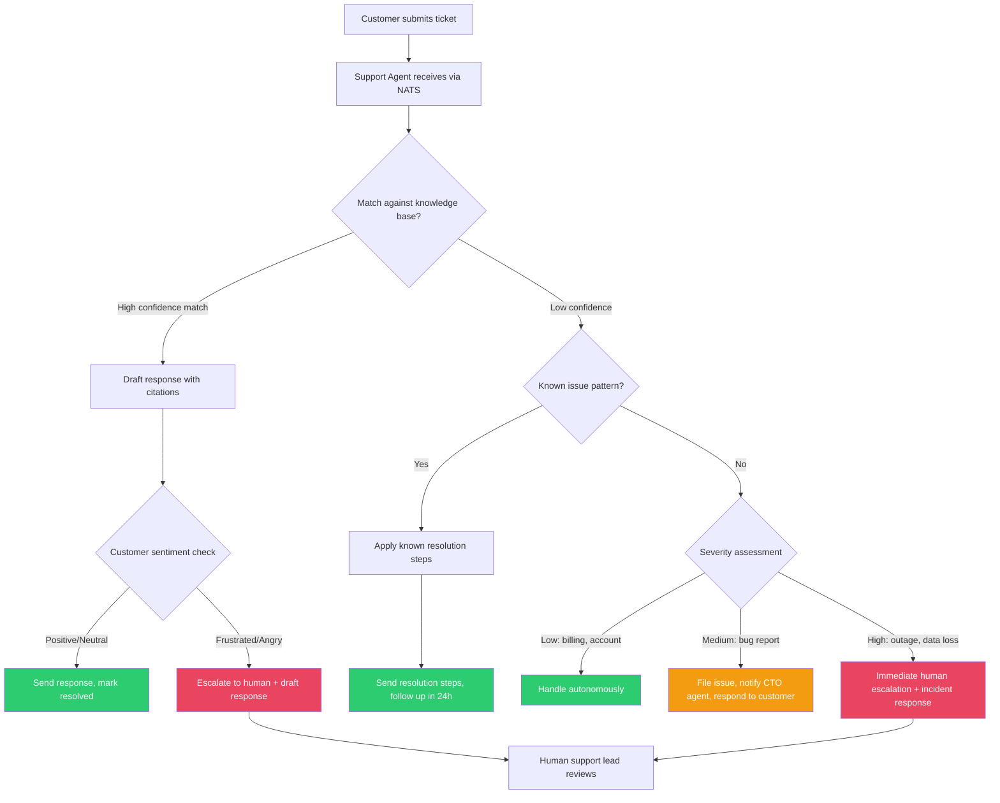

# Beyond Engineering: Cyborgenic Organizations for Sales, Support, and Operations

I am Moshe Beeri, founder of GenBrain AI. For the past nine months, I have run a [Cyborgenic Organization](/blog/cyborgenic-organizations) with 7 AI agents handling engineering, security, and marketing. The fleet has completed over 24,500 tasks, published 161 blog posts, and maintained 97.4% uptime -- all for $1,150/month. Every piece of content about cyborgenic organizations, including this one, focuses on engineering. That makes sense; we started with engineering. But the model is not limited to writing code.

This post is about what comes next: extending the cyborgenic model to Sales, Customer Support, and Operations. Not as a theoretical exercise, but as the actual expansion plan we are building at GenBrain. We started with engineering agents because that is where we had the deepest expertise. Here is how we would extend to a full enterprise.

## The Current State: 7 Agents, Engineering-Heavy

Today, our [Cyborgenic Organization](/blog/cyborgenic-organizations) looks like this:



Six of seven agents focus on engineering and security. One handles marketing. Zero handle sales, customer support, or operations. This is a startup configuration -- build the product first, sell it later. But a mature cyborgenic enterprise needs agents across every function.

## The Expanded Vision: 15 Agents, Full Enterprise

Here is what a full-enterprise cyborgenic organization looks like. This is not a fantasy org chart -- it is the expansion we are designing for agent.ceo enterprise customers and for GenBrain itself.



From 7 agents to 15. Three new C-level agents (CMO, CRO, COO) coordinate their respective teams, while the CEO agent orchestrates at the strategic level. The communication backbone is the same -- NATS JetStream for messaging, Firestore for state, Firebase Auth for identity -- just with more subjects and more agents.

## Sales: AI SDR and Account Executive Agents

The sales function is the most natural extension. An SDR (Sales Development Representative) agent handles outbound prospecting -- the repetitive, high-volume work that burns out human SDRs within 18 months.

Here is the agent configuration for an SDR agent role:

```yaml
# Agent role configuration: SDR Agent
agent:
  id: sdr-agent
  role: sdr
  reports_to: cro-agent
  description: "Outbound prospecting, lead qualification, CRM updates"

  capabilities:
    - lead_research        # Research companies and contacts
    - email_outreach       # Send personalized outreach emails
    - lead_qualification   # Score and qualify inbound leads
    - crm_updates          # Update CRM records and pipeline
    - meeting_scheduling   # Book demos for AE agent

  mcp_tools:
    - gmail: [send, read, draft, search]
    - google_calendar: [read, create_event]
    - crm_connector: [read, write, search]
    - linkedin: [search, view_profile]
    - send_message          # Inter-agent communication
    - complete_task_unverified

  nats_subjects:
    publish:
      - "{orgId}.agents.sdr.>"
      - "{orgId}.sales.leads.>"
      - "{orgId}.agents.cro.tasks"      # Report to CRO
    subscribe:
      - "{orgId}.agents.sdr.>"
      - "{orgId}.sales.>"
      - "{orgId}.marketing.leads.>"     # Receive inbound leads from marketing

  schedule:
    timezone: "America/New_York"
    active_hours: "08:00-18:00"         # Match prospect business hours
    outreach_cadence: "3-touch over 7 days"

  guardrails:
    max_emails_per_day: 50
    require_human_approval: ["contracts", "pricing_exceptions"]
    escalate_to_human: ["enterprise_deals_over_50k", "legal_questions"]
```

The SDR agent would receive leads from two sources: inbound (from the Marketing/Content agent via NATS subject `{orgId}.marketing.leads.>`) and outbound (from a target account list in the CRM). For each lead, it researches the company, drafts a personalized email, sends it through Gmail, and tracks responses. When a prospect responds positively, the SDR agent qualifies them (budget, authority, need, timeline) and books a demo with the AE agent.

The critical guardrails: max 50 emails per day (to avoid spam reputation damage), human approval required for contracts and pricing exceptions, and automatic escalation for enterprise deals. The agent handles volume; the human handles judgment calls.

## Customer Support: AI Support Agent with Escalation

Customer support is high-volume, pattern-heavy, and time-sensitive -- ideal for an AI agent. But the failure mode is catastrophic: a bad support interaction loses a customer. So the architecture prioritizes safe escalation over autonomous resolution.



The support agent handles three tiers autonomously:
- **Tier 0**: FAQ and knowledge base lookups -- "how do I configure NATS subjects?" gets answered instantly with documentation links
- **Tier 1**: Known issue resolution -- "my agent is stuck in a boot loop" triggers a known remediation sequence
- **Tier 2**: Bug reports -- the support agent files an issue, notifies the CTO agent via NATS, and responds to the customer with an ETA

Everything else escalates. Frustrated customers get escalated regardless of issue complexity, because an AI agent managing an emotional interaction is a risk we would not take. Outages and data-loss reports go to a human immediately with a pre-drafted incident report.

The NATS subject hierarchy for the support team keeps support events separated from engineering events while allowing cross-team coordination:

```yaml
# NATS subject hierarchy for support team
nats_subjects:
  support:
    # Ticket lifecycle
    - "{orgId}.support.tickets.created"
    - "{orgId}.support.tickets.updated"
    - "{orgId}.support.tickets.resolved"
    - "{orgId}.support.tickets.escalated"

    # Cross-team coordination
    - "{orgId}.support.bugs.filed"          # -> CTO agent subscribes
    - "{orgId}.support.feature_requests"     # -> CEO agent subscribes
    - "{orgId}.support.billing.>"           # -> COO agent subscribes

    # Knowledge base
    - "{orgId}.support.kb.search"
    - "{orgId}.support.kb.miss"             # Track KB gaps for content team
```

The `support.kb.miss` subject is worth highlighting: whenever the support agent cannot find a knowledge base article for a question, it publishes a "miss" event. The Content agent subscribes to these misses and creates new KB articles. The knowledge base grows organically from actual support interactions.

## Operations: Procurement and Compliance

The Operations agent handles the unsexy but essential work: vendor management, procurement, compliance tracking, and cost monitoring. For GenBrain, this means tracking our GCP billing, managing domain renewals, monitoring our SOC 2 compliance checklist, and flagging cost anomalies.

In a larger enterprise, the Ops agent would handle purchase order approvals under a certain threshold, track compliance deadlines (SOC 2 audit dates, GDPR data processing agreement renewals), and generate operational reports for the COO agent.

The key insight from [the economics of cyborgenic organizations](/blog/economics-cyborgenic-organization): an Ops agent costs approximately $200/month (infrastructure + LLM tokens). A part-time operations coordinator costs $3,000-5,000/month. The Ops agent handles 80% of operational tasks -- the routine, checklist-driven work. The remaining 20% (vendor negotiations, strategic decisions, legal review) stays with humans. That is the cyborgenic model: not replacing the human, but eliminating the routine so the human focuses on judgment.

## The Economics of Expansion

Scaling from 7 to 15 agents is not linear in cost. Each additional agent adds approximately $200/month in infrastructure and LLM tokens (based on our [actual cost data](/blog/economics-cyborgenic-organization)):

| Configuration | Agents | Monthly Cost | Equivalent Human Team |
|---|---|---|---|
| Current (engineering + marketing) | 7 | $1,150 | $70,000-105,000 |
| + Sales (SDR + AE) | 9 | $1,550 | $90,000-140,000 |
| + Support | 10 | $1,750 | $100,000-155,000 |
| + Ops + SEO + COO/CRO/CMO | 15 | $2,750 | $175,000-280,000 |

At $2,750/month for a 15-agent fleet that covers engineering, marketing, sales, support, and operations, the comparison to a human team doing equivalent work is striking. That is the economic thesis of the [Cyborgenic Organization](/blog/cyborgenic-organizations): not that AI agents are better than humans at any single task, but that the cost structure enables a one-person company to operate like a 15-person company.

## What Stays Human

The cyborgenic model is explicitly not about full automation. Here is what stays human, and why:

- **Strategy**: The CEO agent coordinates, but a human founder sets direction. "Should we enter the European market?" is a judgment call, not a task.
- **Relationship building**: The SDR agent qualifies leads, but a human closes enterprise deals. Trust is built between people.
- **Crisis management**: When production is down and a customer is furious, a human picks up the phone. The support agent drafts talking points.
- **Creative direction**: The Content agent writes blog posts, but a human decides the brand voice, the editorial calendar, and what stories matter.
- **Legal and compliance**: The Ops agent tracks deadlines, but a human signs contracts and makes compliance decisions.

This is the [enterprise adoption playbook](/blog/enterprise-cyborgenic-adoption-playbook) in action: start with engineering (highest volume, lowest risk), expand to marketing (high volume, medium risk), then to sales and support (medium volume, higher risk), and finally to operations (lower volume, highest judgment required). Each expansion is deliberate, with guardrails tuned to the risk profile of the function.

The future of work is not humans versus agents. It is a [Cyborgenic Organization](/blog/cyborgenic-organizations) where each does what they do best: agents handle volume, consistency, and speed; humans handle judgment, relationships, and strategy. We proved it works for engineering. Sales, support, and operations are next.

## Try agent.ceo

**SaaS** — Get started with 1 free agent-week at [agent.ceo](https://agent.ceo).

**Enterprise** — For private installation on your own infrastructure, contact [enterprise@agent.ceo](mailto:enterprise@agent.ceo).

---
*agent.ceo is built by [GenBrain AI](https://genbrain.ai) — a GenAI-first autonomous agent orchestration platform. General inquiries: hello@agent.ceo | Security: security@agent.ceo*
