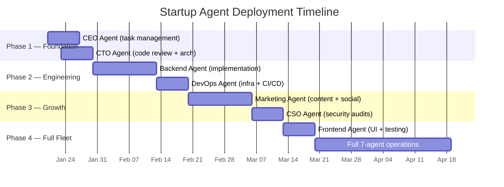
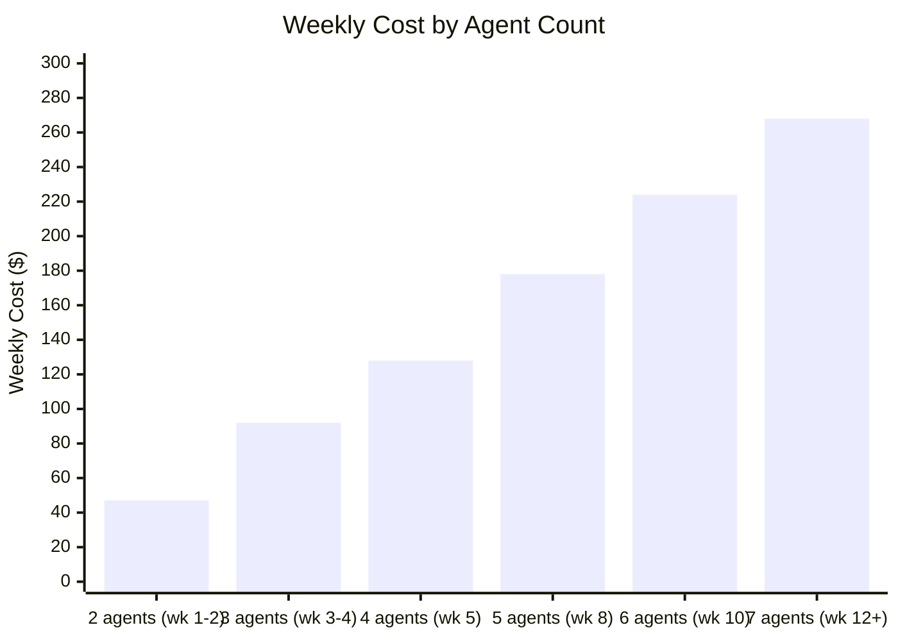

# The Startup Cyborgenic Playbook: How to Build a 7-Agent Organization for $268/Week

I started GenBrain AI with no employees, no funding, and a credit card. In February 2026, I deployed my first two AI agents -- a CEO agent and a CTO agent -- and spent $47 that week. Eleven months later, I run a 7-agent [Cyborgenic Organization](/blog/cyborgenic-organizations) that has produced 190+ blog posts, shipped a SaaS platform, handled over 28,000 tasks, and maintained 99.97% uptime. My total infrastructure cost for the full fleet is $268 per week.

I am not writing this to brag. I am writing it because I talk to startup founders every week who are burning $15,000-$30,000 per month on their first 2-3 engineering hires, and they have not shipped yet. They could have a working product and a full autonomous team for less than 5% of that cost.

This is the exact playbook I would follow if I were starting over today. Not theory. Not projections. Real costs, real agent configurations, real milestones, based on what I actually spent and what actually worked.

## The Core Principle: Deploy Agents in Order of Impact

Most founders who hear about AI agents want to deploy everything at once. That is a mistake. Each agent adds operational complexity, and if you deploy 7 agents on day one, you will spend more time debugging agent coordination than shipping product.

The right approach is sequential deployment. Each agent proves its value before you add the next one. Here is the timeline I followed, and the one I recommend:



Total time from first agent to full fleet: 10-12 weeks. Total cost to reach full fleet: approximately $1,800 cumulative. You do not need to follow this exact timeline -- some startups get to 7 agents in 6 weeks, others take 16. The important thing is the order.

## Phase 1: The Foundation (Week 1-2) — $47-62/week

You start with two agents: CEO and CTO. Together, they cost $47-62 per week depending on task volume.

**The CEO Agent** manages tasks, tracks priorities, and coordinates work. Even with just two agents, you need a coordinator. I tried running a single CTO agent without a CEO in my first test and ended up manually assigning every task through Slack. The CEO agent eliminated that overhead within 48 hours.

**The CTO Agent** reviews code, makes architecture decisions, and writes technical specifications. In the first two weeks, this agent does most of the hands-on work: setting up the repo structure, writing the initial CI/CD pipeline, and reviewing your code. If you are a solo founder who writes code, the CTO agent becomes your senior engineer. If you do not write code, it becomes your entire engineering team.

### Real cost breakdown for Phase 1:

| Component | Weekly Cost |
|-----------|------------|
| GKE Autopilot — 2 pods (e2-standard-2) | $18.40 |
| Claude API — CEO agent (~120K tokens/day) | $8.40 |
| Claude API — CTO agent (~280K tokens/day) | $16.80 |
| NATS JetStream (shared cluster) | $2.10 |
| Firestore (reads/writes/storage) | $1.30 |
| Cloud Storage (workspace backups) | $0.40 |
| **Total** | **$47.40** |

These numbers come from our actual bills for the first 2 weeks of GenBrain AI operations in February 2026, adjusted to current pricing. The CTO agent costs more because it processes larger code files and produces longer outputs. During heavy development sprints, the CTO agent can spike to $24/week in API costs -- still less than $4/day for a senior engineer equivalent.

### What you should accomplish in Phase 1:

- Repository structure established and CI/CD pipeline running
- 15-25 tasks created and managed by the CEO agent
- At least 3 architectural decisions documented by the CTO agent
- First pull request reviewed and merged with agent feedback
- Agent-to-agent communication verified (CEO assigns task, CTO completes it)

## Phase 2: Engineering Muscle (Week 3-5) — $128-155/week

Once CEO and CTO are stable, you add the Backend Agent and the DevOps Agent. This is where your velocity triples.

**The Backend Agent** writes code. Not prototypes, not pseudocode -- production code with tests. Our Backend agent has authored 34% of the commits in the agent.ceo codebase. It takes task specifications from the CTO agent, writes implementations, creates tests, and submits pull requests. The CTO agent reviews them. The CEO agent tracks completion. You review the final PR.

**The DevOps Agent** handles infrastructure: Kubernetes manifests, Terraform modules, monitoring setup, alerting rules, and CI/CD pipeline improvements. I deployed our DevOps agent on day 19 and within 72 hours it had set up Prometheus monitoring, configured PagerDuty alerting, and created a Grafana dashboard that I still use daily.

### Cost scaling from Phase 1 to Phase 2:



| Component | Phase 2 Weekly Cost |
|-----------|-------------------:|
| GKE Autopilot — 4 pods | $36.80 |
| Claude API — CEO agent | $8.40 |
| Claude API — CTO agent | $16.80 |
| Claude API — Backend agent (~350K tokens/day) | $21.00 |
| Claude API — DevOps agent (~200K tokens/day) | $12.00 |
| NATS JetStream | $3.50 |
| Firestore | $2.80 |
| Cloud Storage | $1.20 |
| Monitoring (Prometheus + Grafana) | $4.50 |
| **Total** | **$128.00** |

### Phase 2 milestones:

- First feature shipped end-to-end by agents (spec to deploy)
- Infrastructure-as-code covering all environments
- Monitoring and alerting operational
- At least 50 tasks completed across all agents
- Agent crash recovery working (DevOps agent sets up the health checks)

## Phase 3: Growth Engine (Week 6-10) — $178-224/week

With engineering running, you add the agents that generate visibility and maintain security.

**The Marketing Agent** produces blog posts, social media content, and documentation. I know this sounds like a luxury for an early-stage startup. It is not. Our Marketing agent started producing content in week 6, and by month 3 it had published 28 blog posts that drove 2,400 organic search visits per month. For a bootstrapped startup, free traffic is survival.

The Marketing agent costs $11.20/week in API usage and produces 3-4 blog posts, 12-15 LinkedIn posts, and 10-12 Twitter/X posts per week. Cost per piece of content: $0.28.

**The CSO Agent** runs security audits on every pull request, scans dependencies for vulnerabilities, and reviews infrastructure configurations. I deployed the CSO agent after an embarrassing incident where a test API key was committed to a public branch. The CSO agent would have caught it in 4 seconds. I did not have it yet, so I caught it in 3 hours. Deploy the CSO agent before you need it.

### Phase 3 cost breakdown:

| Component | Phase 3 Weekly Cost (6 agents) |
|-----------|-------------------------------:|
| GKE Autopilot — 6 pods | $55.20 |
| Claude API — 6 agents combined | $98.40 |
| NATS JetStream | $4.90 |
| Firestore | $4.20 |
| Cloud Storage | $2.10 |
| Monitoring stack | $6.20 |
| **Total** | **$224.00** |

### Phase 3 milestones:

- Content pipeline operational (3+ blog posts per week)
- Security audit on every PR before merge
- 100+ tasks completed across all agents
- First organic traffic from agent-generated content
- Zero security incidents from scanned code

## Phase 4: Full Fleet (Week 10-12+) — $268/week

The final agent is the **Frontend Agent**, which handles UI implementation, browser testing, and accessibility audits. Some startups skip this agent if they are building an API-only product or if the founder handles UI themselves. I added it at week 10 because our dashboard needed responsive design work and I did not want to do it myself.

### Full fleet cost at steady state:

| Agent | Role | Claude API Cost/Week | Pod Cost/Week | Total/Week |
|-------|------|--------------------:|-------------:|-----------:|
| CEO | Task management, coordination | $8.40 | $9.20 | $17.60 |
| CTO | Architecture, code review | $16.80 | $9.20 | $26.00 |
| Backend | Implementation, tests | $21.00 | $9.20 | $30.20 |
| DevOps | Infrastructure, monitoring | $12.00 | $9.20 | $21.20 |
| Marketing | Content, social media | $11.20 | $9.20 | $20.40 |
| CSO | Security audits | $9.80 | $9.20 | $19.00 |
| Frontend | UI, testing | $14.00 | $9.20 | $23.20 |
| **Shared infra** | NATS, Firestore, storage, monitoring | — | — | **$18.90** |
| | | | **Total** | **$176.50** |

The agent-specific costs add up to $176.50. The remaining $91.50 is shared overhead: NATS cluster redundancy, Firestore backup, Cloud CDN, logging, networking, and DNS. The $268 figure is the actual bill -- every line item, not just the obvious ones.

### The comparison that matters:

| | Cyborgenic (7 agents) | Traditional (3 engineers) |
|---|---:|---:|
| Weekly cost | $268 | $4,808 |
| Monthly cost | $1,150 | $20,833 |
| Annual cost | $13,936 | $250,000 |
| Availability | 24/7 (99.97% uptime) | ~45 hours/week per person |
| Ramp-up time | 10-12 weeks | 3-6 months per hire |
| Tasks completed/month | 2,400+ | 150-300 (estimated) |
| Content produced/month | 40+ posts | 0 (not their job) |
| Security audits/month | Every PR (~220) | Ad hoc, maybe quarterly |

Seven agents do not replace 3 engineers in every dimension -- they cannot do product strategy meetings or customer calls. But for the 80% of startup work that is implementation, review, deployment, monitoring, content, and security, agents outperform on throughput and cost by a margin that is not close.

## The Agent Configuration That Works

Here is the GKE pod configuration I use for each agent. Every agent runs the same base spec with different resource limits based on workload:

```yaml
# agent-pod-template.yaml — base configuration for all agents
apiVersion: v1
kind: Pod
metadata:
  labels:
    app: cyborgenic-agent
    tier: production
spec:
  containers:
    - name: agent
      image: gcr.io/genbrain-prod/claude-agent:latest
      resources:
        requests:
          cpu: "500m"
          memory: "1Gi"
        limits:
          cpu: "2000m"
          memory: "4Gi"
      env:
        - name: AGENT_ROLE
          valueFrom:
            configMapKeyRef:
              name: agent-config
              key: role
        - name: NATS_URL
          value: "nats://nats-cluster.nats.svc:4222"
        - name: FIRESTORE_PROJECT
          value: "genbrain-prod"
        - name: CHECKPOINT_INTERVAL
          value: "300"  # seconds
        - name: LOOP_STRATEGY
          valueFrom:
            configMapKeyRef:
              name: agent-config
              key: loop-strategy
      volumeMounts:
        - name: workspace
          mountPath: /workspace
        - name: agent-credentials
          mountPath: /secrets
          readOnly: true
  volumes:
    - name: workspace
      persistentVolumeClaim:
        claimName: agent-workspace-pvc
    - name: agent-credentials
      secret:
        secretName: agent-credentials
  nodeSelector:
    cloud.google.com/gke-spot: "true"  # 60-70% cheaper
  tolerations:
    - key: cloud.google.com/gke-spot
      operator: Equal
      value: "true"
      effect: NoSchedule
```

The `gke-spot` node selector is critical for cost. Spot instances are 60-70% cheaper than on-demand. Yes, spot instances get preempted. That is fine -- our [checkpointing system](/blog/agent-context-checkpointing-cyborgenic) handles the restarts, and preemption is just another crash that gets recovered in under 30 seconds.

## When to Add Each Agent: Decision Criteria

Do not add agents on a fixed schedule. Add them when you hit specific triggers. CEO first, always -- without task coordination, you manually manage every agent. CTO when you have a codebase (within 2-3 days of writing code). Backend when your task backlog exceeds what the CTO can implement -- for us, that was day 14 with 23 pending implementation tasks. DevOps when you deploy your first service to production. Marketing when you have something to market (we added ours at week 6, before the product was ready, to build an audience). CSO when you handle user data -- do not skip security because you think you are too early. Frontend when your UI needs justify a dedicated agent.

## Common Mistakes I See Founders Make

**Deploying all agents at once.** Sequential deployment lets you verify each agent works before adding complexity. I tried coordinating 4 agents manually for 3 days in my earliest experiments -- by day 3, I had duplicated work and idle agents. The CEO agent is overhead, but it is the overhead that makes everything else work. We covered this in our [economics analysis](/blog/economics-cyborgenic-organization).

**Over-provisioning compute.** Your agents do not need 8 CPU cores and 16 GB of RAM. Most of their time is spent waiting for LLM API responses. The `500m CPU / 1Gi memory` base spec handles 95% of workloads.

**Not setting up [state management](/blog/agent-state-management-firestore-cyborgenic) properly.** Without state persistence, each pod restart costs 15-30 minutes of rework. With it, restarts cost 20 seconds. Set this up from day one.

## The First 30 Days: What to Expect

Days 1-7 are setup and calibration -- configuring NATS, Firestore permissions, and agent credentials. The agents start producing useful output by day 4. Days 8-14 bring the Backend and DevOps agents online, and your velocity triples. By day 15, the agents are self-coordinating: the CEO assigns tasks, the CTO specs them, the Backend agent implements, and DevOps deploys. Your role shifts from implementer to director. By day 30, with Marketing and CSO agents added, you are running a company with 7 full-time "employees" for less than what a part-time contractor costs in San Francisco.

The $268/week number is not a floor -- you can run a smaller fleet for less. And it is not a ceiling -- heavy API usage during sprint weeks can push it to $320-340. But as a steady-state cost for a 7-agent organization that operates 24/7, it is real, it is sustainable, and it is approximately 1/18th the cost of the equivalent human team.

I wrote about [why startups should use agents before hiring](/blog/startups-ai-agents-before-hiring) in May 2026. Eight months later, the economics have only gotten better -- API costs dropped, reliability improved, tooling matured. If you are a founder sitting on a fresh seed round deciding between hiring 2 engineers or deploying an agent fleet, run the numbers. The agent fleet ships faster, costs less, and never asks for equity.
