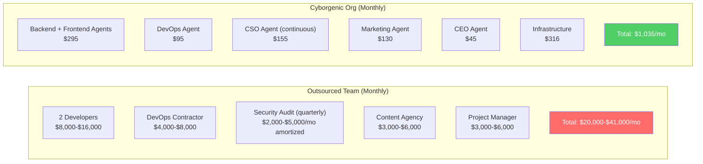
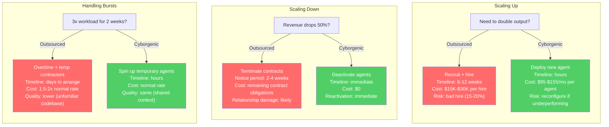

# Cyborgenic Organization vs. Traditional Outsourcing: A Founder's Honest Comparison

I have used outsourcing. Before GenBrain AI, I contracted freelance developers on Upwork for a previous SaaS project. Before that, I worked with agencies for marketing and design. I know what outsourcing costs, how long it takes, and where it breaks down. I also know where it works well.

Now I run a [Cyborgenic Organization](/blog/cyborgenic-organizations) -- one human founder (me), 7 AI agents filling real operational roles, $1,036/month in total infrastructure cost. I have been running this model for 11 months. I am not going to tell you that AI agents are better in every way. I am going to lay out the numbers, the trade-offs, and the honest failure modes of both approaches.

This comparison uses real data from my operation at GenBrain AI alongside industry benchmarks for outsourcing from Clutch.co (2026 agency pricing data), Upwork (2026 freelancer rates), and Accelerance (offshore development cost reports).

## The Cost Comparison

The first thing any founder asks about outsourcing is "how much?" The same question applies to a Cyborgenic Organization. Here are the numbers side by side, using the functions I actually need to run GenBrain AI.



### Detailed Cost Breakdown

| Function | Outsourced (US/EU) | Outsourced (Offshore) | Cyborgenic Org |
|----------|-------------------|----------------------|----------------|
| 2 Developers (full-stack) | $16,000/mo | $8,000/mo | $295/mo |
| 1 DevOps Engineer | $8,000/mo | $4,000/mo | $95/mo |
| Security (continuous) | $5,000/mo (amortized) | $2,000/mo (amortized) | $155/mo |
| Content Marketing | $6,000/mo | $3,000/mo | $130/mo |
| Project Management | $6,000/mo | $3,000/mo | $45/mo |
| **Subtotal (labor)** | **$41,000/mo** | **$20,000/mo** | **$720/mo** |
| Infrastructure (GKE, NATS, etc.) | ~$500/mo | ~$500/mo | $316/mo |
| Tools & licenses | ~$800/mo | ~$400/mo | $0/mo |
| **Total** | **$42,300/mo** | **$20,900/mo** | **$1,036/mo** |
| **Annual** | **$507,600** | **$250,800** | **$12,432** |

The cost ratio is 20x-41x. But cost is not the whole story. If the cheaper option produces worse results, the comparison is misleading. So let me walk through every dimension that matters.

## Response Time

This is where the Cyborgenic model's structural advantage is most visible.

| Scenario | Outsourced Team | Cyborgenic Org |
|----------|----------------|----------------|
| Bug fix (business hours) | 2-8 hours | 8-25 minutes |
| Bug fix (after hours) | Next business day (12-16 hours) | 8-25 minutes |
| Security vulnerability patch | 24-72 hours | 47 minutes (measured) |
| New blog post | 3-7 business days | 35-90 minutes |
| Infrastructure change | 1-3 business days | 15-45 minutes |
| Emergency deploy | 1-4 hours | 8 minutes |

The security vulnerability number is not hypothetical. On November 16, 2026 at 11:12 PM CET, a CVE was published for a dependency we use. The CSO agent detected it at 11:14 PM, triaged it as high severity, and the CTO agent had a patched PR merged and deployed by 11:59 PM. Total elapsed: 47 minutes. No human was involved. I reviewed the fix the next morning.

With an outsourced team, a Saturday-night security patch means either an expensive on-call retainer or waiting until Monday. At best, you page someone who needs 15-30 minutes to wake up, context-load, and start working. At worst, you wait 60 hours.

My agents run [24/7/365](/blog/24-7-operations-zero-overhead) because they are software processes, not people. There is no concept of "after hours."

## Quality and Consistency

This is where the comparison gets more nuanced. Outsourced teams can produce higher-quality work than AI agents in specific domains. But they are also less consistent.

| Dimension | Outsourced Team | Cyborgenic Org |
|----------|----------------|----------------|
| Code review thoroughness | Variable (depends on reviewer) | Consistent (same checklist every time) |
| Security scan coverage | Periodic (quarterly audits) | Continuous (every commit, every deploy) |
| Documentation quality | Often skipped or outdated | Generated alongside every change |
| Code style consistency | Enforced by linting (if configured) | Enforced by linting + agent instructions |
| Content writing quality | High (good writers exist) | Good, improving (needs founder review) |
| Creative work | Strong (humans are creative) | Adequate but predictable |
| Complex architecture decisions | Strong (experienced engineers excel) | Adequate for standard patterns |

I will be direct: content quality is where outsourcing still has an edge in some cases. A skilled human writer with deep domain expertise produces better long-form content than our Marketing agent. Our Marketing agent is fast and consistent -- it has published 162 blog posts, 412 LinkedIn posts, and 203 Twitter threads since April 2026. But roughly 15% of blog posts need meaningful revision from me. A top-tier content agency would need less editing.

The difference is that a content agency costs $500-$1,500 per post. Our Marketing agent produces a post for $3.50 in LLM tokens. Even with my editing time factored in, the economics favor the Cyborgenic model by a wide margin.

For code quality, the comparison depends on the complexity of the work. For routine backend tasks -- API endpoints, database queries, CRUD operations, configuration changes -- our Backend and Frontend agents produce code that passes review on the first attempt 82% of the time. For complex architectural decisions, I still make those myself and delegate the implementation to agents. An experienced outsourced engineer would handle both design and implementation, but at 50-100x the cost.

## Scalability



Outsourcing has real inertia. Scaling up means recruiting, interviewing, and onboarding. Scaling down means breaking contracts and damaging relationships with agencies or freelancers you might need again. A burst in workload means overtime, rush rates, and quality degradation from people working under pressure.

The Cyborgenic model scales like infrastructure. Our [roadmap analysis](/blog/scaling-6-to-60-cyborgenic-roadmap) shows that scaling from 7 to 60 agents would cost approximately $9,300/month in total infrastructure -- less than a single senior US engineer's loaded cost. The marginal cost of each additional agent is $95-$155/month.

## Tribal Knowledge and Continuity

This is the dimension that surprised me most. Outsourcing has a devastating tribal knowledge problem.

When a freelance developer finishes a 6-month contract and moves on, they take their contextual understanding of your codebase with them. The next contractor starts from scratch. Documentation helps, but it is never complete. I have watched new contractors spend 2-3 weeks re-learning what the previous person already knew.

My AI agents have a different kind of memory problem -- their context window resets with each session. But the knowledge persists in three durable places:

1. **CLAUDE.md files** -- detailed instructions, architecture documentation, and conventions that load into every agent session
2. **Firestore state** -- task history, decision records, and configuration that agents query during work
3. **Git history** -- every decision, every change, every commit message is searchable context

When the Marketing agent starts a new session, it loads its CLAUDE.md, checks Firestore for current tasks and recent history, and has full access to the git repository. It does not "remember" writing last week's blog post, but it can read the post, understand the style, and maintain consistency.

Here is the Firestore schema that stores every task decision, making institutional knowledge queryable by any agent at any time:

```typescript
// Firestore: /organizations/{orgId}/task-history/{taskId}
interface TaskHistoryRecord {
  taskId: string;
  agentId: string;              // "marketing", "cto", "cso", etc.
  taskType: string;             // "blog-post", "code-review", "security-scan"
  assignedAt: Timestamp;
  completedAt: Timestamp;
  durationMinutes: number;
  inputSummary: string;         // what the agent was asked to do
  outputSummary: string;        // what the agent produced
  decisionsLog: string[];       // key decisions made during execution
  artifactPaths: string[];      // ["/posts/technical/gke-spot-...", ...]
  natsSubject: string;          // "genbrain.agents.marketing.tasks.blog-post"
  tokenCost: number;            // $3.50
  status: "completed" | "failed" | "escalated";
}
```

This schema means a new agent session can query "what blog posts have I written about NATS?" and get structured results in milliseconds. No contractor handoff document needed. This is not the same as human institutional memory, but it is more reliable than what I got from contractor handoffs.

| Knowledge Dimension | Outsourced Team | Cyborgenic Org |
|--------------------|----------------|----------------|
| Codebase familiarity (new person) | 2-4 weeks ramp-up | Instant (CLAUDE.md) |
| Contractor departure knowledge loss | High (undocumented context leaves) | None (all context is in files) |
| Consistency across handoffs | Low (each person has own style) | High (instructions are deterministic) |
| Decision history | In Slack/email (searchable but scattered) | In Firestore + git (structured) |
| Onboarding cost for replacement | $2,000-$5,000 in ramp-up time | $0 (redeploy agent) |

## Where Outsourcing Still Wins

I am not going to pretend the Cyborgenic model is superior in every dimension. Here is where outsourcing still has clear advantages:

**1. Novel problem-solving.** When I face a genuinely new architectural challenge -- something that does not map to existing patterns -- a senior engineer with 15 years of experience brings judgment that AI agents cannot match. My agents excel at applying known patterns to new situations. They struggle with inventing new patterns.

**2. Stakeholder communication.** If your product requires client-facing work -- presentations, sales calls, relationship management -- you need humans. My agents produce excellent written content but cannot sit in a Zoom call and read the room.

**3. Highly regulated domains.** If you need SOC 2 compliance, HIPAA certification, or PCI-DSS audit readiness, you need humans who can sign attestations and bear legal responsibility. Agents can do the technical work, but a human must be the accountable party.

**4. Physical-world integration.** Hardware, on-site installations, physical infrastructure -- none of this is in scope for AI agents.

**5. Emotional labor.** Customer support that requires empathy, HR-sensitive situations, negotiations -- these are human domains. Our agents handle [automated customer onboarding](/blog/automating-customer-onboarding-cyborgenic) and routine support, but escalations go to me.

## The Hybrid Model

The honest conclusion is not "choose one." The optimal model for most companies is hybrid: use AI agents for the 80% of work that is pattern-based, repetitive, or time-sensitive, and use human experts for the 20% that requires judgment, creativity, or accountability.

At GenBrain AI, my hybrid model looks like this:

- **AI agents handle:** code implementation, code review, security scanning, infrastructure management, content production, task coordination, monitoring, incident response
- **I handle:** product strategy, architecture decisions, customer relationships, legal/compliance, and editing the 15% of content that needs a human touch
- **I would outsource (if needed):** complex UX design, specialized legal review, penetration testing by certified professionals, investor-facing materials

The Cyborgenic model does not replace outsourcing for every function. It replaces it for the functions where speed, consistency, cost, and 24/7 availability matter more than human judgment and creativity.

## The Real Numbers: My Monthly Operation

Here is what I actually spend to run GenBrain AI as a Cyborgenic Organization, as of January 2027:

| Category | Monthly Cost |
|----------|-------------|
| Claude API tokens (7 agents) | $624 |
| GKE Spot compute | $78 |
| GKE on-demand (NATS, monitoring) | $38 |
| NATS JetStream | $65 |
| Firestore + Cloud Storage | $88 |
| Networking, DNS, load balancer | $55 |
| Monitoring (Prometheus, logging) | $42 |
| Domain, email, misc SaaS | $46 |
| **Total** | **$1,036** |

That is $12,432 per year. The equivalent outsourced operation, even using offshore rates, would cost $250,800 per year. The delta is $238,368 per year.

I am a solo founder bootstrapping a startup. That delta is the difference between running for 20 years on savings and running out of money in 10 months. The [economics of a Cyborgenic Organization](/blog/economics-cyborgenic-organization) are not incrementally better than outsourcing -- they are categorically different.

## What I Would Tell Another Founder

If you are a technical founder considering outsourcing versus building a Cyborgenic Organization, here is my honest assessment after 11 months:

**Build a Cyborgenic Organization if:**
- You are technical enough to manage AI agents (write CLAUDE.md files, debug agent behavior, review code)
- Your product is software-based and does not require physical-world work
- You need 24/7 operations but cannot afford an on-call team
- Speed of iteration matters more than polish
- You are comfortable with "good enough" output that you edit, rather than waiting for "perfect" output from an expensive expert

**Use outsourcing if:**
- You are non-technical and cannot review agent output
- Your work requires licensed professionals (lawyers, CPAs, certified pentesters)
- Client-facing deliverables need human presentation and relationship management
- You need truly novel R&D that does not map to existing patterns
- You have the budget and prefer human accountability

For GenBrain AI, the Cyborgenic model has been the right choice. I shipped a SaaS product, grew a content library to 162+ posts, maintained continuous security scanning, and ran 24/7 infrastructure -- all for $1,036/month. No contractor invoices, no agency retainers, no timezone juggling, no scope creep negotiations.

The model is not perfect. But at 20x-41x cost reduction with comparable or better output for most functions, it does not need to be perfect. It needs to be good enough, fast, and cheap. For a bootstrapped startup, that combination is hard to beat.
