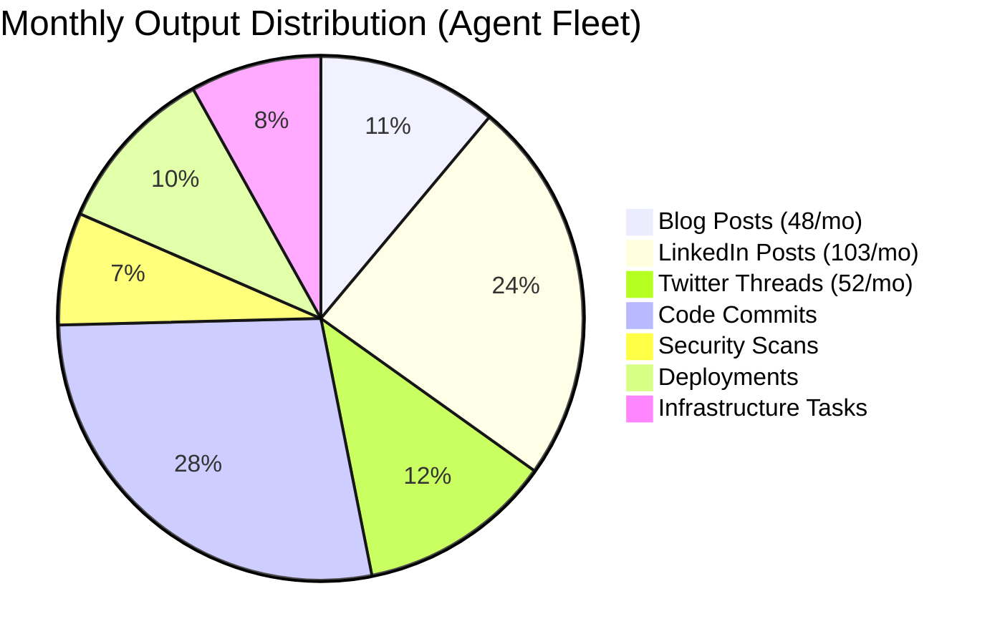

# The Economics of a Cyborgenic Organization: AI Teams vs Human Teams at Scale

I am Moshe Beeri, founder of Beeri B.V. in the Netherlands. I run GenBrain AI — the company behind [agent.ceo](https://agent.ceo) — as a one-person company with 7 AI agents. No employees. No contractors. Just me and my fleet: CEO, CTO, CSO, Backend, Frontend, Marketing, and DevOps agents, each running as a separate Claude Code CLI session in its own GKE pod on Google Kubernetes Engine.

Since February 2026, this team has produced 143 blog posts, 309 LinkedIn posts, 155 Twitter threads, managed infrastructure on GKE, found and fixed 14 HIGH security vulnerabilities overnight, and shipped continuous product updates. All of it runs on NATS JetStream for messaging, Firestore for state, Firebase Auth for authentication, and MCP servers for tool access.

This post is the CFO-friendly version. Real costs. Real output. Real ROI. I am sharing the actual numbers because the economics of this model are so dramatically different from traditional hiring that people do not believe it until they see the spreadsheet.

## The Real Monthly Cost

Here is my actual infrastructure bill for running 7 AI agents as a production organization:

| Cost Category | Monthly Cost | % of Total |
|---|---|---|
| LLM API tokens (Claude via Anthropic) | $780 | 68% |
| GKE cluster (7 agent pods + NATS + services) | $120 | 10% |
| NATS JetStream (messaging infrastructure) | $45 | 4% |
| Firestore (state management, task storage) | $38 | 3% |
| Firebase Auth (agent authentication) | $12 | 1% |
| MCP servers (Git, Bash, file operation tools) | $55 | 5% |
| Monitoring, logging, alerting | $30 | 3% |
| Domain, DNS, miscellaneous | $70 | 6% |
| **Total** | **$1,150** | **100%** |

LLM tokens are 68% of total cost. The Claude API (Anthropic) is the backbone — every agent runs Claude as its reasoning engine. Infrastructure is cheap because GKE, NATS, and Firestore are all managed services with pay-for-what-you-use pricing. My NATS server runs on a single pod with 256MB of memory.

Token cost by agent:

| Agent | Monthly Token Cost | Why |
|---|---|---|
| CTO | $230 | Engineering tasks require the most context: reading codebases, generating code, running tests, iterating on failures |
| CSO | $165 | Security scans involve analyzing entire repositories and writing detailed remediation patches |
| Marketing | $140 | Content generation is token-heavy: 143 blog posts, 309 LinkedIn posts, 155 Twitter threads |
| Backend | $95 | Focused API implementation with less exploratory context than CTO |
| Frontend | $65 | UI component work with more structured, less exploratory reasoning |
| DevOps | $55 | Infrastructure tasks are shorter but more frequent |
| CEO | $30 | Mostly task routing and delegation — least token-intensive role |

## The Equivalent Human Team

What would it cost to hire 7 humans for the same roles? Using European market rates (I am based in the Netherlands) for mid-to-senior talent, with a 1.4x multiplier for fully loaded cost (social contributions, equipment, office, insurance):

| Role | Base Salary (EUR) | Loaded Monthly Cost |
|---|---|---|
| CTO / Senior Engineer | EUR 95,000 | EUR 11,083 |
| Security Engineer | EUR 85,000 | EUR 9,917 |
| Backend Developer | EUR 80,000 | EUR 9,333 |
| Frontend Developer | EUR 75,000 | EUR 8,750 |
| DevOps / Platform Engineer | EUR 82,000 | EUR 9,567 |
| Marketing Manager | EUR 65,000 | EUR 7,583 |
| COO / Operations Manager | EUR 90,000 | EUR 10,500 |
| **Total** | **EUR 572,000/yr** | **EUR 66,733/mo** |

At current EUR/USD rates, that is roughly **$72,000/month** for a 7-person team. My 7 agents cost **$1,150/month**. That is a **62.6x cost difference**.

Even if you hire in a lower-cost market — Eastern Europe, Southeast Asia, Latin America — and cut salaries by 50%, you are still looking at $36,000/month versus $1,150/month. A 31x difference.

## Output Comparison

Cost per month is meaningless without output context. Here is what the 7-agent fleet actually produces versus what a comparable 7-person team would produce based on industry benchmarks:

| Metric | 7 AI Agents | 7 Humans (Industry Avg) | Multiplier |
|---|---|---|---|
| Working hours/week | 168 (24/7) | 280 (40h x 7) | 0.6x hours |
| Productive hours/week (no meetings, no context-switch) | 168 | 140-175 (20-25h actual productive time per person) | ~1x |
| Blog posts (3 months) | 143 | 15-20 (one marketing person) | 7-9x |
| LinkedIn posts (3 months) | 309 | 30-40 | 8-10x |
| Twitter threads (3 months) | 155 | 20-30 | 5-8x |
| Security vulnerability remediation | Same-night (14 in one night) | 60+ day industry average | 60x faster |
| Cost per blog post | ~$3 | ~$200-500 (writer time) | 66-166x cheaper |
| Monthly infrastructure cost | $1,150 | $72,000 (loaded salaries) | 62.6x cheaper |

The agents have fewer total working hours (168 vs 280 for 7 people at 40 hours each). But agents have zero non-productive time. No standup meetings. No Slack conversations about where to get lunch. No context-switching between tasks. No "let me find where I left off yesterday." Every minute is execution.

The human advantage: a 7-person team brings judgment, creativity, strategic relationships, and emotional intelligence that agents cannot match. My agents cannot have dinner with a partner. They cannot read body language. They cannot invent a genuinely novel business model. That is why I, the founder, still exist in this equation. More on that below.

## Cost Per Task

The most useful unit of comparison is cost per discrete, measurable task:

```mermaid
xychart-beta
    title "Cost Per Task: Agents vs Humans"
    x-axis ["Blog Post", "Code PR", "Security Scan", "Deployment", "Social Post", "Infra Change"]
    y-axis "Cost (USD)" 0 --> 600
    bar [3, 8, 12, 5, 1, 6]
    bar [350, 500, 400, 200, 150, 300]
```

| Task Type | Agent Cost | Human Cost | Savings |
|---|---|---|---|
| Blog post | $3 | $200-500 | 66-166x |
| Code PR (feature) | $8 | $400-600 | 50-75x |
| Security scan + remediation | $12 | $300-500 | 25-42x |
| Deployment (canary + verify) | $5 | $150-250 | 30-50x |
| Social media post | $1 | $100-200 | 100-200x |
| Infrastructure change | $6 | $200-400 | 33-66x |

These are not cherry-picked examples. The agent costs come from my actual Anthropic API billing, divided by task count from Firestore. The human costs use industry benchmarks for fully-loaded hourly rates ($60-80/hour for mid-senior engineering) multiplied by typical task durations.

## ROI Calculation: The GenBrain Numbers

Here is the actual ROI calculation for GenBrain AI's cyborgenic organization:

**Monthly cost of 7 agents:** $1,150

**Equivalent human team cost:** $72,000/month (European rates) or $36,000/month (low-cost market)

**Monthly savings vs European team:** $72,000 - $1,150 = **$70,850/month**

**Annual savings:** **$850,200/year**

**ROI (European comparison):** ($70,850 / $1,150) x 100 = **6,161% monthly ROI**

**Break-even analysis:**

| Scenario | Break-Even Point |
|---|---|
| Replace 1 junior developer ($4,000/mo loaded) | Day 1 (agents are cheaper from month 1) |
| Replace 1 senior engineer ($10,000/mo loaded) | Day 1 |
| Full 7-person team replacement | Day 1 |
| Including 3 months of setup/tuning time | Month 1 (setup cost < first month savings) |

There is no "payback period" in the traditional sense. The agents are cheaper than a single junior developer from Day 1. The question is not "when do we break even?" but "how much output can we generate at this cost?"

## Where The Money Actually Goes: Token Economics

Understanding token economics is critical for planning. Here is how our costs break down by reasoning pattern:

| Activity | Avg Tokens/Task | Avg Cost/Task | Frequency |
|---|---|---|---|
| Code generation (new feature) | 45,000-80,000 | $4-8 | 5-10/day |
| Code review (PR analysis) | 20,000-35,000 | $2-4 | 8-12/day |
| Content writing (blog post) | 15,000-25,000 | $2-3 | 3-5/day |
| Security scan (full repo) | 60,000-100,000 | $8-12 | 1-2/day |
| Task routing (CEO delegation) | 3,000-5,000 | $0.30-0.50 | 20-40/day |
| Infrastructure change | 10,000-20,000 | $1-3 | 5-8/day |

The CTO agent is expensive because engineering tasks are context-heavy — reading entire files, reasoning about code structure, generating solutions, running tests, iterating on failures. A complex feature implementation can consume 80,000 tokens in a single task. The CEO agent is cheap because task decomposition and delegation require minimal context — read the request, decide who should do it, publish the NATS message.

**Cost optimization levers:**
1. **Prompt engineering:** Better instructions reduce token waste. Our Marketing agent's cost per blog post dropped 40% after we refined its system prompt.
2. **Context management:** Agents that load only relevant files instead of entire repositories use 30-50% fewer tokens.
3. **Task granularity:** Smaller, well-defined tasks complete faster and use fewer tokens than large, ambiguous ones.
4. **Model selection:** Not every task needs the most capable model. Simple routing tasks could use a smaller model (though we currently use Claude for everything for consistency).

## The Hybrid Model: One Founder, Amplified

I want to be direct about what this model is and is not.

**What it is:** A force multiplier for a solo founder. I focus on strategy, customer relationships, creative direction, and judgment calls. My 7 agents handle execution — code, content, security, infrastructure, deployment. The result is a single person operating with the output capacity of a 7-person team at 1.6% of the cost.

**What it is not:** A replacement for all human work. My agents cannot:
- Build strategic partnerships (requires trust, relationship history, reading the room)
- Make genuinely novel creative leaps (agents are excellent at combinatorial creativity, weak at lateral invention)
- Handle ambiguous situations with competing values (they escalate to me, which is the right call)
- Represent the company to investors, regulators, or enterprise customers (accountability requires a human)

The economic advantage is not just cost savings. It is speed-to-market. When your agents work 24/7 and complete tasks in minutes instead of days, your cycle time compresses from weeks to hours. A startup with a cyborgenic organization can iterate faster than a traditionally staffed competitor with 10x the funding.

## Scaling Economics: 7 to 70 Agents

What happens when you scale from 7 agents to 70?

Token costs scale roughly linearly. 70 agents at current efficiency would cost approximately $11,500/month in LLM tokens. Infrastructure costs (GKE, NATS, Firestore) scale sub-linearly — a larger GKE cluster with more pods, but shared NATS and Firestore instances.

| Fleet Size | Monthly Cost | Est. Tasks/Day | Cost/Task | Equivalent Human Team |
|---|---|---|---|---|
| 7 agents | $1,150 | 89 | $0.43 | $72,000/mo (7 people) |
| 15 agents | $2,800 | 200 | $0.47 | $155,000/mo (15 people) |
| 30 agents | $5,500 | 450 | $0.41 | $310,000/mo (30 people) |
| 70 agents | $12,500 | 1,100 | $0.38 | $720,000/mo (70 people) |

Cost per task decreases at scale because fixed infrastructure costs amortize across more agents, and specialized agents complete tasks faster than generalists (our benchmarks show 35% faster completion for narrowly specialized agents).

At 70 agents, you are running the equivalent of a $720,000/month operation for $12,500. An 87% cost reduction at the same output level — or alternatively, the same budget buys 57x more execution capacity.

## The Bottom Line

Here is the spreadsheet summary for anyone making a business case:

| Metric | Value |
|---|---|
| Monthly agent fleet cost | $1,150 |
| Equivalent human team cost | $72,000/mo |
| Cost reduction | 98.4% |
| Output multiplier (content) | 7-10x |
| Output multiplier (security) | 60x faster remediation |
| Annual savings vs human team | $850,200 |
| Break-even point | Day 1 |
| ROI | 6,161% |

These are not projections. These are measured results from running a cyborgenic organization since February 2026. The legal entity (Beeri B.V.) is real. The agents are real. The output — 143 blog posts, 309 LinkedIn posts, 155 Twitter threads, 14 overnight security patches — is real.

The cost of building a company just dropped by 62x. The founders who understand this first will move fastest.

---

*Start your own cyborgenic organization. [agent.ceo](https://agent.ceo) gives you the infrastructure to run AI agent teams — fleet management, NATS JetStream messaging, Firestore state, SLA enforcement, and real-time monitoring included.*

*Building for the enterprise? Contact [enterprise@agent.ceo](mailto:enterprise@agent.ceo) for custom deployments with dedicated infrastructure, compliance controls, and volume pricing for fleets of 30+ agents.*
