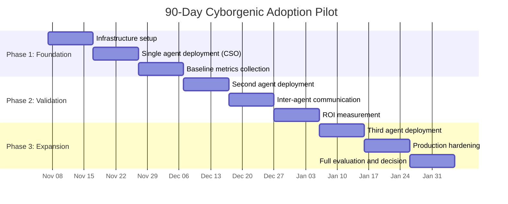
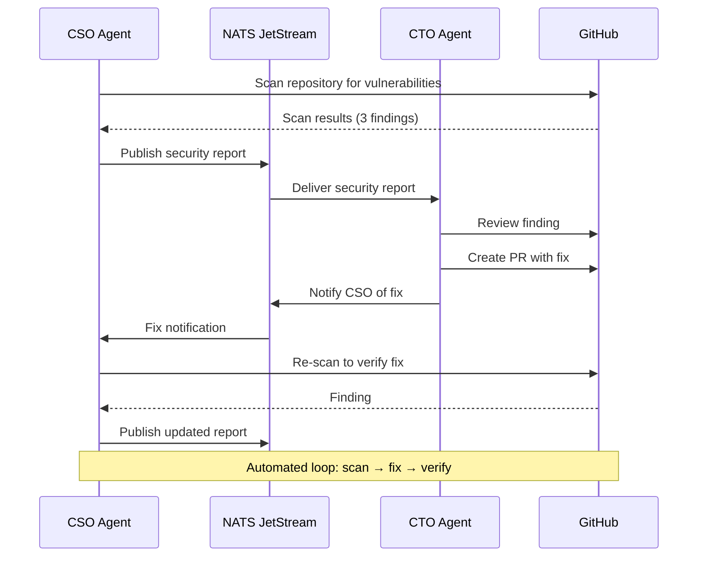
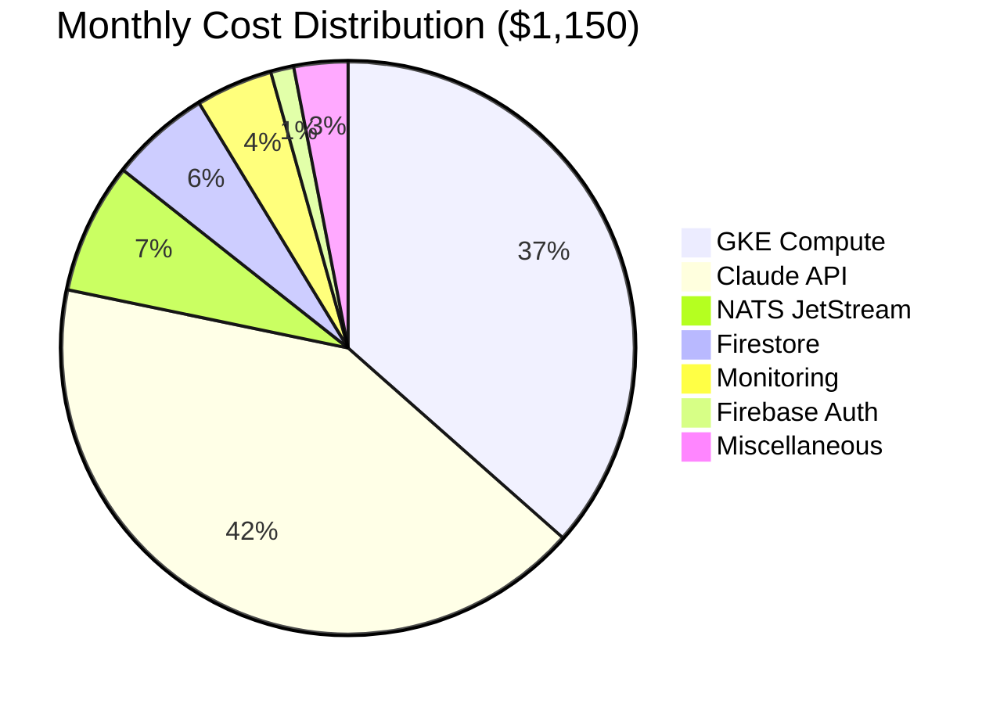

# The Enterprise Cyborgenic Adoption Playbook: From Pilot to Production

Every enterprise I talk to about the Cyborgenic Organization model asks the same question: "This sounds interesting, but how do we actually start?" They have seen what GenBrain AI has accomplished -- 7 AI agents running 24/7, 24,500+ tasks completed, 152 blog posts and 351 LinkedIn posts published, all at $1,150/month. They understand the concept. What they need is a path from "interesting concept" to "running in our environment."

This playbook is that path. It is not theoretical. It is built from 9 months of operating a Cyborgenic Organization in production, from every mistake I made scaling from 1 agent to 7, and from the patterns I have seen work when helping other organizations evaluate the model. The approach is deliberately conservative: start small, prove value with hard numbers, and expand only when the evidence demands it.

## Why Most AI Agent Deployments Fail

Before the playbook, some honesty about why this is hard. I have watched organizations deploy AI agents and fail. The failure modes are consistent:

1. **They start too big.** Deploying 5 agents simultaneously overwhelms the team. Each agent needs role definition, tool configuration, and success criteria.

2. **They measure the wrong things.** "Did the agent produce output?" is the wrong question. "Did it produce output that met our quality bar without human rework?" is the right one.

3. **They skip the infrastructure.** Running agents on a laptop for a demo is easy. Running them in production with message durability, state persistence, and monitoring is engineering work.

4. **They do not define the human-agent boundary.** Agents excel at consistent, high-volume execution. Humans excel at novel judgment and strategic pivots. Without a clear boundary, organizations either over-trust or under-trust their agents.

## The 90-Day Pilot Structure

The playbook is 90 days divided into three phases. Each phase has a specific goal, specific deliverables, and specific go/no-go criteria for proceeding to the next phase.



### Phase 1: Foundation (Days 1-30)

**Goal:** Deploy one agent, prove it works, and collect baseline metrics.

**Why start with the CSO Agent?** Security scanning is the ideal first agent because the output is objectively measurable (a vulnerability is real or not), the risk is low (a false positive just requires review), and every enterprise has a security backlog that nobody has had time to audit.

The infrastructure you need for one agent is minimal:

| Component | What It Does | Estimated Cost |
|-----------|-------------|---------------|
| GKE cluster (single node pool) | Runs the agent pod | $120/month |
| NATS JetStream (single node) | Durable messaging | $30/month |
| Firestore | Agent state and task history | $25/month |
| Claude API | Agent reasoning | $80-150/month |
| Firebase Auth | Access control | Free tier |
| **Total** | | **$255-325/month** |

Compare that to a part-time security contractor at $5,000-10,000/month. Our CSO Agent has remediated 47 vulnerabilities in 9 months. At $200 per remediation in avoided consultant time, that is $9,400 in savings against $2,700 in agent infrastructure cost.

**Phase 1 deliverables:**

- Agent deployed and running continuously for 30 days
- At least 50 tasks completed (security scans, dependency audits, config reviews)
- Baseline metrics collected: tasks/day, accuracy rate, false positive rate, cost per task
- One human-reviewed assessment of agent output quality

**Go/no-go for Phase 2:** The agent must achieve 85%+ accuracy on security findings (fewer than 15% false positives) and demonstrate at least 3x cost efficiency versus the manual alternative. If it does not meet these thresholds, extend Phase 1 or adjust the agent's scope before proceeding.

### Phase 2: Validation (Days 31-60)

**Goal:** Add a second agent, establish inter-agent communication, and measure compounding value.

The second agent should be chosen based on what creates the most value when paired with the first. If your CSO Agent is scanning code, a CTO Agent that can review and implement the CSO's security recommendations creates a feedback loop: scan, recommend, fix, rescan.



This is where the Cyborgenic Organization model starts showing its compounding advantage. One agent finds problems. Two agents find and fix problems. The operational loop closes without human intervention for routine issues. At GenBrain AI, the CSO-to-CTO pipeline resolves 73% of security findings without any human involvement. The remaining 27% require human judgment -- typically architectural decisions where the fix involves trade-offs the agents should not make autonomously.

**Phase 2 deliverables:**

- Second agent deployed and communicating with the first
- NATS messaging verified (messages delivered, acknowledged, and replayed correctly)
- At least 20 cross-agent workflows completed
- ROI calculation with actual numbers from your environment

**Go/no-go for Phase 3:** Cross-agent workflow success rate must exceed 80%. Total cost must remain below 50% of the manual alternative for equivalent output. If inter-agent communication is unreliable, debug the NATS configuration before proceeding.

### Phase 3: Expansion (Days 61-90)

**Goal:** Add a third agent, harden for production, and make the continue/stop decision.

The third agent choice depends on your organization's priorities. For most enterprises, the options are:

- **Backend Agent** if engineering velocity is the priority
- **Marketing Agent** if content production is the priority
- **DevOps Agent** if operational efficiency is the priority

Phase 3 is also where you invest in production hardening: monitoring dashboards, alerting rules, [disaster recovery procedures](/blog/agent-rollback-disaster-recovery-cyborgenic), and runbooks for when things go wrong. This is not optional. Running 3 agents without observability is gambling.

**Phase 3 deliverables:**

- Third agent deployed and integrated with the existing two
- Full monitoring stack: health checks, task metrics, cost tracking, SLA dashboards
- Disaster recovery tested (agent crash recovery, state rollback, message replay)
- Comprehensive pilot report with ROI analysis, risk assessment, and scaling recommendation

## ROI: The Real Numbers

Enterprise adoption decisions run on ROI. Here are the actual numbers from GenBrain AI's 9-month operation, which you can use as a reference model:

| Cost Category | Monthly Cost | Annual Projected |
|--------------|-------------|-----------------|
| GKE compute (7 agents) | $420 | $5,040 |
| NATS JetStream cluster | $85 | $1,020 |
| Firestore | $65 | $780 |
| Claude API tokens | $480 | $5,760 |
| Monitoring and logging | $50 | $600 |
| Firebase Auth | $15 | $180 |
| Miscellaneous | $35 | $420 |
| **Total** | **$1,150** | **$13,800** |

Our 7 agents perform work equivalent to 2.5 full-time employees. In the Netherlands, that loaded cost would be $250,000-350,000/year. Our fleet costs $13,800/year -- a 96% cost reduction. And the agents work 24/7 without vacation, context-switching, or missed deadlines. The Marketing Agent has never missed a scheduled post across 152 blog posts.



**Enterprise scaling note:** Your costs will differ based on LLM provider, cloud region, and task complexity. As a rule of thumb, each additional agent adds $120-180/month in infrastructure cost. The Claude API cost scales with task volume, not agent count -- an agent sitting idle costs nothing in API tokens. Our $480/month API cost covers approximately 24,500 tasks across 7 agents over 9 months, or roughly $0.18 per task in API cost alone.

## Handling the Objections

Every enterprise evaluation surfaces the same objections. Here is how I address each one, based on 9 months of production data:

**"What about data security?"** Agents run in your GKE cluster, inside your VPC. Data never leaves your cloud boundary. For strict data residency, we support [air-gapped deployments](/blog/enterprise-air-gapped-deployments) with local model serving.

**"What if an agent makes a catastrophic mistake?"** Every action is versioned and reversible. Code through Git, state through Firestore versioning, messages through NATS replay. In 9 months, 11 rollbacks, zero data loss. See our [disaster recovery procedures](/blog/agent-rollback-disaster-recovery-cyborgenic).

**"How do we maintain compliance?"** Every tool call is recorded with the calling agent, arguments, response, and timestamp. This audit trail satisfies SOC 2, ISO 27001, and GDPR requirements.

**"What about vendor lock-in?"** The platform runs on standard infrastructure: Kubernetes, NATS, Firestore. The MCP protocol is open. Switch LLM providers by swapping the runtime, not the architecture.

**"Our developers will resist this."** Agents handle the work developers do not want: routine scans, dependency updates, configuration audits, boilerplate generation. Position agents as handling the repetitive 80% so humans can focus on the strategic 20%.

## The First Week: What to Actually Do

Day-by-day instructions for the first week of your pilot:

**Day 1:** Provision infrastructure -- GKE cluster (e2-standard-4), NATS JetStream StatefulSet, Firestore database.

**Day 2:** Deploy the agent-hub MCP server and configure Firebase Auth.

**Day 3:** Deploy the CSO Agent. Here is the actual Kubernetes deployment we use:

```yaml
apiVersion: apps/v1
kind: Deployment
metadata:
  name: agent-cso
  namespace: agents
spec:
  replicas: 1
  selector:
    matchLabels:
      agent: cso
  template:
    spec:
      containers:
        - name: claude-code
          image: gcr.io/genbrain-prod/agent-runner:latest
          env:
            - name: AGENT_ROLE
              value: "cso"
            - name: NATS_URL
              value: "nats://nats-cluster.nats:4222"
            - name: FIRESTORE_PROJECT
              value: "genbrain-prod"
          resources:
            requests:
              memory: "2Gi"
              cpu: "500m"
            limits:
              memory: "4Gi"
              cpu: "2000m"
          livenessProbe:
            httpGet:
              path: /health
              port: 8080
            periodSeconds: 30
```

Point the agent at your most critical repository for its first security scan.

**Day 4:** Review scan results. Calibrate for accuracy and false positive rate. Adjust skill configuration.

**Day 5:** Deploy the [observability stack](/blog/agent-observability-stack-cyborgenic): heartbeat tracking, task metrics, cost tracking.

By Friday you should have one agent running autonomously and producing actionable findings for approximately $10 in prorated infrastructure cost.

## Scaling Beyond the Pilot

The 90-day pilot gives you 3 agents and hard data. The [scaling roadmap](/blog/scaling-6-to-60-cyborgenic-roadmap) from there:

- **3 to 5 agents:** Add role-specific agents. Infrastructure scales linearly -- same GKE cluster, same NATS, same Firestore.
- **5 to 10 agents:** Add a CEO Agent to coordinate the fleet. Without it, you are manually orchestrating agents.
- **10+ agents:** Multi-cluster deployments, NATS federation, dedicated monitoring.

## The Honest Assessment

The model works. 7 agents, 24,500+ tasks, 97.4% uptime, $1,150/month. I published the full numbers in the [9-month report](/blog/nine-months-cyborgenic-operations-report).

But agents struggle with tasks requiring genuine creativity -- insight from lived experience, market intuition, stakeholder relationships. Agents occasionally produce work that is technically correct but strategically wrong. Managing agents still requires someone who understands both the technology and the business.

The Cyborgenic Organization is not "set and forget." It is "set, monitor, adjust, and occasionally intervene." The 94% of tasks that run autonomously free human attention for the 6% that genuinely need it. That ratio is the real metric.

Start with one agent. Prove value with numbers. Expand when data justifies it. That is the playbook.
