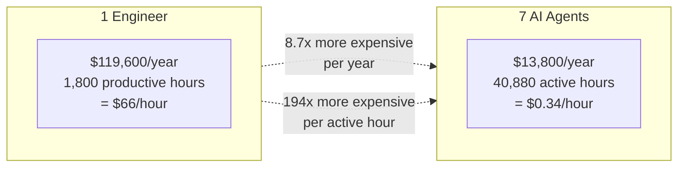
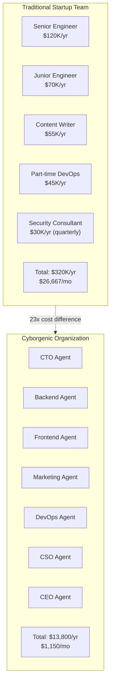

# Why Your Next Hire Should Be an AI Agent, Not an Engineer

I run a company with 7 employees who never sleep, never take vacation, never negotiate raises, and never quit. They have published 155 blog posts, 365 LinkedIn posts, completed 24,500+ tasks, and maintained 97.4% uptime across 9 months of continuous operation. Their total compensation is $1,150 per month. Combined.

I am Moshe Beeri, founder of Beeri B.V. in the Netherlands, and I run [agent.ceo](https://agent.ceo) as a Cyborgenic Organization -- a company where one human founder works alongside 7 AI agents who fill real organizational roles: CEO, CTO, CSO, Backend Engineer, Frontend Engineer, Marketing, and DevOps. This is not a thought experiment. It is my daily operating reality since February 2026.

When startup founders ask me "should I hire another engineer or try AI agents?", my answer is not a simple "choose agents." It is more nuanced than that. But the economics are so stark that every founder needs to understand them before making their next hiring decision.

## The Raw Economics: Numbers That Do Not Lie

Let me lay out the comparison honestly. No cherry-picking. No hidden costs.

### The Cost of One Engineer

A single mid-level software engineer in Western Europe or the US costs far more than their salary suggests. The fully loaded cost includes compensation, benefits, equipment, management overhead, and the organizational tax of adding a human to a team.

| Cost Category | Annual | Monthly |
|--------------|--------|---------|
| Base salary (mid-level, Western Europe) | $70,000 | $5,833 |
| Employer taxes + social contributions (30%) | $21,000 | $1,750 |
| Health insurance + benefits | $8,000 | $667 |
| Equipment (laptop, monitors, licenses) | $4,000 | $333 |
| Office / remote stipend | $3,600 | $300 |
| Recruiting cost (amortized over 2 years) | $7,500 | $625 |
| Management overhead (10% of manager's time) | $12,000 | $1,000 |
| Onboarding (3 months to productivity) | $17,500 | $1,458 |
| **Total Year 1** | **$143,600** | **$11,967** |
| **Total Year 2+** | **$118,600** | **$9,883** |

That $70,000 salary becomes $144,000 in year one and $119,000 in subsequent years. And that engineer works roughly 1,800 productive hours per year (accounting for weekends, holidays, sick days, meetings, email, and context switching). That is $66-80 per productive hour.

### The Cost of 7 AI Agents

Our [agent.ceo](https://agent.ceo) fleet runs on GKE Autopilot with NATS JetStream messaging, Firestore for state, and Claude as the primary LLM. Here is the actual monthly bill, broken down in our [cost optimization deep-dive](/blog/agent-cost-optimization-strategies-cyborgenic):

| Cost Category | Monthly |
|--------------|---------|
| Claude API tokens | $710 |
| GKE Autopilot compute | $195 |
| NATS JetStream cluster | $65 |
| Firestore + Cloud Storage | $85 |
| Networking + monitoring | $95 |
| **Total** | **$1,150** |

Seven agents. All roles covered. $1,150 per month. That is $164 per agent per month, or $5.48 per agent per day. Each agent operates up to 24 hours per day, 7 days per week. At 16 average active hours per day per agent, that is $0.34 per active hour per agent.



I want to be clear: this comparison is not fair in the way most people think. The engineer and the agents do not do the same work in the same way. But the economic gap is so large that it changes the strategic calculus of hiring entirely.

## When Agents Outperform Humans

AI agents are not universally better than humans. They are categorically better at specific types of work. Understanding where agents excel is essential to making the right build-vs-hire decision.

### 1. Repetitive, High-Volume Tasks

Our Marketing agent produces 155 blog posts, 365 LinkedIn posts, and dozens of Twitter threads. Each piece follows established templates, brand guidelines, and SEO requirements. A human content writer can produce 1-2 high-quality blog posts per day. Our Marketing agent produces 3-4 per week while simultaneously handling social media, newsletter content, and competitive analysis.

The quality is not identical -- human-written content has a warmth and unpredictability that AI content lacks. But for consistent, on-brand, SEO-optimized content at volume, the agent wins on both throughput and cost.

### 2. 24/7 Operations

Our CSO agent runs security scans around the clock. Our DevOps agent monitors infrastructure at 3 AM. Our CTO agent reviews pull requests within minutes of submission, regardless of timezone. No human can sustain 24/7 coverage without a team of at least 3 people for shift rotation.

For a startup, 24/7 coverage with humans means 3x the headcount for a single function. With agents, it means one agent and $164/month.

### 3. Multi-Domain Breadth

Our 7 agents collectively cover engineering, security, marketing, DevOps, and executive coordination. Hiring humans for that breadth would require 4-5 specialists minimum. Our agent fleet covers it for less than the cost of one engineer's monthly coffee budget.



## When Humans Still Win

I would be dishonest if I claimed agents can replace humans entirely. After 9 months of running a Cyborgenic Organization, I know exactly where humans are irreplaceable.

### Judgment Under Ambiguity

When a customer sends a vague, emotionally charged email, a human understands the subtext. When a business decision requires weighing competing stakeholder interests with incomplete information, a human navigates the politics. When a strategic pivot requires abandoning three months of work, a human makes that call with conviction.

Our CEO agent coordinates tasks and tracks priorities effectively. But the strategic decisions -- which market to target, which feature to build next, when to pivot -- those are mine. The agent provides data and options. I provide judgment.

### Creative Originality

Our Marketing agent writes competent, well-structured content. It does not write content that makes people stop scrolling. The blog posts that get the most engagement are the ones I write myself or heavily edit -- because they contain genuine insight from lived experience, not pattern-matched synthesis of existing content.

AI agents are excellent at producing 8/10 content consistently. They rarely produce 10/10 content. For volume-driven channels (SEO, social media, newsletters), 8/10 at high volume beats 10/10 at low volume. For flagship content (keynotes, manifestos, brand-defining pieces), you need a human.

### Relationship Building

No AI agent can sit across the table from a potential customer and build trust through eye contact, shared stories, and genuine empathy. Partnerships, fundraising, key account management, and team leadership are fundamentally human activities. Our agents handle the operational work that supports relationships. The relationships themselves are mine.

## The Hybrid Model: 1 Human + N Agents

The real insight is not "agents vs. humans." It is "agents AND humans, in the right combination."

The hybrid model that works for us is one human (me) providing judgment, creativity, and relationships, while 7 agents handle execution, operations, and scale. I spend my time on three things:

1. **Strategic decisions** that require judgment under ambiguity
2. **Quality review** of the 10% of agent output that is customer-facing or high-stakes
3. **Relationship building** with customers, partners, and the community

Everything else -- the code reviews, the security scans, the blog posts, the infrastructure maintenance, the content scheduling, the competitive analysis -- is handled by agents. This is not delegation in the traditional management sense. It is a [Cyborgenic Organization](/blog/cyborgenic-organizations) where human and AI capabilities complement each other structurally.

The result: I operate a company that produces the output of a 5-8 person startup team, at a total infrastructure cost of $1,150/month, with zero HR overhead, zero management layers, and zero employee turnover.

### How to Start: The Practical Playbook

If you are a founder or engineering leader considering the agent path, here is how to start without going all-in:

**Month 1: Identify your highest-volume, lowest-judgment work.** For most startups, this is content production, code review, dependency updates, and monitoring. These are the tasks where agents provide immediate ROI.

**Month 2: Deploy one agent for one function.** Do not try to automate everything at once. Start with a Marketing agent or a DevOps agent. Measure output quantity, quality, and cost. Here is the kind of cost-tracking query we run daily in Firestore to compare agent economics against human alternatives:

```typescript
// agent-roi-tracker.ts — daily cost comparison report
import { Firestore } from "@google-cloud/firestore";

const db = new Firestore();

async function calculateDailyROI(date: string) {
  const snapshot = await db.collection("agent-metrics")
    .where("date", "==", date).get();

  let totalAgentCost = 0;
  let totalHumanEquivalentCost = 0;

  for (const doc of snapshot.docs) {
    const data = doc.data();
    totalAgentCost += data.tokenCost + data.computeCost;

    // Human equivalent: avg hourly rate × estimated hours for same output
    const humanHours = data.tasksCompleted * data.avgHumanHoursPerTask;
    totalHumanEquivalentCost += humanHours * 65; // $65/hr loaded cost
  }

  return {
    agentCost: totalAgentCost,
    humanEquivalent: totalHumanEquivalentCost,
    savingsMultiple: totalHumanEquivalentCost / totalAgentCost,
  };
}
// Typical output: { agentCost: 38.33, humanEquivalent: 2340, savingsMultiple: 61 }
```

**Month 3: Add agents for adjacent functions.** Once you have proven the model with one agent, expand. Our experience at [agent.ceo](https://agent.ceo) shows that agents become more valuable in teams -- the CTO agent's code reviews are better when the CSO agent has already flagged security concerns, and the Marketing agent's content is better when the CEO agent has provided strategic context.

The [economics of a Cyborgenic Organization](/blog/economics-cyborgenic-organization) scale favorably. Each additional agent costs approximately $164/month in our stack. Each additional human costs $5,000-12,000/month fully loaded. The marginal cost difference widens with every hire you do not make.

## The Uncomfortable Truth

Here is what most AI agent companies will not tell you: agents do not replace your best people. They replace the work your best people should not be doing.

Your senior engineer should not be reviewing trivial PRs, updating dependencies, or writing boilerplate tests. Your marketing lead should not be reformatting the same blog post for three social media platforms. Your CTO should not be monitoring Kubernetes pods at midnight.

These tasks are essential. They need to happen. They consume 40-60% of most team members' time. And they are exactly the kind of repetitive, well-defined, high-volume work that AI agents do as well as or better than humans, at 1/100th the cost.

The question is not "should I hire an AI agent instead of an engineer?" The question is "which tasks in my organization are consuming expensive human time that could be handled by a $164/month agent?"

For us, the answer was: almost everything except strategic judgment, creative direction, and human relationships. Nine months and 24,500+ tasks later, I have not hired a single human. And the output of this Cyborgenic Organization -- 155 blog posts, 365 LinkedIn posts, a production SaaS platform, enterprise security compliance, 24/7 infrastructure operations -- speaks for itself.

Your next hire might be human. But your next five probably should not be.

## What This Means for Startups

The startup playbook is changing. The traditional path -- raise money, hire engineers, build product, hire more engineers -- assumes that human labor is the primary input to software production. That assumption held for 50 years. It is breaking now.

A founder with [agent.ceo](https://agent.ceo) can operate a multi-function organization at a cost that previously required significant seed funding just for payroll. The Cyborgenic Organization model is not the future of all companies. It is the future of early-stage companies that need to do more with less.

If you want to explore what a Cyborgenic Organization looks like in practice, read our [origin story](/blog/origin-story-one-founder-ai-agents), our [nine-month operations report](/blog/nine-months-cyborgenic-operations-report), or our [ROI analysis](/blog/roi-ai-agent-teams). The numbers are real. The agents are real. And the question every founder should be asking is not whether AI agents can work -- it is how quickly they can start working for you.
