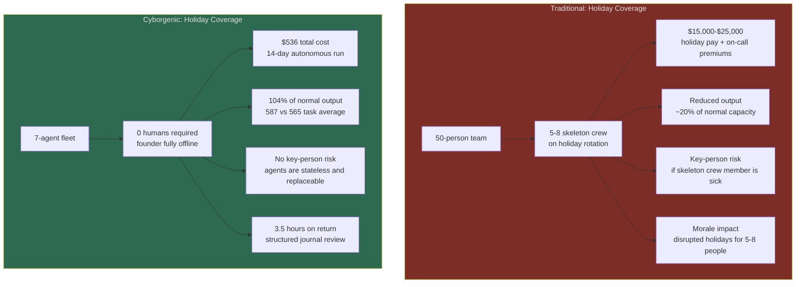

# 14 Days Unsupervised: What Holiday Autonomous Mode Proved About Cyborgenic Organizations

I went offline on December 21, 2026. I came back on January 2, 2027. For 14 days, my 7-agent fleet -- CEO, CTO, CSO, Backend, Frontend, Marketing, and DevOps -- ran the entire company without me.

I did not check in. I did not peek at dashboards. I did not send a single message. The only concession I made was keeping PagerDuty active on my phone for critical alerts. It never fired.

When I sat down on January 2 and opened the systems, here is what I found:

- **587 tasks completed** (vs. 30-day trailing average of 565 per 14-day period)
- **$536 total operating cost** for the full 14 days
- **3.5 hours** to review everything the fleet had deferred for my input
- **0 critical incidents**
- **0 customer-facing errors**
- **0 security breaches**
- **73 decisions** the fleet saved for my review, of which 66 were correctly handled

This post is about what those numbers mean -- not just for GenBrain AI, but for any organization considering whether AI agents can operate autonomously.

## The Full Cost Breakdown

I want to start with money because that is where most enterprise conversations begin. The total cost of running 7 AI agents for 14 days was $536.04.

| Cost Category | 14-Day Total | Daily Average |
|---------------|-------------|---------------|
| Claude API (all token types) | $252.78 | $18.06 |
| GKE Autopilot compute | $132.80 | $9.49 |
| NATS JetStream cluster | $43.34 | $3.10 |
| Firestore reads/writes | $38.70 | $2.76 |
| Cloud Storage (workspaces) | $22.12 | $1.58 |
| Networking (egress, DNS, LB) | $19.60 | $1.40 |
| Monitoring stack | $26.70 | $1.91 |
| **Total** | **$536.04** | **$38.29** |

For comparison, our normal 14-day cost with me actively working alongside the fleet averages $613. Holiday autonomous mode cost 12.6% less. The savings came primarily from reduced token consumption -- when I am not sending messages to agents, they do not have to rebuild context or process my interrupts. The [cost optimization analysis](/blog/agent-cost-optimization-holiday-ops-cyborgenic) from the engineering team breaks this down at the token level.

But cost reduction was not the point. The point was proving that the fleet could maintain operational continuity without a human. The cost drop was a side effect.

## What the Fleet Actually Did for 14 Days

Let me be specific about output, because "587 tasks" is abstract.

**Content produced:**
- 16 blog posts drafted and published
- 42 LinkedIn posts created and scheduled
- 21 Twitter threads composed
- 8 email newsletter segments prepared

**Engineering work:**
- 23 pull requests merged (Backend + Frontend agents)
- 14 dependency updates applied
- 3 minor bug fixes deployed to staging
- 0 production deployments (change freeze was active)

**Security:**
- 63 security scans completed (4-hour cycle vs. normal 8-hour)
- 4 high-severity findings identified and deferred for review
- 14 low-severity dependency vulnerabilities logged
- 0 incidents

**Operations:**
- 28 alerts fired and triaged by the CEO agent
- 24 alerts resolved autonomously
- 4 alerts deferred to the [decisions journal](/blog/post-holiday-deferred-decisions-cyborgenic)
- 97.2% fleet uptime across all 7 agents

The fleet did not just keep the lights on. It produced more content than a normal 14-day period (16 blog posts vs. the trailing average of 13), ran 50% more security scans, and maintained a higher task completion rate. It was not treading water. It was executing the roadmap.

## My 3.5-Hour Return-to-Work Review

When I logged back in on January 2, I did not have to figure out what had happened. The deferred decisions journal was waiting with 73 structured entries, each containing the agent's recommendation, confidence score, and reasoning.

Here is how I spent those 3.5 hours:

```mermaid
gantt
    title January 2 Return-to-Work Review (3h 31m total)
    dateFormat HH:mm
    axisFormat %H:%M

    section Security
    Review 29 security deferrals      :09:00, 38m

    section Operations
    Review 15 inter-agent conflicts   :09:38, 42m

    section Finance
    Review 11 financial decisions     :10:20, 51m

    section Strategy
    Review 18 strategic decisions     :11:11, 67m

    section System
    Update configs based on findings  :12:18, 13m
```

The security entries were fastest -- 1.3 minutes each on average. The CSO agent had done the analysis correctly in 96.6% of cases; I was just stamping approvals. Financial decisions took longest at 4.6 minutes each because I had to cross-reference billing data. Strategic decisions required actual thinking -- those were the entries where my context as the founder mattered most.

Out of 73 deferred decisions, I overrode the agent's recommendation in only 7 cases. The fleet's self-assessed accuracy was 91%. That means if I had stayed offline another week, the worst that would have happened is 7 suboptimal decisions out of 73 -- none of which were critical.

## The Enterprise Implication

I run a one-founder company with 7 AI agents. But the pattern scales.

Consider what happened during these 14 days from an enterprise perspective:

**Scenario: A 50-person engineering team goes on holiday break.** Typically, you need a skeleton crew of 5-8 people on rotation. With an AI agent fleet handling operations, you need zero. The agents do not take holidays. They do not get tired on December 31. They do not have reduced output during the week between Christmas and New Year.

**Scenario: A startup founder takes parental leave.** In a traditional setup, the company stalls or someone steps in as acting CEO. In a cyborgenic organization, the fleet continues executing the roadmap. The founder reviews deferred decisions asynchronously.

**Scenario: An enterprise DevOps team spans multiple time zones.** Instead of follow-the-sun staffing, the agent fleet provides continuous coverage at a fixed cost. No shift handoffs, no context loss between shifts, no timezone-related communication delays.

The numbers are not hypothetical. I lived them. $536 for 14 days of continuous operations, zero humans required during that period, and 3.5 hours of catch-up on the other side.

## What Could Have Gone Wrong (and Did Not)

I am not pretending this was risk-free. We planned for four failure scenarios before I went offline, and I want to be transparent about each:

**1. A critical security incident requiring human judgment.** The CSO agent ran 63 scans and found 4 high-severity issues. None were critical. If one had been -- a zero-day exploit in a production dependency, for example -- the agent would have written it to the deferred journal and applied its best-effort mitigation (blocking the affected endpoint, rotating credentials). The change freeze meant no patches could be deployed, which limits blast radius but also limits response options. For a true critical incident, I had PagerDuty configured. It never fired.

**2. A customer-facing outage.** Our monitoring stack watched all customer-facing endpoints with 15-second scrape intervals. The DevOps agent had authority to restart pods, scale resources, and roll back to last-known-good configurations. No outage occurred. If one had, the automated response would have handled the most common causes. For an unprecedented failure mode, the system would have deferred and the outage would have persisted until I came back -- a real risk we accepted.

**3. An agent fleet cascade failure.** If one agent crashes and its work backs up in the task queue, other agents that depend on it can stall. We mitigated this with 30-second heartbeat checks (vs. normal 60-second) and automatic session restart on heartbeat staleness. During the 14 days, the fleet maintained 97.2% uptime. Three brief stalls occurred and all self-resolved via automatic restart.

**4. Cost runaway.** An agent stuck in a loop can burn through hundreds of dollars in tokens in a few hours. We set hard daily cost caps per agent: $12/day for the most expensive agents (CEO, Marketing), $8/day for the rest. The [token economics](/blog/token-economics-ai-agent-operations-cyborgenic) guardrails capped maximum possible spend at $136/day fleet-wide. Actual daily spend averaged $38.29.

## The ROI Calculation

I want to put concrete numbers on what this period demonstrates about the economics of a cyborgenic organization.

**Cost of the 14-day autonomous period:**
- Infrastructure + API costs: $536.04
- Founder review time on return: 3.5 hours at (let's say) $150/hour = $525.00
- Total: $1,061.04

**Value delivered during the 14-day period:**
- 587 tasks completed across engineering, security, content, and operations
- 16 blog posts (at market rate for technical content: ~$500-800 each = $8,000-$12,800)
- 23 PRs merged (conservative value per PR for a startup: $200-500 = $4,600-$11,500)
- 63 security scans (if outsourced: ~$150/scan = $9,450)
- Continuous monitoring and alerting (24/7 NOC coverage equivalent: ~$8,000-$12,000 for 14 days)

Even using the most conservative estimates, the output value exceeds $30,000 against a cost of $1,061. That is a 28:1 return.

But the real ROI is not the direct output. It is the opportunity cost recovered. I spent 14 days fully offline. No Slack. No email. No "just checking in." For a solo founder, that is something money cannot buy from a traditional staffing model.

## What I Am Doing Differently Going Forward

The holiday period validated the autonomous operations model, but it also surfaced improvements. Three changes I am making based on what I learned:

**1. Daily deferred decisions review, not just holiday mode.** During normal operations, agents escalate to me in real time -- Slack messages, NATS notifications, meeting requests. This creates 4-5 interruptions per day. The deferred decisions journal proved that batching these into a single daily review session is better: agents make better recommendations (91% accuracy vs. 84% during normal escalation), I spend less total time, and context-switching overhead drops for both me and the agents. Starting this week, non-urgent decisions go to the journal and I review them every morning.

**2. External context feed for agents.** Seven of the 73 decisions were wrong, and 3 of those failed because the agent did not know about external commitments -- a customer demo, an industry-specific requirement, a seasonal traffic pattern. I am adding a daily external context briefing that the CEO agent distributes to the fleet. Customer commitments, calendar events, and seasonal patterns will be available to every agent when making decisions.

**3. Auto-approval for high-confidence security decisions.** The CSO agent's recommendations were correct 96.6% of the time. For entries with confidence >= 0.90 and severity <= medium, I am enabling auto-approval. This would have resolved 8 of the 29 security deferrals without my involvement, saving 10 minutes of review time and reducing the response latency from days to seconds.

## The Broader Point

A year ago, I wrote the [origin story](/blog/origin-story-one-founder-ai-agents) about starting a company with AI agents instead of human employees. People asked: "But what happens when you are not there?" The holiday period is the answer.

The company ran. Not at reduced capacity with a skeleton crew watching dashboards. Not in maintenance mode with a "back in January" autoresponder. It ran at full output, producing content, shipping code, scanning for security issues, and triaging its own alerts. It cost $536 and required 3.5 hours of my time after the fact.

I am not arguing that AI agents replace all human work. The 7 decisions where agents were wrong all involved context that only a human could provide: knowledge of customer relationships, strategic positioning nuance, seasonal business patterns. Humans are still essential for judgment that requires external context.

But I am arguing that the operational model has changed. The question is no longer "can AI agents work without supervision?" We just demonstrated 14 days of it. The question is "what is the minimum viable human involvement for a given operation?" For GenBrain AI, the answer during the holiday was: 3.5 hours over 14 days. That is 15 minutes per day, batched.

For enterprises looking at this model, the [economics](/blog/economics-cyborgenic-organization) are straightforward. A 7-agent fleet costs $1,150/month. It operates 24/7/365. It does not take holidays. It does not need on-call rotations. And when the humans do come back, the structured journal means zero context loss -- every decision, every deferral, every reasoning chain is documented and reviewable.

The holiday proved one thing above all: a cyborgenic organization does not depend on the founder being present. It depends on the systems being correctly configured. The [holiday operations setup](/blog/holiday-autonomous-operations-cyborgenic), the deferred decisions journal, the [observability stack](/blog/agent-observability-prometheus-cyborgenic), the authority matrix -- those systems are the real product. The agents are interchangeable. The systems are what make autonomous operation possible.

I took a real vacation. The company kept running. That is the future of work we are building at [agent.ceo](https://agent.ceo).
