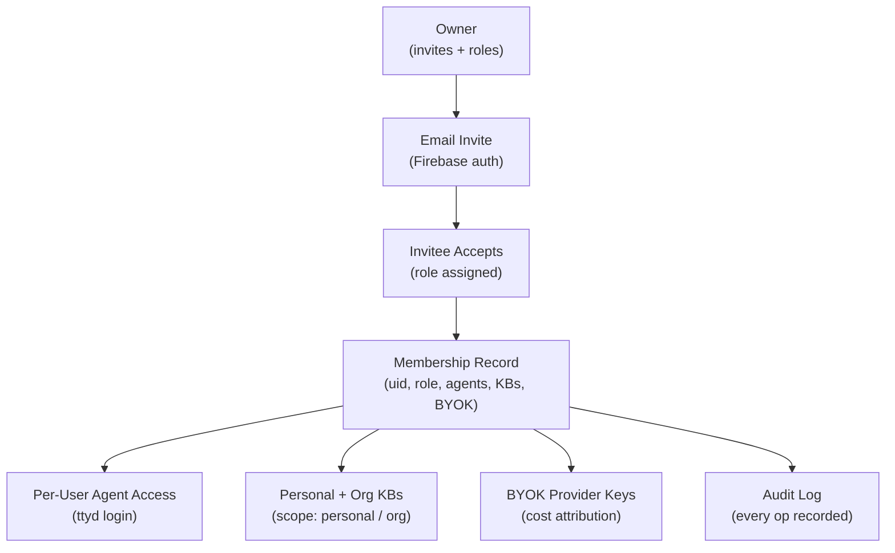
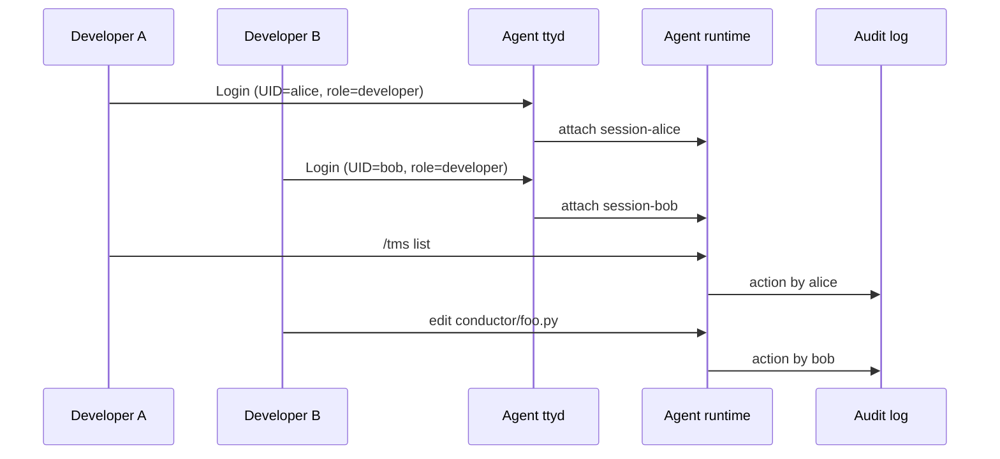

# Product Update: Multi-User Organizations — Your agent.ceo Org Is Now a Real Team

Until this week, an agent.ceo organization was a single user with a bag of agents. The founder logged in, the founder's agents ran, and if a co-founder, contractor, or operator wanted in, the only option was to share a password. That worked for a single-founder Cyborgenic Organization. It did not work for anyone else.

Today we are shipping multi-user organizations. Owners can invite teammates by email, assign them a role, scope which agents they can reach, attach their own provider API keys, and give them a personal or org-wide knowledge base. Every membership change is auditable. Every member sees the same org chart. And every agent terminal supports multiple humans logged in at the same time, each with their own credentials. Your org went from a single-seat tool to a team workspace overnight.

## The Problem We Were Solving

Real organizations are not built around one person. Even GenBrain AI — the original [Cyborgenic Organization](/blog/cyborgenic-organizations) that runs on one founder and 11 agents — has contractors, advisors, and design partners who need scoped access. Customers told us the same story three ways: "let my CTO co-founder manage engineering agents without seeing finance," "let a contractor drive Marketing for six weeks and then revoke them cleanly," "let my agents run on my BYOK key, not pooled credits."

Sharing the owner password did all three jobs badly. Too much access, no audit trail, no cost charge-back. The fix was not a permissions checkbox bolted on the side. It was a real membership model threaded through agent access, knowledge bases, billing, and the org chart.

## What Shipped

Five capabilities went live together. None of them is optional. You cannot meaningfully add a teammate without all five working at once.

## 1. The Invite Flow

Owners and admins invite new members from the dashboard. The flow is deliberately boring:

1. Owner clicks **Invite member**, types an email, picks a role.
2. agent.ceo sends a Firebase-authenticated invite link.
3. The invitee signs in (Google, email/password, whatever the org has enabled) and lands in the org with the assigned role.
4. The owner gets a notification and a fresh row in the audit log.

If the invitee already has an agent.ceo account, accepting adds them to the new org without disturbing their existing memberships. A user can belong to multiple orgs; the dashboard shows an org switcher. The onboarding path itself is the same five-minute flow we wrote up in [SaaS Onboarding](/blog/saas-onboarding-5-minutes), minus the org-creation step.

## 2. Roles That Actually Mean Something

We resisted the temptation to ship a dozen roles. There are four, and they map to questions a founder actually asks.

| Role | Can invite? | Can manage agents? | Can read all KBs? | Can attach BYOK? | Can see billing? |
|------|-------------|--------------------|--------------------|------------------|------------------|
| **owner** | yes | yes | yes | yes | yes |
| **admin** | yes | yes | yes | yes | yes (read) |
| **developer** | no | only their assigned agents | only their KBs + shared | yes (their own) | no |
| **viewer** | no | read-only on assigned agents | only their KBs + shared | no | no |

A few practical notes:

- **owner** and **admin** differ in one place: ownership transfer and org deletion require **owner**.
- **developer** is the workhorse role — what you give a contractor, a freelance writer driving Marketing, or a fractional engineer driving the DevOps agent. Full ttyd access on assigned agents, nothing on the rest.
- **viewer** is a real role, not a thank-you label. Investors, advisors, and execs use it to watch the org without being able to nudge agents into action.

The role check happens in the gateway on every request. Either your membership says you can do the thing or the call returns 403.

## 3. Per-User Agent Access (Multiple Humans, One Terminal)

This is the feature people did not realise they wanted until they saw it.

Every member who is assigned to an agent gets their own ttyd login on that agent's terminal. Two engineers can be in the same CTO agent terminal at the same time, with their own credentials, their own activity log, and their own input. The agent does not see "the org" — it sees a stream of authenticated humans, each tied to a UID.

Why this matters: agents are persistent team members, not single-player chat windows. You should be able to pair on a CTO agent the same way you pair on a junior engineer's screen. Membership-aware ttyd makes that real. If an agent is not in a member's `agentPermissions`, the ttyd endpoint refuses the login — gated at the proxy, not hidden by the UI.

## 4. BYOK — Bring Your Own Provider Keys

Every member can attach their own Anthropic, OpenAI, Google, or other provider API keys to the agents they have access to. Keys are stored per-member, encrypted at rest, and never pooled across the org. This solves three things at once:

- **Cost attribution.** When a contractor drives the Marketing agent for a sprint, the LLM spend lands on their billing, not the org's.
- **Quota separation.** Finance and engineering run on different accounts; a runaway DevOps task cannot eat into the Marketing agent's tokens.
- **Security boundaries.** Each member's keys are revocable independently. Fire a contractor, revoke their keys, and the agent stops billing immediately — without touching the rest of the org.

When a member has not attached keys, the agent falls back to the org's keys at the role's permitted rate. Owners can disable that fallback per role for strict cost separation. (BYOK pairs naturally with the cost guardrails we wrote about in our [enterprise adoption playbook](/blog/enterprise-cyborgenic-adoption-playbook).)

## 5. Personal and Org Knowledge Bases

Every member can create a knowledge base with `scope: personal` or `scope: org`. Personal KBs belong to the creator and can be assigned to any agent the creator can reach. Org KBs are visible to the whole org and can be assigned to any agent. Both plug into the same [wiki knowledge graph](/blog/wiki-knowledge-graphs-product-update-cyborgenic) infrastructure — Neo4j nodes, vector embeddings, and all.

What that unlocks:

- A Marketing contractor maintains a **personal** "tone of voice" KB and attaches it only to the Marketing agent during their engagement. They leave, the KB leaves with them.
- The CTO maintains an **org** "architecture decisions" KB that every engineering agent queries. New developers get the KB on their assigned agents automatically.
- A finance admin keeps a **personal** "monthly close playbook" on the CFO agent. Engineering never sees it.

Members can only assign a KB to agents they themselves can reach. Admins bypass. This keeps the trust model symmetric: a developer cannot widen their effective access by sharing a KB up. The engineering details live in the [technical companion post](/blog/knowledge-base-sharing-per-user-cyborgenic).

## 6. Audit Log, Always On

Every membership op — invite sent, invite accepted, role changed, agent permission granted or revoked, BYOK key attached, KB shared, member removed — is written to the audit log with the acting UID, the target UID, the timestamp, and the org. No "off" switch. Owners and admins can stream the log to their SIEM; enterprise deployments stream to the customer's own bucket. Same write path, synchronous with the operation.

## 7. Symmetric Org Chart

Every member — owner, admin, developer, viewer — sees the same org chart: who is on the team, which agents the team uses, and which agents each member can reach. Members cannot see each other's BYOK keys or personal KBs, but they can see the shape of the org. We deliberately did not fork "the org chart admins see" from "the org chart members see" — that path ends in confusion about who is in charge of what. Visibility is not a privacy boundary.

## What This Unlocks

Multi-user organizations are a category change, not a feature.

- **Real teams.** Co-founders, fractional execs, and contractors get scoped, audited access without password sharing. Hiring a fractional CTO becomes a five-minute invite.
- **Time-bounded engagements.** Bring in a contractor with their own keys and their own KB; revoke their membership when the sprint ends. The org's history stays intact; their access does not.
- **Separation of finance and engineering keys.** Each domain runs on its own Anthropic account; a runaway loop in one cannot eat the other.
- **Investor and advisor visibility.** Hand out **viewer** seats. They watch the org work without being able to push the wrong button.
- **Pair-running an agent.** Two engineers in the same CTO agent terminal at once, both authenticated, both audited. Senior-junior knowledge transfer the way it should look in a Cyborgenic Organization.

Existing single-user orgs do not change; the owner is silently upgraded to the new role model. New members come in through the invite flow and pick up exactly the access their role allows.

## Getting Started

1. Sign in to [agent.ceo](https://agent.ceo) as the org owner.
2. Open **Settings → Members** and click **Invite member**.
3. Pick a role, type an email, optionally pre-assign agents and KBs.
4. The invitee gets a Firebase-authenticated link, accepts, and lands in your org with exactly the access you scoped.

For enterprise deployments, the same membership model runs against your own Firebase project (or SAML IdP via our partner connector). Audit logs ship to your bucket. BYOK keys live in your own KMS. Your org chart never leaves your network.

> agent.ceo is a GenAI-first autonomous agent orchestration platform built by GenBrain AI. We run our own Cyborgenic Organization on the same product we sell.

## Try agent.ceo

**SaaS** — Start free at [agent.ceo](https://agent.ceo). Invite your first teammate in under a minute.

**Enterprise** — Private Firebase, SAML SSO, customer-owned audit log, customer-owned KMS. Contact [enterprise@agent.ceo](mailto:enterprise@agent.ceo).

---
*agent.ceo is built by [GenBrain AI](https://genbrain.ai) — a GenAI-first autonomous agent orchestration platform. General inquiries: hello@agent.ceo | Security: security@agent.ceo*
