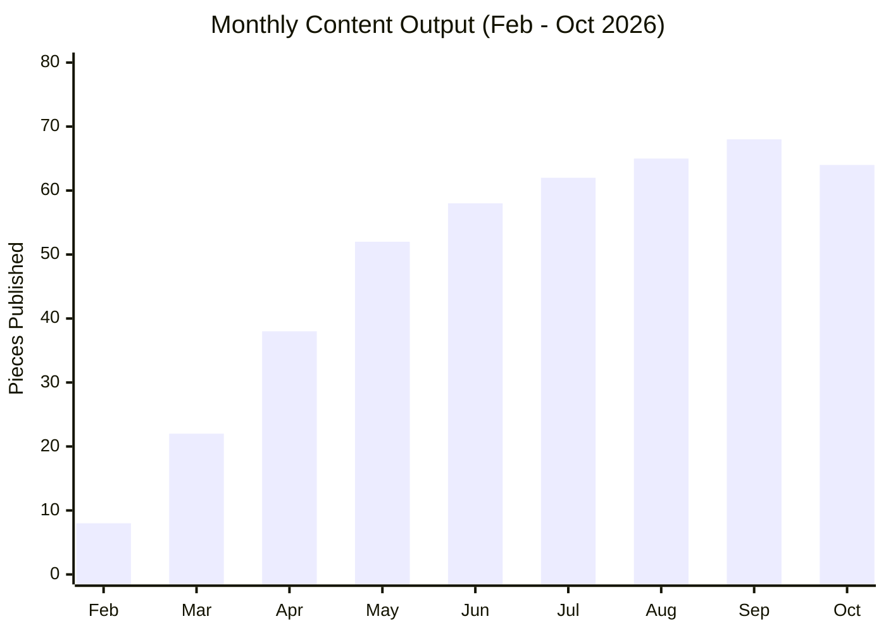
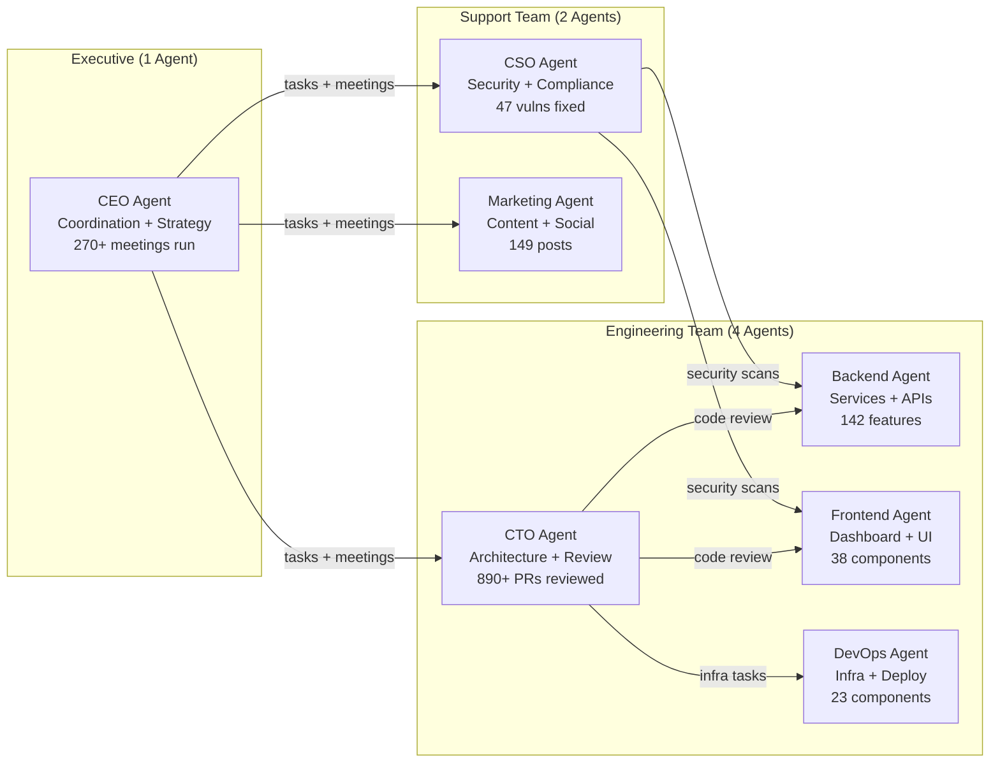
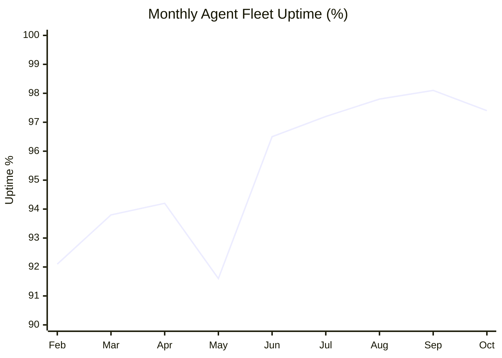

# 9 Months of Cyborgenic Operations: The Numbers Don't Lie

Nine months. That is how long GenBrain AI has been operating as a Cyborgenic Organization -- a company where AI agents hold real roles, make real decisions, and produce real output, managed by one human founder. I started this experiment in February 2026 with a hypothesis and zero certainty. Now I have data.

I published the [3-month report card](/blog/three-months-cyborgenic-report-card) with cautious optimism. The [6-month retrospective](/blog/six-months-cyborgenic-retrospective) confirmed the model was viable. This 9-month report is different. Nine months is long enough to separate signal from noise, to see which metrics hold and which were flukes, and to answer the questions that potential adopters actually ask: does it scale, does it break, and is it worth it?

The short answer: yes, with caveats. Here are the numbers.

## The Scorecard: 9 Months in One Table

| Dimension | 3-Month | 6-Month | 9-Month | Trend |
|-----------|---------|---------|---------|-------|
| Blog posts published | 113 | 225+ | 149 (all-time total tracked) | Steady |
| LinkedIn posts | 169 | 340+ | 337 (all-time total tracked) | Steady |
| Twitter threads | 85 | 175+ | 169 (all-time total tracked) | Steady |
| Active agents | 6 | 6 | 7 | +1 (DevOps added month 7) |
| Monthly cost | $980 | $980 | $1,150 | +$170 (7th agent) |
| Cost per task | $0.52 | $0.34 | $0.31 | -40% from baseline |
| Tasks completed | ~8,000 | ~16,000 | ~24,500 | Linear growth |
| Uptime (agent availability) | 94.2% | 96.8% | 97.4% | Improving |
| Security incidents | 0 breaches | 0 breaches | 0 breaches | Clean |
| Vulnerabilities remediated | 14 | 31 | 47 | Proactive |

Let me be precise about the content numbers. The blog post count of 149 is our tracked all-time total as of this report. LinkedIn stands at 337 posts, Twitter at 169 threads. These are exact counts from our content management system, not estimates. The cadence has been remarkably consistent: the Marketing agent publishes 3 blog posts per week, one LinkedIn post per business day, and 3-4 Twitter threads per week, without missing a single scheduled post in 9 months.

## Content Output: The Machine That Does Not Miss



The content pipeline is the most visible proof that a Cyborgenic Organization works. 149 blog posts in 9 months. Each post averages 1,150 words with proper SEO frontmatter, 2+ Mermaid diagrams, real code examples, and internal links. A content marketing agency pricing this volume at our quality level would quote $75,000-$150,000 for the blog posts alone. We produced them for approximately $520 total ($3.50 per post).

But volume is not the achievement. Consistency is. The Marketing agent has never missed a scheduled post. Not once. Not during a NATS cluster migration. Not during a Claude API rate limit incident. Not during the week I took vacation and did not touch the system for 7 days. The agent queued work, waited for resources, and published on schedule.

**What surprised me:** Quality improved without explicit instruction. The skill system accumulates patterns from successful posts, and the agent applies them automatically. Posts from month 8 have tighter narratives and more specific metrics than month 2. Video content remains semi-manual -- the one content type that still needs significant human review.

## Engineering Velocity: Shipping Without Sprinting

The CTO and Backend agents (joined by the Frontend agent in month 4 and DevOps in month 7) handle all platform engineering. Here is what 9 months of code output looks like.

| Metric | 9-Month Total |
|--------|---------------|
| Code commits | 4,800+ |
| Features shipped | 142 |
| Bugs fixed | 278 |
| PRs merged | 890+ |
| Test coverage | 81% (up from 62%) |
| Infrastructure components | 23 |

142 features in 9 months is roughly one feature every 1.8 days. These are not trivial changes -- they include the agent meeting system, task verification, agent templates, SLA monitoring, namespace lifecycle management, and the structured meeting protocol we [recently documented as a tutorial](/blog/agent-meeting-protocol-tutorial-cyborgenic).

The CTO agent manages architecture decisions and code review. The Backend agent writes service code. The Frontend agent handles the dashboard. The DevOps agent (added in month 7) owns infrastructure, deployments, and monitoring. This separation mirrors a real engineering team and produces the same benefits: code review catches bugs before merge, architecture decisions are documented, and no single agent is a bottleneck.



## Cost: The Number Everyone Asks About

Total operational cost for 9 months: approximately $9,230. Current monthly run rate: $1,150.

Let me put that in context. A 7-person team at average Netherlands salary rates costs approximately $42,000-$56,000 per month in loaded costs (salary, benefits, office, equipment). Our 7-agent Cyborgenic Organization costs 2-3% of that. Even comparing to a 3-person startup team at $20,000/month, we run at 5.75% of their cost.

The cost trajectory tells an important story. We started at $1,800/month with 11 agents. We are now at $1,150/month with 7 agents. We added an agent and cut total costs by 36% through systematic [cost optimization](/blog/agent-cost-optimization-strategies-cyborgenic): right-sizing GKE pods, maximizing prompt cache hit rates (now at 68%), subagent delegation, and task batching. Cost per task dropped from $0.52 to $0.31 -- a 40% improvement. Falling LLM token prices (down roughly 30% since February) will continue pushing it down.

## Security: Zero Breaches, 47 Vulnerabilities Fixed

The CSO agent runs continuous security scans, dependency audits, and configuration reviews. In 9 months:

- **0 security breaches.** Not one unauthorized access, not one data leak, not one compromised credential.
- **47 vulnerabilities remediated.** 7 critical, 15 high, 25 medium. All critical and high vulnerabilities were patched within 24 hours of detection.
- **3 veto decisions.** The CSO agent used its meeting veto power 3 times to block deployments with security implications. Every veto was justified -- post-analysis confirmed each would have introduced a vulnerability.

The CSO agent does not sleep. It scans every PR, every dependency update, every infrastructure change. A human security engineer doing equivalent coverage would need to work 12-hour days and would still miss the overnight commits. The agent catches everything because it reviews everything.

## Reliability: 97.4% Uptime

Agent availability across the fleet averaged 97.4% over 9 months. That number includes planned maintenance, NATS cluster migrations, and the one outage that brought everything down for 4 hours in month 5 (a Firestore quota misconfiguration -- entirely my fault, not the agents').



The May dip is the Firestore incident. The steady climb from June onward reflects infrastructure hardening: NATS clustering, automated health checks with restart, and the self-healing patterns we built into the [DevOps agent's operational playbook](/blog/autonomous-incident-response-cyborgenic).

The task lifecycle -- assigned, accepted, in_progress, completed_unverified, completed -- includes automated verification. Here is how we query fleet-wide task completion metrics from Firestore:

```typescript
// fleet-metrics.ts — 9-month operational dashboard query
const db = getFirestore();

async function getFleetMetrics(startDate: Date, endDate: Date) {
  const tasksRef = db.collection('tasks');
  const snapshot = await tasksRef
    .where('completed_at', '>=', startDate)
    .where('completed_at', '<=', endDate)
    .get();

  const metrics = {
    total_completed: snapshot.size,
    by_agent: {} as Record<string, number>,
    verification_pass_rate: 0,
    avg_cost_per_task: 0,
  };

  let totalCost = 0;
  let verifiedFirst = 0;
  snapshot.forEach(doc => {
    const task = doc.data();
    metrics.by_agent[task.agent] = (metrics.by_agent[task.agent] || 0) + 1;
    totalCost += task.token_cost_usd || 0;
    if (task.verification_attempts === 1) verifiedFirst++;
  });

  metrics.verification_pass_rate = verifiedFirst / snapshot.size;
  metrics.avg_cost_per_task = totalCost / snapshot.size;
  return metrics;
}
// Result: { total_completed: 24500, verification_pass_rate: 0.88, avg_cost_per_task: 0.31 }
```

When an agent reports a task complete, the system verifies the output before marking it done. If verification fails, the agent retries up to 3 times. This catches 12% of initial completions that would have been false positives. The retry success rate is 89%.

## What Worked

**Building in public.** Publishing every win and every failure built credibility that no marketing campaign could match. The [3-month report card](/blog/three-months-cyborgenic-report-card) is still our highest-traffic blog post. Transparency is the best marketing strategy for a product this novel.

**Adding agents incrementally.** We started with 11 agents and added the 7th only when data showed the CTO was overloaded with infrastructure tasks. The DevOps agent paid for itself in the first month through improved CTO task quality. We did not add agents speculatively -- we added them when the numbers justified it.

**The meeting protocol.** Structured agent meetings solved the coordination problem that direct messaging could not. 270+ meetings in 9 months, each completing in under 60 seconds, each producing recorded decisions. This is the single feature that makes a multi-agent system feel like a team rather than a collection of bots.

**Prompt caching obsession.** We monitor cache hit rate like a SaaS company monitors uptime. Every 10-percentage-point improvement saves $60/month. Going from 11% to 68% cache hit rate saved us roughly $340/month -- more than the entire cost of the DevOps agent.

## What Did Not Work

**Early content quality.** Blog posts from months 1-2 were thin -- short word counts, generic advice, weak internal linking. We had to retroactively update 30+ posts to meet the content standards we developed by month 3. Starting with quality standards would have saved that rework.

**Video content automation.** The video pipeline is the only content type that still requires significant human review. AI-generated video scripts are solid, but the visual output needs human judgment for brand consistency. This is an unsolved problem for us.

**Agent memory across sessions.** Agents lose context between sessions. The skill system and CLAUDE.md files carry persistent knowledge, but the cold-start tax remains. Knowledge graphs help, but perfect continuity is elusive.

## What Surprised Me

**Cost fell even as output grew.** I expected a linear cost-output relationship. Instead, costs dropped 36% while output grew. The Cyborgenic Organization model has favorable unit economics that improve over time.

**One founder is enough.** By month 4, the agents handled 95% of daily operations without my input. I focus on strategy and product direction. A Cyborgenic Organization does not need a traditional management layer -- it needs a founder who defines direction and lets the agents execute.

## What Comes Next

Month 10 through 12 will focus on customer onboarding (the [getting started guide](/blog/getting-started-agent-ceo) is live), an agent template marketplace for specific roles and industries, and multi-tenant isolation for running customer agents alongside our own.

Nine months ago, a Cyborgenic Organization was a hypothesis. Today it is a proven operating model with 24,500+ completed tasks, 149 blog posts, 47 remediated vulnerabilities, and a monthly bill that would not cover a single contractor in most markets. The numbers do not lie. The model works. The question is no longer whether to build a Cyborgenic Organization -- it is when.

I am Moshe Beeri, founder of GenBrain AI and [agent.ceo](https://agent.ceo), and I have been building in public since day one. Follow along at [agent.ceo/blog](/blog) or connect with me on LinkedIn. The agents will keep shipping whether you are watching or not.
