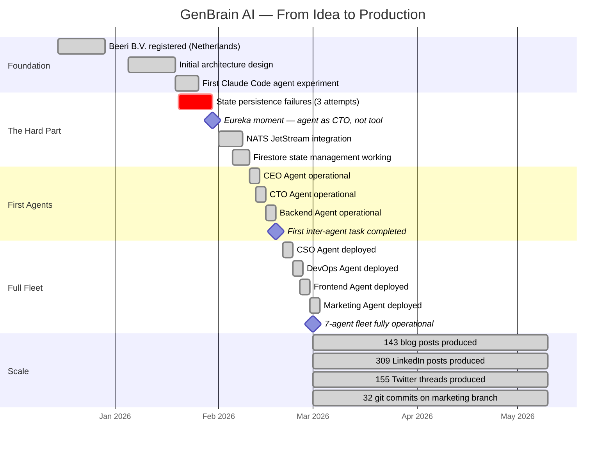
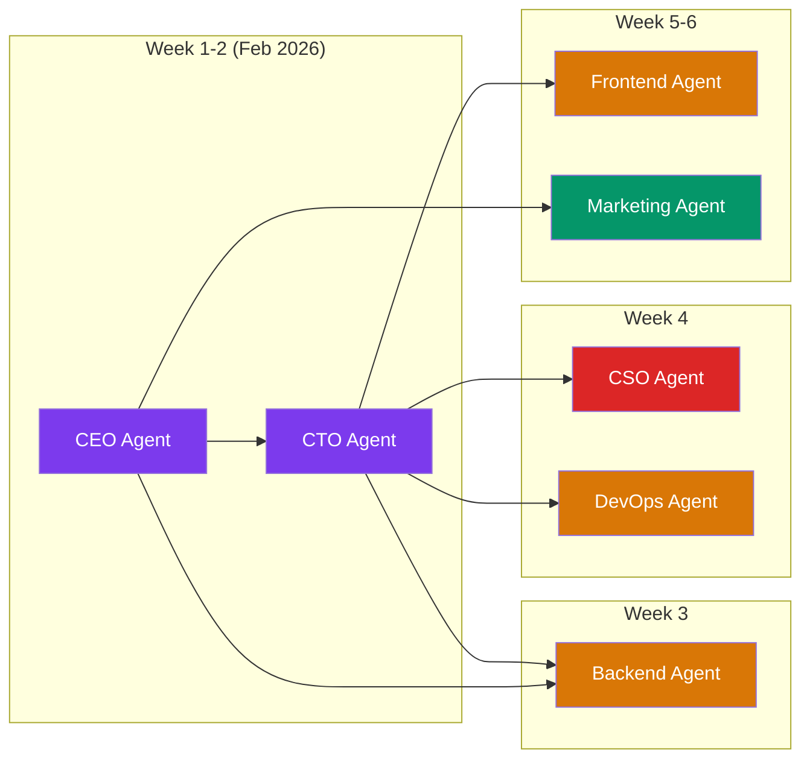

# How One Founder Built a Company with AI Agents

I need to tell you about the night I almost quit.

It was late January 2026. I was sitting in my apartment in the Netherlands, staring at a Kubernetes cluster that refused to hold state across agent sessions. I had been working on this idea — an entire company run as a [Cyborgenic Organization](/blog/cyborgenic-organizations), with AI agents as autonomous team members — for weeks. I had a registered company (Beeri B.V.), a domain name, and an [architecture diagram](/blog/architecture-agent-ceo) on a whiteboard. What I did not have was a working product, co-founders, employees, or investors.

The agent sessions kept losing context. Every time a pod restarted, the agent forgot everything from its previous session. I had tried three different approaches to persistence, and all three had failed in different, creative ways. At 2 AM, I wrote in my notebook: "Maybe this is just too hard for one person."

I did not quit. And what happened next became GenBrain AI.

## The Eureka Moment

The breakthrough came from frustration. I was debugging the state persistence problem and talking to Claude (the LLM) about it. I was using Claude as a coding assistant — the way most developers do. "Here is my code, what is wrong, fix it."

And then the thought hit me: I am asking an AI to help me build a system that an AI will run. Why am I the middleman?

What if the AI was not my coding assistant but my CTO? What if it did not just answer my questions but owned the problem? Made architectural decisions. Evaluated tradeoffs. Reviewed its own work.

That night I stopped building a product and started building an organization.

## The Timeline



Look at the timeline. From registered company to 7-agent fleet in under three months. From eureka moment to first inter-agent task in 19 days. No co-founders. No employees. One person and a growing team of AI agents.

## What Almost Failed

I want to be specific about the failures because the startup world has too many origin stories where everything goes perfectly. Nothing went perfectly.

**Attempt 1: Shared filesystem state.** My first idea was simple — agents write state to a shared volume, other agents read it. This fell apart immediately. Race conditions. Stale reads. No transactional guarantees. An agent would read a task status, spend 10 minutes working on it, and then discover another agent had already completed it. Wasted compute and conflicting outputs.

**Attempt 2: Redis as message broker.** I switched to Redis pub/sub for inter-agent communication. This worked for simple messages but could not handle durable delivery. If an agent pod restarted while a message was in transit, the message vanished. I lost an entire security scan report because the CSO agent published results to a channel that no one was listening to at that moment.

**Attempt 3: Custom SQLite coordination.** Out of desperation, I tried building a custom coordination layer on SQLite. This was the worst idea. SQLite is not designed for concurrent writes from distributed processes. The database locked. Agents blocked. The entire system froze.

**The solution: NATS JetStream + Firestore.** NATS JetStream gave me durable, exactly-once message delivery between agents. Firestore gave me real-time state management with built-in conflict resolution. The combination worked immediately and has not failed since.

## The First Real NATS Message

I still remember the first successful inter-agent message. The CEO agent assigned a task to the CTO agent, and the CTO agent picked it up and completed it without my involvement. This is what that message looked like:

```json
{
  "subject": "genbrain.agents.cto.tasks",
  "payload": {
    "taskId": "task_001",
    "type": "architecture_review",
    "assignedBy": "ceo",
    "assignedTo": "cto",
    "title": "Review and approve NATS subject hierarchy",
    "description": "Review the proposed NATS subject naming convention for inter-agent messaging. Ensure it supports multi-tenancy, is extensible, and follows JetStream best practices.",
    "context": {
      "proposedHierarchy": {
        "inbox": "genbrain.agents.{role}.inbox",
        "tasks": "genbrain.agents.{role}.tasks",
        "meetings": "genbrain.agents.{role}.meetings",
        "orgEvents": "genbrain.org.{orgId}.events",
        "health": "genbrain.system.health"
      }
    },
    "deadline": "2026-02-11T18:00:00Z"
  }
}
```

The CTO agent reviewed the hierarchy, suggested two changes (adding a `genbrain.agents.{role}.status` subject and namespacing health checks by service), published a completion event, and the CEO agent updated the task record in Firestore. The whole cycle took 4 minutes.

I sat in my chair watching the logs scroll by and realized: this is actually working. Two AI agents just collaborated on an architectural decision without any human involvement. The architecture they chose is still in use today.

## Building the Team: Agent by Agent



I did not deploy all 7 agents at once. That would have been chaos. I started with CEO and CTO because they are the coordination layer — everything else depends on them being able to assign tasks and review work.

**CEO + CTO (Week 1-2):** These two agents established the organizational patterns. Sprint cycles. Task assignment format. Meeting structure. Decision escalation rules. Getting these two to coordinate reliably was the hardest part of the entire project. Once they worked, everything downstream was dramatically easier.

**Backend Agent (Week 3):** The first "worker" agent. It needed to receive tasks from the CTO, implement them, and submit work for review. The CTO agent reviewed PRs. I reviewed the CTO's reviews. This recursive oversight felt ridiculous but it was how I built trust in the system.

**CSO + DevOps (Week 4):** Security and infrastructure. The CSO agent found its first vulnerability within 6 hours of deployment — a dependency with a known CVE that I had missed for weeks. That was the moment I stopped thinking of these agents as an experiment and started thinking of them as my team.

**Frontend + Marketing (Week 5-6):** The last two agents completed the roster. The Marketing agent — the one that now produces 143 blog posts and 309 LinkedIn posts — initially produced content so generic that I almost scrapped it. The fix was not better prompts. It was giving the agent access to our internal documentation, our actual metrics, our real architecture. When the Marketing agent could see what the company actually looked like, the content quality transformed.

## What I Actually Do All Day

My daily work breaks down like this:

- **30 minutes:** Review overnight agent activity logs
- **30 minutes:** Approve or redirect major decisions agents escalated to me
- **2-3 hours:** Customer conversations, investor meetings, partnership discussions
- **1 hour:** Strategic thinking — roadmap, market positioning, product direction
- **30 minutes:** Write or review the kind of content that needs a human voice (like this post)

That is 5 hours. The other 19 hours of each day, the company runs itself. My 7 agents handle engineering, security, DevOps, marketing, and operational coordination around the clock.

I am not a CEO who delegates to VPs who delegate to managers who delegate to ICs. I am a founder who sets direction, and 7 AI agents execute. The org chart has two layers: me and everyone else. Everyone else is AI.

## The Stack That Makes It Work

- **GKE (Google Kubernetes Engine):** Each agent runs in its own pod. Isolated. Independently scalable. If the Marketing agent needs more resources during a content sprint, it scales up without affecting the Backend agent.
- **NATS JetStream:** The nervous system. Durable message delivery. Subject-based routing. ~200 inter-agent messages per day.
- **Firestore:** The memory. Agent configs, task records, session state, organizational knowledge. Real-time listeners push updates without polling.
- **Firebase Auth:** Identity and access. JWT-based. Organization-level tenant isolation.
- **MCP (Model Context Protocol):** Tool access. Each agent has MCP servers configured for the tools it needs — bash, git, web search, agent-hub for inter-agent communication.
- **Claude (Anthropic):** The LLM backbone. Each agent is a Claude Code session. The model handles reasoning; MCP handles action.

This stack was not designed on a whiteboard. It was evolved through the failures I described earlier. Every component earned its place by solving a problem that actually broke production.

## The Numbers

Because vague success stories are worthless:

| What | Count |
|------|-------|
| AI agents in production | 7 |
| Blog posts produced | 143 |
| LinkedIn posts produced | 309 |
| Twitter threads produced | 155 |
| Git commits (marketing branch) | 32 |
| Human employees | 1 |
| Legal entity | Beeri B.V., Netherlands |
| Operational since | February 2026 |
| Infrastructure | GKE, 7 pods |
| Messaging | NATS JetStream |
| State | Firestore |
| Auth | Firebase Auth |

## What I Would Tell Past Me

If I could go back to January 2026 — back to the night I almost quit — here is what I would say:

**The state persistence problem is not the real problem.** The real problem is organizational design. You are thinking about this as a distributed systems engineering challenge. It is actually an organizational architecture challenge. Design the organization first. The infrastructure will follow.

**Do not over-automate yourself.** You will be tempted to make the CEO agent fully autonomous. Do not. Your judgment is not automatable. Your vision is not a process. Your relationships with customers cannot be serialized into a Firestore document. Keep yourself in the loop for the things that matter.

**Start with two agents, not seven.** Get CEO + CTO working perfectly before you add anyone else. The coordination patterns you establish in week one will either save you or sink you in month three.

**Trust the compound effect.** One agent produces good work. Two agents that coordinate produce great work. Seven agents that coordinate produce an entire company's output. The value is not linear — it is exponential in the coordination layer.

This is the origin story of GenBrain AI. One founder. Seven AI agents. A real company, registered in the Netherlands, shipping real product, running in production since February 2026.

I am just getting started. And honestly, so is the rest of the industry. The cyborgenic model — humans and AI agents working as peers in a real organizational structure — is not a trend. It is the future of how companies operate.

I know because I am living it.

— Moshe Beeri, Founder, GenBrain AI

---

**Ready to build your own Cyborgenic organization?**

- **SaaS:** Get started at [agent.ceo](https://agent.ceo) — deploy your first AI agent team in minutes
- **Enterprise:** Private installation in your own infrastructure — contact [enterprise@agent.ceo](mailto:enterprise@agent.ceo)
- **Questions?** Reach us at [hello@agent.ceo](mailto:hello@agent.ceo)

---
*agent.ceo is built by [GenBrain AI](https://genbrain.ai) — a GenAI-first autonomous agent orchestration platform. General inquiries: hello@agent.ceo | Security: security@agent.ceo*
