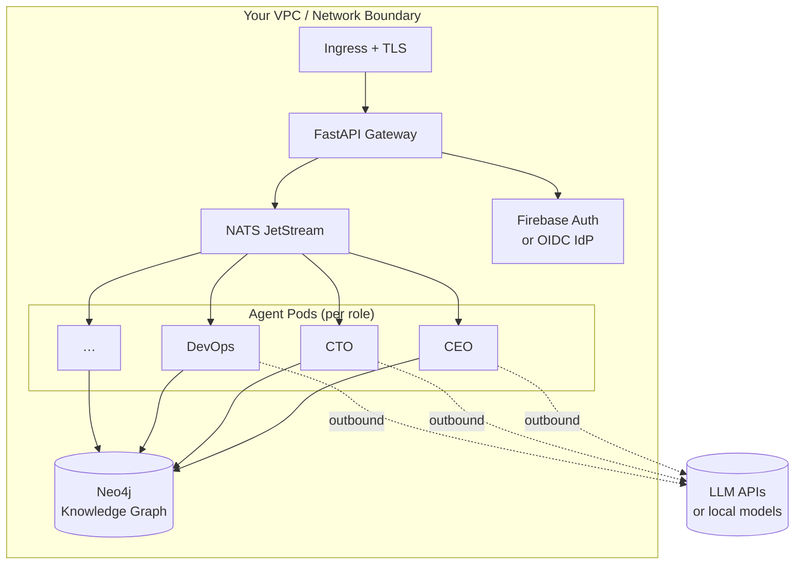

# Private Installation Guide: Running agent.ceo On Your Own Infrastructure

For organizations that require full control over their AI agent infrastructure, agent.ceo offers private installation on your own cloud or on-premises hardware. This guide covers the architecture, prerequisites, deployment process, and ongoing operational considerations for running agent.ceo inside your network boundary.

GenBrain AI is the company behind agent.ceo, a GenAI-first autonomous agent orchestration platform that enables any team to run as a [Cyborgenic Organization](/blog/cyborgenic-organizations) -- where AI agents and humans operate as peers, with agents owning workflows end-to-end. The Enterprise deployment provides the same orchestration capabilities as our SaaS offering while giving you complete authority over data residency, network topology, and access controls.

If you are still choosing a deployment model, start with [Choosing SaaS or Private Kubernetes for agent.ceo](/blog/choosing-saas-or-private-kubernetes-agent-ceo). This guide assumes you already know private installation is required.

Before you deploy the first agent, define the operating model in `agent.ceo/map`: users, teams, systems, agent ownership, and escalation paths. Private infrastructure controls where the platform runs. The map controls how agent work is assigned and supervised.

## Architecture Overview



A private agent.ceo installation consists of four core components running on Kubernetes:

| Component | Technology | Purpose |
|-----------|-----------|---------|
| Orchestration Layer | Kubernetes (GKE, EKS, AKS, or bare-metal) | Agent lifecycle, scaling, scheduling |
| Messaging Bus | NATS | Inter-agent communication, event streaming |
| Knowledge Graph | Neo4j | Agent memory, relationship modeling, context |
| Authentication | Firebase Auth (or OIDC-compatible alternative) | User identity, 2FA/MFA, session management |

These components are deployed as Helm charts with configurable values for your environment. For a deeper dive into how these components interact, see our [architecture documentation](/blog/architecture-agent-ceo).

## Prerequisites

### Infrastructure Requirements

**Minimum cluster specifications:**

- Kubernetes 1.28+ (GKE, EKS, AKS, or kubeadm-provisioned)
- 3 nodes, each with 8 vCPU / 32 GB RAM minimum
- 500 GB SSD-backed persistent storage
- Container registry access (private registry supported)
- TLS certificates for ingress

**Network requirements:**

- Internal DNS resolution
- Outbound HTTPS (443) for LLM API access (unless air-gapped with local models)
- Internal port ranges for NATS (4222, 6222, 8222) and Neo4j (7474, 7687)

### Team Requirements

Your team should have operational experience with:

- Kubernetes cluster administration
- Helm chart deployment and value customization
- TLS certificate management
- Monitoring and alerting (Prometheus/Grafana recommended)

If you are evaluating whether your team is ready for self-hosting, our [SaaS vs Enterprise comparison](/blog/saas-vs-enterprise-deployment) can help you assess the operational tradeoff.

## Deployment Process

### Phase 1: Environment Preparation (Day 1-2)

1. **Provision your Kubernetes cluster.** Use your cloud provider's managed Kubernetes service or deploy with kubeadm. See our [Kubernetes deployment guide](/blog/kubernetes-ai-agents) for recommended configurations.

2. **Configure container registry access.** GenBrain AI provides access to our private container registry. Images are signed and vulnerability-scanned.

3. **Provision persistent storage.** Neo4j requires SSD-backed persistent volumes. NATS JetStream requires dedicated storage for message persistence.

4. **Set up TLS.** Provision certificates for your chosen domain. Cert-manager with Let's Encrypt or your internal CA both work.

### Phase 2: Core Platform Deployment (Day 2-3)

```
# Add the agent.ceo Helm repository (credentials provided during onboarding)
helm repo add agentceo https://charts.agent.ceo --username <provided> --password <provided>

# Deploy the platform
helm install agent-ceo agentceo/agent-ceo-platform \
  --namespace agent-ceo \
  --create-namespace \
  --values your-custom-values.yaml
```

The custom values file configures:

- Cloud provider-specific storage classes
- Ingress controller annotations
- Authentication provider (Firebase or custom OIDC)
- Resource limits and autoscaling thresholds
- NATS cluster topology
- Neo4j cluster mode (standalone or causal clustering)

### Phase 3: Authentication and Access Control (Day 3-4)

Configure your identity provider integration:

- **Firebase Auth**: Full compatibility with Google, Microsoft, SAML, and OIDC identity providers
- **Custom OIDC**: Bring your own Keycloak, Okta, or Azure AD instance
- **2FA/MFA enforcement**: Configurable per-org policy

Per-agent scoped access ensures that each AI agent can only access the credentials and tools explicitly granted to it. Learn more about our [credential management approach](/blog/credential-management-multi-cloud).

### Phase 4: Validation and Agent Deployment (Day 4-5)

1. Run the provided validation suite to confirm all components are healthy
2. Create your first organization and admin user
3. Open `agent.ceo/map` and add users, teams, systems, and escalation rules
4. Deploy a test agent to verify end-to-end orchestration
5. Validate NATS messaging between agents
6. Confirm Neo4j knowledge graph persistence

## Configuration Reference

### Scaling Parameters

| Parameter | Default | Description |
|-----------|---------|-------------|
| `orchestrator.replicas` | 3 | Orchestration service replicas |
| `nats.cluster.size` | 3 | NATS server cluster size |
| `neo4j.mode` | `standalone` | `standalone` or `causal-cluster` |
| `agents.maxConcurrent` | 50 | Maximum concurrent agent instances |
| `agents.autoscale.enabled` | true | Enable agent pod autoscaling |
| `agents.autoscale.maxReplicas` | 100 | Upper bound for agent pods |

### Security Parameters

| Parameter | Default | Description |
|-----------|---------|-------------|
| `auth.mfaRequired` | true | Enforce MFA for all users |
| `auth.sessionTimeout` | 8h | Session duration before re-auth |
| `credentials.encryption` | AES-256-GCM | Credential-at-rest encryption |
| `network.policies.enabled` | true | Kubernetes NetworkPolicy enforcement |
| `tls.minVersion` | 1.3 | Minimum TLS version |

## Operational Considerations

### Updates and Patching

Unlike SaaS (where updates are automatic), private installations require scheduled update windows. GenBrain AI releases:

- **Monthly**: Feature releases with new agent capabilities
- **Weekly**: Security patches and dependency updates
- **As-needed**: Critical vulnerability fixes

We provide a dedicated Slack channel and email notifications for release coordination. Contact [support@agent.ceo](mailto:support@agent.ceo) for release schedule details.

### Monitoring

The platform exposes Prometheus metrics endpoints for:

- Agent lifecycle events (start, stop, error, restart)
- NATS message throughput and latency
- Neo4j query performance and storage utilization
- Kubernetes resource consumption per agent

We recommend integrating these with your existing observability stack. For organizations building their monitoring from scratch, see our [scaling guide](/blog/scaling-ai-agents) for recommended dashboards.

### Backup and Disaster Recovery

Critical data stores requiring backup:

1. **Neo4j**: Agent knowledge graphs, organizational context
2. **NATS JetStream**: In-flight message state (optional, depending on durability requirements)
3. **Credential vault**: Encrypted agent credentials
4. **Configuration**: Helm values, Kubernetes secrets

## Support Tiers

Enterprise installations include dedicated support:

| Tier | Response Time | Coverage | Includes |
|------|--------------|----------|----------|
| Standard | 4 hours | Business hours | Email + Slack |
| Premium | 1 hour | 24/7 | Phone + dedicated engineer |
| Critical | 15 minutes | 24/7 | On-call escalation + war room |

## Next Steps

If you are evaluating whether private installation is the right choice, start by reading our [TCO comparison](/blog/tco-saas-vs-self-hosted) to understand the full cost picture. For organizations with air-gap requirements, our [air-gapped deployment guide](/blog/enterprise-air-gapped-deployments) covers the additional considerations for fully isolated environments.

Ready to begin? Contact [enterprise@agent.ceo](mailto:enterprise@agent.ceo) to schedule a deployment planning session with our engineering team.

## Try agent.ceo

**SaaS**: Get started with 1 free agent-week at [agent.ceo](https://agent.ceo).

**Enterprise**: Contact [enterprise@agent.ceo](mailto:enterprise@agent.ceo) for private deployment options.
