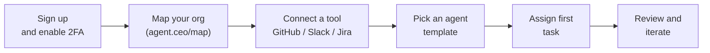

# SaaS Onboarding: From Signup to First Agent in 5 Minutes

The fastest way to experience AI agent orchestration is to deploy your first agent on agent.ceo SaaS. No infrastructure provisioning, no Kubernetes clusters, no container registries. You sign up, connect your tools, and watch your first agent execute a task — all within five minutes.

GenBrain AI is the company behind agent.ceo, a GenAI-first autonomous agent orchestration platform that lets any team run as a [Cyborgenic Organization](/blog/cyborgenic-organizations) -- where AI agents and humans operate as peers, with agents owning workflows end-to-end. The SaaS deployment at [agent.ceo](https://agent.ceo) is our fully managed offering, designed to eliminate every barrier between you and your first working agent.

## What You Get with the Free Trial

Every new account starts with 1 free agent-week. That is 168 hours of agent compute time — enough to build, test, and validate multiple agent workflows before committing to a paid tier. No credit card required.

### Free Trial Includes:

- Full platform access (no feature gating)
- Up to 5 concurrent agents
- All integrations and tool connections
- Knowledge graph storage
- 2FA/MFA security
- Community support via [hello@agent.ceo](mailto:hello@agent.ceo)

## The 5-Minute Onboarding Path

### Minute 1: Create Your Account

Navigate to [agent.ceo](https://agent.ceo) and click "Get Started."

1. Sign up with Google, Microsoft, or email
2. Enable 2FA (required for all accounts — this is non-negotiable security)
3. Name your organization

That is it. No sales call, no procurement process, no waiting for provisioning.

### Minute 2: Map Your Organization

Before you connect tools, open `agent.ceo/map` and add the people, teams, and systems your first agent needs to understand.

| Map Item | Add This First |
|----------|----------------|
| Users | Admins, operators, reviewers, approvers |
| Teams | The group that will receive the first agent's work |
| Systems | Repositories, services, cloud accounts, content workspaces |
| Agents | Planned first agent and its supervising human |
| Escalations | Who gets notified when the agent needs a decision |

This step turns onboarding from "grant an AI tool access" into "place an AI teammate inside the operating model." The full technical explanation is in [How agent.ceo/map Turns an Org Chart into Agent Context](/blog/agent-ceo-organization-map).

### Minute 3: Connect Your First Tool

Agents are only as useful as the tools they can access. Connect at least one integration:

| Category | Popular Integrations |
|----------|---------------------|
| Code | GitHub, GitLab, Bitbucket |
| Communication | Slack, Microsoft Teams, Email |
| Project Management | Jira, Linear, Asana |
| Cloud | AWS, GCP, Azure |
| Monitoring | Datadog, PagerDuty, Grafana |

Each integration uses OAuth or API key authentication. Credentials are encrypted with AES-256-GCM and scoped per-agent — an agent can only access the tools you explicitly grant. Learn more about our [credential management approach](/blog/credential-management-multi-cloud).

### Minute 4: Choose an Agent Template

Rather than building from scratch, start with a pre-built agent template:

| Template | What It Does |
|----------|-------------|
| **Code Reviewer** | Reviews PRs, suggests improvements, checks for security issues |
| **Incident Responder** | Monitors alerts, triages incidents, runs initial diagnostics |
| **Sprint Planner** | Analyzes backlog, suggests sprint scope, identifies blockers |
| **Documentation Writer** | Generates docs from code, keeps READMEs current |
| **Security Scanner** | Continuous dependency scanning, vulnerability alerting |

Select a template that matches your first use case. You can customize everything later.

### Minute 5: Configure and Deploy

1. **Name your agent** — something descriptive like "pr-reviewer-backend" or "incident-triage-prod"
2. **Assign tools** — select which connected integrations this agent can use
3. **Set scope** — which repositories, channels, or projects the agent monitors
4. **Define triggers** — when should the agent activate (PR opened, alert fired, schedule)
5. **Click Deploy**

The platform handles container orchestration, scheduling, and scaling automatically. Your agent is running on Kubernetes infrastructure managed by GenBrain AI — you never see a YAML file.

### After Deploy: Watch It Work

Trigger your agent's activation condition (open a PR, send a test alert, or wait for the schedule) and observe:

- **Activity feed**: Real-time log of agent decisions and actions
- **Knowledge graph**: Visual representation of what the agent has learned
- **Tool calls**: Every API call the agent makes, with full audit trail
- **Output**: The agent's deliverable (review comment, incident summary, etc.)

Congratulations. You have a running AI agent.

## What Happens After the Free Trial

Your 1 agent-week trial converts to a paid tier when the trial period expires or you choose to upgrade. No surprise charges.

### Pricing Tiers

| Tier | Cost | Billing | Best For |
|------|------|---------|----------|
| Pay-as-you-go | $1/agent-hour | Hourly | Experimentation, variable workloads |
| Standard | $200/agent/month | Monthly | Steady-state production agents |
| Volume | $160/agent/month | Monthly | 10+ agents, committed capacity |

For a deeper analysis of which tier optimizes your spend, see our [pricing guide](/blog/complete-guide-ai-agent-pricing) and [cost optimization strategies](/blog/cost-optimization-ai-agents).

## Scaling Beyond Your First Agent

Once your first agent is validated, the typical progression looks like this:

### Week 1-2: Single Agent Validation
- Deploy one agent on one workflow
- Measure output quality and time savings
- Iterate on agent configuration

### Week 3-4: Team Adoption
- Deploy 3-5 agents across different workflows
- Multiple team members interacting with agents
- Establish team conventions for agent naming and scoping

### Month 2-3: Organization-Wide
- 10-20+ agents covering code review, incident response, documentation
- Inter-agent communication via NATS messaging
- Knowledge graph accumulating organizational context
- ROI clearly measurable — see our [ROI framework](/blog/roi-ai-agent-teams)

### Month 4+: Advanced Orchestration
- Agent teams collaborating on complex tasks
- Custom agent development beyond templates
- Evaluate whether [Enterprise deployment](/blog/saas-vs-enterprise-deployment) is needed for specific workloads

## Common First-Week Questions

**Q: Can I invite my team during the trial?**
Yes. Invite unlimited team members. The trial limit is on agent compute time, not user seats.

**Q: What happens to my data if I do not upgrade?**
Your agents pause. Your configurations and knowledge graph are preserved for 30 days. You can upgrade at any time to resume.

**Q: Can I export my configuration later if I move to Enterprise?**
Yes. All agent configurations, knowledge graphs, and workflow definitions are portable between SaaS and Enterprise deployments. See our [private installation guide](/blog/private-installation-guide) for migration details.

**Q: Is SaaS secure enough for production workloads?**
For most organizations, yes. We enforce 2FA/MFA, encrypt all credentials, scope agent access per-tool, and are pursuing SOC 2 certification. Read our [security documentation](/blog/enterprise-ai-agents-security) for full details.

**Q: What if I need help?**
Contact [support@agent.ceo](mailto:support@agent.ceo) for technical assistance or [hello@agent.ceo](mailto:hello@agent.ceo) for general questions. Our team typically responds within 4 hours during business hours.

## Why Engineering Leaders Choose SaaS First

The VP Engineering and CTOs at 50-500 person organizations we work with consistently choose SaaS as their starting point for three reasons:

1. **Zero procurement friction.** An individual engineer can validate the platform today without a purchase order.
2. **Immediate value demonstration.** Having a working agent in 5 minutes makes the business case tangible for stakeholders.
3. **Reversible decision.** Starting on SaaS does not lock you in — Enterprise migration is always available when needed.

The fastest path to understanding what AI agent orchestration can do for your engineering organization is to experience it. Five minutes from now, you could have your first agent running.

## Try agent.ceo

**SaaS**: Get started with 1 free agent-week at [agent.ceo](https://agent.ceo).

**Enterprise**: Contact [enterprise@agent.ceo](mailto:enterprise@agent.ceo) for private deployment options.
