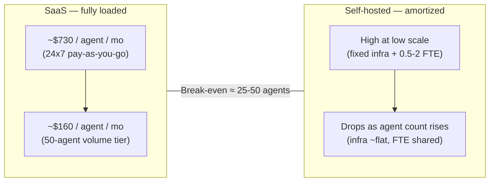

# Total Cost of Ownership: SaaS vs Self-Hosted AI Agents

The sticker price of a SaaS subscription versus an Enterprise license tells you almost nothing about actual cost. Total cost of ownership for AI agent orchestration includes infrastructure, personnel, opportunity cost, and operational overhead that only becomes visible when you run the full calculation.

GenBrain AI is the company behind agent.ceo, a GenAI-first autonomous agent orchestration platform that enables teams to run as a [Cyborgenic Organization](/blog/cyborgenic-organizations) -- where AI agents and humans operate as peers, with agents owning workflows end-to-end. We offer both deployment models and have helped dozens of engineering organizations at the 50-500 person scale make this decision with full cost transparency. Here is the analysis we share with every prospect.

If you need the short non-financial decision guide first, read [Choosing SaaS or Private Kubernetes for agent.ceo](/blog/choosing-saas-or-private-kubernetes-agent-ceo). This article focuses on the full cost picture after that deployment question is on the table.

## Cost-by-Agent: Where the Two Curves Cross

## The Cost Categories Most Teams Miss

When comparing SaaS versus self-hosted, engineering leaders typically account for:

- Software licensing
- Cloud infrastructure

But the true TCO includes at least seven additional categories:

| Category | SaaS | Self-Hosted |
|----------|------|------------|
| Software license | Subscription pricing | Enterprise license fee |
| Cloud infrastructure | Included | Your cloud bill |
| Kubernetes operations | Included | Your team's time |
| Security patching | Included | Your team's time |
| Monitoring and alerting | Included | Your tooling costs |
| Incident response | GenBrain AI on-call | Your on-call rotation |
| Upgrade management | Automatic | Scheduled maintenance windows |
| Backup and DR | Included | Your backup infrastructure |
| Personnel (DevOps/SRE) | None required | 0.5-2 FTE depending on scale |

## SaaS Cost Model: Fully Loaded

### Direct Costs

| Agents | Tier | Monthly Cost | Annual Cost |
|--------|------|-------------|-------------|
| 1 | Pay-as-you-go | ~$730 (24/7) | ~$8,760 |
| 5 | Standard | $1,000 | $12,000 |
| 10 | Standard | $2,000 | $24,000 |
| 10 | Volume | $1,600 | $19,200 |
| 25 | Volume | $4,000 | $48,000 |
| 50 | Volume | $8,000 | $96,000 |

### Hidden Costs: Nearly Zero

With SaaS, there are no meaningful hidden costs. The platform is fully managed:

- No infrastructure to provision or maintain
- No engineers allocated to platform operations
- No on-call rotation for the orchestration layer
- No upgrade planning or maintenance windows
- Security patches applied automatically

The total annual cost for 10 agents on the Volume tier is $19,200. Period.

For a complete pricing breakdown, see our [pricing guide](/blog/complete-guide-ai-agent-pricing).

## Self-Hosted Cost Model: Fully Loaded

### Direct Costs: Infrastructure

Running agent.ceo on your own Kubernetes cluster requires compute, storage, and networking resources. Here is a representative breakdown on a major cloud provider:

| Resource | Specification | Monthly Cost (est.) |
|----------|--------------|-------------------|
| Kubernetes nodes (3x) | 8 vCPU, 32 GB RAM each | $1,200 |
| GPU nodes (for local LLM) | 1x A100 80GB | $3,200 |
| Persistent storage | 1 TB SSD | $170 |
| Load balancer | Regional | $50 |
| Network egress | 100 GB/month | $90 |
| Container registry | Private, 50 GB | $50 |
| **Infrastructure subtotal** | | **$4,760/month** |

Annual infrastructure cost: approximately $57,120.

Note: GPU costs apply only if you run local LLM inference (required for [air-gapped deployments](/blog/enterprise-air-gapped-deployments)). Organizations using external LLM APIs can eliminate the $3,200/month GPU line item but add API costs instead.

### Direct Costs: License

Enterprise licensing is custom. Contact [enterprise@agent.ceo](mailto:enterprise@agent.ceo) for a quote based on your deployment size and support tier.

### Hidden Costs: Personnel

This is where the self-hosted TCO diverges dramatically from the sticker price.

| Role | Time Allocation | Loaded Annual Cost (est.) |
|------|----------------|--------------------------|
| Platform/SRE engineer | 0.5-1.0 FTE | $100,000-$200,000 |
| Security engineer (patching, compliance) | 0.25 FTE | $50,000 |
| On-call coverage | Rotation participation | $20,000 (on-call comp) |
| **Personnel subtotal** | | **$170,000-$270,000/year** |

### Hidden Costs: Operational Overhead

| Activity | Frequency | Hours/Year | Cost at $150/hr |
|----------|-----------|-----------|-----------------|
| Kubernetes upgrades | Quarterly | 40 | $6,000 |
| Platform upgrades | Monthly | 48 | $7,200 |
| Security patching | Weekly | 52 | $7,800 |
| Incident investigation | ~12/year | 60 | $9,000 |
| Backup validation | Monthly | 24 | $3,600 |
| Capacity planning | Quarterly | 16 | $2,400 |
| **Operational subtotal** | | | **$36,000/year** |

### Self-Hosted Total (10 Agents, Standard Scale)

| Category | Annual Cost |
|----------|-------------|
| Cloud infrastructure | $57,120 |
| Enterprise license | Custom (contact sales) |
| Personnel | $170,000-$270,000 |
| Operational overhead | $36,000 |
| **Total (excluding license)** | **$263,120-$363,120** |

## Break-Even Analysis

At what agent count does self-hosting become cost-competitive with SaaS (ignoring compliance drivers)?

| Agents | SaaS Annual (Volume) | Self-Hosted Annual (est.) | SaaS Advantage |
|--------|---------------------|--------------------------|----------------|
| 10 | $19,200 | $263,000+ | SaaS by $243,800 |
| 25 | $48,000 | $275,000+ | SaaS by $227,000 |
| 50 | $96,000 | $300,000+ | SaaS by $204,000 |
| 100 | $192,000 | $340,000+ | SaaS by $148,000 |
| 200 | $384,000 | $400,000+ | Approaching parity |
| 300+ | $576,000+ | $450,000+ | Self-hosted advantage begins |

**The break-even point is approximately 200-300 agents** for organizations that do not have a compliance requirement driving the Enterprise decision.

Important caveat: if you already have a mature Kubernetes platform team and an under-utilized cluster, your incremental cost for adding agent.ceo workloads is significantly lower than the greenfield estimates above. In that case, break-even may occur at 50-100 agents.

## When Cost Is Not the Primary Driver

For many organizations, the self-hosted decision is not about cost optimization — it is about constraints that SaaS cannot satisfy:

- **Data residency requirements** — regulatory mandate, not a choice
- **Air-gap requirements** — classified or isolated network environments
- **Existing infrastructure amortization** — unused capacity on existing clusters
- **Vendor concentration risk** — organizational policy against single points of failure

In these cases, the TCO premium for self-hosting is the cost of compliance, not a cost optimization failure. See our [deployment comparison guide](/blog/saas-vs-enterprise-deployment) for the non-cost factors that drive this decision.

## Optimizing Self-Hosted TCO

If you have determined that Enterprise deployment is required, here are strategies to minimize TCO:

### 1. Right-Size Infrastructure

Do not provision for peak day-one. agent.ceo supports Kubernetes autoscaling — start with a smaller cluster and let it grow. See our [scaling guide](/blog/scaling-ai-agents) for autoscaling configuration.

### 2. Share Kubernetes Clusters

If you already run production workloads on Kubernetes, deploy agent.ceo as an additional namespace rather than a dedicated cluster. This eliminates the control plane cost and amortizes node overhead.

### 3. Use Spot/Preemptible Instances for Agents

Agent workloads are often fault-tolerant. Running agent pods on spot instances (AWS) or preemptible VMs (GCP) can reduce compute costs by 60-70%.

### 4. External LLM APIs Over Local Inference

Unless you have an air-gap requirement, using external LLM APIs (and paying per-token) is significantly cheaper than running GPU infrastructure for local model serving. The $3,200/month GPU cost disappears.

### 5. Leverage Existing Observability

If you already run Prometheus, Grafana, and PagerDuty, the marginal cost of monitoring agent.ceo is near zero. Do not build a separate monitoring stack.

## The Recommendation Framework

| Your Situation | Recommendation |
|----------------|---------------|
| < 200 agents, no compliance drivers | SaaS |
| < 200 agents, compliance requirement | Enterprise (cost of compliance) |
| 200+ agents, no compliance drivers | Evaluate both, Enterprise may be cheaper |
| 200+ agents, compliance requirement | Enterprise (clear choice) |
| Existing K8s platform team with capacity | Enterprise threshold drops to ~100 agents |
| No K8s experience in-house | SaaS unless compliance mandates otherwise |

## Making the Business Case

Whether you are presenting to your CFO or your board, here is how to frame the decision:

**For SaaS**: "We deploy AI agents at $160-200/agent/month with zero operational overhead. The alternative requires $263,000+ annual investment in infrastructure and personnel before we run a single agent."

**For Enterprise**: "Compliance requires us to self-host. The $263,000+ annual premium over SaaS is the cost of meeting our regulatory obligations. Without self-hosting, we cannot deploy AI agents at all."

For help building the ROI case for AI agent deployment in either model, see our [ROI framework](/blog/roi-ai-agent-teams).

## Next Steps

Ready to run the numbers for your specific situation? Contact [enterprise@agent.ceo](mailto:enterprise@agent.ceo) for a customized TCO analysis based on your agent count, compliance requirements, and existing infrastructure.

If the analysis points toward SaaS, you can [start your free trial today](/blog/saas-onboarding-5-minutes) — 1 agent-week free, no credit card required.

## Try agent.ceo

**SaaS**: Get started with 1 free agent-week at [agent.ceo](https://agent.ceo).

**Enterprise**: Contact [enterprise@agent.ceo](mailto:enterprise@agent.ceo) for private deployment options.
