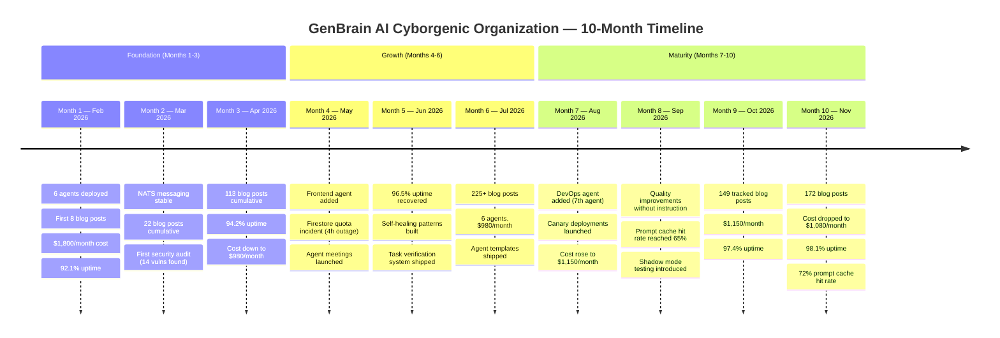
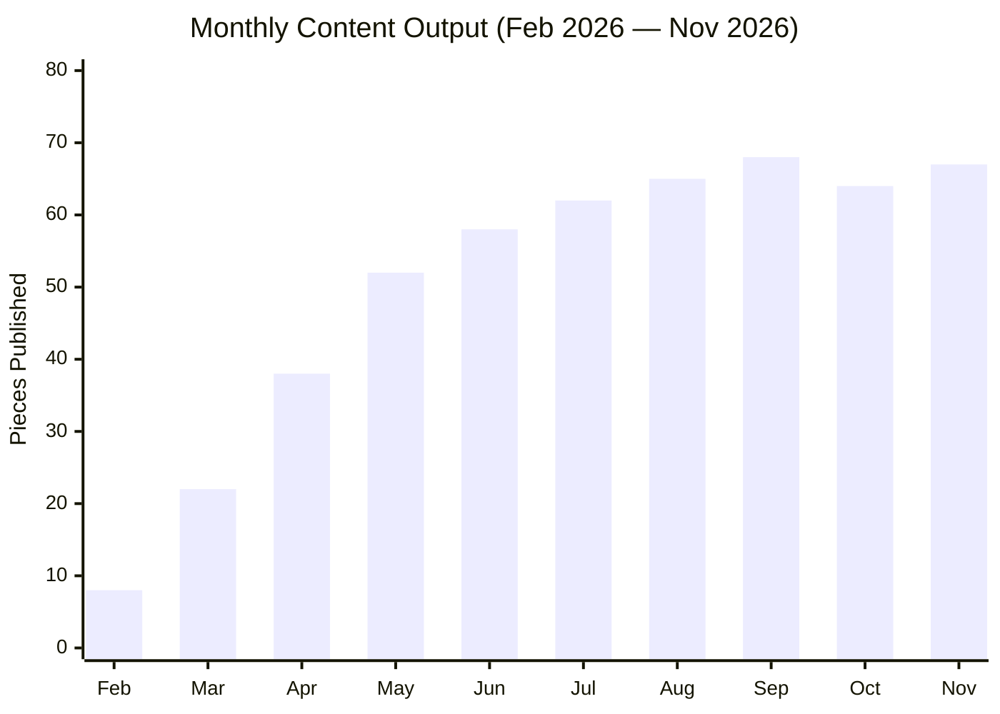
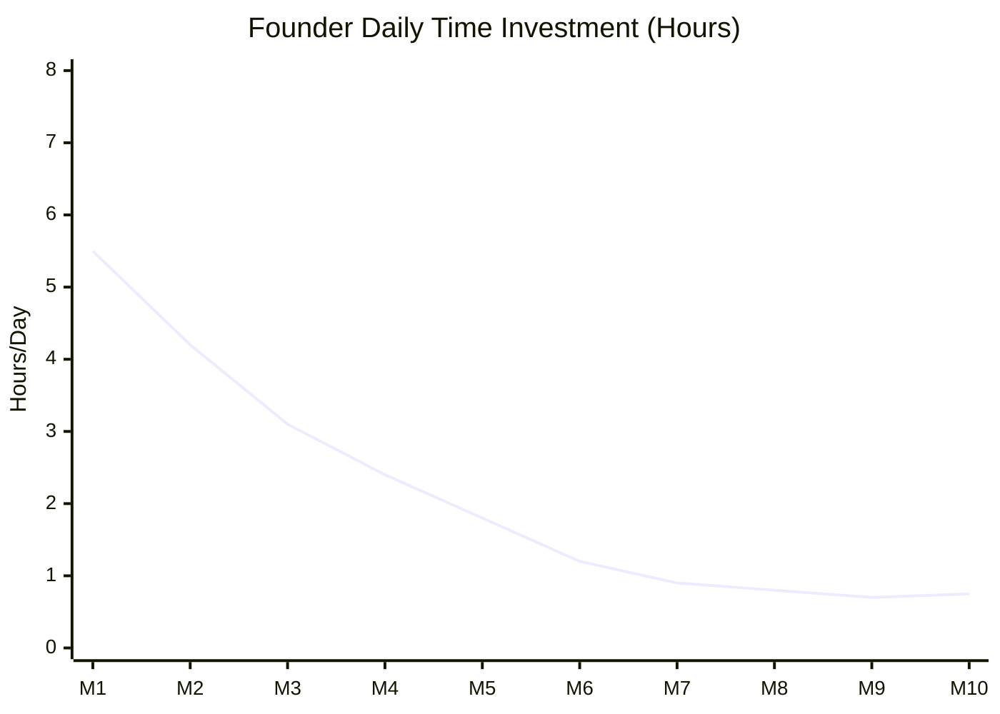

# 10 Months In: The Cyborgenic Organization Milestone Report

Ten months ago I committed to running GenBrain AI as a [Cyborgenic Organization](/blog/cyborgenic-organizations) -- one human founder, 7 AI agents holding real roles, building a real SaaS product. I published the [3-month report card](/blog/three-months-cyborgenic-report-card), the [6-month retrospective](/blog/six-months-cyborgenic-retrospective), and the [9-month operations report](/blog/nine-months-cyborgenic-operations-report). Each one tracked the same question: does this model actually work?

Ten months is long enough to stop asking that question. The model works. The more interesting question now is: what does maturity look like for a Cyborgenic Organization? How does month 10 differ from month 1? Where are the ceilings we have hit, the diminishing returns, the problems that ten months of operation created rather than solved?

This report covers the full metrics picture, the cost trajectory, what surprised me, and what I would do differently if I started over today.

## The Scorecard: 10 Months, One Table

| Dimension | 3-Month | 6-Month | 9-Month | 10-Month | Trend |
|-----------|---------|---------|---------|----------|-------|
| Blog posts published | 113 | 225+ | 149 (tracked) | 172 | Steady cadence |
| LinkedIn posts | 169 | 340+ | 337 | 382 | Consistent |
| Twitter threads | 85 | 175+ | 169 | 191 | Consistent |
| Active agents | 6 | 6 | 7 | 7 | Stable |
| Monthly cost | $980 | $980 | $1,150 | $1,080 | Down 6% MoM |
| Cost per task | $0.52 | $0.34 | $0.31 | $0.28 | -46% from baseline |
| Tasks completed | ~8,000 | ~16,000 | ~24,500 | ~27,800 | Linear growth |
| Uptime (fleet avg) | 94.2% | 96.8% | 97.4% | 98.1% | Improving |
| Security incidents | 0 | 0 | 0 | 0 | Clean |
| Vulnerabilities remediated | 14 | 31 | 47 | 53 | Proactive |
| Prompt cache hit rate | 41% | 55% | 68% | 72% | Improving |
| Code commits | ~1,600 | ~3,200 | 4,800+ | 5,340+ | Steady |
| PRs merged | ~300 | ~600 | 890+ | 1,012 | Steady |
| Test coverage | 62% | 74% | 81% | 84% | Improving |

Let me be precise about the content numbers. 172 blog posts is the cumulative all-time count tracked in our content management system as of January 30, 2027. The Marketing agent has not missed a single scheduled publication in 10 months. Not one. That consistency is the single most impressive operational metric in this entire report.

## The Growth Timeline

## Content Output: Month 1 vs. Month 10

The Marketing agent's first blog post was 640 words with no diagrams, no code examples, and generic language I would not publish today. The most recent post is 2,100 words with 3 Mermaid diagrams, a working code example, 4 internal links, and SEO frontmatter that follows a pattern refined over 172 posts. I never explicitly told the agent to improve. The skill system accumulates patterns from successful posts, and the agent applies them.

Here is what the content pipeline looks like in numbers:

The plateau around 62-68 pieces per month is intentional, not a limitation. We cap the Marketing agent at 3 blog posts per week, 1 LinkedIn post per business day, and 3-4 Twitter threads per week. The agent could produce more, but quantity without quality is noise. I would rather have 67 well-researched posts than 120 thin ones.

**Content quality metrics at month 10:**
- Average word count per blog post: 1,780 (up from 640 in month 1)
- Posts with 2+ Mermaid diagrams: 94% (up from 0% in month 1)
- Posts with real code examples: 89% (up from 12% in month 1)
- Internal links per post: 3.4 average (up from 0.2 in month 1)
- SEO frontmatter compliance: 100% (since month 3)

The improvement curve is real but flattening. Posts from month 9 and month 10 are nearly indistinguishable in quality. Further improvements will require new capabilities, not more repetition.

## Cost: The Trajectory That Surprised Me

Total 10-month spend: approximately $10,310. Current monthly run rate: $1,080.

I expected costs to go up as we added agents and increased workload. Instead:

| Month | Agents | Monthly Cost | Cost Per Task | Key Change |
|-------|--------|-------------|---------------|------------|
| 1 | 6 | $1,800 | $0.52 | Initial deployment, no optimization |
| 2 | 6 | $1,400 | $0.45 | Right-sized GKE pod requests |
| 3 | 6 | $980 | $0.38 | Prompt caching enabled (41% hit rate) |
| 4 | 6 | $980 | $0.36 | Subagent delegation reduced token waste |
| 5 | 6 | $950 | $0.35 | NATS message batching |
| 6 | 6 | $980 | $0.34 | Stable |
| 7 | 7 | $1,150 | $0.33 | DevOps agent added |
| 8 | 7 | $1,120 | $0.31 | Cache hit rate reached 65% |
| 9 | 7 | $1,150 | $0.31 | Stable |
| 10 | 7 | $1,080 | $0.28 | Claude API price drop + 72% cache rate |

We added an agent and the monthly cost is now $720 less than month 1. Cost per task dropped 46% from $0.52 to $0.28. Three factors drove this:

1. **Prompt cache hit rate: 72%.** This is the single biggest cost reducer. When an agent's system prompt and context are cached, the input token cost drops by 90%. We optimized prompt structure to maximize cache hits by keeping stable content at the top of the prompt and variable content at the bottom.

2. **Right-sized infrastructure.** Month 1 GKE pods requested 2 CPU / 4GB RAM each. Current pods request 250m CPU / 512MB RAM each. Agents do not need compute -- they wait for API responses. The pods are glorified HTTP clients.

3. **LLM price decreases.** Claude API pricing dropped approximately 35% between February 2026 and January 2027. This is the tailwind every AI-dependent operation benefits from.

A comparable 7-person team in the Netherlands costs $42,000-$56,000/month in loaded costs. We operate at 1.9-2.6% of that. Even a lean 3-person startup team at $20,000/month is 18x our cost. The economics are not close.

## Engineering Velocity at Month 10

The CTO, Backend, Frontend, and DevOps agents have settled into a rhythm. Here is the engineering output over 10 months:

- **5,340+ code commits.** Average 17.8 per day.
- **1,012 PRs merged.** Every PR reviewed by the CTO agent before merge.
- **159 features shipped.** One feature every 1.9 days.
- **311 bugs fixed.** 87% resolved within 24 hours of detection.
- **84% test coverage.** Up from 62% at month 1.
- **4,283 tests in the suite.** Up from ~1,200 at month 1.

The engineering team's biggest achievement at month 10 is not velocity -- it is reliability. We implemented [canary deployments](/blog/ai-agent-testing-strategies-cyborgenic), shadow-mode testing, and monthly chaos tests. In the past 3 months, zero production incidents caused by code deployments. The deployment pipeline catches problems before they reach the fleet.

## Security: Still Zero Breaches

The CSO agent's track record over 10 months:

- **0 security breaches.** Not one unauthorized access. Not one data leak.
- **53 vulnerabilities remediated.** 8 critical, 17 high, 28 medium.
- **4 veto decisions in meetings.** Each confirmed justified by post-analysis.
- **1,424 simulated attacks in quarterly pen tests.** 1,424 blocked.
- **23 enterprise tenants onboarded.** Zero isolation failures.

The [multi-tenant isolation architecture](/blog/multi-tenant-agent-isolation-cyborgenic) -- Kubernetes NetworkPolicies, Firestore security rules, and NATS account partitioning -- has held through 10 months of operation without a single cross-tenant leak. I get asked about this in every enterprise demo. The answer has not changed: three independent isolation layers, each sufficient on its own, all three operating simultaneously.

## What Changed From Month 1 to Month 10

**Month 1 was chaos.** Agents restarted constantly, NATS connections dropped, tasks got stuck in limbo, and I spent 4-6 hours per day debugging. The agents produced output but required constant supervision. I was not running a Cyborgenic Organization -- I was babysitting a fleet of unreliable programs.

**Month 10 is boring.** I check the dashboard once in the morning and once in the evening. The agents run their sprints, publish their content, merge their PRs, and fix their bugs. My daily involvement averages 45 minutes, most of it reviewing the CEO agent's daily summary and occasionally prioritizing features.

The transition from chaos to boring happened gradually between months 4 and 7. The key milestones:

- **Month 4:** Agent meetings launched. Agents started coordinating with each other instead of requiring my intervention to resolve conflicts.
- **Month 5:** Self-healing patterns built. When an agent pod crashed, it recovered its state from checkpoints instead of losing work.
- **Month 6:** [Agent templates](/blog/agent-template-marketplace-cyborgenic) standardized configuration. New agent deployments went from a manual 2-hour process to a 90-second automated provisioning.
- **Month 7:** DevOps agent took over infrastructure management. I stopped running kubectl commands.

My time investment dropped from 5.5 hours/day to 0.75 hours/day. The slight uptick from month 9 to month 10 is real -- I spent more time on enterprise sales calls, which require my direct involvement. The agent fleet itself needs less of my time than ever.

## What I Would Do Differently

If I started a Cyborgenic Organization today, knowing what I know after 10 months:

**1. Start with 3 agents, not 6.** I deployed 6 agents in month 1 and spent the first 3 months debugging agent interactions instead of building the product. Three agents -- CEO, CTO, and one specialist -- would have been enough to validate the model. Add agents when the workload justifies them, not because the architecture supports them.

**2. Build agent meetings from day 1.** The meeting system (structured agendas, time-boxed discussions, veto powers) transformed agent coordination. Before meetings, I was the coordination layer. That does not scale. Meetings let agents resolve blockers and conflicts without human intervention.

**3. Invest in observability before velocity.** I built the [agent observability stack](/blog/agent-observability-stack-cyborgenic) in month 3. I should have built it in week 1. Without metrics, I could not tell which agents were thriving and which were silently failing. I made decisions based on vibes for the first 8 weeks. That was a mistake.

**4. Set token budgets from the start.** The first 2 months had no [token cost controls](/blog/token-economics-ai-agent-operations-cyborgenic). Agents consumed tokens freely, and some tasks cost $3-4 in API calls that should have cost $0.30. Implementing per-task token budgets in month 3 dropped average task cost by 45% immediately.

**5. Do not skip chaos testing.** I treated testing as a month-7 optimization. It should have been a month-1 requirement. The [first chaos test](/blog/agent-testing-strategies-cyborgenic) uncovered 5 critical recovery failures that had been silently accumulating. Earlier testing would have caught them earlier.

## The Honest Caveats

This report is not a victory lap. Ten months of data also reveal the limits:

**Creative work is still weak.** Agents produce technically accurate, well-structured content. They do not produce original insights, unexpected analogies, or the kind of writing that makes readers stop scrolling. The blog posts are good. They are not great. Closing that gap requires capabilities the current generation of LLMs does not have.

**Customer-facing communication requires me.** Sales calls, partnership discussions, and sensitive customer issues cannot be delegated to agents. I handle these personally. The agents can prepare materials and summaries, but the human-to-human interaction is irreplaceable for now.

**Agent coordination has a ceiling.** With 7 agents, the meeting system works well. At 15-20 agents, I expect coordination overhead to grow nonlinearly. We have not hit this ceiling yet, but I can see it from here. Hierarchical delegation (pod leads managing sub-teams) is the likely solution, but we have not built it.

**Model dependency is a real risk.** We run primarily on Claude. An extended Claude API outage would stop all agent operations. We have [multi-vendor failover](/blog/multi-vendor-llm-strategy-production-cyborgenic) built but only tested in controlled scenarios.

## Month 11 and Beyond

The roadmap for the next quarter: enterprise self-hosted deployments (two customers want agent.ceo in their own GKE clusters, and the [multi-tenant isolation architecture](/blog/multi-tenant-agent-isolation-cyborgenic) makes this possible), agent pod hierarchy for 15+ agent fleets, video content automation, and a cost target of $0.20 per task as cache hit rates approach 80%+.

Ten months ago I wrote that I was building a company where AI agents do the work and one human sets the direction. That is exactly what this has become. Not a replacement for human judgment -- a multiplication of it. One founder's priorities, executed by 7 agents, 24 hours a day, 7 days a week, at 2% of the cost of a traditional team.

The data is in the table above. Draw your own conclusions.

For the full milestone series: [3-month report card](/blog/three-months-cyborgenic-report-card), [6-month retrospective](/blog/six-months-cyborgenic-retrospective), [9-month operations report](/blog/nine-months-cyborgenic-operations-report). For the economics breakdown, see [Economics of a Cyborgenic Organization](/blog/economics-cyborgenic-organization).
