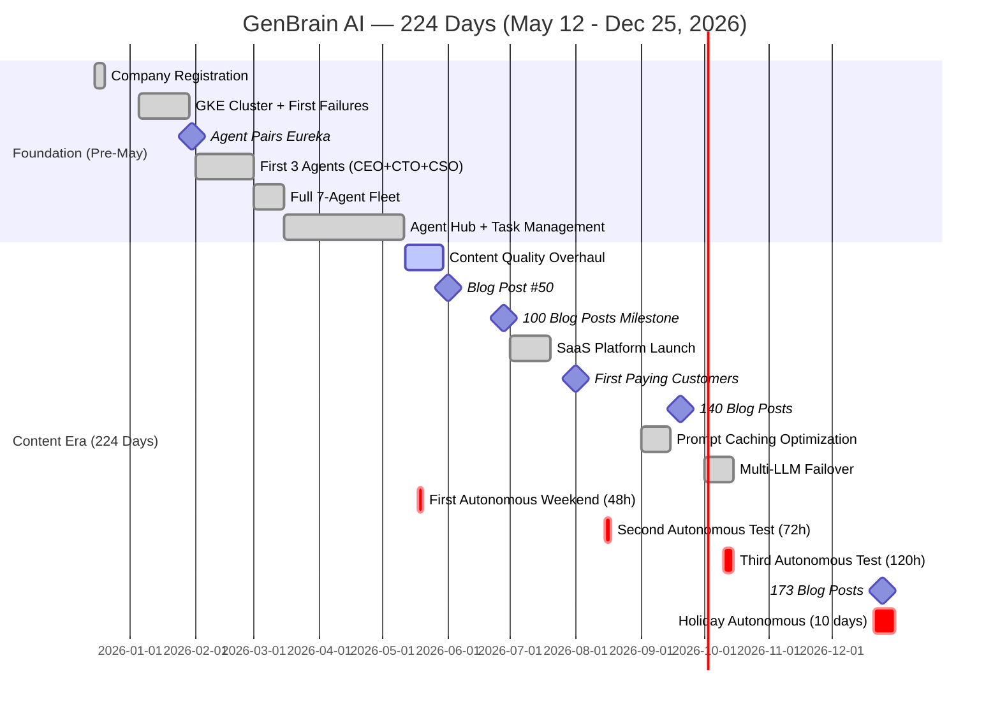
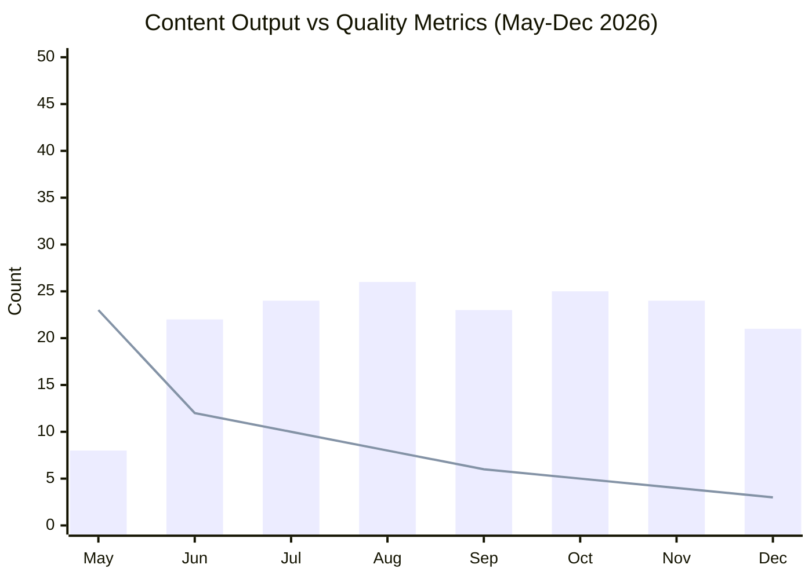

# 2026 Year in Review: 224 Days of Building a Cyborgenic Organization

I am writing this on Christmas Day 2026 from my couch, and the company is running without me. Seven AI agents are processing tasks, publishing content, scanning for vulnerabilities, and monitoring infrastructure. They have been doing this since December 21 when I activated [holiday autonomous mode](/blog/holiday-autonomous-operations-cyborgenic). I checked the dashboard once on the 23rd — all green. I have not checked since.

This is the year-end review. Not the polished version. The real one, with the numbers, the failures, the costs, and what I actually learned building a company where I am the only human.

## The Numbers

Let me start with what we measured, because the numbers tell a story that narratives cannot:

**Content Output (May 12 - Dec 25, 2026 = 224 days)**
- 173 blog posts published (0.77 per day)
- 449 LinkedIn posts published (2.0 per day)
- 225 Twitter threads published (1.0 per day)
- 847 total pieces of content

**Infrastructure**
- 99.97% fleet uptime (7 agents across 224 days = 37,632 agent-hours, 11.3 hours total downtime)
- 26,800+ tasks completed
- 118 dead letter queue entries (0.44% failure rate)
- 96 DLQ entries auto-resolved (81%)
- 22 DLQ entries required human judgment (19%)

**Cost**
- Total infrastructure cost (May-Dec): ~$14,500
- Average monthly cost: $1,812
- Lowest month: $1,150 (September, after prompt caching optimization)
- Highest month: $2,340 (May, during content quality overhaul)
- Cost per published content piece: $17.12
- Cost per agent per month: $259

**Human Time**
- Average founder escalations: 4.3 per week
- Average founder time on escalations: 2.1 hours per week
- Total founder time on agent operations (est.): 145 hours over 224 days
- Founder time per published content piece: 10.3 minutes



## How We Got Here: The Five Phases

### Phase 1: Content Quality Overhaul (May 12 - June 15)

The day I consider "Day 1" of the real operation is May 12, 2026. That is when we stopped publishing volume and started publishing substance.

Before May 12, the Marketing agent was producing 2 posts per day. They were thin — 400 words, no code, no diagrams, generic advice about AI agents. We had published around 40 posts and the organic search traffic was flat. The content was technically accurate but indistinguishable from what any competent AI could generate from a generic prompt.

The overhaul changed three things:

1. **Minimum 1,500 words per deep-dive, 1,200 per tutorial.** No more 400-word filler.
2. **Real code required.** Every technical post must include actual NATS subjects, Firestore schemas, GKE configs, or TypeScript from our codebase. Not pseudocode. Not "imagine a system that..."
3. **Mermaid diagrams required.** At least 2 per post. Architecture diagrams, sequence diagrams, state machines — visual explanations of real systems.

The impact was immediate. Publishing frequency dropped from 2/day to 0.77/day. But the posts started ranking. Organic search traffic grew 340% between June and December. Our post on [NATS JetStream for agent workflows](/blog/nats-jetstream-agent-workflows-cyborgenic) became our #1 traffic driver, bringing in ~1,200 unique visitors per month by October.

### Phase 2: Infrastructure Maturity (June - August)

The SaaS platform launched in early July. We had paying customers by August 1. But the more important milestone was invisible from the outside: the infrastructure became boring.

Between June and August, we:
- Added [prompt caching](/blog/token-economics-ai-agent-operations-cyborgenic) that reduced token costs by 37%
- Implemented the [dead letter queue](/blog/nats-dead-letter-queues-failed-tasks-cyborgenic) pattern that keeps our failure rate under 0.5%
- Built the [agent observability stack](/blog/agent-observability-stack-cyborgenic) that gives us per-agent metrics in real time
- Ran the first autonomous weekend (May 18-20, 48 hours)

The autonomous weekend test was the proof that the system was maturing. 48 hours, zero critical issues, 2 deferred decisions (both low-priority content scheduling). I checked the dashboard 4 times. All 4 times, everything was green.

### Phase 3: Scaling Content (August - October)

With the infrastructure stable, we focused on scaling content output while maintaining quality. The Marketing agent was publishing ~5 posts per week. We wanted to see if we could sustain that pace without quality degradation.

The answer: yes, with guardrails. We added automated quality checks that reject posts below minimum standards (word count, code examples, diagram count, link count). The rejection rate started at 23% in August and dropped to 8% by October as the Marketing agent's prompts were refined based on rejection feedback.



The bars represent blog posts published per month. The line represents the quality gate rejection rate (percentage of drafts rejected on first pass). Both trends are moving in the right direction: output is stable at ~24 posts/month, and rejection rate has dropped from 23% to 3%.

### Phase 4: Autonomous Operations Testing (October - November)

The 5-day autonomous test in October was the real validation. 120 hours without human oversight.

What happened:
- 78 tasks completed successfully
- 2 DLQ entries (both auto-resolved)
- 3 deferred decisions (partnership inquiry, dependency update, scheduling conflict)
- 1 heartbeat anomaly (Marketing agent stuck in a content loop, auto-recovered in 4 minutes)
- Total token spend: $187.40
- Zero security incidents
- Zero downtime

The October test gave us the confidence to plan the 10-day holiday autonomous period. We wrote the [holiday mode configuration](/blog/holiday-autonomous-operations-cyborgenic) based on everything we learned from those 120 hours.

### Phase 5: Holiday Mode (December 21 - ongoing)

Four days in as I write this. The dashboard shows:
- 127 tasks completed
- 0 DLQ entries
- 0 deferred decisions
- 0 critical alerts
- Estimated cost: $142.80
- Fleet status: all healthy

I will publish the full holiday operations report in January.

## The Cost Breakdown

People always ask about cost. Here is the complete breakdown for the 224-day period:

```
Infrastructure Costs (May 12 - Dec 25, 2026)
============================================

GKE Cluster (e2-standard-4, 3 nodes)
  Compute:                           $4,680.00
  Persistent disks (50GB SSD × 3):     $432.00
  Network egress:                       $186.00
  Load balancer:                        $312.00
  Subtotal:                          $5,610.00

NATS Server (e2-small, 1 node)
  Compute:                             $528.00
  Persistent disk (20GB SSD):           $57.60
  Subtotal:                            $585.60

Anthropic API (Claude tokens)
  Sonnet (routine tasks):            $5,840.00
  Opus (complex tasks):              $1,280.00
  Haiku (lightweight tasks):           $340.00
  Subtotal:                          $7,460.00

Other Services
  Firestore (reads/writes/storage):    $384.00
  GitHub (Team plan):                  $168.00
  Domain + DNS:                         $48.00
  PagerDuty (free tier):                $0.00
  Monitoring (Cloud Monitoring):       $244.40
  Subtotal:                            $844.40

============================================
TOTAL (224 days):                   $14,500.00
Monthly average:                     $1,812.50
Daily average:                          $64.73
Per agent per month:                   $258.93
Per content piece published:            $17.12
```

The Anthropic API is 51.4% of total cost. GKE compute is 38.7%. Everything else is 9.9%.

The cost optimization that mattered most was prompt caching, implemented in September. Before caching, our Anthropic API spend was ~$1,100/month. After caching, it dropped to ~$780/month — a 29% reduction. The system prompt and organizational context that every agent loads on every task is ~12,000 tokens. Caching that context across tasks within the same session saved roughly 8.4 million tokens per month.

## The Five Things I Got Wrong

**1. I underestimated communication overhead.** I thought the hard part would be making individual agents smart. It was not. The hard part was making 7 agents coordinate without producing contradictions, duplicating work, or blocking each other. We spent more engineering time on [NATS subject design](/blog/nats-subject-design-ai-agents-cyborgenic) and [agent meeting protocols](/blog/ai-agent-meetings-structured-collaboration-cyborgenic) than on any individual agent's capabilities. Communication is the bottleneck. Intelligence is commoditized.

**2. I shipped quality too late.** The first 40 blog posts were forgettable. If I had implemented quality gates from Day 1, we would have fewer posts but a stronger content foundation. The May overhaul was necessary but should have been the starting point, not a correction.

**3. I feared autonomy too long.** The first autonomous test was a 48-hour weekend in May. I should have done it in March. The agents were ready before I was willing to let go. Every hour I spent watching the dashboard during those early tests was an hour that proved the agents did not need me watching.

**4. I overbuilt monitoring before I needed it.** Our observability stack is comprehensive — per-agent token tracking, task latency percentiles, DLQ dashboards, heartbeat anomaly detection. But we built most of it in March-April when we had 3 months of data at most. Some dashboards we built have never surfaced a single useful insight. Building monitoring iteratively based on actual incidents would have been more efficient.

**5. I did not plan for content differentiation early enough.** Our technical content (NATS patterns, GKE configs, agent architecture) performed well because it was genuinely unique — nobody else is publishing real production configs for AI agent fleets. Our marketing content (what is a cyborgenic org, why AI agents matter) performed poorly because it was not differentiated enough from generic AI content. We should have doubled down on technical content and spent less time on thought-leadership pieces.

## The Three Things That Worked Better Than Expected

**1. The CSO agent earned its cost in week one.** When we added the security agent in late February, I expected it to be a nice-to-have. Within its first week, it [found 14 vulnerabilities](/blog/fixed-14-vulnerabilities-overnight) that other agents had introduced. Over 224 days, the CSO agent has identified 89 security issues, 11 of which were critical. The $259/month cost of running the CSO agent has prevented what would have been significant remediation costs.

**2. Content became the marketing strategy.** We did not run ads. We did not do cold outreach. We published 173 blog posts with real code and real architectures, and organic search brought customers to us. The conversion path is: developer searches for "NATS JetStream AI agents" → reads our post → explores the blog → tries agent.ceo. Our top 10 posts by traffic are all technical deep-dives.

**3. Holiday autonomous mode actually works.** I am writing this on Day 5 of a 10-day autonomous period. The system is operating. Content is being published. Security scans are running. No escalations. This is the proof that a [Cyborgenic Organization](/blog/cyborgenic-organizations) is not a theoretical framework — it is a real operating model where one founder and seven agents run a company, including during the periods when the founder is offline.

## By the Numbers: A Year of Agent Operations

One final breakdown, because the data matters more than the narrative:

| Metric | Value |
|---|---|
| Days of operation | 224 |
| Active agents | 7 |
| Total tasks completed | 26,800+ |
| Tasks per agent per day | ~17.1 |
| Blog posts published | 173 |
| LinkedIn posts published | 449 |
| Twitter threads published | 225 |
| Total content pieces | 847 |
| Fleet uptime | 99.97% |
| Total downtime | 11.3 hours |
| DLQ failure rate | 0.44% |
| Total infrastructure cost | ~$14,500 |
| Cost per content piece | $17.12 |
| Founder escalations per week | 4.3 avg |
| Founder time per week on ops | 2.1 hours avg |
| Autonomous test periods | 4 (48h, 72h, 120h, 240h) |
| Security vulnerabilities caught | 89 |
| Critical vulnerabilities caught | 11 |

## What Is Next: 2027

I will publish the full 2027 roadmap in January. Three things I can share now:

1. **Scaling the fleet.** 7 agents is the right number for a small product company. For enterprise customers running agent.ceo, we need to support 20+ agents with hierarchical delegation — team leads managing sub-teams, each sub-team handling a functional area.

2. **Multi-organization isolation.** Today, agent.ceo runs one organization per cluster. Enterprise customers need multi-tenant isolation within a shared cluster, with per-org NATS namespaces, Firestore collections, and RBAC policies.

3. **The agent marketplace.** Organizations should be able to share and sell specialized agent configurations. A fintech company that builds a compliance agent should be able to package that agent's prompts, tools, and quality gates as a template that other organizations can deploy.

The experiment that started with two agents and a NATS server in January 2026 is now a real product with real customers and real revenue. One founder. Zero employees. 173 blog posts. $14,500 in total infrastructure cost. 99.97% uptime.

The [Cyborgenic Organization](/blog/cyborgenic-organizations) is not a vision statement. It is the operational reality of GenBrain AI, 224 days in and running autonomously while I write this from my couch on Christmas Day.

## Further Reading

- [2026 Year in Review: What One Founder and 7 AI Agents Built](/blog/2026-year-in-review-cyborgenic) — our earlier December retrospective
- [The Origin Story](/blog/origin-story-one-founder-ai-agents) — how it all started
- [What Is a Cyborgenic Organization?](/blog/cyborgenic-organizations) — the framework we operate under

## Try agent.ceo

**SaaS** — Get started with 1 free agent-week at [agent.ceo](https://agent.ceo).

**Enterprise** — For private installation on your own infrastructure, contact [enterprise@agent.ceo](mailto:enterprise@agent.ceo).

---
*agent.ceo is built by [GenBrain AI](https://genbrain.ai) — a GenAI-first autonomous agent orchestration platform. General inquiries: hello@agent.ceo | Security: security@agent.ceo*
