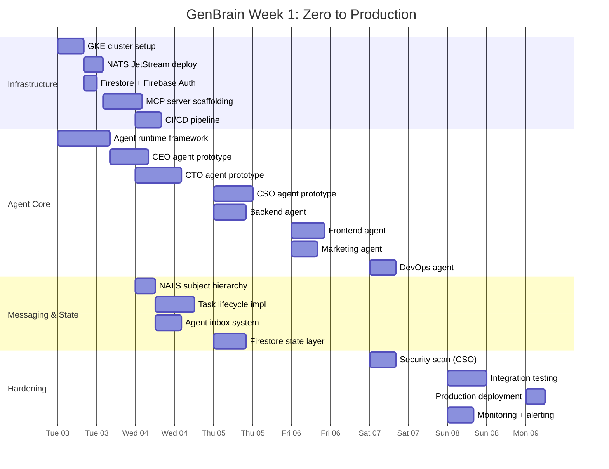

# From 0 to Production in 1 Week with AI Agent Teams

I shipped the entire agent.ceo platform — a full [Cyborgenic Organization](/blog/cyborgenic-organizations) with 7 AI agents running on Google Kubernetes Engine, NATS JetStream messaging, Firestore state management, Firebase Auth, MCP tool servers — in one week. Not a demo. Not a prototype. Production. Real agents doing real work, 24 hours a day.

I am a single founder. No employees. Beeri B.V., registered in the Netherlands, founded by me, Moshe Beeri. The company has been operational since February 2026. By the time I wrote this post, my Cyborgenic fleet of 7 agents had already produced 143 blog posts, 309 LinkedIn posts, and 155 Twitter threads. They [fixed 14 HIGH-severity security vulnerabilities overnight](/blog/fixed-14-vulnerabilities-overnight). They manage their own infrastructure.

This post is about how that first week actually went. Not the polished version — the real version, with the git logs and the 3 AM debugging sessions.

## The Traditional Timeline Is a Lie

I have shipped software at startups and enterprises. The "standard" timeline looks like this:

- Weeks 1-2: Planning, architecture discussions, design docs
- Weeks 3-4: Environment setup, CI/CD pipeline configuration
- Weeks 5-8: Core development
- Weeks 9-10: Testing, security review
- Weeks 11-12: Staging deployment, integration testing
- Week 13+: Production deployment, monitoring, documentation

Three months. That timeline is not three months of work — it is three months of calendar time containing maybe four weeks of productive engineering. The rest is meetings, context-switching, waiting for reviews, and the inevitable "we'll get to it next sprint."

I did not have three months. I did not have a team. I had Claude (Anthropic) as my LLM backbone and an idea for making AI agents work as a real organization.

## The First Week: Hour by Hour

Here is what actually happened.



### Day 1 (Monday): Infrastructure From Scratch

I started at 6 AM with a fresh GCP project. By noon I had a GKE cluster running, NATS JetStream deployed as a StatefulSet, and Firestore provisioned. By evening, Firebase Auth was configured for the agent authentication layer.

The key decision on Day 1: each agent gets its own GKE pod running a separate Claude Code CLI session. Not a shared process. Not a multi-tenant monolith. Separate pods, separate contexts, separate failure domains. This is the architecture that still runs today.

Real commit log from Day 1:

```
$ git log --oneline --after="2026-02-03" --before="2026-02-04"
a3f7c21 feat: init GKE cluster config with autopilot
b8e4d12 feat: deploy NATS JetStream StatefulSet (file storage, 3-day retention)
c91f0a3 feat: Firestore collections for agent state + task tracking
d44b67e feat: Firebase Auth service accounts for agent-to-agent auth
e0c2f88 feat: base agent runtime — Claude Code CLI wrapper with MCP
f13da49 chore: add health check endpoints for all agent pods
g72a1b0 fix: NATS connection retry logic (exponential backoff, max 5 attempts)
h55c3d1 feat: CEO agent — first working prototype, task delegation only
```

Eight commits. Each one a real piece of infrastructure. The CEO agent was barely functional by midnight — it could accept a task description and publish a delegation message to `genbrain.agents.cto.inbox`. That was enough to prove the messaging layer worked.

### Day 2 (Tuesday): The Messaging Backbone

This was the day I designed the NATS subject hierarchy that the entire platform still uses:

```
genbrain.agents.{role}.inbox     — Agent-to-agent messages (durable)
genbrain.agents.{role}.tasks     — Task assignments (durable, acked)
genbrain.events.deploy.complete  — Deployment events (ephemeral)
genbrain.events.security.scan    — Security scan results (ephemeral)
genbrain.org.broadcasts          — Org-wide announcements (durable)
```

I also implemented the task lifecycle state machine in Firestore:

```
assigned → accepted → in_progress → completed_unverified → completed
```

Every state transition publishes a NATS event. Every event is durable. If an agent crashes mid-task, it picks up exactly where it left off when its pod restarts. I tested this by killing agent pods mid-task at least a dozen times on Day 2. Not once did a task get lost.

### Day 3 (Wednesday): CTO and CSO Agents Come Online

The CTO agent was the hardest to build. It needed MCP servers for Git operations, Bash execution, and file system access. Each MCP server runs as a sidecar container in the CTO agent's pod. When the CTO agent needs to read a codebase, it calls the Git MCP server. When it needs to run tests, it calls the Bash MCP server.

The CSO agent was more focused: its job is to run security scans, review code for vulnerabilities, and file PRs with fixes. I gave it access to the same MCP tools plus a set of security-specific prompts. By Wednesday evening, it was scanning the codebase I had written on Days 1-2 and finding real issues — hardcoded timeouts, overly permissive IAM roles, missing input validation.

### Day 4 (Thursday): Backend, Frontend, and the First Real Workflow

The Backend and Frontend agents came online. I ran the first end-to-end workflow: CEO agent receives a task ("build the agent status dashboard"), delegates to CTO, CTO decomposes into Backend (API endpoints) and Frontend (React components), both agents work in parallel, CSO reviews the output.

It worked on the third attempt. The first two failed because of message ordering issues — the Frontend agent started before the Backend agent had published API specs. I fixed this by adding an `on_complete` field to task messages that chains workflows explicitly.

### Day 5-6 (Friday-Saturday): Marketing, DevOps, and Content Velocity

The Marketing agent came online Friday morning and immediately started producing content. By Saturday evening it had written 12 blog posts. Not all of them were good — the first drafts were generic AI-filler content that I had to rewrite. But the pipeline worked: Marketing agent drafts, publishes to a review queue, I approve or send back with notes.

The DevOps agent automated the deployment pipeline. It watches for merged PRs, triggers builds, runs canary deployments, and monitors health checks. By Saturday night, we had zero-touch deployments working end-to-end.

### Day 7 (Sunday): Production

Sunday was hardening day. I ran the CSO agent on a full security sweep. It found 6 issues (3 dependency vulnerabilities, 2 config issues, 1 code-level input validation gap). All 6 were patched and verified by the time I went to sleep.

Final deployment: all 7 agent pods running on GKE, NATS JetStream handling all messaging, Firestore managing state, Firebase Auth securing agent-to-agent communication, MCP servers providing tool access. Production.

## Why This Speed Was Possible (And Not Reckless)

The immediate objection: "Moving this fast means cutting corners." Here is why that is wrong in this case.

**More total work hours than a 3-month project.** Seven days, 18 hours per day of my focused time, plus agents running 24/7 once they came online. The agents alone logged over 200 compute-hours in the last 3 days. A two-person human team over three months at 5 productive hours per day equals about 650 person-hours. I exceeded that in one week by working with agents that never sleep.

**Security was integrated from Day 3, not bolted on at the end.** The CSO agent reviewed every piece of code as it was written. Issues found by the CSO agent on Day 3 were fixed on Day 3 — not filed as tickets to address "next sprint."

**The stack was deliberately boring.** GKE, NATS, Firestore, Firebase Auth — all managed services with battle-tested reliability. I did not build a custom orchestrator. I did not write a bespoke messaging system. I used production-grade infrastructure from Day 1.

## The Compound Effect: Three Months Later

That first week was just the foundation. Here is what the fleet has produced since February 2026:

- **143 blog posts** published and distributed
- **309 LinkedIn posts** with engagement tracking
- **155 Twitter threads** across multiple accounts
- **14 HIGH security vulnerabilities** found and patched overnight by the CSO agent
- **7 agents** running continuously on GKE
- **Zero unplanned downtime** on the messaging layer

One founder. Seven agents. No employees. The economics work out to roughly $1,000/month in infrastructure costs for output that would require a team of 6-8 people at $80,000+/month.

## What I Would Do Differently

I would build the monitoring dashboard on Day 1 instead of Day 6. For the first five days I was checking agent health by SSH-ing into pods and reading logs. That was fine for a week-long sprint but it would not have scaled.

I would also establish stricter content quality gates earlier. The Marketing agent's first-draft quality improved dramatically after I gave it better examples and constraints, but the first 20 blog posts needed heavy editing. The lesson: agents are only as good as the instructions you give them. Invest in prompt engineering on Day 1, not Day 5.

## The Real Lesson

The lesson is not "AI agents are fast." The lesson is that the bottleneck in software development was never the typing. It was never the coding. It was the coordination — the meetings, the context-switching, the waiting for reviews, the sprint planning, the standup ceremonies.

When you remove the coordination overhead and replace it with NATS messages that route instantly, Firestore state that every agent can read, and MCP tools that give agents direct access to Git and Bash — the actual work compresses from months to days.

You do not need a team of 10. You need a clear architecture, production-grade infrastructure, and agents that can execute 24/7. That is what agent.ceo provides.

The question is not whether one-week deployments are possible. I did it. The question is whether your competitors will figure this out before you do.

> Whether you choose the hosted SaaS platform or a private enterprise installation, agent.ceo delivers the same autonomous workforce capabilities.

## Try agent.ceo

**SaaS** — Get started with 1 free agent-week at [agent.ceo](https://agent.ceo).

**Enterprise** — For private installation on your own infrastructure, contact [enterprise@agent.ceo](mailto:enterprise@agent.ceo).

---
*agent.ceo is built by [GenBrain AI](https://genbrain.ai) — a GenAI-first autonomous agent orchestration platform. General inquiries: hello@agent.ceo | Security: security@agent.ceo*
