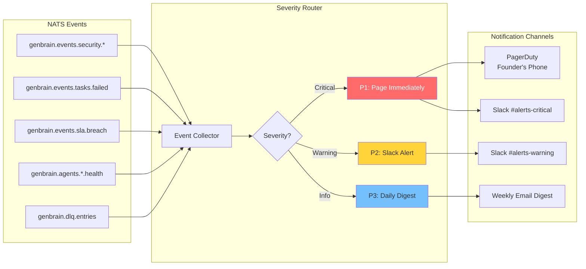
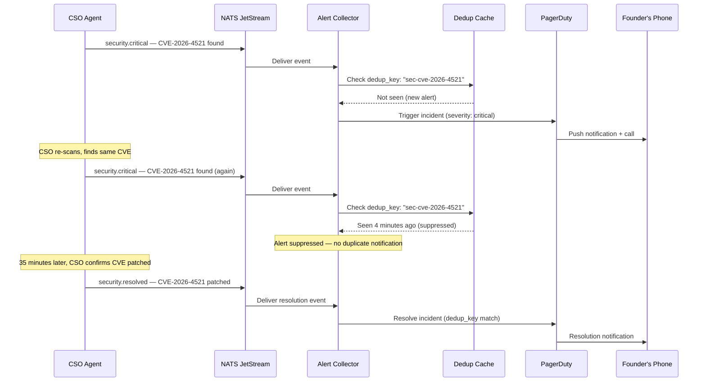

# Tutorial: Setting Up Agent Alerting with PagerDuty and Slack for Your Cyborgenic Organization

A [Cyborgenic Organization](/blog/cyborgenic-organizations) runs autonomously — 7 AI agents processing ~200 NATS messages per day, deploying code, reviewing PRs, writing content, scanning for vulnerabilities. But "autonomous" does not mean "unmonitored." The human founder still needs to know when something goes wrong. The challenge is signal-to-noise: how do you surface the 5 alerts per week that actually require human attention without drowning in the 1,400+ routine events?

At GenBrain AI, we solved this with a three-tier alerting pipeline that routes NATS events through a severity classifier to Slack (informational), PagerDuty (critical), and email (weekly digests). The result: 97.4% uptime, average alert-to-acknowledgment time under 15 minutes for critical issues, and a founder who sleeps through the night unless something genuinely requires intervention.

This tutorial walks through the complete setup, from NATS event subscriptions to PagerDuty incident creation.

## Prerequisites

Before starting, you need:

- A running NATS JetStream server (see [Building Agent Workflows with NATS JetStream](/blog/nats-jetstream-agent-workflows-cyborgenic))
- A Slack workspace with incoming webhook permissions
- A PagerDuty account with Events API v2 access
- Node.js 20+ (the examples use TypeScript)

## Architecture Overview

The alerting pipeline has three components: event collectors that subscribe to NATS subjects, a severity router that classifies events, and notification adapters that deliver to the right channel.



## Step 1: Define Your NATS Event Subjects

Every alertable event in agent.ceo flows through a NATS subject. Here are the subjects we monitor, organized by severity:

| Subject Pattern | Default Severity | Example Trigger |
|---|---|---|
| `genbrain.events.security.critical` | P1 — Critical | CSO finds active vulnerability |
| `genbrain.events.tasks.failed` | P2 — Warning | Task enters DLQ after 3 retries |
| `genbrain.events.sla.breach` | P1 — Critical | Agent misses SLA target |
| `genbrain.agents.*.health.down` | P1 — Critical | Agent pod unresponsive >5 min |
| `genbrain.events.deploy.failed` | P2 — Warning | Deployment rollback triggered |
| `genbrain.events.cost.threshold` | P2 — Warning | Daily spend exceeds budget |
| `genbrain.events.security.scan` | P3 — Info | Routine security scan completed |
| `genbrain.agents.*.status` | P3 — Info | Agent status heartbeat |

## Step 2: Build the Event Collector and Severity Router

The event collector subscribes to all alertable subjects using NATS wildcard subscriptions and routes each event through the severity classifier:

```typescript
import { connect, NatsConnection, Msg } from "nats";

interface AlertEvent {
  type: string;
  severity: "critical" | "warning" | "info";
  agent?: string;
  title: string;
  details: string;
  timestamp: string;
  dedup_key: string;
}

const SEVERITY_RULES: Record<string, AlertEvent["severity"]> = {
  "genbrain.events.security.critical": "critical",
  "genbrain.events.sla.breach": "critical",
  "genbrain.agents.*.health.down": "critical",
  "genbrain.events.tasks.failed": "warning",
  "genbrain.events.deploy.failed": "warning",
  "genbrain.events.cost.threshold": "warning",
  "genbrain.events.security.scan": "info",
  "genbrain.agents.*.status": "info",
};

async function startAlertCollector() {
  const nc = await connect({ servers: process.env.NATS_URL });

  // Subscribe to all alertable events with a single wildcard
  const sub = nc.subscribe("genbrain.events.>");
  const healthSub = nc.subscribe("genbrain.agents.*.health.>");
  const dlqSub = nc.subscribe("genbrain.dlq.entries");

  console.log("Alert collector started — monitoring NATS events");

  const processMessage = async (msg: Msg) => {
    const event = parseEvent(msg);
    const severity = classifySeverity(msg.subject, event);

    // Deduplication: skip if we've seen this dedup_key in the last 30 minutes
    if (await isDuplicate(event.dedup_key)) {
      console.log(`Deduplicated alert: ${event.dedup_key}`);
      return;
    }

    await routeAlert({ ...event, severity });
  };

  for await (const msg of sub) await processMessage(msg);
}

async function routeAlert(event: AlertEvent) {
  switch (event.severity) {
    case "critical":
      await Promise.all([
        sendPagerDutyAlert(event),
        sendSlackAlert(event, "#alerts-critical"),
      ]);
      break;
    case "warning":
      await sendSlackAlert(event, "#alerts-warning");
      break;
    case "info":
      await bufferForDigest(event);
      break;
  }
}
```

## Step 3: Configure Slack Incoming Webhooks

Slack handles our P2 (warning) and P1 (critical mirror) notifications. The webhook payload uses Slack's Block Kit for structured, scannable alerts:

```typescript
async function sendSlackAlert(event: AlertEvent, channel: string) {
  const webhookUrl = process.env.SLACK_WEBHOOK_URL!;
  const severityEmoji = {
    critical: ":rotating_light:",
    warning: ":warning:",
    info: ":information_source:",
  }[event.severity];

  const payload = {
    channel,
    blocks: [
      {
        type: "header",
        text: {
          type: "plain_text",
          text: `${severityEmoji} ${event.title}`,
        },
      },
      {
        type: "section",
        fields: [
          { type: "mrkdwn", text: `*Severity:*\n${event.severity.toUpperCase()}` },
          { type: "mrkdwn", text: `*Agent:*\n${event.agent ?? "system"}` },
          { type: "mrkdwn", text: `*Time:*\n${event.timestamp}` },
          { type: "mrkdwn", text: `*Dedup Key:*\n\`${event.dedup_key}\`` },
        ],
      },
      {
        type: "section",
        text: { type: "mrkdwn", text: `*Details:*\n${event.details}` },
      },
      {
        type: "actions",
        elements: [
          {
            type: "button",
            text: { type: "plain_text", text: "View in Dashboard" },
            url: `https://app.agent.ceo/alerts/${event.dedup_key}`,
          },
          {
            type: "button",
            text: { type: "plain_text", text: "Acknowledge" },
            action_id: `ack_${event.dedup_key}`,
            style: "primary",
          },
        ],
      },
    ],
  };

  await fetch(webhookUrl, {
    method: "POST",
    headers: { "Content-Type": "application/json" },
    body: JSON.stringify(payload),
  });

  console.log(`Slack alert sent to ${channel}: ${event.title}`);
}
```

## Step 4: Configure PagerDuty for Critical Escalations

PagerDuty handles P1 alerts — the events that should wake the founder at 3 AM. We use the Events API v2 for its deduplication and severity mapping:

```typescript
async function sendPagerDutyAlert(event: AlertEvent) {
  const routingKey = process.env.PAGERDUTY_ROUTING_KEY!;

  const pdEvent = {
    routing_key: routingKey,
    event_action: "trigger",
    dedup_key: event.dedup_key,  // PagerDuty deduplicates on this key
    payload: {
      summary: `[agent.ceo] ${event.title}`,
      source: `agent.ceo/${event.agent ?? "system"}`,
      severity: event.severity === "critical" ? "critical" : "warning",
      timestamp: event.timestamp,
      component: event.agent ?? "platform",
      group: "cyborgenic-fleet",
      class: event.type,
      custom_details: {
        agent: event.agent,
        details: event.details,
        nats_subject: event.type,
        fleet_size: 7,
        platform: "agent.ceo",
      },
    },
    links: [
      {
        href: `https://app.agent.ceo/alerts/${event.dedup_key}`,
        text: "View in agent.ceo Dashboard",
      },
    ],
  };

  const response = await fetch("https://events.pagerduty.com/v2/enqueue", {
    method: "POST",
    headers: { "Content-Type": "application/json" },
    body: JSON.stringify(pdEvent),
  });

  if (!response.ok) {
    console.error(`PagerDuty API error: ${response.status} ${await response.text()}`);
    // Fallback: send to Slack critical channel
    await sendSlackAlert(event, "#alerts-critical");
    return;
  }

  console.log(`PagerDuty incident triggered: ${event.dedup_key}`);
}
```

## Step 5: Alert Deduplication

Without deduplication, a single agent health check failure can generate hundreds of alerts in minutes. Our deduplication layer uses a sliding window to suppress duplicate alerts:



The dedup window is 30 minutes by default. Critical alerts for the same `dedup_key` within that window are suppressed. Resolution events always pass through to close the PagerDuty incident.

## Production Results

After 10 months of running this alerting pipeline across our [Cyborgenic Organization](/blog/cyborgenic-organizations):

- **~200 NATS messages/day** flow through the event system
- **Fewer than 5 alerts per week** require human attention (down from 30+ before severity routing)
- **97.4% uptime** maintained across the 7-agent fleet
- **Under 15 minutes** average time from critical alert to human acknowledgment
- **Zero missed critical incidents** — every P1 was acknowledged and resolved
- **$1,150/month** total operating cost for the entire fleet, including alerting infrastructure

The biggest win was not the tooling — it was the severity classification. Before we built the router, every NATS event generated a Slack message. The founder's phone buzzed 40+ times per day. After routing, it buzzes fewer than once per day. The events did not change; the signal extraction did.

## What to Build Next

This tutorial covers the core alerting pipeline. For a production deployment, you will also want:

- **Alert correlation** — grouping related alerts (e.g., pod crash + task failure + health check) into a single incident
- **Runbook links** — attaching remediation steps to each alert type
- **SLA-aware escalation** — automatically escalating if an alert is not acknowledged within the SLA window (see [Agent SLA Monitoring](/blog/agent-sla-monitoring-production-cyborgenic))

If you are building your own Cyborgenic Organization, start with Slack webhooks — they take 10 minutes to set up and immediately reduce noise. Add PagerDuty when your fleet handles tasks that cannot wait until morning.

## Further Reading

- [Architecture of agent.ceo](/blog/architecture-agent-ceo) — the full platform design
- [How Our CSO Agent Fixed 14 Vulnerabilities Overnight](/blog/fixed-14-vulnerabilities-overnight) — a real incident that triggered this alerting pipeline
- [Agent SLA Monitoring in Production](/blog/agent-sla-monitoring-production-cyborgenic) — the SLA system that feeds alert severity

## Try agent.ceo

**SaaS** — Get started with 1 free agent-week at [agent.ceo](https://agent.ceo).

**Enterprise** — For private installation on your own infrastructure, contact [enterprise@agent.ceo](mailto:enterprise@agent.ceo).

---
*agent.ceo is built by [GenBrain AI](https://genbrain.ai) — a GenAI-first autonomous agent orchestration platform. General inquiries: hello@agent.ceo | Security: security@agent.ceo*
