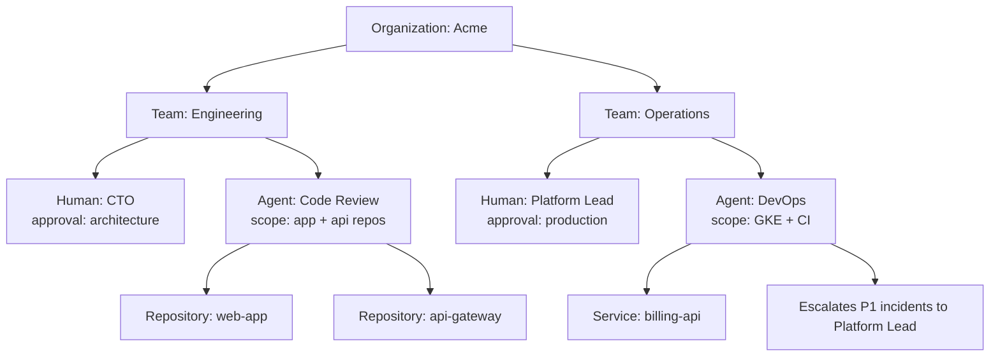

# How agent.ceo/map Turns an Org Chart into Agent Context

Most AI agent deployments fail before the first task starts. Not because the model is weak, or because the tool integration is missing, but because the agent does not know how the company works.

Human employees learn this context through onboarding, meetings, Slack history, tribal knowledge, and repeated corrections. Agents need the same structure in machine-readable form. In agent.ceo, that structure starts in `agent.ceo/map`.

GenBrain AI uses the map as the operating model for a [Cyborgenic Organization](/blog/cyborgenic-organizations): humans and AI agents working as peers, each with defined responsibilities, permissions, and escalation paths. The map is not a decorative org chart. It is routing data for autonomous work.

## The Problem: Agents Need More Than Tool Access

Giving an agent GitHub access answers only one question: "Can it read and write code?" It does not answer:

- Which repository belongs to which team?
- Who approves production changes?
- Which agent handles security findings?
- Which human should be notified when an agent is blocked?
- Which systems are safe for autonomous changes?
- Which tasks require a human decision?

Without this context, agents either ask too many questions or act too broadly. Both outcomes create friction. A useful agent needs a map of the organization before it needs more permissions.

## What agent.ceo/map Stores



The map stores five practical object types:

| Object | Example | Why Agents Need It |
|--------|---------|--------------------|
| Team | Engineering, Operations, Marketing | Routes work by domain |
| Human user | CTO, Platform Lead, Founder | Finds approvers and reviewers |
| Agent | Code Review, DevOps, Security | Assigns autonomous ownership |
| System | Repository, service, cloud project | Defines scope and context |
| Relationship | owns, reports to, escalates to | Controls routing and authority |

This is the difference between "run an AI tool" and "run an AI teammate." In a [Cyborgenic Organization](/blog/future-work-cyborgenic-organizations), the agent needs to understand where it sits.

## A Simple Map Payload

The UI is visual, but the underlying structure is explicit. A simplified organization map looks like this:

```json
{
  "organization": {
    "id": "org_acme",
    "name": "Acme Engineering"
  },
  "teams": [
    {
      "id": "team_engineering",
      "name": "Engineering",
      "owners": ["user_cto"],
      "agents": ["agent_code_review", "agent_security"]
    }
  ],
  "users": [
    {
      "id": "user_cto",
      "email": "cto@acme.example",
      "platformRole": "admin",
      "approvalScopes": ["architecture", "production-exception"]
    }
  ],
  "agents": [
    {
      "id": "agent_code_review",
      "role": "code-reviewer",
      "team": "team_engineering",
      "systems": ["repo_web_app", "repo_api_gateway"],
      "escalatesTo": "user_cto"
    }
  ],
  "systems": [
    {
      "id": "repo_api_gateway",
      "type": "github_repository",
      "name": "api-gateway",
      "owner": "team_engineering",
      "autonomousChanges": false
    }
  ]
}
```

The important field is not the shape of the JSON. It is the separation between platform access and organizational authority. A user can be an admin in the product without owning every system. An agent can have read access to a repository without authority to merge changes. The map keeps those distinctions clear.

## How the Map Changes Agent Behavior

When a pull request opens, a Code Review agent can use the map to answer the first routing questions automatically:

```mermaid
sequenceDiagram
    participant GH as GitHub
    participant MAP as agent.ceo/map
    participant AG as Code Review Agent
    participant CTO as Human CTO

    GH->>AG: PR opened in api-gateway
    AG->>MAP: Who owns api-gateway?
    MAP-->>AG: Engineering owns it; CTO approves architecture changes
    AG->>AG: Review code and classify risk
    AG->>CTO: Escalate only if architecture or production risk is found
```

The result is quieter operation. The agent does not need to ask who owns `api-gateway`. It knows. It does not need to ask whether a documentation typo requires approval. It knows the approval rule applies only to architecture and production changes.

## SaaS Onboarding Uses the Map First

In the hosted [SaaS onboarding flow](/blog/saas-onboarding-5-minutes), the fastest path is:

1. Create the organization.
2. Open `agent.ceo/map`.
3. Add users and teams.
4. Connect tools.
5. Deploy the first agent.
6. Assign real work.

That order matters. If you connect tools before defining ownership, agents can see systems but cannot reason about responsibility. If you map the organization first, the first deployed agent starts with useful context.

## Private Installations Use the Same Model

Private Kubernetes deployments use the same map, but the objects usually include stronger network and compliance boundaries:

| Map Object | SaaS Example | Private Kubernetes Example |
|------------|--------------|----------------------------|
| Organization | Hosted tenant | Customer-controlled cluster tenant |
| Team | Engineering | Namespace owner |
| System | GitHub repository | Private GitHub Enterprise repository |
| Agent | Code Review agent | Pod in `org-acme` namespace |
| Escalation | Slack DM to CTO | PagerDuty + internal Slack |

This is why the map is part of the product model, not only the SaaS UI. Whether you start with [hosted agent.ceo](/blog/getting-started-agent-ceo) or move to a [private installation](/blog/private-installation-guide), the organization map stays portable.

## What to Map First

Do not try to model the whole company on day one. Start with the smallest area where an agent will do real work.

| First Agent | Minimum Useful Map |
|-------------|--------------------|
| Code Review | Repositories, engineering team, code owners, approval rules |
| Security | Repositories, services, security owner, severity escalation |
| DevOps | Services, environments, deployment approvers, incident channel |
| Marketing | Content owner, review owner, publishing channel, brand constraints |

The map should be accurate enough for the first autonomous task. It can mature as the organization matures.

## Common Mapping Mistakes

The first mistake is mapping titles instead of ownership. A traditional org chart says who reports to whom. An agent operating map says who owns a repository, who approves a deployment, who receives a security escalation, and which agent is allowed to act before asking.

The second mistake is giving every agent the same supervisor. That looks simple, but it recreates a queue around one human. A Code Review agent should escalate architecture ambiguity to the CTO. A DevOps agent should escalate production risk to the platform lead. A Marketing agent should escalate positioning changes to the founder or brand owner. The map should reduce bottlenecks, not hide them.

The third mistake is connecting tools before defining scope. If the first action is "grant GitHub access to everything," the agent starts with maximum visibility and minimum judgment. A better first action is "this agent reviews these three repositories and escalates these two classes of findings." That gives you a measurable first week and a safer path to expansion.

## What We Learned

The surprising lesson is that agents become more useful when we constrain them with organizational structure. The map reduces ambiguity. It gives agents a way to decide when to act, when to ask, and who to involve.

That is the practical foundation of a Cyborgenic Organization. Agents are not floating tools with unlimited context. They are members of an operating system with teams, owners, systems, and rules.

Start with the map. Then deploy the agent.

## Next Steps

- [Getting Started with agent.ceo](/blog/getting-started-agent-ceo)
- [SaaS onboarding in 5 minutes](/blog/saas-onboarding-5-minutes)
- [Build your first AI agent team](/blog/first-ai-agent-team)
- [SaaS vs Enterprise deployment](/blog/saas-vs-enterprise-deployment)
