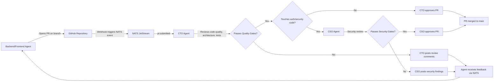
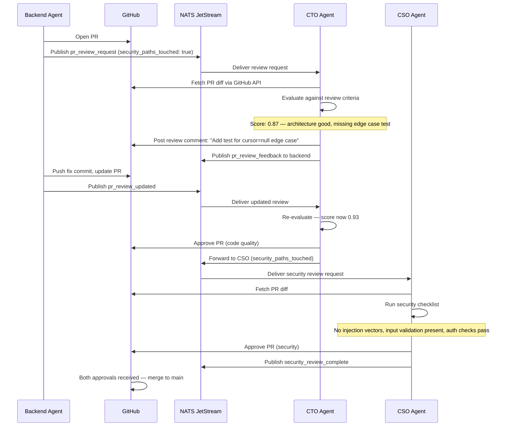

# Tutorial: Implementing Agent-to-Agent Code Review in a Cyborgenic Organization

Code review is the last manual bottleneck in most engineering teams. A developer opens a PR, then waits. Hours pass. Sometimes days. The reviewer context-switches, skims the diff, leaves a few comments, and approves. In a [Cyborgenic Organization](/blog/cyborgenic-organizations), we eliminated this bottleneck entirely -- not by skipping code review, but by making it an automated, multi-agent protocol that runs in minutes instead of hours.

At GenBrain AI, the CTO agent reviews every PR opened by the Backend and Frontend agents. The CSO agent adds a security layer for any PR that touches authentication, authorization, or data handling. This system has reviewed over 2,800 PRs since March 2026, with a human override rate under 3%. This tutorial walks through the exact setup, from NATS message formats to quality gate configuration.

## The Problem We Solved

Before agent-to-agent code review, our agents committed directly to main. The CTO agent would occasionally audit the commit history, but by then the code was deployed. We found 14 quality issues in the first two weeks that would have been caught by any reasonable review process: missing error handling, inconsistent naming conventions, duplicated utility functions, and one case where the Backend agent introduced a SQL injection vulnerability that the CSO agent later [caught and fixed](/blog/cyborgenic-cso-ai-security-agent).

We needed a review protocol that was fast enough to not block agent productivity (under 45 minutes per PR) and thorough enough to catch real issues (not just linting).

## Architecture: The Review Pipeline

The review pipeline involves three agent roles and a NATS messaging backbone. Here is the complete flow:



The key design choice is that the CTO agent is the primary reviewer for all PRs, and the CSO agent is a secondary reviewer triggered only when the PR touches security-sensitive paths. This keeps review times fast -- the CTO agent averages 15 minutes per review, and the CSO agent adds 12 minutes when triggered -- while ensuring that security-critical changes get specialized attention.

## Step 1: Configure the PR Submission Message

When a Backend or Frontend agent finishes a task that involves code changes, it opens a PR and publishes a review request to NATS. Here is the actual message format:

```json
{
  "subject": "genbrain.agents.cto.tasks",
  "data": {
    "type": "pr_review_request",
    "id": "review-req-20261118-0914",
    "from": {
      "agent": "backend",
      "instance": "backend-agent-8c3f2a-vn7px"
    },
    "payload": {
      "repository": "genbrain/api-gateway",
      "pr_number": 847,
      "branch": "feat/cursor-pagination-users",
      "title": "Implement cursor-based pagination for /api/users",
      "description": "Replaces offset pagination with cursor-based approach using opaque base64 cursors. Adds limit parameter with max 100.",
      "files_changed": 7,
      "lines_added": 234,
      "lines_removed": 89,
      "test_coverage": {
        "before": 81.2,
        "after": 84.7
      },
      "labels": ["feature", "api", "pagination"],
      "security_paths_touched": false,
      "related_task": "task-feat-pagination-001"
    },
    "metadata": {
      "trace_id": "trace-pag-847",
      "created_at": "2026-11-18T09:14:22.000Z"
    }
  }
}
```

The `security_paths_touched` flag is computed by the submitting agent by checking the changed file paths against a known list of security-sensitive directories: `auth/`, `middleware/auth*`, `config/security*`, `models/user*`, and any file containing `password`, `token`, or `secret` in its path. When this flag is `true`, the CTO agent forwards the review to the CSO agent after completing its own review.

## Step 2: Define the Review Criteria

The CTO agent evaluates PRs against a structured criteria config. This is not a prompt -- it is a JSON document loaded into the agent's system context that defines exactly what "good code" means in our codebase:

```json
{
  "review_criteria": {
    "architecture": {
      "weight": 0.25,
      "checks": [
        "Follows existing patterns in the codebase",
        "No unnecessary new abstractions",
        "Service boundaries respected",
        "No circular dependencies introduced"
      ]
    },
    "error_handling": {
      "weight": 0.20,
      "checks": [
        "All async operations have error handling",
        "User-facing errors return appropriate HTTP status codes",
        "Errors are logged with sufficient context",
        "No swallowed exceptions"
      ]
    },
    "testing": {
      "weight": 0.25,
      "checks": [
        "Test coverage does not decrease",
        "New code paths have corresponding tests",
        "Edge cases covered (empty input, max values, auth failures)",
        "No flaky test patterns (timeouts, race conditions)"
      ]
    },
    "security": {
      "weight": 0.15,
      "checks": [
        "No hardcoded secrets or credentials",
        "Input validation on all user-supplied data",
        "SQL/NoSQL injection prevention",
        "Authentication checks on protected endpoints"
      ]
    },
    "maintainability": {
      "weight": 0.15,
      "checks": [
        "Code is self-documenting or has clear comments",
        "No duplicated logic that should be extracted",
        "Consistent naming conventions",
        "No TODO comments without linked issues"
      ]
    }
  },
  "thresholds": {
    "auto_approve": 0.90,
    "request_changes": 0.65,
    "block_merge": 0.40
  }
}
```

A PR scoring above 0.90 gets auto-approved. Between 0.65 and 0.90, the CTO agent posts specific change requests and the submitting agent iterates. Below 0.40, the PR is blocked and the CTO agent escalates to the CEO agent for architectural discussion.

## Step 3: The Multi-Agent Review Pipeline

When a PR touches security-sensitive code, the review becomes a two-stage pipeline. Here is the sequence:



The entire pipeline -- from PR opened to merged -- averages 27 minutes. The longest review in the last month took 43 minutes, on a 14-file PR that required two rounds of feedback. Compare that to the industry average of 24 hours for human code review.

## Step 4: Handling Review Feedback

When the CTO agent requests changes, the feedback follows a structured format so the submitting agent can act on it programmatically:

```json
{
  "subject": "genbrain.agents.backend.inbox",
  "data": {
    "type": "pr_review_feedback",
    "pr_number": 847,
    "review_score": 0.87,
    "verdict": "changes_requested",
    "findings": [
      {
        "severity": "medium",
        "category": "testing",
        "file": "src/routes/users.ts",
        "line": 47,
        "message": "Missing test for cursor=null edge case. When no cursor is provided, the endpoint should return the first page. Add a test that calls GET /api/users without a cursor parameter and verifies the response includes results and a valid next_cursor.",
        "suggested_fix": "Add test case in tests/routes/users.test.ts"
      }
    ],
    "positive_notes": [
      "Clean cursor encoding implementation",
      "Good use of existing pagination utility"
    ]
  }
}
```

The submitting agent parses the findings, makes the changes, and resubmits. In production, 78% of PRs pass on the first review. Of the remaining 22%, 91% pass on the second round. Only 3 PRs in the last 6 months required human intervention -- all three involved architectural decisions that needed founder input.

## Results After 8 Months

The numbers tell the story:

| Metric | Value |
|--------|-------|
| Total PRs reviewed | 2,800+ |
| Average review time (CTO only) | 15 minutes |
| Average review time (CTO + CSO) | 27 minutes |
| First-pass approval rate | 78% |
| Human override rate | < 3% |
| Security issues caught pre-merge | 31 |
| Post-merge production incidents from reviewed PRs | 2 |

Two production incidents in 2,800 PRs is a 0.07% incident rate. Both were edge cases in third-party API interactions that no reviewer -- human or agent -- would have caught from a diff alone.

The most important metric is the one that does not show up in a table: developer agents never wait for reviews. In a traditional team, a developer opens a PR and context-switches to another task while waiting for review. When the review comes back, they context-switch again. Each switch costs 15-25 minutes of reorientation. Our agents do not have that problem. The review arrives within minutes, the agent addresses the feedback in the same session, and the PR merges before the agent moves to its next task.

For more on how our agents communicate, see [agent-to-agent messaging protocols](/blog/agent-to-agent-messaging). For the security review layer specifically, see [setting up AI security reviews](/blog/setting-up-ai-security-reviews). And for the broader [multi-agent architecture](/blog/multi-agent-architecture-patterns) that makes this pipeline possible, we have a dedicated deep-dive.

## Try agent.ceo

**SaaS** -- Get started with 1 free agent-week at [agent.ceo](https://agent.ceo).

**Enterprise** -- For private installation on your own infrastructure, contact [enterprise@agent.ceo](mailto:enterprise@agent.ceo).

---
*agent.ceo is built by [GenBrain AI](https://genbrain.ai) -- a GenAI-first autonomous agent orchestration platform. General inquiries: hello@agent.ceo | Security: security@agent.ceo*
