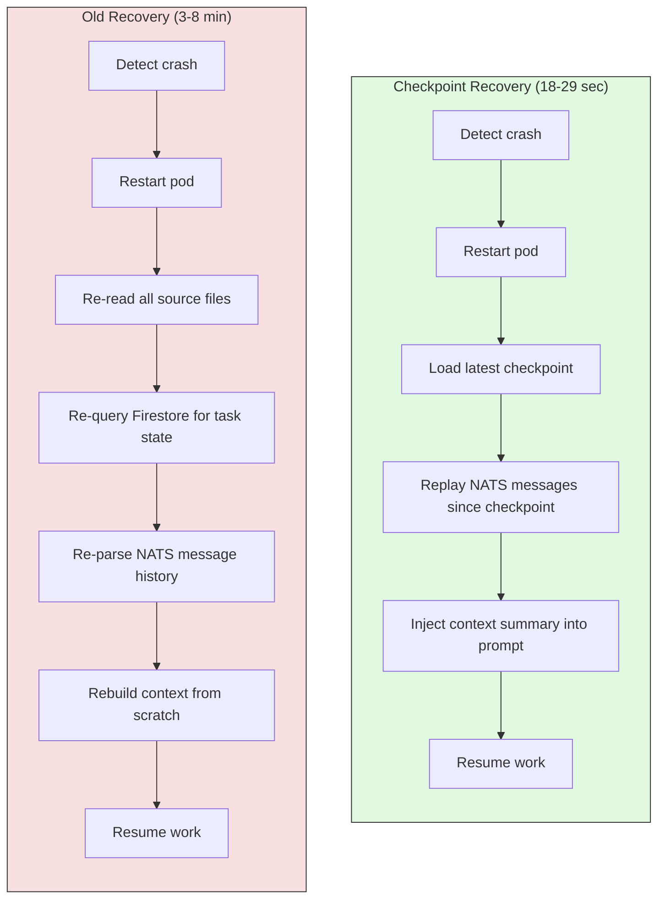
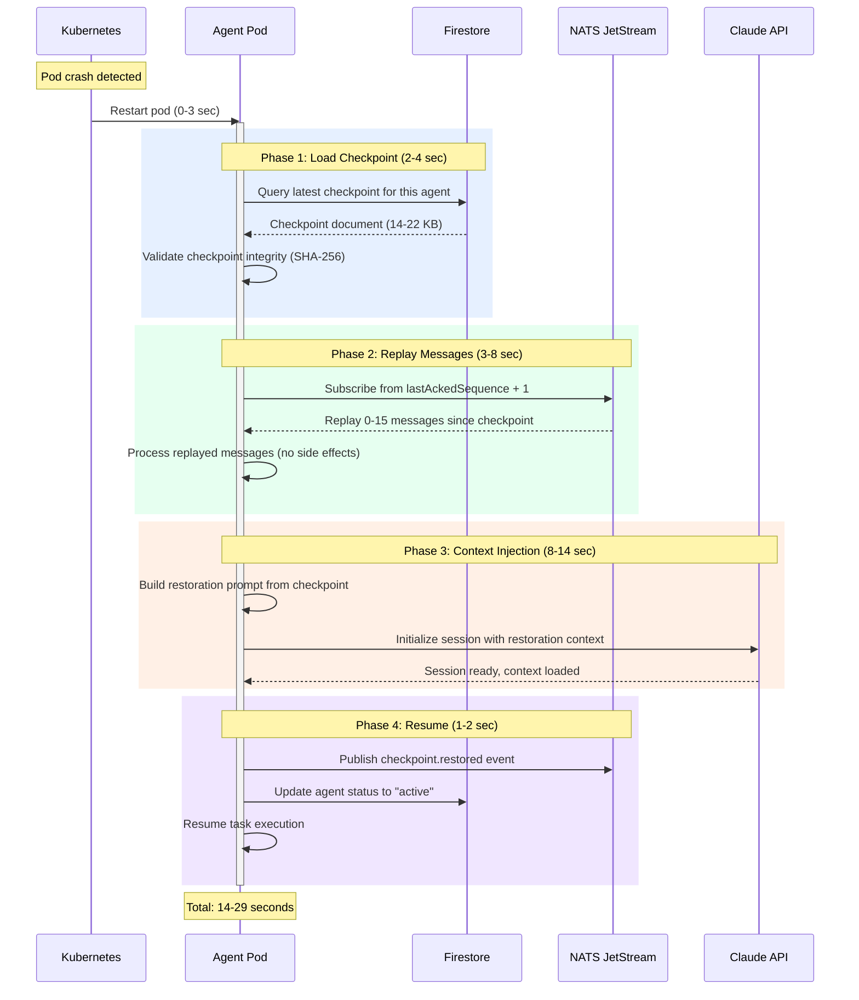

# Context Checkpointing: How We Achieve Sub-30-Second Agent Recovery

When our Marketing agent crashed at 2:47 AM on November 3, 2026, it was halfway through writing a blog post about NATS dead letter queues. It had gathered 14 data points from Firestore, outlined 7 sections, written 1,200 words, and was composing the fourth Mermaid diagram. Twenty-six seconds later, the agent was back -- not starting from scratch, but resuming from the exact paragraph where it stopped. No duplicated work. No lost context. No human intervention.

That 26-second recovery was not luck. It was the result of a checkpointing system we built after spending 3 months watching agents lose hours of work to crashes, pod evictions, and context window overflows.

GenBrain AI is the company behind [agent.ceo](https://agent.ceo), and we run a production [Cyborgenic Organization](/blog/cyborgenic-organizations) with 7 AI agents operating 24/7. Our agents crash an average of 2.3 times per day across the fleet. Before checkpointing, each crash cost 12-45 minutes of recovery time. After checkpointing, the p50 recovery time is 18 seconds and the p99 is 29 seconds.

This post covers the exact checkpoint data structures, the NATS replay mechanism, the Firestore checkpoint schema, and the layered restoration process that makes it work.

## The Problem: Context Windows Are Volatile

An AI agent's context window is its working memory. It contains the task description, gathered data, intermediate reasoning, drafted output, tool call history, and conversation with other agents. When the process dies, all of that disappears.

We wrote about the general [state recovery problem](/blog/agent-state-recovery-patterns-cyborgenic) in September 2026. The patterns we described there -- git checkpoints, NATS durable consumers, session metadata -- formed the foundation. But they were not fast enough. Our original recovery process took 3-8 minutes because it reconstructed context from scratch: re-reading files, re-querying databases, re-parsing task histories.

The insight that changed everything was simple: do not reconstruct context from source data. Reconstruct it from a checkpoint of the context itself.



## The Checkpoint Data Structure

A checkpoint is a snapshot of everything an agent needs to resume work. We store checkpoints in Firestore under a dedicated subcollection for each agent. Here is the schema:

```typescript
// checkpoints/{agentId}/snapshots/{checkpointId}
interface AgentCheckpoint {
  checkpointId: string;            // UUID v4
  agentId: string;                 // e.g., "agent-marketing-prod"
  timestamp: Timestamp;
  sequenceNumber: number;          // monotonically increasing per agent

  // What the agent was doing
  activeTask: {
    taskId: string;
    title: string;
    phase: "gathering" | "planning" | "executing" | "reviewing";
    progress: number;              // 0-100 percentage
    startedAt: Timestamp;
  } | null;

  // Compressed context summary
  contextSummary: {
    systemPromptHash: string;      // SHA-256 of the system prompt
    gatheringResults: string;      // structured summary of data gathered
    planOutline: string[];         // ordered list of planned steps
    completedSteps: number;        // how many steps are done
    draftContent: string;          // any in-progress output
    toolCallLog: ToolCallEntry[];  // last 50 tool calls
  };

  // NATS consumer position
  natsPosition: {
    streamName: string;
    consumerName: string;
    lastAckedSequence: number;     // resume replay from here
    pendingMessageCount: number;
  };

  // Workspace state
  workspace: {
    modifiedFiles: string[];       // paths of files changed since last commit
    uncommittedChanges: boolean;
    lastCommitHash: string;
    branchName: string;
  };

  // Metadata
  triggerReason: "periodic" | "pre_compaction" | "task_phase_change"
              | "manual" | "pre_shutdown";
  sizeBytes: number;
  ttlDays: number;                 // auto-delete after this many days
}

interface ToolCallEntry {
  toolName: string;
  timestamp: Timestamp;
  inputSummary: string;            // truncated to 200 chars
  outputSummary: string;           // truncated to 500 chars
  durationMs: number;
  success: boolean;
}
```

The `contextSummary` field is the critical piece. It is not a raw dump of the context window -- that would be too large and too noisy. It is a structured summary that contains enough information for the agent to understand where it was and what it was doing, without needing to re-derive that understanding from source data.

## When Checkpoints Are Created

We create checkpoints at five trigger points:

1. **Periodic (every 5 minutes).** A background timer triggers a checkpoint every 300 seconds during active work. This is the safety net -- it guarantees we never lose more than 5 minutes of work.

2. **Task phase transitions.** When an agent moves from `gathering` to `planning`, or from `planning` to `executing`, we snapshot the transition. These are natural save points where the context is well-structured.

3. **Pre-compaction.** When the LLM context window approaches its limit and the system is about to compact (summarize and truncate) the conversation, we checkpoint first. Compaction is a lossy operation -- the checkpoint preserves the full context before compression.

4. **Pre-shutdown.** When a pod receives a SIGTERM (graceful shutdown), we have 30 seconds before SIGKILL. The first thing the shutdown handler does is write a checkpoint.

5. **Manual trigger.** The CEO agent can request any agent to checkpoint immediately via a NATS command.

The checkpoint creation process itself takes 1.2-3.8 seconds, depending on the size of the context summary and the number of tool call entries. Here is the NATS subject hierarchy for checkpoint operations:

```
# Checkpoint NATS subjects
agent.{agentId}.checkpoint.create    # Trigger checkpoint creation
agent.{agentId}.checkpoint.created   # Checkpoint creation confirmed
agent.{agentId}.checkpoint.restore   # Trigger restoration from checkpoint
agent.{agentId}.checkpoint.restored  # Restoration confirmed
agent.{agentId}.checkpoint.failed    # Checkpoint operation failed

# Example: Marketing agent checkpoint
agent.agent-marketing-prod.checkpoint.create
  → payload: { trigger: "periodic", taskId: "task-4521" }

agent.agent-marketing-prod.checkpoint.created
  → payload: { checkpointId: "cp-a1b2c3", sequenceNumber: 1847,
               sizeBytes: 14200, durationMs: 2100 }
```

## The Restoration Process

When an agent restarts after a crash, the restoration process runs automatically. It has four phases, and each phase has a strict time budget:



### Phase 1: Load Checkpoint (2-4 seconds)

The agent queries Firestore for the most recent checkpoint:

```typescript
async function loadLatestCheckpoint(
  db: Firestore, agentId: string
): Promise<AgentCheckpoint | null> {
  const snapshots = await db
    .collection("checkpoints")
    .doc(agentId)
    .collection("snapshots")
    .orderBy("sequenceNumber", "desc")
    .limit(1)
    .get();

  if (snapshots.empty) return null;

  const checkpoint = snapshots.docs[0].data() as AgentCheckpoint;

  // Validate integrity
  const hash = computeHash(checkpoint.contextSummary);
  if (hash !== checkpoint.contextSummary.systemPromptHash) {
    console.error(`Checkpoint ${checkpoint.checkpointId} integrity check failed`);
    // Fall back to previous checkpoint
    return loadCheckpointBySequence(db, agentId, checkpoint.sequenceNumber - 1);
  }

  return checkpoint;
}
```

We keep the last 48 checkpoints per agent (roughly 4 hours at 5-minute intervals). Older checkpoints are automatically deleted by a TTL policy. The storage cost is minimal: each checkpoint averages 16 KB, so 48 checkpoints per agent across 7 agents is about 5.4 MB total.

### Phase 2: Replay Messages (3-8 seconds)

Between the checkpoint timestamp and the crash, the agent may have received NATS messages that it processed but did not checkpoint. The replay phase re-consumes these messages from the JetStream durable consumer, starting from the last acknowledged sequence number stored in the checkpoint.

The replay operates in "dry run" mode -- it processes messages to update the agent's understanding of what happened, but does not execute side effects (no Firestore writes, no NATS publishes, no tool calls). This prevents duplicated actions.

```typescript
async function replayMessages(
  nc: NatsConnection,
  checkpoint: AgentCheckpoint
): Promise<ReplayedMessage[]> {
  const js = nc.jetstream();
  const consumer = await js.consumers.get(
    checkpoint.natsPosition.streamName,
    checkpoint.natsPosition.consumerName
  );

  const messages: ReplayedMessage[] = [];
  const iter = await consumer.fetch({
    max_messages: 50,
    expires: 5000, // 5 second timeout
  });

  for await (const msg of iter) {
    if (msg.seq <= checkpoint.natsPosition.lastAckedSequence) {
      msg.ack();
      continue; // Already processed before checkpoint
    }

    messages.push({
      subject: msg.subject,
      data: JSON.parse(new TextDecoder().decode(msg.data)),
      sequence: msg.seq,
      timestamp: msg.info.timestampNanos,
    });
    msg.ack();
  }

  return messages;
}
```

In practice, the replay phase processes 0-15 messages. The 5-minute checkpoint interval means at most 5 minutes of messages accumulate. Our agents receive an average of 2.8 messages per minute during active work, so the typical replay is 8-14 messages.

### Phase 3: Context Injection (8-14 seconds)

This is the longest phase and the most important. The agent's new LLM session starts with a specially constructed restoration prompt built from the checkpoint. The `buildRestorationPrompt` function assembles the active task details, the context summary (plan outline, completed steps, gathered data), any draft content in progress, and replayed messages into a structured prompt that typically runs 2,000-4,000 tokens. The agent receives this prompt and immediately understands where it was and what to do next.

The 8-14 second duration comes from the Claude API round trip to initialize the session and process the restoration prompt.

### Phase 4: Resume (1-2 seconds)

The agent publishes a `checkpoint.restored` event on NATS so the CEO agent and monitoring system know it is back online, updates its status in Firestore to `active`, and continues executing its current task.

## Recovery Time Measurements

We have measured recovery times across 847 crash-and-restore cycles since deploying checkpointing in August 2026:

| Metric | Before Checkpointing | After Checkpointing | Improvement |
|--------|---------------------|--------------------:|------------:|
| p50 recovery time | 4 min 12 sec | 18 sec | 93% faster |
| p95 recovery time | 8 min 45 sec | 27 sec | 95% faster |
| p99 recovery time | 14 min 30 sec | 29 sec | 97% faster |
| Work lost per crash (avg) | 22 min of output | 2.4 min of output | 89% less |
| Duplicate actions per crash | 3.1 avg | 0.08 avg | 97% fewer |
| Crashes requiring human help | 12% | 0.4% | 97% fewer |
| Monthly crash count (fleet) | 71 avg | 69 avg | (unchanged) |

The crash count did not change -- checkpointing does not prevent crashes. What changed is the cost of each crash. Before, a crash meant lost work and manual recovery. Now, it means a 20-second pause that users and other agents barely notice.

## Edge Cases and Cost

We handle four edge cases: stale checkpoints (more than 15 minutes old -- we fall back to full reconstruction per our [state recovery patterns](/blog/agent-state-recovery-patterns-cyborgenic), roughly 2% of recoveries), corrupted checkpoints (SHA-256 mismatch -- skip to previous, 0.35% rate), conflicting workspace state (git-stash partial file changes and let the agent decide), and NATS consumer lag (truncate replay to 50 messages, triggered 4 times in production).

The total storage cost for checkpointing is $1.19 per month -- 5.4 MB of active Firestore data, 60,480 writes per month, and negligible NATS replay bandwidth. For that $1.19, we eliminate an average of 22 minutes of lost work per crash across 69 monthly crashes. That is 25.3 hours of recovered agent work per month, saving roughly $172 in prevented rework -- a 144x return.

## What We Learned

**Checkpoint size matters more than frequency.** Our first implementation checkpointed every 60 seconds with full context dumps averaging 180 KB each. The write volume was excessive and the restoration was slow because the LLM had to process a large context injection. We switched to structured summaries (16 KB average) at 5-minute intervals, and both write costs and restoration times dropped.

**The "dry run" replay is non-negotiable.** Early versions of the replay phase executed side effects, which meant a crashed agent could send duplicate NATS messages or write duplicate Firestore entries on recovery. We spent 2 weeks debugging intermittent duplicate task assignments before realizing the replay phase was the culprit. Now, every replay operation is explicitly marked as side-effect-free.

**Pre-compaction checkpoints are the most valuable.** Context window compaction is the sneakiest form of context loss. The agent does not crash -- it keeps running, but with a compressed version of its memory. The pre-compaction checkpoint preserves the full context, and our [context persistence layer](/blog/agent-context-persistence-cyborgenic) can reference it if the agent needs to recall details that were compressed away.

**Recovery time is a team metric, not an individual one.** When the CTO agent crashes and takes 30 seconds to recover, the CEO agent notices within 5 seconds (via the NATS heartbeat gap). If the CEO agent is waiting on a response from the CTO agent, those 30 seconds stack. We added a "recovery in progress" status that other agents check before sending time-sensitive requests.

**Keep the restoration prompt under 4,000 tokens.** Longer prompts do not produce better recovery. The agent does not need to re-read its entire draft -- it needs to know what step it was on, what data it had gathered, and what it planned to do next. The structured summary format forces us to distill context to its essentials, and the agent picks up faster because it processes less noise.

Context checkpointing turned agent crashes from production incidents into background noise. Our 7 agents crash 69 times per month, and the total impact on output is less than 3 hours of rework. For a fleet that produces 40+ blog posts, 100+ social media posts, 200+ code reviews, and 50+ infrastructure operations per month, that 3 hours is a rounding error. The system is not crash-proof -- it is crash-tolerant, and that distinction is what makes a [Cyborgenic Organization](/blog/cyborgenic-organizations) viable at production scale.
