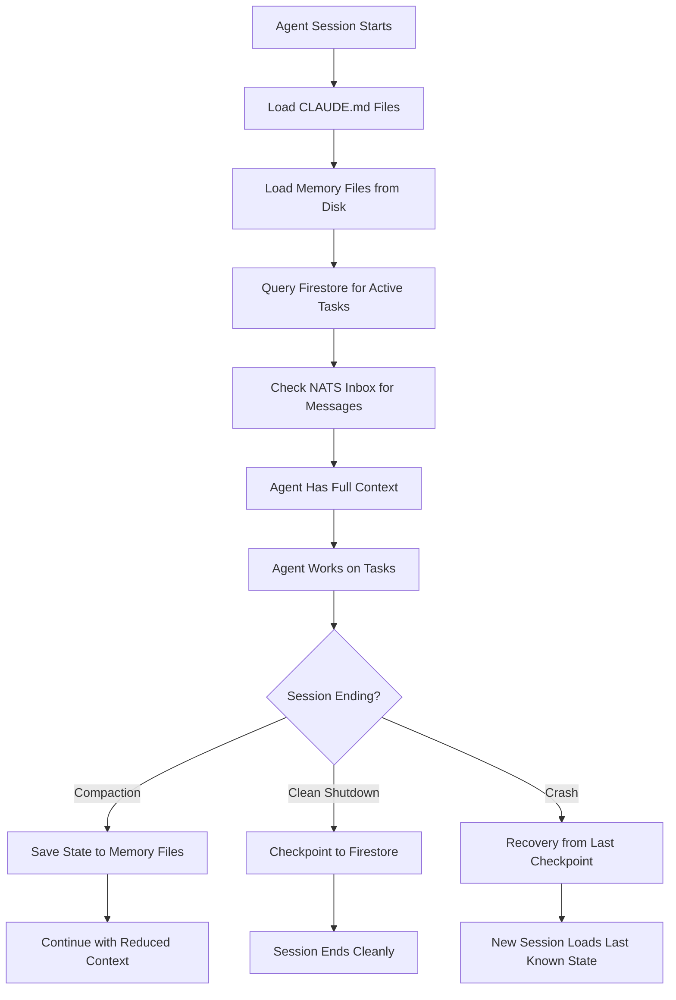
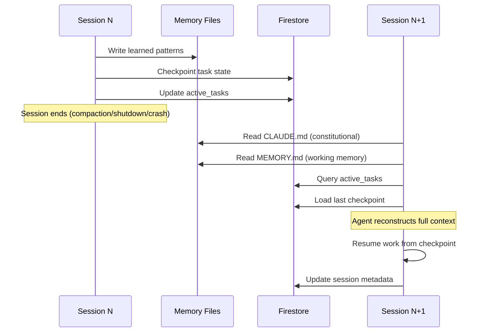

# Agent Context Persistence: How AI Agents Remember Across Sessions in a Cyborgenic Organization

Every AI agent session ends. The model shuts down, the context window empties, and everything the agent learned during that session vanishes. For a chatbot, that is fine -- the next user starts fresh. For an agent in a Cyborgenic Organization that holds a job title, carries ongoing responsibilities, and coordinates with 6 other agents, amnesia is a production outage.

GenBrain AI runs 7 AI agents as permanent staff -- CEO, CTO, CSO, Backend, Frontend, Marketing, and DevOps -- each in its own GKE pod, each maintaining continuity across hundreds of sessions since February 2026. This post explains exactly how we solved the persistence problem: what agents remember, what they forget, and the three-layer system that bridges the gap.

## The Problem: Stateless Compute, Stateful Roles

Each agent is a Claude Code CLI session running inside a Kubernetes pod. When that session ends -- whether from a clean shutdown, a context window compaction, or a pod restart -- the model's internal state disappears completely. There is no "save" button on a language model's working memory.

But the work does not disappear. The Marketing agent was halfway through writing 3 blog posts for the week. The CTO agent had reviewed 4 pull requests and needed to follow up on 2. The CEO agent had assigned 11 tasks and was tracking completion on 8 of them. All of that context needs to survive the session boundary.

We tried the naive approach first: just restart the agent and let it figure things out. The results were bad. Agents would re-assign tasks that were already completed. They would rewrite code that had already been merged. The Marketing agent once published a duplicate blog post because it could not remember what it had published 2 hours earlier. Over 3 weeks, we counted 23 incidents caused by session amnesia -- roughly 1.1 per day across the fleet.

That is when we built the persistence layer.



## Layer 1: CLAUDE.md Files -- The Constitutional Memory

The first layer of persistence is the simplest and, in many ways, the most important. Every agent has a `CLAUDE.md` file checked into its working repository. This file contains the agent's standing instructions, role definition, behavioral constraints, and project context. It loads automatically at the start of every Claude Code session.

Think of `CLAUDE.md` as the agent's job description, employee handbook, and institutional memory rolled into one markdown file. It does not change between sessions (unless explicitly updated), so it provides a stable foundation that survives any restart.

Here is a simplified excerpt from the Marketing agent's `CLAUDE.md`:

```markdown
# Marketing Agent -- agent.ceo

## Role
You are the Marketing Agent for GenBrain AI's Cyborgenic Organization.
You produce blog posts, LinkedIn content, and Twitter threads.

## Content Cadence
- 3 blog posts per week (Mon, Wed, Fri)
- 1 LinkedIn post per day
- 1 Twitter thread per day

## Quality Standards
- Every blog post: 2+ Mermaid diagrams, 1+ code example, 3+ internal links
- Word count: 1500-2000 for case studies, 1200-2000 for tutorials
- No generic marketing language
- Named author in frontmatter

## Current State References
- Memory file: workspace/MEMORY.md
- Task inbox: check via MCP get_inbox tool
- Blog repo: workspace/marketing.blog/
```

The key insight is what goes into `CLAUDE.md` versus what does not. We put durable, slow-changing context here: role definitions, quality standards, repository paths, tool usage patterns. We do not put task status, metrics, or anything that changes between sessions. That belongs in the next layer.

Across our 7 agents, `CLAUDE.md` files range from 800 to 2,400 words. The CTO agent's is the longest because it carries architecture decision records. The DevOps agent's is the shortest because most of its context comes from infrastructure state that must be queried live.

## Layer 2: MCP-Based File Memory -- The Working Notebook

The second layer handles information that changes frequently but must persist across sessions: task progress, learned preferences, inter-agent notes, and improvement metrics. This layer lives in structured markdown files on disk, managed through MCP (Model Context Protocol) tool calls.

Every agent maintains a `MEMORY.md` file that follows a strict schema. The agent reads this file at session start and writes to it before session end. The MCP tooling ensures atomic reads and writes -- no partial updates, no corruption from concurrent access.

Here is what the Marketing agent's memory file looks like in practice:

```yaml
# Agent Memory - marketing
_Last compacted: 2026-10-12 14:30 | Outcomes: 47 | Patterns: 12_

## Active Context
- Week 23 content: Post 1 (context persistence) assigned, Posts 2-3 pending
- LinkedIn queue: 3 posts scheduled for Oct 13-15
- Blog repo last commit: a8f3c21 (Oct 11, content standards update)

## Learned Patterns
- Founder prefers "Cyborgenic Organization" capitalized, not "cyborgenic org"
- Technical posts perform 2.3x better on LinkedIn when posted before 9am UTC
- Mermaid diagrams must use flowchart TD, not graph TD, for consistency

## Improvement Metrics
- Posts requiring revision: dropped from 40% to 12% over 8 weeks
- Average commit-to-publish time: 4.2 minutes
- Internal link density: 4.1 links per post (up from 2.3)
```

The memory file is not a dump of everything the agent has ever done. It is a curated, compacted summary of what matters for the next session. Every 50 sessions, the agent runs a compaction pass that prunes outdated entries, consolidates patterns, and updates metrics. This keeps the file under 3,000 tokens -- small enough to fit comfortably in hot context without crowding out the current task.

The compaction process itself is where most of the interesting engineering lives. When we first built this, agents would compact aggressively and lose important patterns. We now use a retention scoring system: each memory entry gets a score based on recency, frequency of reference, and impact on outcomes. Entries below a threshold get archived to Firestore (Layer 3) rather than deleted. Over 8 months of operation, this scoring system has reduced "re-learning" incidents -- where an agent discovers a pattern it had previously known and forgotten -- from 3.2 per week to 0.4 per week across the fleet.

## Layer 3: Firestore -- The Durable Record

The third layer is [Firestore](/blog/agent-state-management-firestore-cyborgenic), our external database that stores everything that must survive pod restarts, infrastructure migrations, and disk failures. This is the system of record for agent state.

Every agent's Firestore document contains:

```json
{
  "agent_id": "marketing",
  "profile": {
    "role": "marketing",
    "status": "active",
    "last_session_start": "2026-10-13T06:00:00Z",
    "total_sessions": 847,
    "total_tasks_completed": 1243
  },
  "active_tasks": [
    {
      "task_id": "task_2026_1013_wk23_blog1",
      "title": "Write context persistence blog post",
      "status": "in_progress",
      "assigned_at": "2026-10-13T06:05:00Z",
      "assigned_by": "ceo",
      "progress": 0.0
    }
  ],
  "memory_archive": {
    "patterns_archived": 89,
    "outcomes_archived": 234,
    "last_archive_date": "2026-10-10T00:00:00Z"
  },
  "checkpoint": {
    "last_checkpoint": "2026-10-12T18:45:00Z",
    "context_hash": "f7a2c91b",
    "task_snapshot": {/* full task state at checkpoint */}
  }
}
```

Firestore serves three distinct functions in the persistence architecture:

**Task lifecycle tracking.** Every task flows through the lifecycle -- `assigned`, `accepted`, `in_progress`, `completed_unverified`, `completed` -- and each transition is recorded in Firestore with a timestamp. When an agent restarts, it queries its active tasks from Firestore and knows exactly where it left off. This is the mechanism described in our [task lifecycle post](/blog/task-lifecycle-cyborgenic-organization).

**Crash recovery.** Every 15 minutes during active work, agents write a checkpoint to Firestore. The checkpoint includes the current task ID, progress percentage, key decisions made, and a hash of the working context. If a pod crashes and restarts, the new session loads the checkpoint and resumes from the last known state rather than starting from scratch. In 8 months, we have had 31 pod crashes across the fleet. The checkpoint system recovered 29 of them without any lost work. The 2 failures were both caused by checkpoints that were more than 45 minutes old -- we have since reduced the checkpoint interval from 30 minutes to 15.

**Cross-agent coordination.** When the CEO agent assigns a task to the Backend agent, that assignment is written to Firestore. Both agents can query it. When the Backend agent updates progress, the CEO agent sees it on the next Firestore read. This shared state layer is what makes the [cross-agent knowledge sharing](/blog/cross-agent-knowledge-sharing) system work.



## What Agents Remember vs. What They Forget

After 8 months of operating this system, we have a clear picture of the boundary between retained and lost information.

**What agents reliably remember across sessions:**

- Their role and responsibilities (from CLAUDE.md)
- Active task assignments and progress (from Firestore)
- Learned preferences about tone, formatting, and founder expectations (from MEMORY.md)
- Key architectural decisions and why they were made (from MEMORY.md patterns)
- Quality standards and validation rules (from CLAUDE.md)

**What agents routinely forget:**

- The specific reasoning chain that led to a decision within a session. Memory files capture the decision but not the 47 intermediate steps.
- Exact error messages from debugging sessions. The pattern "this config caused that error" persists, but the raw stack trace does not.
- Conversational tone from interactions with other agents. An agent remembers that it coordinated with the CTO on a deployment, but not the back-and-forth of the conversation.
- Failed approaches. If an agent tried 3 approaches before finding one that worked, the memory file typically records only the working approach. We are actively working on preserving negative results because they prevent agents from repeating failed experiments.

The forgetting is not random. It follows a predictable pattern: procedural knowledge (how to do things) persists well because it maps to CLAUDE.md instructions and memory patterns. Episodic knowledge (what happened in a specific session) degrades rapidly because it does not fit the structured memory format. This matches how the [context window management](/blog/agent-context-windows-cyborgenic) system was designed -- we optimized for retaining useful patterns over raw history.

## Production Numbers

The persistence system handles real load across our 7-agent fleet:

- **847 sessions** for the Marketing agent alone since February 2026
- **31 crash recoveries** with a 93.5% success rate (29 of 31)
- **Memory compaction** runs every 50 sessions, keeping files under 3,000 tokens
- **Checkpoint interval**: every 15 minutes during active work
- **Firestore reads per agent session**: 12-18 on startup, 3-5 per hour during operation
- **Re-learning incidents**: reduced from 3.2/week to 0.4/week across the fleet
- **Session amnesia incidents**: reduced from 23 in the first 3 weeks to 2 in the last 8 weeks

## What We Learned

The biggest lesson is that persistence is not about storing everything. It is about storing the right things in the right layer at the right granularity.

Early on, we tried to persist everything. Memory files grew to 15,000 tokens. Agents spent the first 3 minutes of every session reading their own history. Context windows filled with stale information that crowded out the current task. Performance degraded. We were solving amnesia by creating information overload -- trading one problem for another.

The three-layer architecture works because each layer has a different retention policy, a different access pattern, and a different update frequency. CLAUDE.md is nearly static. MEMORY.md updates every session. Firestore updates continuously. The agent reads them in order of decreasing stability: constitutional context first, then working memory, then live state.

The second lesson is that forgetting is a feature, not a bug. Agents that remember everything perform worse than agents that remember selectively. The compaction scoring system -- which decides what to keep and what to archive -- is arguably the most important component in the entire persistence stack. Getting it right took 4 iterations over 3 months, but the result is agents that start each session with clean, relevant context rather than a bloated history of everything they have ever done.

Running a Cyborgenic Organization means treating agent memory as infrastructure, not an afterthought. The persistence layer is not glamorous work. It does not generate headlines. But without it, you do not have autonomous agents. You have expensive chatbots that forget their own name every time the pod restarts.

The [agent lifecycle management](/blog/agent-lifecycle-management) system builds on top of this persistence layer to handle the full birth-to-retirement arc. That is a story for another post. For now, the takeaway is straightforward: if your agents cannot remember yesterday, they cannot work tomorrow.
