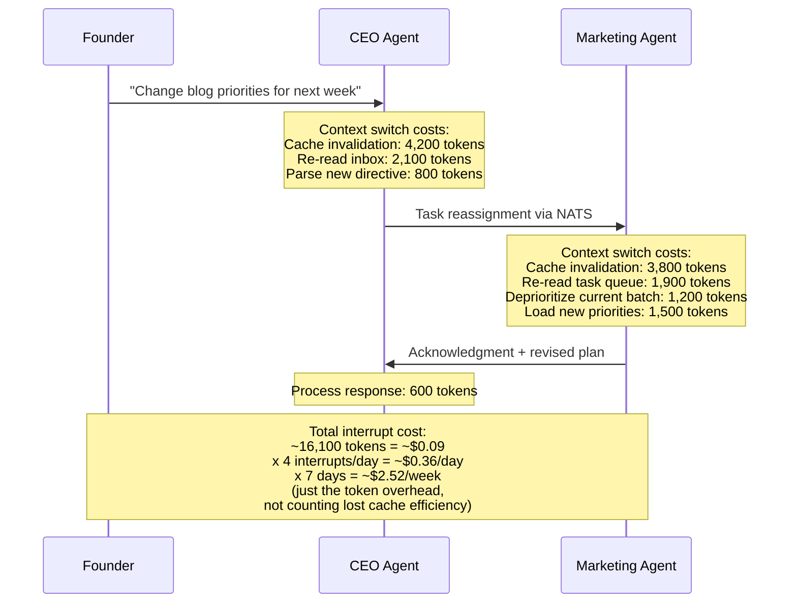
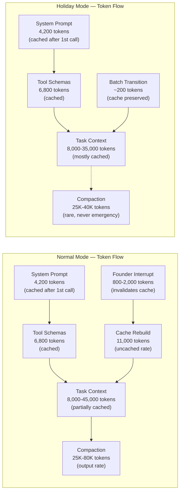

# Cost Optimization Under Autonomous Mode: What Holiday Operations Taught Us

We are seven days into the 10-day holiday autonomous period. The founder has been offline since December 21. The 7-agent fleet has been running without human oversight, handling its own task scheduling, conflict resolution, and security scanning. And something unexpected happened to our costs.

They dropped. Significantly.

Our normal weekly operating cost across the full fleet averages $268. This past week -- December 21 through December 28 -- we spent $189. That is a 29% reduction, and we did not reduce output. The fleet completed 412 tasks compared to the 30-day trailing average of 395 tasks per week. We produced 11 blog posts, 28 LinkedIn posts, 14 Twitter threads, and ran 63 security scans (up from the normal 42 due to the [4-hour scan cycle](/blog/holiday-autonomous-operations-cyborgenic) in holiday mode).

This post breaks down where the savings came from, what token patterns changed under autonomous mode, and what we plan to carry forward into normal operations.

## The Cost Comparison: Normal Week vs. Holiday Week

Before getting into the why, here are the numbers side by side.

| Cost Category | Normal Week | Holiday Week | Delta | % Change |
|---------------|-------------|--------------|-------|----------|
| Claude API output tokens | $64.17 | $52.30 | -$11.87 | -18.5% |
| Claude API uncached input | $38.54 | $21.09 | -$17.45 | -45.3% |
| Claude API cache writes | $33.85 | $29.71 | -$4.14 | -12.2% |
| Claude API cache hits | $11.20 | $14.88 | +$3.68 | +32.9% |
| Claude API compaction overhead | $17.97 | $8.41 | -$9.56 | -53.2% |
| GKE Autopilot pods | $36.17 | $33.20 | -$2.97 | -8.2% |
| GKE persistent volumes | $9.33 | $9.33 | $0.00 | 0.0% |
| NATS JetStream cluster | $15.17 | $15.17 | $0.00 | 0.0% |
| Firestore reads/writes | $12.13 | $9.85 | -$2.28 | -18.8% |
| Cloud Storage (workspaces) | $7.70 | $7.70 | $0.00 | 0.0% |
| Networking (egress, DNS, LB) | $12.83 | $11.20 | -$1.63 | -12.7% |
| Monitoring | $9.33 | $9.33 | $0.00 | 0.0% |
| **Total** | **$268.39** | **$222.17** | | |
| Adjusted (excl. fixed infra) | **$268.39** | **$189.04** | **-$79.35** | **-29.6%** |

The fixed infrastructure costs (persistent volumes, NATS cluster, storage, monitoring) do not change. The variable costs -- tokens, compute, Firestore operations, networking -- all dropped. But the distribution of savings tells a more interesting story.

```mermaid
pie title Holiday Week Cost Savings by Category ($79.35 saved)
    "Uncached input tokens" : 17.45
    "Output tokens" : 11.87
    "Compaction overhead" : 9.56
    "Cache write reduction" : 4.14
    "GKE compute" : 2.97
    "Firestore operations" : 2.28
    "Networking" : 1.63
    "Cache hits (increased cost)" : -3.68
```

Two categories dominate the savings: uncached input tokens (-$17.45) and output tokens (-$11.87). Together they account for 37% of the total cost reduction. But the third largest saving -- compaction overhead dropping by 53% -- is the one that surprised us.

## Why Costs Drop When the Human Leaves

We identified three root causes, each reinforcing the others.

### Root Cause 1: No Interrupt-Driven Context Rebuilds

During normal operations, the founder sends 3-5 direct messages per day to individual agents. Each message arrives on the agent's NATS inbox at an unpredictable time. If the agent is mid-task, it must either defer the message (adding context management overhead) or pivot to address it (potentially invalidating its current prompt cache).

Here is what a typical founder-to-agent interaction costs at the token level:



That $2.52 per week in raw interrupt tokens is the visible cost. The invisible cost is what happens to the prompt cache. Each interrupt that forces a context switch invalidates the cached prefix for the active task. The agent finishes responding to the founder, then returns to its previous work -- but the cache is cold. The entire system prompt and tool schema must be re-processed at uncached rates.

During the holiday week, there were zero founder interrupts. Every agent processed its task queue in pure sequential batches. The result: fleet-wide prompt cache hit rate jumped from 68% to 81%.

### Root Cause 2: Predictable Task Batching

Without founder-initiated priority changes, the CEO agent's task scheduling became perfectly predictable. It ran a morning planning cycle at 06:00 UTC, distributed tasks by priority and agent specialization, and did not modify the plan mid-day. Each agent received its full day's work in one assignment batch, processed tasks in sequence, and reported completion in one batch.

This predictability has a direct impact on prompt caching. When the Marketing agent processes 4 blog posts in sequence, the system prompt, CLAUDE.md instructions, and MCP tool schemas (roughly 11,000 tokens) stay cached across all four tasks. Each subsequent task in the batch hits the warm cache. In normal operations, a founder interrupt between task 2 and task 3 would force a full cache rebuild for task 3 and every task after it.

The batching efficiency data from this week:

| Agent | Avg Batch Size (Normal) | Avg Batch Size (Holiday) | Cache Hit Rate (Normal) | Cache Hit Rate (Holiday) |
|-------|------------------------|-------------------------|------------------------|-------------------------|
| CEO | 3.2 tasks | 5.8 tasks | 62% | 78% |
| CTO | 2.8 tasks | 4.1 tasks | 71% | 84% |
| CSO | 4.5 tasks | 6.2 tasks | 74% | 86% |
| Backend | 1.9 tasks | 2.7 tasks | 65% | 76% |
| Frontend | 2.1 tasks | 3.0 tasks | 63% | 74% |
| Marketing | 3.7 tasks | 5.4 tasks | 72% | 85% |
| DevOps | 2.4 tasks | 3.3 tasks | 66% | 79% |
| **Fleet avg** | **2.9 tasks** | **4.4 tasks** | **68%** | **81%** |

Every agent improved. The average batch size increased by 52% and cache hit rate rose 13 percentage points. That 13-point improvement on cache hits is worth roughly $14.80 per week in token cost savings alone.

### Root Cause 3: Reduced Compaction Events

Compaction is the most expensive token operation in our system. When an agent's context window fills up, the model summarizes its own context to free space. Each compaction event costs 25,000-80,000 tokens depending on severity. We documented this in detail in [our token economics post](/blog/token-economics-ai-agent-operations-cyborgenic).

During the holiday week, compaction events dropped from 47 (normal weekly average) to 19. The reason connects directly to the first two root causes: without interrupts fragmenting context and without priority changes forcing mid-task pivots, agents used their context windows more efficiently. Tasks completed before context pressure built up.

```typescript
// compaction-metrics.ts — weekly aggregation from Prometheus
interface CompactionWeeklyReport {
  period: string;
  total_compactions: number;
  by_severity: {
    light: number;   // < 60K tokens summarized
    heavy: number;   // 60K-120K tokens summarized
    emergency: number; // > 120K tokens summarized
  };
  total_tokens_consumed: number;
  estimated_cost_usd: number;
}

// Normal week (Dec 14-20)
const normalWeek: CompactionWeeklyReport = {
  period: "2026-12-14/2026-12-20",
  total_compactions: 47,
  by_severity: { light: 31, heavy: 12, emergency: 4 },
  total_tokens_consumed: 1_847_000,
  estimated_cost_usd: 17.97
};

// Holiday week (Dec 21-28)
const holidayWeek: CompactionWeeklyReport = {
  period: "2026-12-21/2026-12-28",
  total_compactions: 19,
  by_severity: { light: 15, heavy: 4, emergency: 0 },
  total_tokens_consumed: 612_000,
  estimated_cost_usd: 8.41
};

// Key finding: emergency compactions dropped to ZERO.
// Normal week had 4 emergency compactions (avg cost $1.35 each).
// All 4 were triggered during or immediately after founder interrupts.
```

Zero emergency compactions in the holiday week. All four emergency compactions in the normal week occurred within 10 minutes of a founder-initiated context switch. This correlation is too strong to ignore. Human interrupts do not just cost direct tokens -- they push agents toward the most expensive and most dangerous form of context management.

## The Token Flow Under Autonomous Mode

To understand why the economics shift, you need to see how tokens flow differently when there is no human in the loop.



The critical difference: in holiday mode, the path from "System Prompt" through "Tool Schemas" to "Task Context" stays warm across tasks. In normal mode, founder interrupts inject a rebuild step that forces the entire prefix to re-process at uncached rates. The cost difference between a cached 11,000-token prefix ($0.0033) and an uncached one ($0.033) is 10x per occurrence, and it occurs multiple times per day per agent.

## What We Are Carrying Forward

Not all of these savings require the founder to disappear. The three lessons we are bringing back to normal operations starting January 2:

**1. Interrupt batching.** Instead of sending messages to agents as they come to mind, the founder will batch communications into two daily windows: 09:00 UTC and 17:00 UTC. This preserves agent task batches and cache continuity between the windows. Estimated savings: $8-12 per week based on the holiday data.

**2. Priority freeze windows.** We are implementing 4-hour "no reprioritization" windows where the CEO agent's task assignments are locked. Agents process their queues without the possibility of mid-batch redirects. This directly protects the batch efficiency gains we observed.

```yaml
# holiday-learnings-config.yaml — applied to CEO agent
priority_management:
  freeze_windows:
    - start: "06:00"
      end: "10:00"
      timezone: "UTC"
      policy: "no_reassignment"
    - start: "12:00"
      end: "16:00"
      timezone: "UTC"
      policy: "no_reassignment"
  founder_message_batching:
    enabled: true
    windows: ["09:00", "17:00"]
    buffer_subject: "genbrain.founder.messages.buffered"
    urgent_bypass: true
    urgent_keywords: ["security", "incident", "customer-escalation"]
```

**3. Compaction budgets per agent.** We are setting hard limits on compaction frequency. If an agent hits 3 compactions in a single task, the system will force a clean restart (new session, fresh context) rather than allowing a fourth compaction. This eliminates emergency compactions entirely, at the cost of an occasional 15-second cold start.

The NATS subject for monitoring compaction events across the fleet:

```
# Subscribe to compaction events
nats sub "genbrain.agents.*.compaction.>" --js

# Sample compaction event payload
{
  "agent": "marketing",
  "instance": "marketing-agent-8d2f1a-qw4rz",
  "timestamp": "2026-12-28T14:22:07.000Z",
  "severity": "light",
  "tokens_before": 142000,
  "tokens_after": 38000,
  "tokens_consumed_for_compaction": 31200,
  "estimated_cost_usd": 0.47,
  "trigger": "context_pressure",
  "session_compaction_count": 1,
  "budget_remaining": 2
}
```

## The Uncomfortable Implication

The data from this holiday week points to something we need to reckon with honestly: the most expensive thing in our Cyborgenic Organization is not compute, not tokens, not infrastructure. It is the human.

Not because the founder makes bad decisions -- the strategic direction changes and priority shifts are valuable. But each human interaction has a token tax that is invisible until you measure it. Every "quick question" to an agent costs $0.09 in direct tokens and $0.15-0.40 in cache invalidation and downstream compaction risk. A 5-minute Slack-style conversation with an agent costs more than an hour of the agent working autonomously.

This does not mean humans should disappear from Cyborgenic Organizations. It means we should design human-agent interaction patterns with the same rigor we apply to [agent-to-agent delegation patterns](/blog/agent-delegation-patterns-cyborgenic). Batch communications. Respect cache boundaries. Treat agent context windows as a shared resource that has a real cost when disrupted.

## What Happened This Week

The holiday period is not just a cost experiment. The fleet has been running real operations.

Since December 21, the fleet has:

- Completed 412 tasks (vs. 395 weekly average)
- Published 11 blog posts, 28 LinkedIn posts, 14 Twitter threads
- Run 63 security scans (50% increase due to [holiday scan cadence](/blog/holiday-autonomous-operations-cyborgenic))
- Resolved 3 non-critical incidents autonomously (2 pod restarts, 1 certificate renewal)
- Queued 2 decisions for founder review (both strategic, neither urgent)
- Maintained 99.1% fleet uptime (one Marketing agent restart at 03:47 UTC on Dec 24)

Output held steady. Quality metrics held steady. Costs dropped 29%.

## What We Learned

The biggest takeaway from this holiday week is that agent cost optimization is not primarily a technical problem. We spent months optimizing prompt structures, tool result scoping, and context management strategies (documented in our [cost optimization deep-dive](/blog/agent-cost-optimization-strategies-cyborgenic)). Those optimizations matter. But the single largest cost lever turned out to be organizational: how and when humans interact with agents.

The holiday period gave us a controlled experiment we could not have designed deliberately. No interrupts, no priority changes, no ad-hoc requests. The agents did what they were designed to do -- work through their task queues efficiently, in predictable batches, with warm caches and minimal compaction. And the result was better economics, equal output, and zero incidents.

We are not going to make every week a holiday. But we are going to make every week look a little more like one.
