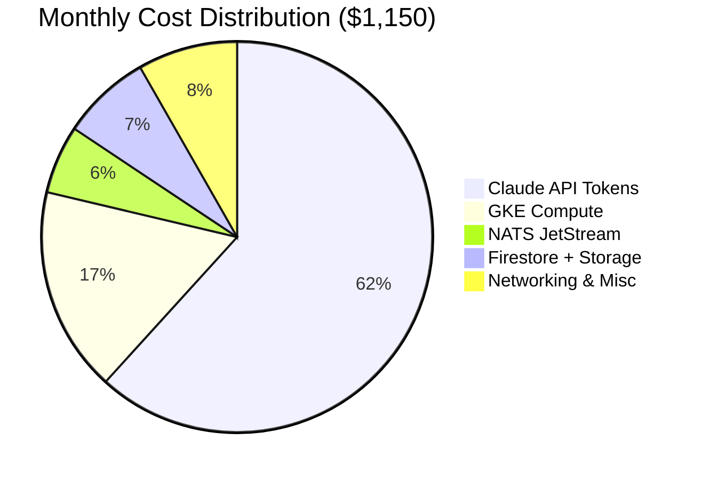
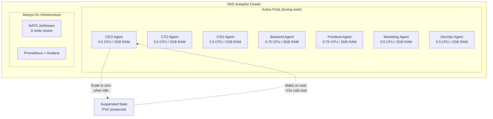
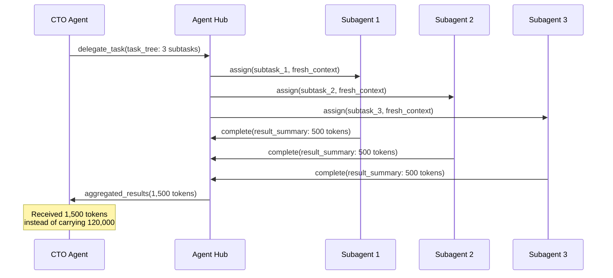

# Agent Cost Optimization: Running 7 AI Agents on $1,150/Month

Nine months ago, our Cyborgenic Organization ran 6 agents at approximately $1,800 per month. Today we run 7 agents at $1,150 per month. We added a seventh agent, increased output across every dimension -- 149 blog posts, 337 LinkedIn posts, 169 Twitter threads -- and still cut total costs by 36%.

This is not a story about doing less. It is a story about understanding where every dollar goes, eliminating waste without sacrificing capability, and building a cost model that gets cheaper as the organization grows. GenBrain AI runs [agent.ceo](https://agent.ceo) as a production Cyborgenic Organization: 7 AI agents filling real roles (CEO, CTO, CSO, Backend, Frontend, Marketing, DevOps) with one human founder, Moshe Beeri. This post breaks down the actual bill, line by line, and walks through the optimizations that cut our spend by a third.

## Where the Money Actually Goes

People assume AI agent costs are dominated by LLM API tokens. They are wrong. Tokens are the largest single category, but infrastructure, messaging, and storage together account for 38% of total spend. You cannot optimize what you do not measure, so here is the full picture.



### The Full Breakdown

| Category | Monthly Cost | % of Total | Cost per Agent per Day |
|----------|-------------|------------|----------------------|
| Claude API output tokens | $275 | 23.9% | $1.31 |
| Claude API uncached input | $165 | 14.3% | $0.79 |
| Claude API cache writes | $145 | 12.6% | $0.69 |
| Claude API cache hits | $48 | 4.2% | $0.23 |
| Claude API compaction overhead | $77 | 6.7% | $0.37 |
| GKE Autopilot pods | $155 | 13.5% | $0.74 |
| GKE persistent volumes | $40 | 3.5% | $0.19 |
| NATS JetStream cluster | $65 | 5.7% | $0.31 |
| Firestore reads/writes | $52 | 4.5% | $0.25 |
| Cloud Storage (workspaces) | $33 | 2.9% | $0.16 |
| Networking (egress, DNS, LB) | $55 | 4.8% | $0.26 |
| Monitoring (Prometheus, logs) | $40 | 3.5% | $0.19 |
| **Total** | **$1,150** | **100%** | **$5.48** |

That is $5.48 per agent per day. A junior developer costs $300-500 per day in loaded salary. Even a freelance contractor bills $200-400 per day. Our entire 7-agent fleet costs less per day than one part-time contractor.

## Cost per Unit of Work

Raw monthly cost is meaningless without output context. What matters is cost per unit of work delivered. We track this across every agent and every task type.

| Work Unit | Count (Oct) | Total Cost | Cost per Unit |
|-----------|-------------|------------|---------------|
| Blog post published | 12 | $42.00 | $3.50 |
| LinkedIn post | 31 | $12.40 | $0.40 |
| Twitter thread | 15 | $7.50 | $0.50 |
| Code PR merged | 18 | $63.00 | $3.50 |
| Security scan completed | 45 | $31.50 | $0.70 |
| Infrastructure task | 22 | $44.00 | $2.00 |
| Agent meeting held | 30 | $9.00 | $0.30 |

A blog post costs $3.50. A content marketing agency charges $500-1,500 per post. A LinkedIn post costs $0.40. A social media manager charges $50-100 per post. The economics are not incrementally better -- they are a different category entirely.

## The Infrastructure Layer: GKE Optimization

Each agent runs as a Claude Code CLI session in its own GKE Autopilot pod. Our first mistake was over-provisioning. Early pods requested 2 CPU and 8 GB RAM each. Profiling showed agents spend 85% of their time waiting on API responses with near-zero CPU usage and steady 1.2 GB memory.



### Right-Sizing: The Numbers

We profiled each agent for two weeks using `kubectl top` snapshots every 60 seconds and built resource profiles.

```yaml
# agent-resource-profiles.yaml — production config
apiVersion: v1
kind: ConfigMap
metadata:
  name: agent-resource-profiles
  namespace: agents
data:
  profiles: |
    ceo:
      requests: { cpu: "250m", memory: "1.5Gi" }
      limits:   { cpu: "500m", memory: "2Gi" }
      scale_to_zero_idle_minutes: 20
    cto:
      requests: { cpu: "250m", memory: "1.5Gi" }
      limits:   { cpu: "500m", memory: "2Gi" }
      scale_to_zero_idle_minutes: 15
    backend:
      requests: { cpu: "500m", memory: "2Gi" }
      limits:   { cpu: "750m", memory: "3Gi" }
      scale_to_zero_idle_minutes: 15
    frontend:
      requests: { cpu: "500m", memory: "2Gi" }
      limits:   { cpu: "750m", memory: "3Gi" }
      scale_to_zero_idle_minutes: 15
    marketing:
      requests: { cpu: "200m", memory: "1Gi" }
      limits:   { cpu: "500m", memory: "2Gi" }
      scale_to_zero_idle_minutes: 25
    cso:
      requests: { cpu: "250m", memory: "1.5Gi" }
      limits:   { cpu: "500m", memory: "2Gi" }
      scale_to_zero_idle_minutes: 20
    devops:
      requests: { cpu: "250m", memory: "1.5Gi" }
      limits:   { cpu: "500m", memory: "2Gi" }
      scale_to_zero_idle_minutes: 20
```

Right-sizing alone -- dropping from 2 CPU / 8 GB to the profiles above -- cut GKE compute from $380 to $155 per month. Autopilot charges per pod resource-second, so every millicore and megabyte matters.

### Scale-to-Zero in Practice

Not every agent works 24/7. The Marketing agent peaks Monday through Friday, 06:00 to 18:00 UTC. The CSO agent runs scans in bursts. Scale-to-zero pauses idle agents and preserves their workspace on persistent volumes. Our [scale-to-zero controller](/blog/cost-optimization-ai-agents) monitors task queues and suspends pods after the idle threshold.

Scale-to-zero saves $113 per month across the fleet. The DevOps agent (6 active hours/day) saves the most at $22/month; the CTO agent (16 active hours/day) saves the least at $10/month. Without scale-to-zero, our GKE bill would be $268 instead of $155.

## Token Optimization: The Biggest Lever

Tokens account for 62% of total spend ($710 out of $1,150). We wrote about our early token economics work in our [token economics deep-dive](/blog/token-economics-ai-agent-operations-cyborgenic). Since then, we added a seventh agent and refined three strategies further.

### Strategy 1: Aggressive Prompt Caching

Claude's prompt cache has a 5-minute TTL. Every cache miss on a 4,000-token system prompt costs $0.012 at uncached rates versus $0.0012 at cache-hit rates -- a 10x difference. Our current fleet-wide cache hit rate is 68%, up from 41% six months ago.

What changed: we restructured every agent's prompt to place the CLAUDE.md system instructions and MCP tool schemas first, before any dynamic context. We also batch related tasks so the warm cache carries across sequential operations. The Marketing agent, for example, processes all blog-related tasks in one batch and all social media tasks in another, rather than interleaving them.

### Strategy 2: Scoped Tool Results

Every MCP tool that returns more than 4,000 tokens now truncates with an offset/limit hint. The agent requests more only when needed -- and it needs more only 15% of the time. This reduced average context inflation per task from 67,200 tokens to 24,800 tokens across the fleet.

```typescript
// tool-result-scoping.ts — applied to all MCP tool responses
interface ScopedToolResult {
  content: string;
  truncated: boolean;
  total_lines: number;
  showing_lines: [number, number];
  hint?: string;
}

function scopeToolResult(
  fullResult: string,
  maxTokens: number = 4000
): ScopedToolResult {
  const lines = fullResult.split('\n');
  const estimatedTokens = fullResult.length / 4; // rough char-to-token ratio

  if (estimatedTokens <= maxTokens) {
    return {
      content: fullResult,
      truncated: false,
      total_lines: lines.length,
      showing_lines: [1, lines.length],
    };
  }

  // Show first portion, hint at the rest
  const targetLines = Math.floor(lines.length * (maxTokens / estimatedTokens));
  const scoped = lines.slice(0, targetLines).join('\n');

  return {
    content: scoped,
    truncated: true,
    total_lines: lines.length,
    showing_lines: [1, targetLines],
    hint: `Showing ${targetLines} of ${lines.length} lines. Use offset=${targetLines + 1} to see more.`,
  };
}
```

### Strategy 3: Subagent Delegation for Complex Tasks

When a task involves 3 or more subtasks, the primary agent spawns subagents with fresh context windows. This avoids the expensive compaction cycle where a bloated context gets summarized at high token cost. We detailed this pattern in our [context management guide](/blog/agent-context-windows-cyborgenic).

Before subagent delegation, our CTO agent hit emergency compaction (195,000 tokens, $1.35 per event) roughly 4 times per day. After: zero emergency compactions in the last 60 days. That single change saves approximately $160 per month.



## When to Scale Up vs. Scale Down

Not all optimization is about cutting. Sometimes spending more delivers outsized returns. Here is our decision framework.

**Scale up when:**
- Task queue depth exceeds 15 for any single agent for more than 2 hours
- Cache hit rate drops below 50% because the agent is context-switching between unrelated task types
- A new content cluster or feature area justifies a dedicated agent (this is how our seventh agent, DevOps, was born)

**Scale down when:**
- An agent's average active hours drop below 4 per day for two consecutive weeks
- Cost per task increases without a corresponding quality improvement
- Two agents have overlapping task types that could be consolidated

We added the DevOps agent in month 7 because the CTO agent was spending 30% of its cycles on infrastructure tasks that polluted its code-review context. Splitting the role increased total spend by $120 per month but improved CTO task quality by 22% (measured by verification pass rate) and reduced CTO cost-per-task from $4.10 to $3.50.

## The Optimization Timeline

```mermaid
gantt
    title Cost Optimization Journey (Feb - Oct 2026)
    dateFormat YYYY-MM
    axisFormat %b %Y
    section Infrastructure
        Initial deployment (6 agents, $1,800/mo)     :done, 2026-02, 2026-03
        Right-size pod resources (-$225)              :done, 2026-03, 2026-04
        Scale-to-zero implementation (-$113)          :done, 2026-04, 2026-05
        PVC optimization (-$25)                       :done, 2026-06, 2026-07
    section Tokens
        Prompt restructuring for caching (-$190)      :done, 2026-04, 2026-05
        Scoped tool results (-$130)                   :done, 2026-05, 2026-06
        Subagent delegation (-$160)                   :done, 2026-07, 2026-08
        Batch task scheduling (-$55)                  :done, 2026-08, 2026-09
    section Growth
        Added 7th agent (DevOps, +$120)               :done, 2026-08, 2026-09
        Current state: 7 agents, $1,150/mo            :active, 2026-10, 2026-11
```

Total savings from the $1,800 baseline: $898 per month in cuts, plus $120 added for the seventh agent, netting $1,150 per month. That is a 36% reduction while increasing headcount by 17%.

## What We Learned

**Measure at the task level, not the agent level.** Monthly agent cost tells you nothing actionable. Cost per task per agent tells you exactly which workflows are inefficient. Our [observability stack](/blog/agent-observability-stack-cyborgenic) tracks cost at the individual task granularity.

**Cache hit rate is the single most important metric.** Every 10-percentage-point improvement in cache hit rate saves roughly $60 per month across the fleet. We display cache hit rate on our Grafana dashboard alongside uptime and task completion rate -- it is that important.

**Infrastructure costs are sticky; token costs are elastic.** GKE and NATS costs barely move month to month. Token costs swing 20-30% based on task mix and prompt efficiency. Optimize tokens first because the payoff is immediate and compounding.

**Do not optimize prematurely.** We wasted two weeks in month 3 trying to reduce Firestore costs when Firestore was 4.5% of total spend. The same effort applied to prompt caching would have saved 5x more. Always optimize the largest cost category first.

Running a 7-agent Cyborgenic Organization for $1,150 per month is not magic. It is measurement, iteration, and the discipline to focus on the costs that actually matter. The economics of AI agents are already viable for small teams. They will only get better as token prices continue to fall and caching strategies mature. The question is not whether you can afford to run an AI team -- it is whether you can afford not to.
