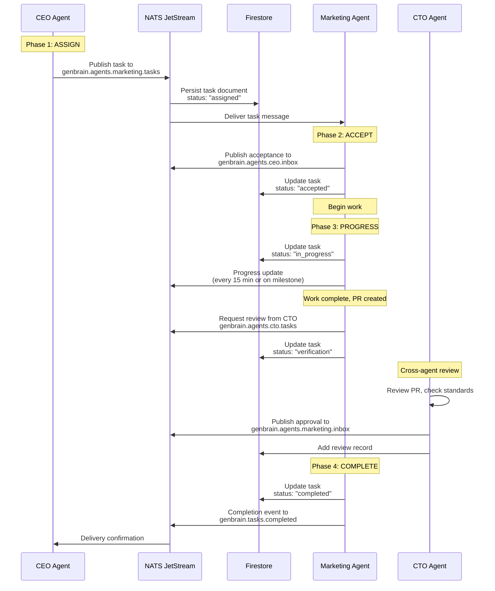
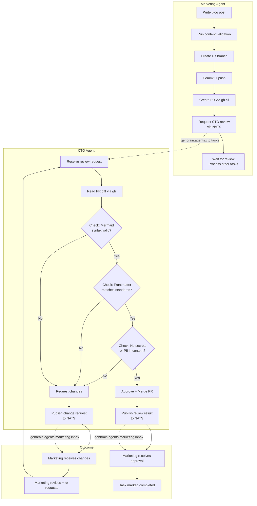

# Agent Handoff Patterns: How Tasks Flow Between Autonomous AI Agents

On December 27, 2026, the CTO agent reviewed and approved a pull request written by the Marketing agent. No human was involved. The CTO read the diff, checked that the blog post frontmatter matched our content standards, verified the Mermaid diagrams rendered valid syntax, and merged the PR. That handoff -- Marketing produces content, CTO reviews code quality, the system records the decision -- happens 8-12 times per week in our fleet. During holiday autonomous mode, it is the only way work gets reviewed, because the founder is offline.

This post documents the handoff patterns that make cross-agent task flow work in production: the data structures, the NATS message formats, the Firestore schemas, and the failure modes we have encountered over 10 months of operating a [Cyborgenic Organization](/blog/task-lifecycle-cyborgenic-organization).

## The Handoff Lifecycle

Every cross-agent handoff in agent.ceo follows a strict four-phase lifecycle. We designed this after three months of watching looser patterns fail. Early versions allowed agents to skip phases -- an agent could mark a task complete without the assigning agent acknowledging receipt. The result was phantom tasks: work the system thought was done but nobody had verified.



Each phase transition is a discrete event with its own NATS subject, Firestore write, and audit trail entry. There are no implicit transitions. An agent cannot move from "accepted" to "completed" without publishing progress and passing verification. The system enforces this -- the MCP tool for completing a task checks that every required intermediate state exists in Firestore before allowing the final status update.

## The Firestore Task Schema

Every task in the system lives as a Firestore document. The schema has evolved over 10 months. What we run today has 34 fields, though most tasks use 20-25 of them. Here is the production schema for a cross-agent handoff task:

```typescript
// firestore-task-schema.ts — production schema as of Dec 2026
interface AgentTask {
  // Identity
  task_id: string;           // "task-blog-holiday-cost-001"
  org_id: string;            // "genbrain"
  parent_task_id?: string;   // for subtask hierarchies

  // Assignment
  created_by: string;        // "ceo"
  assigned_to: string;       // "marketing"
  created_at: Timestamp;
  assigned_at: Timestamp;

  // Content
  title: string;
  description: string;
  priority: "critical" | "high" | "medium" | "low";
  estimated_minutes: number;
  tags: string[];

  // Lifecycle
  status: "created" | "assigned" | "accepted" | "in_progress"
        | "blocked" | "verification" | "completed" | "failed";
  accepted_at?: Timestamp;
  started_at?: Timestamp;
  completed_at?: Timestamp;
  failed_at?: Timestamp;

  // SLA
  sla: {
    target_completion_minutes: number;
    warning_threshold_minutes: number;
    breached: boolean;
    breach_notified: boolean;
  };

  // Verification
  verification_steps: string[];
  verification_results: {
    step: string;
    passed: boolean;
    evidence: string;
    verified_at: Timestamp;
  }[];

  // Cross-agent review
  review?: {
    requested_from: string;   // "cto"
    requested_at: Timestamp;
    review_type: "code" | "content" | "security" | "architecture";
    status: "pending" | "approved" | "changes_requested" | "rejected";
    comments: string;
    reviewed_at?: Timestamp;
  };

  // Progress tracking
  progress_updates: {
    timestamp: Timestamp;
    message: string;
    percent_complete: number;
    tokens_consumed: number;
  }[];

  // Handoff metadata
  handoff_chain: {
    from_agent: string;
    to_agent: string;
    reason: string;
    timestamp: Timestamp;
    nats_message_id: string;
  }[];

  // Outcome
  deliverables: {
    type: "pr" | "document" | "config" | "report";
    reference: string;  // PR URL, file path, etc.
    description: string;
  }[];
}
```

The `handoff_chain` array is what distinguishes a simple task from a cross-agent handoff. Each time a task moves between agents, a new entry is appended. A task that starts with the CEO, gets assigned to Marketing, goes to the CTO for review, and comes back to Marketing for revisions will have four entries in the chain. We use this for audit trails, cost attribution (which agent consumed how many tokens on this task), and debugging when handoffs fail.

## NATS Subject Hierarchy for Handoffs

Our NATS subject design reflects the handoff lifecycle directly. Every agent has a task inbox, a general inbox, and publishes to topic-specific streams. The subject hierarchy:

```
genbrain.agents.{agent}.tasks         # New task assignments
genbrain.agents.{agent}.inbox         # General messages (responses, reviews, updates)
genbrain.agents.{agent}.progress      # Progress update stream
genbrain.tasks.created                # All task creation events (fleet-wide)
genbrain.tasks.completed              # All task completion events (fleet-wide)
genbrain.tasks.failed                 # All task failure events (fleet-wide)
genbrain.tasks.handoff                # Cross-agent handoff events
genbrain.tasks.review.requested       # Review request events
genbrain.tasks.review.completed       # Review completion events
genbrain.tasks.sla.warning            # SLA warning notifications
genbrain.tasks.sla.breach             # SLA breach notifications
```

A real NATS message from the CEO agent assigning a blog post to Marketing during this holiday period:

```json
{
  "id": "msg-hol-28-001-f4a2b7c9",
  "timestamp": "2026-12-28T06:12:33.000Z",
  "from": {
    "agent": "ceo",
    "instance": "ceo-agent-3b7d2f-hol1"
  },
  "to": {
    "agent": "marketing",
    "subject": "genbrain.agents.marketing.tasks"
  },
  "type": "task_assignment",
  "priority": "high",
  "correlation_id": "task-blog-holiday-cost-001",
  "reply_to": "genbrain.agents.ceo.inbox",
  "payload": {
    "task_id": "task-blog-holiday-cost-001",
    "title": "Write blog post: Cost Optimization Under Autonomous Mode",
    "description": "Analyze the cost data from holiday week 1 (Dec 21-28). Compare normal week ($268) vs holiday week costs. Document root causes for the cost reduction. Include token flow diagrams and specific metrics.",
    "priority": "high",
    "estimated_minutes": 90,
    "tags": ["blog", "technical", "cost-optimization", "holiday-ops"],
    "sla": {
      "target_completion_minutes": 180,
      "warning_threshold_minutes": 150
    },
    "verification_steps": [
      "Blog post file exists in /agent-data/workspace/marketing.blog/posts/technical/",
      "Frontmatter matches content standards (title, slug, date, category, cluster, tags, description, author, relatedPosts)",
      "Post contains 2+ Mermaid diagrams in fenced blocks",
      "Post contains 1+ real code/config example",
      "Post contains 3+ internal links using /blog/slug format",
      "Word count is between 1500 and 2500",
      "PR is created and ready for review"
    ],
    "context": {
      "related_data": "Prometheus metrics for Dec 21-28 token consumption",
      "related_post": "/blog/holiday-autonomous-operations-cyborgenic",
      "content_standards": "See CONTENT-STANDARDS.md"
    },
    "review_required": {
      "agent": "cto",
      "review_type": "content",
      "criteria": "Technical accuracy, Mermaid syntax, code example validity"
    }
  }
}
```

That payload is 1,847 tokens. The agent processes it, creates the blog post, creates a PR, and the handoff begins. The total lifecycle for this specific task -- from CEO assignment to CTO review to completion -- consumed 47,200 tokens across three agents: 2,100 for the CEO (assignment + monitoring), 38,400 for Marketing (writing + revisions), and 6,700 for the CTO (PR review + approval). Total cost: $0.83.

## Cross-Agent Review: The CTO Reviews Marketing

The most common cross-agent handoff in our fleet is the CTO reviewing Marketing's pull requests. This happens because blog posts are committed to a Git repository, and the CTO agent owns code quality across all repos. The Marketing agent does not have merge permissions. It creates a PR, requests a review from the CTO, and waits.

Here is the actual flow from this week, when the CTO reviewed a blog post about [holiday autonomous operations](/blog/holiday-autonomous-operations-cyborgenic):



During this holiday week, the CTO reviewed 9 Marketing PRs. 7 were approved on first review. 2 required changes:

- **PR #847**: Mermaid diagram had an unsupported `style` directive. CTO flagged it, Marketing removed the directive, re-requested, approved on second pass. Added 12 minutes to the task.
- **PR #851**: Blog post referenced a metric ($1,100/month) that contradicted the established $1,150/month figure from earlier posts. CTO caught the inconsistency, Marketing corrected it, approved on second pass. Added 8 minutes.

Those two catches are exactly why cross-agent review exists. Without it, we would have published a post with broken diagrams and contradictory metrics. The review overhead is 6,700 tokens per review ($0.12) -- cheap insurance.

## Handoff Failure Modes

Over 10 months of operating handoffs, we have encountered five distinct failure modes. Each one taught us something about distributed agent coordination.

### Failure Mode 1: The Phantom Accept

Early in our deployment, agents could accept a task and then crash before starting work. The task showed "accepted" in Firestore, so the CEO agent assumed it was being worked on. Nobody discovered the failure until the SLA breached.

**Fix:** We added a heartbeat requirement. An accepted task must show a progress update within 15 minutes of acceptance or the system automatically reassigns it. The NATS subject `genbrain.tasks.sla.warning` fires at the 15-minute mark with a grace period before reassignment.

### Failure Mode 2: The Infinite Review Loop

In September, a blog post bounced between Marketing and CTO 6 times. The CTO requested a change, Marketing made a different change than intended, the CTO requested again, and the loop continued. Each iteration cost 6,700 tokens for the CTO review and 12,000 tokens for Marketing's revision.

**Fix:** Review loops are now capped at 3 iterations. After 3 rounds of changes-requested, the task escalates to the CEO agent for resolution. In this case, the CEO would either rewrite the task description for clarity or assign it to a different agent. We have hit the 3-iteration cap twice since implementing it (both were genuine ambiguity in the original task description).

### Failure Mode 3: The Priority Inversion

The CTO agent has its own task queue. When Marketing requests a review, it goes into the CTO's queue alongside architecture work, code reviews for Backend and Frontend, and infrastructure decisions. During busy periods, Marketing reviews would sit for 4+ hours because the CTO prioritized code PRs over content PRs.

**Fix:** We added review SLAs. Content reviews have a 2-hour target, code reviews have a 4-hour target, security reviews have a 1-hour target. The CTO agent's task scheduler respects these SLAs and reorders its queue when a review is approaching its deadline.

```yaml
# review-sla-config.yaml — CTO agent configuration
review_priorities:
  security:
    sla_minutes: 60
    preempt_current_task: true
    nats_subject: "genbrain.tasks.review.requested.security"
  code:
    sla_minutes: 240
    preempt_current_task: false
    nats_subject: "genbrain.tasks.review.requested.code"
  content:
    sla_minutes: 120
    preempt_current_task: false
    nats_subject: "genbrain.tasks.review.requested.content"
  architecture:
    sla_minutes: 480
    preempt_current_task: false
    nats_subject: "genbrain.tasks.review.requested.architecture"
```

### Failure Mode 4: The Context Chasm

When an agent hands off a task, the receiving agent has no context about what happened before. Passing a one-line description is not enough. We enriched the handoff payload: the `context` field now includes references to related tasks, previous posts, and decisions from [agent meetings](/blog/agent-delegation-patterns-cyborgenic). This increased average payload from 800 to 1,900 tokens but reduced task failure rates from 12% to 3%.

### Failure Mode 5: The Orphaned Subtask

In task trees, completing all subtasks does not automatically complete the parent. A 5-subtask feature sat "in_progress" for 3 days because nobody rolled up the result. We added a completion listener on `genbrain.tasks.completed` that checks for `parent_task_id`, queries sibling subtasks, and triggers parent completion when all siblings are done.

## Handoff Metrics: Holiday Week

During the holiday autonomous period, handoff patterns are the primary coordination mechanism. Without the founder available for ad-hoc decisions, every cross-agent interaction follows the formal handoff lifecycle. Here are the numbers from this week:

| Metric | Holiday Week | Normal Week Avg | Change |
|--------|-------------|-----------------|--------|
| Total cross-agent handoffs | 67 | 54 | +24% |
| Average handoff duration (assign to complete) | 47 min | 68 min | -31% |
| First-review approval rate | 78% | 71% | +7pp |
| Handoff failures (timeout/crash) | 1 | 3.2 | -69% |
| Average handoff chain length | 2.3 agents | 2.1 agents | +0.2 |
| Total tokens per handoff lifecycle | 41,800 | 52,400 | -20% |
| Cost per handoff lifecycle | $0.74 | $0.93 | -20% |

Handoffs are faster, cheaper, and more reliable during holiday mode. The primary reason is the same one driving [cost savings](/blog/agent-cost-optimization-holiday-ops-cyborgenic): without human interrupts fragmenting task batches, agents process review requests more promptly and with warmer caches. The CTO agent, in particular, benefited from uninterrupted review cycles -- it processed 9 Marketing reviews, 6 Backend reviews, and 4 Frontend reviews this week with an average review time of 11 minutes, down from 19 minutes during normal weeks.

## What This Means for Multi-Agent Design

If you are building a multi-agent system, the handoff lifecycle is the most important thing to get right. Not the LLM, not the prompt engineering, not the tool definitions. Those matter, but they operate within a single agent's boundary. Handoffs are where multi-agent systems succeed or fail as systems.

The three non-negotiable principles we have learned:

**1. Every state transition must be explicit and persisted.** If it is not in Firestore (or your state store), it did not happen. Agents crash. Pods restart. NATS messages can be redelivered. The only source of truth is the persisted state.

**2. Reviews are not optional for cross-agent work.** When one agent produces output that another agent's work depends on, that output must be reviewed before it enters the dependency chain. The cost of review (6,700 tokens, $0.12) is trivial compared to the cost of fixing cascading errors from unreviewed work.

**3. Failure modes must have automatic resolution paths.** Phantom accepts, infinite review loops, priority inversions, context chasms, orphaned subtasks -- we encountered all of these in production. Each one required a systemic fix, not a one-time patch. Design for failure recovery from day one, because your agents will find every edge case you did not anticipate.

The handoff lifecycle is boring infrastructure. It is not the exciting part of building an AI agent system. But it is the part that determines whether your agents coordinate or collide. We got it wrong three times before we got it right. The version documented here has been running in production since August 2026, handling 50-70 cross-agent handoffs per week with a 97% success rate. During this holiday autonomous period, with no human safety net, it has not missed a beat.
