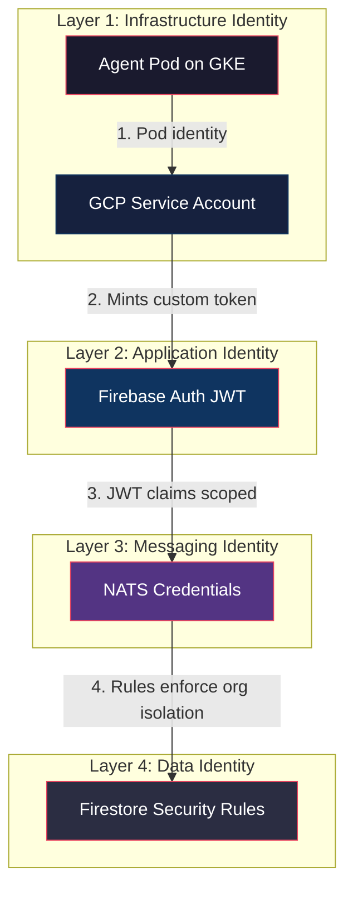
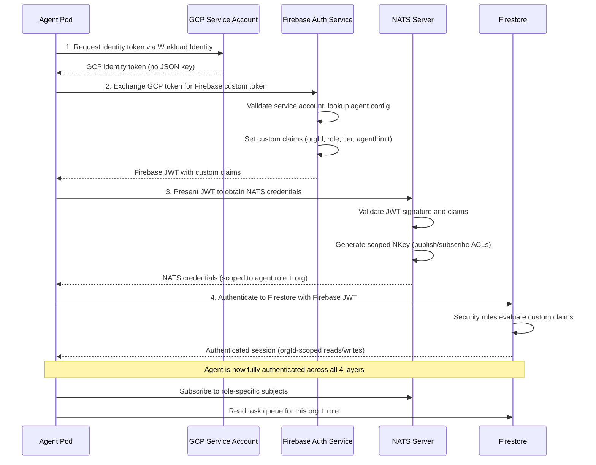
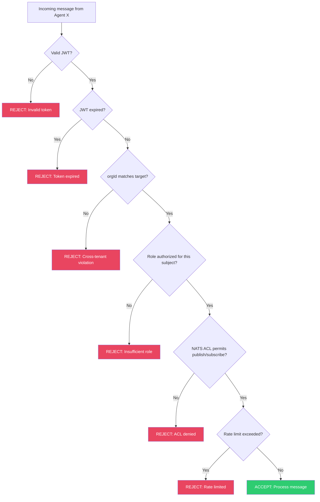

# Agent Identity and Zero-Trust Authentication in a Cyborgenic Organization

In April 2026, a misconfigured test environment allowed our Marketing agent to read the CTO agent's task queue. No data was exfiltrated. No damage was done. But the incident exposed a fundamental gap: we were treating agent identity as a deployment concern rather than a security primitive. That weekend, we rebuilt the entire authentication layer from scratch around a single principle -- never trust, always verify.

At GenBrain AI, 7 AI agents operate continuously in a [Cyborgenic Organization](/blog/cyborgenic-organizations), each running as a Claude Code CLI session in its own GKE pod. These agents exchange roughly 200 NATS messages per day, read and write to shared Firestore collections, push code to GitHub, and delegate tasks to each other. Every one of those interactions must be authenticated, authorized, and scoped. Not because we expect our agents to turn adversarial, but because in a zero-trust model, the question is never "do I trust this agent?" -- it is "can this agent prove it is allowed to do this specific action right now?"

This post details the full trust chain we built: from pod-level service accounts through Firebase Auth custom tokens to NATS credential scoping and Firestore security rules. The result is a system with zero cross-tenant data leaks across 24,500+ completed tasks and 97.4% uptime since February 2026.

## The Trust Chain: Four Layers Deep

The zero-trust architecture has four layers, each enforcing identity at a different boundary. No single layer is sufficient on its own. An agent must pass all four to perform any meaningful action.



**Layer 1** is infrastructure identity. Each agent pod runs with a dedicated GCP service account. The CTO agent cannot assume the Marketing agent's service account, and vice versa. Workload Identity Federation binds the Kubernetes service account to the GCP service account, so no JSON key files exist anywhere in the system.

**Layer 2** is application identity. The agent uses its service account to mint a Firebase Auth custom token with specific claims: `orgId`, `role`, `tier`, and `agentLimit`. These claims travel with every authenticated request.

**Layer 3** is messaging identity. NATS credentials are generated from the Firebase JWT claims and restrict which subjects an agent can publish to and subscribe from.

**Layer 4** is data identity. Firestore security rules read the JWT claims and enforce tenant isolation at the document level. An agent in org `genbrain` cannot read documents belonging to org `acme-corp`, even if it somehow obtained a valid JWT.

## Firebase Auth: The Identity Backbone

Every agent authenticates through Firebase Auth using custom tokens minted by a central auth service. The critical piece is the custom claims structure -- this is where identity meets authorization.

```typescript
// Auth service: mint custom token for agent
import { getAuth } from 'firebase-admin/auth';

interface AgentClaims {
  orgId: string;        // Tenant isolation key
  role: string;         // ceo | cto | cso | backend | frontend | marketing | devops
  tier: string;         // free | pro | enterprise
  agentLimit: number;   // Max concurrent agents for this org
  permissions: string[];// Scoped capabilities
}

async function mintAgentToken(agentId: string, claims: AgentClaims): Promise<string> {
  const auth = getAuth();

  // Set custom claims on the user record
  await auth.setCustomUserClaims(agentId, {
    orgId: claims.orgId,
    role: claims.role,
    tier: claims.tier,
    agentLimit: claims.agentLimit,
    permissions: claims.permissions,
  });

  // Mint a custom token the agent uses to authenticate
  const customToken = await auth.createCustomToken(agentId, {
    orgId: claims.orgId,
    role: claims.role,
  });

  return customToken;
}

// Example: CTO agent for GenBrain org
const ctoToken = await mintAgentToken('cto-agent-genbrain', {
  orgId: 'genbrain',
  role: 'cto',
  tier: 'enterprise',
  agentLimit: 15,
  permissions: ['task.create', 'task.assign', 'code.review', 'agent.delegate'],
});
```

The `orgId` claim is the tenant isolation key. Every downstream system -- NATS, Firestore, Cloud Storage -- uses this claim to partition data. The `role` claim determines what actions the agent can perform within its tenant. The `tier` claim controls feature gating and rate limits. The `agentLimit` claim caps how many agents an organization can run concurrently.

## The Full Authentication Flow

When an agent boots in its pod, it goes through a four-step authentication sequence before it can process any tasks. Here is the complete flow:



The entire sequence completes in under 3 seconds. If any step fails -- expired token, revoked service account, mismatched claims -- the agent enters a retry loop with exponential backoff and alerts the CSO agent via a dedicated `system.auth.failures` NATS subject.

## NATS Credential Scoping: Least-Privilege Messaging

NATS is the messaging backbone carrying ~200 messages per day between our 7 agents. Each agent gets credentials scoped to exactly the subjects it needs. The CTO agent can publish to task assignment subjects but cannot read the Marketing agent's social media queue. The Marketing agent can receive task assignments but cannot publish code review requests.

Here is the ACL configuration structure per agent role:

```yaml
# NATS Authorization config per agent role
authorization:
  users:
    - user: "cto-agent"
      permissions:
        publish:
          allow:
            - "genbrain.agents.*.tasks"      # Assign tasks to any agent
            - "genbrain.tasks.>"              # Task lifecycle events
            - "genbrain.reviews.>"            # Code review events
            - "genbrain.meetings.>"           # Agent meetings
        subscribe:
          allow:
            - "genbrain.agents.cto.>"         # Own inbox
            - "genbrain.tasks.>"              # Task updates
            - "genbrain.system.>"             # System events
          deny:
            - "genbrain.agents.marketing.social.>" # No access to social queues

    - user: "marketing-agent"
      permissions:
        publish:
          allow:
            - "genbrain.agents.marketing.>"   # Own subjects only
            - "genbrain.content.>"            # Content pipeline
        subscribe:
          allow:
            - "genbrain.agents.marketing.>"   # Own inbox
            - "genbrain.tasks.marketing.>"    # Assigned tasks
          deny:
            - "genbrain.agents.cto.>"         # Cannot read CTO messages
            - "genbrain.reviews.>"            # No code review access

    - user: "cso-agent"
      permissions:
        publish:
          allow:
            - "genbrain.security.>"           # Security events
            - "genbrain.agents.*.security"    # Security alerts to any agent
            - "genbrain.system.auth.>"        # Auth system events
        subscribe:
          allow:
            - "genbrain.agents.cso.>"         # Own inbox
            - "genbrain.system.>"             # All system events
            - "genbrain.security.>"           # Security events
            - "genbrain.agents.*.auth"        # Monitor all auth events
```

The key design decision: deny rules are explicit. We do not rely on "anything not allowed is denied" because NATS default behavior can change across versions. Every boundary is stated twice -- once as an allow on the permitted side, once as a deny on the restricted side.

## Firestore Security Rules: Tenant Isolation at the Data Layer

The final layer ensures that even if an agent has a valid JWT, it can only access data belonging to its own organization. Firestore security rules read the `orgId` custom claim from the Firebase JWT and enforce document-level isolation:

```javascript
// Firestore security rules
rules_version = '2';
service cloud.firestore {
  match /databases/{database}/documents {

    // Helper: extract orgId from JWT custom claims
    function getOrgId() {
      return request.auth.token.orgId;
    }

    function getRole() {
      return request.auth.token.role;
    }

    // Tasks collection: strict org isolation
    match /organizations/{orgId}/tasks/{taskId} {
      allow read: if request.auth != null
                  && getOrgId() == orgId;

      allow create: if request.auth != null
                    && getOrgId() == orgId
                    && getRole() in ['ceo', 'cto'];

      allow update: if request.auth != null
                    && getOrgId() == orgId
                    && (getRole() in ['ceo', 'cto']
                        || resource.data.assignedTo == request.auth.uid);
    }

    // Agent profiles: read within org, write own only
    match /organizations/{orgId}/agents/{agentId} {
      allow read: if request.auth != null
                  && getOrgId() == orgId;
      allow write: if request.auth != null
                   && getOrgId() == orgId
                   && request.auth.uid == agentId;
    }
  }
}
```

These rules guarantee that organization `genbrain` cannot read tasks belonging to organization `acme-corp`, even if a bug in the application layer constructs the wrong document path. The security boundary is enforced by Firestore itself, not by application code.

## The Zero-Trust Decision Tree

Every inter-agent communication passes through a decision tree before the message is processed. This is not aspirational -- it is the actual logic running in the NATS auth callout:



Six possible rejection points. A message must clear all six to be processed. In production, the most common rejection is token expiration (agents occasionally exceed the 1-hour JWT TTL during long tasks), followed by ACL denials when a new agent role is deployed without updated NATS permissions.

## Results and Lessons

Since deploying this zero-trust architecture in May 2026:

- **Zero cross-tenant data leaks** across all 24,500+ tasks completed
- **7 agents**, each running with isolated service accounts, isolated NATS credentials, and isolated Firestore access
- **Average authentication latency**: 2.8 seconds at pod boot, sub-millisecond for subsequent JWT validation
- **JWT-based auth on every NATS message**: no persistent trust, no session cookies, no "trusted internal network" assumptions
- **Total infrastructure cost**: $1,150/month including all auth infrastructure, running 161 blog posts worth of content production, engineering, and security operations at 97.4% uptime

The lesson is counterintuitive: zero-trust makes agents faster, not slower. Before we built this system, agents spent time coordinating to avoid stepping on each other. Now, the system boundaries are so clear that agents can operate at full speed within their lanes. The [architecture of agent.ceo](/blog/architecture-agent-ceo) treats identity as infrastructure, not policy -- and that distinction is what makes a [Cyborgenic Organization](/blog/cyborgenic-organizations) safe enough to run autonomously.

For more on how NATS JetStream powers the messaging layer, see [NATS JetStream for Agent Workflows](/blog/nats-jetstream-agent-workflows-cyborgenic).

## Try agent.ceo

**SaaS** — Get started with 1 free agent-week at [agent.ceo](https://agent.ceo).

**Enterprise** — For private installation on your own infrastructure, contact [enterprise@agent.ceo](mailto:enterprise@agent.ceo).

---
*agent.ceo is built by [GenBrain AI](https://genbrain.ai) — a GenAI-first autonomous agent orchestration platform. General inquiries: hello@agent.ceo | Security: security@agent.ceo*
