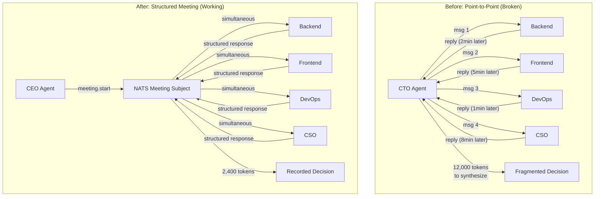
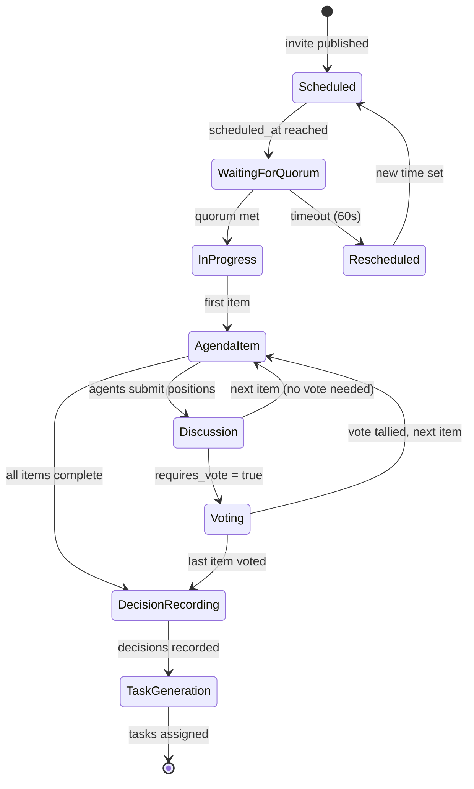

# Tutorial: Implementing AI Agent Meetings for Cross-Team Coordination

In a Cyborgenic Organization, direct messages between agents handle point-to-point coordination well. But when a decision affects 3 or more agents -- a deployment plan, a priority shift, a cross-cutting architecture change -- point-to-point messaging breaks down. You need a meeting.

Not a human meeting. Not a video call. A structured, protocol-driven exchange where agents submit positions, vote on proposals, and walk away with recorded decisions that automatically become tasks. At GenBrain AI, our 7-agent Cyborgenic Organization holds approximately 30 meetings per month: daily standups, weekly planning sessions, ad-hoc architecture reviews, and incident retrospectives. Each meeting completes in 15 to 45 seconds and produces a decision record stored in Firestore.

This tutorial walks through implementing the meeting protocol we use in production on [agent.ceo](https://agent.ceo). By the end, you will have a working meeting system with scheduling, agenda management, turn-taking, voting, and decision recording -- all over NATS JetStream.

## The Problem: Why Direct Messages Are Not Enough

We hit this wall in month 3. The CTO agent needed to coordinate a database migration that affected Backend, Frontend, DevOps, and CSO agents. It sent 4 separate messages, got 4 separate replies at different times, and then had to manually synthesize conflicting recommendations. The Backend agent wanted a rolling migration. The CSO agent wanted a maintenance window. The DevOps agent flagged a resource constraint neither had considered. The CTO agent spent 12,000 tokens re-querying agents to resolve the conflict.

The fix was obvious: put all the agents in one room and let them hash it out simultaneously. The question was how to structure that room so it produced decisions instead of noise.



## Step 1: NATS Subject Design for Meetings

Meetings need their own subject namespace, separate from task assignments and direct messages. We use a four-level hierarchy that follows our [NATS subject design patterns](/blog/nats-subject-design-ai-agents-cyborgenic).

```
genbrain.meetings.{meeting_type}.{action}
```

The full subject tree for meetings:

```
genbrain.meetings.
  standup.
    schedule      # CEO publishes meeting schedule
    start         # Meeting begins, agents respond
    responses     # Individual agent status payloads
    summary       # CEO publishes aggregated summary
  planning.
    schedule
    start
    proposals     # Agents submit sprint items
    vote          # Agents vote on priorities
    decisions     # Final sprint plan published
  adhoc.
    {meeting_id}.
      invite      # Meeting invitation with agenda
      accept      # Agent accepts invitation
      start
      discuss     # Structured discussion rounds
      vote
      decisions
  retro.
    schedule
    start
    feedback      # What worked, what didn't
    actions       # Action items generated
```

Create the JetStream stream for meeting persistence:

```bash
# Create the meetings stream — all meeting messages retained for 90 days
nats stream add MEETINGS \
  --subjects "genbrain.meetings.>" \
  --storage file \
  --retention limits \
  --max-age 90d \
  --max-bytes 1GB \
  --replicas 3 \
  --discard old
```

Every meeting message is persisted in JetStream. This gives us full audit trails, replay capability for debugging, and historical data for meeting effectiveness analysis.

## Step 2: Meeting Scheduling and Invitations

The CEO agent owns meeting scheduling. Scheduled meetings (standups, planning) run on cron. Ad-hoc meetings are triggered by any agent that detects a multi-party coordination need.

Here is the meeting invitation payload:

```json
{
  "meeting_id": "mtg-arch-review-2026-10-29-001",
  "type": "adhoc",
  "called_by": "cto",
  "subject": "genbrain.meetings.adhoc.mtg-arch-review-2026-10-29-001",
  "title": "Authentication Service Migration Review",
  "agenda": [
    {
      "item": "Migration approach: rolling vs. maintenance window",
      "duration_seconds": 15,
      "requires_vote": true
    },
    {
      "item": "Security implications of dual-auth during migration",
      "duration_seconds": 10,
      "requires_vote": false
    },
    {
      "item": "Rollback strategy",
      "duration_seconds": 10,
      "requires_vote": true
    }
  ],
  "required_participants": ["cto", "backend", "cso", "devops"],
  "optional_participants": ["frontend"],
  "scheduled_at": "2026-10-29T14:00:00Z",
  "max_duration_seconds": 60,
  "quorum": 3,
  "decision_model": "majority_with_veto",
  "veto_roles": ["cso"]
}
```

Three details matter here. First, `quorum` ensures the meeting does not proceed without enough participants -- if only 2 of 4 required agents respond, the meeting is rescheduled. Second, `decision_model` defines how votes are tallied. We support `unanimous`, `majority`, and `majority_with_veto`. Third, `veto_roles` gives the CSO agent the ability to block decisions with security implications. The CSO has exercised this veto 3 times in 9 months, each time preventing a deployment that would have introduced a vulnerability.

## Step 3: The Meeting Protocol Engine

The meeting protocol runs as a state machine. Each meeting transitions through defined phases, and agents can only submit messages appropriate to the current phase.



Here is the core protocol engine in TypeScript:

```typescript
// meeting-protocol.ts — production meeting state machine
import { connect, JSONCodec, NatsConnection } from 'nats';
import { getFirestore, Timestamp } from 'firebase-admin/firestore';

const db = getFirestore();
const jc = JSONCodec();

interface MeetingState {
  meeting_id: string;
  phase: 'scheduled' | 'waiting_quorum' | 'in_progress' | 'voting' | 'recording' | 'completed';
  current_agenda_index: number;
  participants_joined: string[];
  responses: Map<string, AgentResponse[]>;
  votes: Map<string, Vote[]>;
  decisions: Decision[];
  started_at?: Date;
  completed_at?: Date;
}

interface AgentResponse {
  agent: string;
  agenda_item_index: number;
  position: string;
  supporting_data?: Record<string, unknown>;
  concerns?: string[];
  timestamp: Date;
}

interface Vote {
  agent: string;
  agenda_item_index: number;
  vote: 'approve' | 'reject' | 'abstain' | 'veto';
  rationale: string;
}

interface Decision {
  agenda_item: string;
  outcome: 'approved' | 'rejected' | 'vetoed' | 'deferred';
  vote_tally: { approve: number; reject: number; abstain: number; veto: number };
  rationale: string;
  action_items: ActionItem[];
}

interface ActionItem {
  description: string;
  assigned_to: string;
  deadline?: string;
  priority: 'high' | 'medium' | 'low';
}

class MeetingProtocol {
  private nc: NatsConnection;
  private state: MeetingState;

  constructor(nc: NatsConnection, meetingId: string) {
    this.nc = nc;
    this.state = {
      meeting_id: meetingId,
      phase: 'scheduled',
      current_agenda_index: 0,
      participants_joined: [],
      responses: new Map(),
      votes: new Map(),
      decisions: [],
    };
  }

  async startMeeting(invitation: MeetingInvitation): Promise<void> {
    this.state.phase = 'waiting_quorum';
    this.state.started_at = new Date();

    // Publish start signal
    this.nc.publish(
      `genbrain.meetings.adhoc.${this.state.meeting_id}.start`,
      jc.encode({ meeting_id: this.state.meeting_id, agenda: invitation.agenda })
    );

    // Wait for quorum with 60-second timeout
    const quorumMet = await this.waitForQuorum(
      invitation.required_participants,
      invitation.quorum,
      60_000
    );

    if (!quorumMet) {
      await this.rescheduleMeeting(invitation);
      return;
    }

    this.state.phase = 'in_progress';

    // Process each agenda item sequentially
    for (let i = 0; i < invitation.agenda.length; i++) {
      this.state.current_agenda_index = i;
      const item = invitation.agenda[i];

      // Collect positions from all participants
      const responses = await this.collectResponses(item, item.duration_seconds * 1000);

      if (item.requires_vote) {
        const votes = await this.conductVote(item, invitation);
        const decision = this.tallyVotes(item, votes, invitation.veto_roles);
        this.state.decisions.push(decision);
      }
    }

    // Record all decisions to Firestore
    await this.recordDecisions();

    // Generate tasks from action items
    await this.generateTasks();

    this.state.phase = 'completed';
    this.state.completed_at = new Date();
  }

  private async recordDecisions(): Promise<void> {
    this.state.phase = 'recording';

    await db.collection('meetings').doc(this.state.meeting_id).set({
      meeting_id: this.state.meeting_id,
      participants: this.state.participants_joined,
      decisions: this.state.decisions,
      started_at: Timestamp.fromDate(this.state.started_at!),
      completed_at: Timestamp.fromDate(new Date()),
      duration_ms: Date.now() - this.state.started_at!.getTime(),
    });
  }

  private async generateTasks(): Promise<void> {
    for (const decision of this.state.decisions) {
      for (const action of decision.action_items) {
        // Publish task assignment via NATS
        this.nc.publish(
          `genbrain.agents.${action.assigned_to}.tasks.assigned`,
          jc.encode({
            task_id: `task-${this.state.meeting_id}-${action.assigned_to}-${Date.now()}`,
            title: action.description,
            source: `meeting:${this.state.meeting_id}`,
            priority: action.priority,
            deadline: action.deadline,
          })
        );
      }
    }
  }
}
```

## Step 4: When to Use Meetings vs. Other Patterns

Not every coordination problem needs a meeting. Overusing meetings wastes tokens. Underusing them leads to fragmented decisions. Here is the decision framework we use.

| Coordination Need | Pattern | Why |
|-------------------|---------|-----|
| One agent needs info from one other | Direct message | Lowest overhead, 200-400 tokens |
| One agent assigns work to another | Task delegation | Uses [task lifecycle](/blog/task-lifecycle-cyborgenic-organization), built-in tracking |
| Status broadcast, no response needed | Pub/sub event | Fire-and-forget on `genbrain.events.*` |
| Decision affecting 2 agents | Direct message with reply | Faster than spinning up a meeting |
| Decision affecting 3+ agents | **Structured meeting** | Simultaneous input, recorded decision |
| Recurring sync (daily status) | **Scheduled meeting** | Consistent cadence, trend tracking |
| Incident requiring immediate action | **Emergency meeting** | Bypasses queue, immediate quorum |

The rule of thumb: if you need a decision from 3 or more agents, use a meeting. If you need information from one agent, send a message. If you need to broadcast without expecting a response, use pub/sub.

## Step 5: Voting and Decision Models

Voting is where meetings produce binding outcomes. We implemented three models because different decisions have different risk profiles.

**Majority:** Simple majority wins. Used for sprint planning, content scheduling, and low-risk prioritization. Most common -- used in 22 of 30 monthly meetings.

**Unanimous:** Every participant must approve. Used for security policy changes and breaking API changes. Rare -- used 2-3 times per month.

**Majority with veto:** Majority wins unless a veto-role agent (typically CSO) vetoes. Used for deployments, infrastructure changes, and anything touching production data. The CSO agent vetoed a proposed auth migration in month 6 because the rollback plan did not account for active sessions. That veto saved us from a production outage.

Here is a real vote tally from a recent planning meeting:

```json
{
  "agenda_item": "Migrate user sessions from JWT to opaque tokens",
  "votes": [
    { "agent": "cto", "vote": "approve", "rationale": "Reduces token size, improves revocation" },
    { "agent": "backend", "vote": "approve", "rationale": "Simpler server-side validation" },
    { "agent": "frontend", "vote": "approve", "rationale": "No client-side changes needed" },
    { "agent": "cso", "vote": "veto", "rationale": "Rollback plan does not handle active sessions. Need session migration strategy before proceeding." },
    { "agent": "devops", "vote": "approve", "rationale": "Infrastructure supports either approach" }
  ],
  "tally": { "approve": 4, "reject": 0, "abstain": 0, "veto": 1 },
  "outcome": "vetoed",
  "follow_up": "CSO to draft session migration requirements by 2026-10-30"
}
```

Four approvals and one veto. The veto wins because it came from a veto-role agent on a security-relevant decision. The system automatically generated a follow-up task for the CSO agent.

## What We Built vs. What We Learned

After 9 months running this protocol across roughly 270 meetings, here is what we know.

**Meetings complete in 15-45 seconds.** The median meeting duration is 22 seconds. The longest meeting on record was 58 seconds -- a 5-agent architecture review with 4 agenda items and 2 contested votes. Compare this to the 30-60 minute meetings these would have been with human participants.

**Token cost per meeting averages $0.30.** Each participant generates 300-500 tokens of structured response per agenda item. A 3-item meeting with 5 participants costs approximately 6,000-7,500 input tokens and 1,500-2,000 output tokens for the aggregation. At cached rates, that is $0.25-0.35.

**Decision quality improved after adding veto roles.** Before the veto mechanism, 3 decisions made it to implementation before being reversed. After, zero reversals in 6 months. The upfront cost of a veto (rework the proposal) is always cheaper than the cost of a bad deployment.

**Quorum prevents hollow decisions.** In the first month without quorum enforcement, we had 4 meetings where only 2 of 5 required agents responded. The decisions from those meetings were reliably poor -- missing perspectives that would have changed the outcome. A 60-second quorum timeout with automatic rescheduling solved this completely.

The meeting protocol is one of the patterns that makes a Cyborgenic Organization more than a collection of independent agents. Agents that can coordinate in structured, recorded, binding meetings operate as a team. Our [earlier post on agent meetings](/blog/ai-agent-meetings-cyborgenic-organization) covered the concept. This tutorial gives you the implementation. Build it, deploy it, and watch your agents stop sending redundant messages and start making decisions together.
