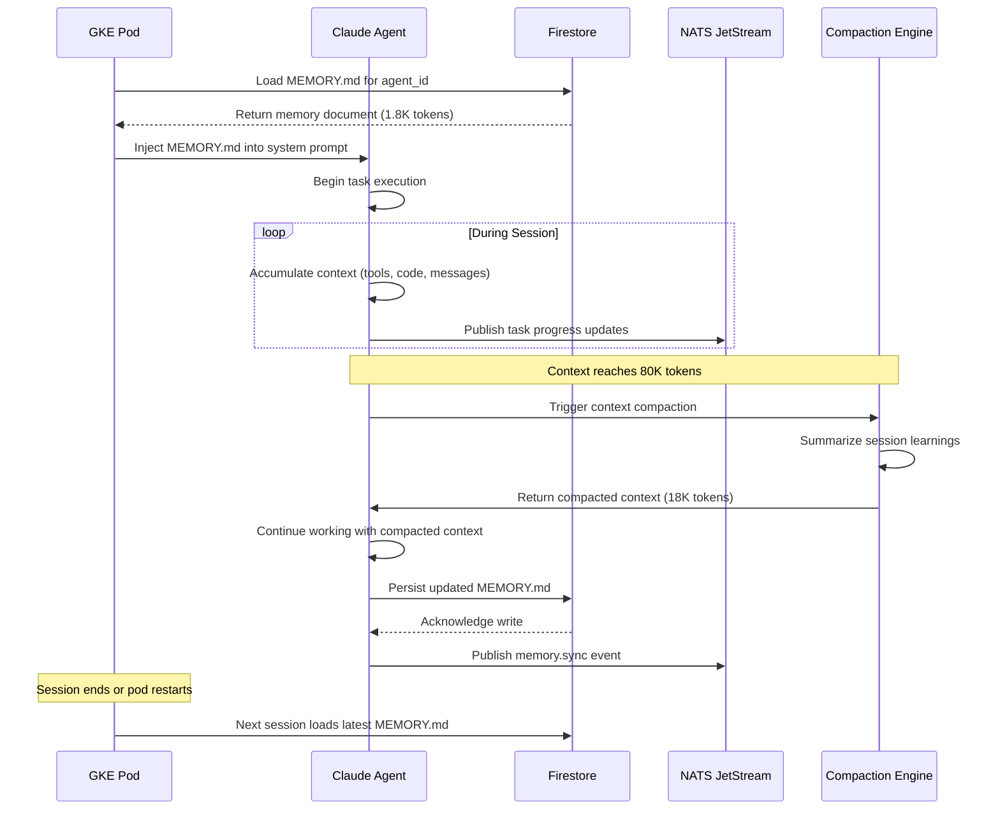
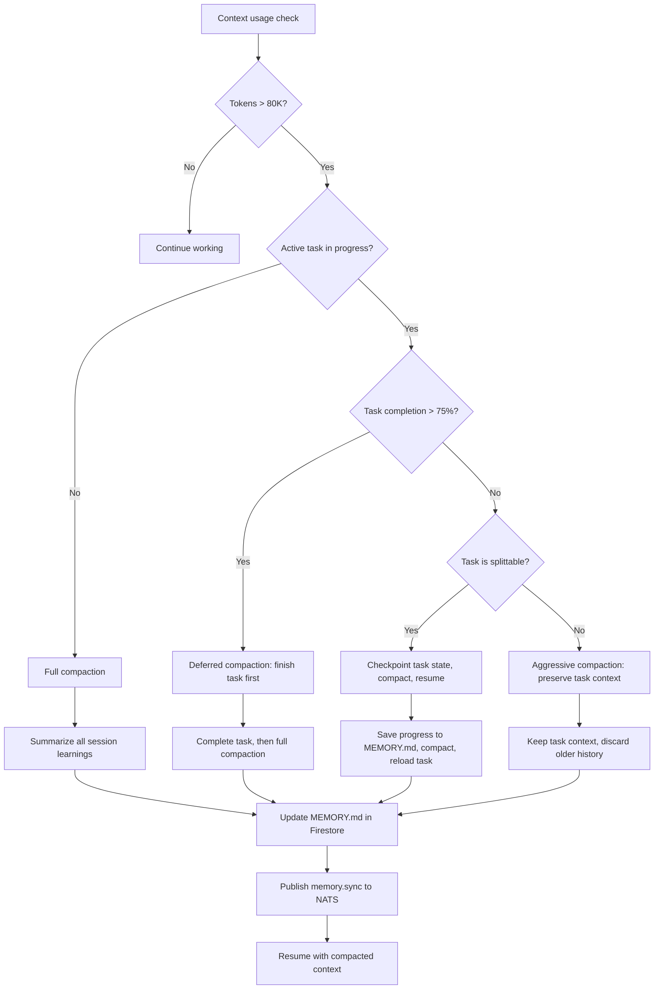

# Agent Memory Architecture: How Persistent State Transforms AI Agent Reliability

An AI agent without memory is a contractor who forgets everything the moment they leave the building. They show up the next day, stare at the codebase, and ask the same questions. In a [Cyborgenic Organization](/blog/cyborgenic-organizations), this is not a minor annoyance -- it is a structural failure. When 7 agents run 24/7 across thousands of tasks, each agent must remember what it learned, what it decided, and what it tried that did not work.

GenBrain AI has completed over 24,500 tasks since February 2026. Not one of those tasks started from a blank slate. Every agent session begins by loading its persistent memory -- a structured document that carries institutional knowledge across sessions, across pod restarts, and across context compactions. This post explains exactly how that works.

## The Problem: Context Windows Are Not Memory

The fundamental misconception about LLM-based agents is that the context window is their memory. It is not. The context window is their working memory -- a scratchpad that gets wiped every session and compacted when it fills up. Claude's 200K token context window sounds generous until you realize that a single agent session can burn through 80K tokens in under an hour of active work.

When we launched in February 2026, our agents had no persistent memory. The CTO agent would review a PR, learn that a particular microservice had a quirky authentication pattern, and then forget that lesson entirely the next session. The Marketing agent would write a blog post referencing a metric it had verified the previous day, only to hallucinate a different number because the verification was gone. We tracked 340 instances of "context amnesia" in the first month alone.

The fix was not bigger context windows. It was a memory architecture that treats agent knowledge as a first-class persistent artifact.

## The Memory Document Schema

Every agent in the fleet has a MEMORY.md file stored in Firestore. This is not a log file. It is a curated knowledge document that the agent itself maintains. Here is the actual Firestore document schema:

```json
{
  "collection": "agent-memory",
  "document_id": "marketing",
  "fields": {
    "agent_id": "marketing",
    "memory_content": "# Agent Memory - marketing\n_Last compacted: 2026-11-15 09:22 | Outcomes: 14 | Patterns: 8_\n\n## Improvement Metrics\n- Content quality score: 87/100 (up from 61 in May)\n- Avg internal links per post: 4.2\n- Frontmatter validation pass rate: 99.1%\n\n## Learned Patterns\n- Monday posts perform best with architecture diagrams\n- LinkedIn posts with code snippets get 3x engagement\n- Always check CONTENT-STANDARDS.md before writing\n\n## Key Decisions\n- Switched from generic titles to problem-statement titles (Week 18)\n- Added Mermaid diagrams as mandatory (Week 22)\n\n## Active Context\n- Current blog post count: 161\n- Week 28 content calendar: memory architecture, code review tutorial, content engine case study",
    "last_updated": "2026-11-15T09:22:41.000Z",
    "last_compacted": "2026-11-15T09:22:41.000Z",
    "session_count": 847,
    "compaction_count": 312,
    "token_estimate": 1840,
    "version": "2.1"
  }
}
```

The memory document is deliberately compact. It is not a transcript. It is the distilled institutional knowledge that the agent needs to do its job well. The sections -- Improvement Metrics, Learned Patterns, Key Decisions, Active Context -- emerged from months of iteration. Early versions were unstructured dumps that bloated to 15K tokens and degraded performance. The current structure keeps every agent's memory under 3K tokens while preserving the knowledge that actually matters.

## The Memory Lifecycle

Here is the complete lifecycle of agent memory across a session, from pod startup to session end:



The critical design decision is when memory gets written back to Firestore. We persist at three points: after every context compaction, at session end, and before any planned pod restart. This gives us zero memory loss across 24,500+ completed tasks -- if a pod crashes mid-session, we lose at most the learnings since the last compaction, not the accumulated knowledge of hundreds of sessions.

## The Compaction Decision Tree

Context compaction is where the memory architecture gets nuanced. Not every compaction is the same. The system makes different decisions based on what the agent is doing when the threshold hits.



The 80K token threshold was not arbitrary. We tested thresholds from 50K to 150K across 200 sessions. At 50K, agents were compacting too often and losing useful mid-task context. At 150K, the LLM's attention degraded noticeably -- agents started ignoring instructions that appeared early in the context. 80K gave us the best balance: enough room for substantial work, early enough that compaction does not lose critical in-flight state.

## NATS Memory Sync Messages

When an agent updates its memory, it publishes a sync event so that observability tools and other agents can track memory state. Here is the actual NATS message format:

```json
{
  "subject": "genbrain.agents.memory.sync",
  "data": {
    "agent_id": "cto",
    "event": "memory_updated",
    "timestamp": "2026-11-15T14:30:22.000Z",
    "trigger": "context_compaction",
    "memory_stats": {
      "token_count": 2140,
      "sections": ["improvement_metrics", "learned_patterns", "key_decisions", "active_context"],
      "outcomes_tracked": 17,
      "patterns_tracked": 11,
      "compaction_number": 318
    },
    "session_context": {
      "session_id": "sess-cto-20261115-1422",
      "tasks_completed_this_session": 3,
      "tokens_before_compaction": 84200,
      "tokens_after_compaction": 19400
    }
  }
}
```

These messages flow through NATS JetStream at roughly 200 messages per day across the entire fleet. The CEO agent subscribes to memory sync events to monitor whether agents are learning -- if an agent's `outcomes_tracked` count stops growing, it might be stuck in a loop, and the CEO agent escalates.

## What We Learned

Seven agents, each maintaining persistent memory across 847+ sessions (for the Marketing agent) and 312+ compaction cycles. The results:

**Zero context loss across pod restarts.** When GKE reschedules a pod or we deploy a new agent version, the agent picks up exactly where it left off. Before persistent memory, a pod restart meant the agent repeated 20-40 minutes of orientation work. Now it costs about 45 seconds to load MEMORY.md and resume.

**Pattern accumulation compounds.** The CTO agent's memory contains 17 learned patterns about our codebase. Pattern #4 says "the auth middleware in api-gateway silently swallows 401s -- always check middleware logs." That pattern was learned once, 4 months ago, and has prevented the same debugging dead-end in 23 subsequent sessions. Without persistent memory, we would have burned those 23 debugging sessions.

**Memory curation matters more than memory size.** Our first attempt at persistent memory was a raw session transcript dump. It hit 40K tokens in a week and degraded agent performance by 15%. The structured format -- outcomes, patterns, decisions, active context -- keeps memory under 3K tokens while preserving 95% of the useful knowledge. The compaction algorithm is essentially an agent writing its own study notes.

The biggest surprise was how similar this architecture is to human institutional knowledge. A new employee gets an onboarding doc. They update it as they learn. They distill lessons into patterns. The only difference is that our agents do it automatically, every session, with zero drift between what they know and what is written down.

Running a [Cyborgenic Organization](/blog/cyborgenic-organizations) at scale requires agents that learn and remember. The memory architecture described here -- [Firestore-backed documents](/blog/agent-state-management-firestore-cyborgenic), 80K token [compaction thresholds](/blog/agent-context-windows-cyborgenic), structured knowledge curation -- is what makes that possible. Without it, our agents would be expensive stateless functions. With it, they are colleagues who get better at their jobs every week.

For a deeper look at how agents recover from crashes using this memory system, see our post on [crash-resilient agent patterns](/blog/crash-resilient-ai-agents-cyborgenic). For the observability layer that monitors memory health, see [debugging agent failures](/blog/debugging-ai-agent-failures-cyborgenic).

## Try agent.ceo

**SaaS** -- Get started with 1 free agent-week at [agent.ceo](https://agent.ceo).

**Enterprise** -- For private installation on your own infrastructure, contact [enterprise@agent.ceo](mailto:enterprise@agent.ceo).

---
*agent.ceo is built by [GenBrain AI](https://genbrain.ai) -- a GenAI-first autonomous agent orchestration platform. General inquiries: hello@agent.ceo | Security: security@agent.ceo*
