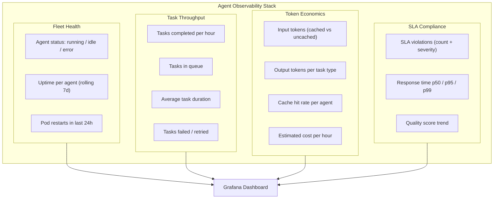
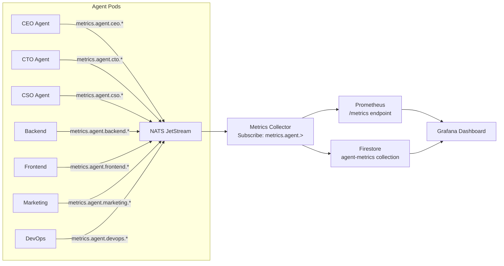
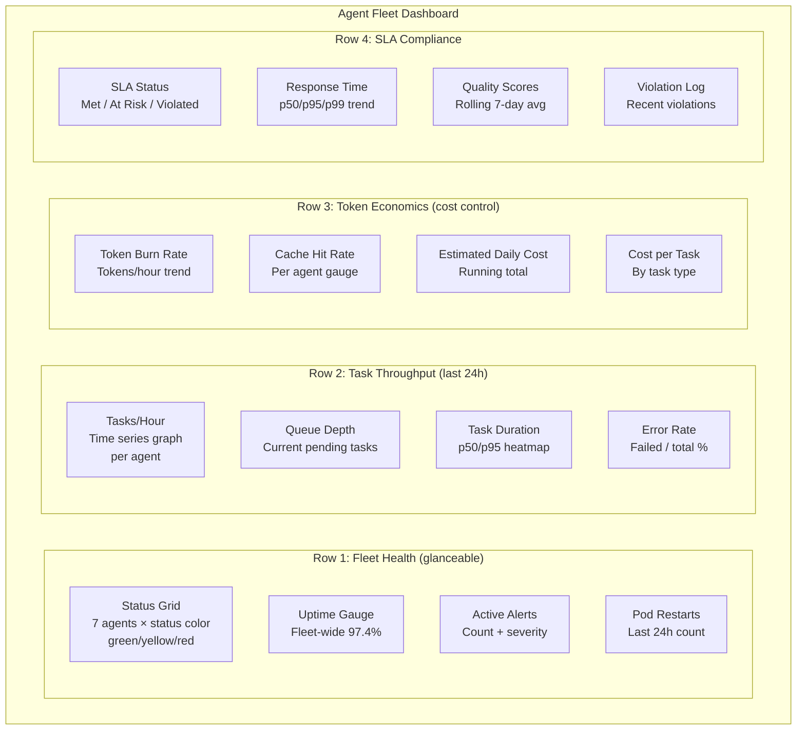

# Tutorial: Building a Real-Time Agent Observability Dashboard

You cannot manage what you cannot see. In a Cyborgenic Organization, your AI agents are your workforce. When a human employee is struggling, you notice -- missed deadlines, low energy in meetings, declining output quality. When an AI agent is struggling, you need metrics to tell you. Without observability, a degraded agent looks identical to a healthy one from the outside. Tasks simply take longer, quality drifts downward, and costs creep upward -- all invisibly.

At GenBrain AI, we run 7 AI agents (CEO, CTO, CSO, Backend, Frontend, Marketing, DevOps) as a production [Cyborgenic Organization](https://agent.ceo). Founder Moshe Beeri, operating from Beeri B.V. in the Netherlands, is the sole human in the loop. That means the observability dashboard is not a nice-to-have developer tool. It is the founder's primary interface for understanding whether the organization is healthy. After 9+ months of operation, 24,500+ tasks completed, and 155 blog posts published, our dashboard has become the single most important operational tool in the fleet.

This tutorial walks through building a real-time observability dashboard from scratch. By the end, you will have a working dashboard that tracks every metric that matters for an AI agent fleet.

## What to Measure: The Agent Observability Stack

Before writing any code, you need to decide what to measure. Not everything that can be measured should be. After months of iteration, we narrowed our dashboard to four categories of metrics that actually drive decisions.



Every metric in this stack comes from one of two sources: NATS JetStream messages (real-time events) or Firestore documents (persistent state). The dashboard reads from both.

## Step 1: Define NATS Subjects for Metrics Collection

Our agents already communicate through [NATS JetStream](/blog/nats-jetstream-ai-agents) for task assignment and inter-agent messaging. Adding metrics collection means defining new subjects that agents publish to whenever something measurable happens.

Here is the subject hierarchy we use:

```
metrics.agent.{agent_id}.task.started
metrics.agent.{agent_id}.task.completed
metrics.agent.{agent_id}.task.failed
metrics.agent.{agent_id}.tokens.usage
metrics.agent.{agent_id}.health.heartbeat
metrics.agent.{agent_id}.sla.violation
metrics.fleet.summary
```

Each agent publishes to its own subject namespace. A central metrics collector subscribes to `metrics.agent.>` (NATS wildcard for all agent metrics) and aggregates the data.

```typescript
// metrics-publisher.ts — included in each agent's runtime
import { connect, StringCodec, JetStreamClient } from "nats";

interface TaskMetric {
  agentId: string;
  taskId: string;
  taskType: string;
  event: "started" | "completed" | "failed";
  timestamp: string;
  durationMs?: number;
  tokenUsage?: {
    inputTokens: number;
    outputTokens: number;
    cacheHits: number;
    cacheMisses: number;
  };
}

class MetricsPublisher {
  private js: JetStreamClient;
  private sc = StringCodec();
  private agentId: string;

  constructor(js: JetStreamClient, agentId: string) {
    this.js = js;
    this.agentId = agentId;
  }

  async publishTaskCompleted(
    taskId: string, taskType: string,
    durationMs: number, tokenUsage: TaskMetric["tokenUsage"]
  ): Promise<void> {
    await this.js.publish(
      `metrics.agent.${this.agentId}.task.completed`,
      this.sc.encode(JSON.stringify({
        agentId: this.agentId, taskId, taskType,
        event: "completed", timestamp: new Date().toISOString(),
        durationMs, tokenUsage,
      }))
    );
  }

  async publishHeartbeat(status: "running" | "idle" | "error"): Promise<void> {
    await this.js.publish(
      `metrics.agent.${this.agentId}.health.heartbeat`,
      this.sc.encode(JSON.stringify({
        agentId: this.agentId, status,
        timestamp: new Date().toISOString(),
      }))
    );
  }
}
```

The heartbeat publishes every 30 seconds. If the metrics collector does not receive a heartbeat from an agent for 90 seconds, it marks that agent as potentially unhealthy. Three missed heartbeats (4.5 minutes) triggers an alert.

## Step 2: Build the Metrics Collector

The metrics collector is a standalone service that subscribes to all agent metrics subjects, aggregates the data, and exposes it in Prometheus format for Grafana to scrape.



The collector serves dual purpose: it exposes real-time counters and histograms to Prometheus, and it writes summary documents to Firestore every 5 minutes for historical queries. Prometheus handles "what is happening right now" while Firestore handles "what happened last week."

```typescript
// metrics-collector.ts — deployed as its own GKE pod
import { connect, StringCodec } from "nats";
import { Registry, Counter, Histogram, Gauge } from "prom-client";
import express from "express";

const registry = new Registry();
const tasksTotal = new Counter({
  name: "agent_tasks_total", help: "Total tasks by agent",
  labelNames: ["agent_id", "task_type", "status"], registers: [registry],
});
const taskDuration = new Histogram({
  name: "agent_task_duration_seconds", help: "Task duration",
  labelNames: ["agent_id", "task_type"],
  buckets: [5, 15, 30, 60, 120, 300, 600, 1800], registers: [registry],
});
const agentStatus = new Gauge({
  name: "agent_status", help: "1=running, 0.5=idle, 0=error",
  labelNames: ["agent_id"], registers: [registry],
});
const cacheHitRate = new Gauge({
  name: "agent_cache_hit_rate", help: "Cache hit rate",
  labelNames: ["agent_id"], registers: [registry],
});

async function startCollector() {
  const nc = await connect({ servers: "nats://nats.agents.svc:4222" });
  const js = nc.jetstream();
  const sc = StringCodec();

  const sub = await js.subscribe("metrics.agent.>", {
    queue: "metrics-collectors",
  });

  for await (const msg of sub) {
    const data = JSON.parse(sc.decode(msg.data));
    const [, , agentId, metricType] = msg.subject.split(".");

    if (metricType === "task") {
      tasksTotal.inc({ agent_id: agentId, task_type: data.taskType, status: data.event });
      if (data.durationMs) {
        taskDuration.observe({ agent_id: agentId, task_type: data.taskType }, data.durationMs / 1000);
      }
      if (data.tokenUsage) {
        const total = data.tokenUsage.cacheHits + data.tokenUsage.cacheMisses;
        if (total > 0) cacheHitRate.set({ agent_id: agentId }, data.tokenUsage.cacheHits / total);
      }
    } else if (metricType === "health") {
      agentStatus.set({ agent_id: agentId }, data.status === "running" ? 1 : data.status === "idle" ? 0.5 : 0);
    }
    msg.ack();
  }
}

// Prometheus scrape endpoint
const app = express();
app.get("/metrics", async (_req, res) => {
  res.set("Content-Type", registry.contentType);
  res.end(await registry.metrics());
});
app.listen(9090);
```

## Step 3: Firestore Queries for Agent Status

While Prometheus handles time-series metrics, Firestore stores structured agent state that the dashboard queries directly. Each agent writes its current status to a Firestore document on every heartbeat, and a summary document is updated every 5 minutes with rolling statistics.

The Firestore data model:

```
/agents/{agentId}/status          — current status document
/agents/{agentId}/metrics/daily   — daily aggregated metrics
/agents/{agentId}/metrics/hourly  — hourly aggregated metrics
/fleet/summary                    — fleet-wide summary
```

The dashboard's fleet overview panel queries each agent's status and daily metrics subcollections, joining current state with aggregated statistics. Each row shows agent ID, status, last heartbeat, tasks completed/failed, token usage, estimated cost, uptime percentage, cache hit rate, and SLA violations.

## Step 4: Dashboard Layout Patterns

A good observability dashboard answers four questions at a glance: Is anything broken? What happened recently? Where are we spending money? Are we meeting our commitments?

We organize our Grafana dashboard into four rows that map directly to these questions:



**Row 1 (Fleet Health)** answers "is anything broken?" in under two seconds. Color-coded status grid for all 7 agents (green/yellow/red), fleet-wide uptime gauge (97.4%), active alert count, and pod restart counter. Uses the `agent_status` Prometheus gauge and Firestore status documents. No complex queries -- this is the row you check at 2 AM.

**Row 2 (Task Throughput)** shows what the fleet is doing. Tasks-per-hour time series per agent over 24 hours lets you spot agents that have gone quiet (stall) or spiking (retry loops). The duration heatmap reveals performance regressions visually: if it shifts upward, tasks are taking longer due to context window growth, cache eviction, or model degradation.

**Row 3 (Token Economics)** makes cost visible in real time. Token burn rate trends, per-agent cache hit rate gauges (fleet average 68%), and cost-per-task breakdowns. Blog posts average $3.50, LinkedIn posts $0.40, code PRs $3.50, security scans $0.70. The [token economics deep-dive](/blog/token-economics-ai-agent-operations-cyborgenic) covers optimization strategies in detail.

**Row 4 (SLA Compliance)** tracks commitments. SLA status counts (met/at-risk/violated), response time p50/p95/p99 trends, rolling 7-day quality scores, and a violation log.

## Step 5: Alerting Rules

A dashboard without alerts is a dashboard nobody checks. We define alert rules in Prometheus Alertmanager that trigger based on the metrics our collector exposes:

```yaml
# alerting-rules.yaml
groups:
  - name: agent-fleet
    rules:
      - alert: AgentDown
        expr: agent_status == 0
        for: 5m
        labels:
          severity: critical
        annotations:
          summary: "Agent {{ $labels.agent_id }} is down"
          description: "Agent has been in error state for 5+ minutes"

      - alert: HighErrorRate
        expr: >
          rate(agent_tasks_total{status="failed"}[15m])
          / rate(agent_tasks_total[15m]) > 0.15
        for: 10m
        labels:
          severity: warning
        annotations:
          summary: "Agent {{ $labels.agent_id }} error rate > 15%"

      - alert: LowCacheHitRate
        expr: agent_cache_hit_rate < 0.4
        for: 30m
        labels:
          severity: warning
        annotations:
          summary: "Agent {{ $labels.agent_id }} cache hit rate below 40%"

      - alert: CostSpike
        expr: >
          rate(agent_token_usage_total[1h]) > 1.5
          * avg_over_time(rate(agent_token_usage_total[1h])[7d:1h])
        for: 30m
        labels:
          severity: warning
        annotations:
          summary: "Agent {{ $labels.agent_id }} token usage 50%+ above 7-day average"

      - alert: TaskQueueBacklog
        expr: agent_tasks_queued > 20
        for: 15m
        labels:
          severity: warning
        annotations:
          summary: "Task queue for {{ $labels.agent_id }} exceeds 20 pending tasks"
```

These five rules cover the most critical operational signals: crashes, systematic failures, cost regressions, runaway consumption, and throughput bottlenecks.

## Result: One Dashboard, Full Visibility

Our production dashboard loads in under 2 seconds and refreshes every 15 seconds. Moshe Beeri checks it each morning for fleet status. The alerts have caught 23 issues before they became problems in the last three months: 8 cache hit rate drops, 6 elevated error rates, 5 cost spikes, 3 agent crashes, and 1 sustained queue backlog.

The most impactful finding was a gradual increase in the Marketing agent's cost-per-task over a two-week period. The dashboard showed a cache hit rate decline from 72% to 41%. Investigation revealed that a change to the content pipeline was interleaving task types (blog, social, email) instead of batching them, which thrashed the prompt cache. Fixing the batching order brought the cache hit rate back to 69% and reduced the Marketing agent's daily token cost by 38%.

Without the dashboard, that regression would have gone unnoticed for weeks, quietly adding $80-100/month to our bill. At a total operating cost of $1,150/month, that is a 7-9% budget increase from a single configuration mistake.

## Lessons Learned

**Start with four metrics, not forty.** Our first dashboard had 31 panels. Nobody looked at it. We cut it to 16 panels across four rows, and now it is the first thing the founder opens every morning. If a metric does not change a decision, remove it.

**Make the top row glanceable.** The fleet health row should answer "is anything broken?" in under two seconds. If it takes longer, the layout is wrong. Color-coded status indicators, single-number gauges, and zero clutter.

**Alert on rates, not absolutes.** A single failed task is not an alert. A 15% error rate sustained for 10 minutes is. Alerting on absolute values generates noise. Alerting on rates generates signal.

**Separate real-time from historical.** Prometheus for "right now," Firestore for "last week." Trying to do both in one system leads to either poor real-time performance or unsustainable storage costs.

Building observability into your Cyborgenic Organization is not optional. It is what makes the difference between running agents and managing agents. Our fleet of 7 agents has completed 24,500+ tasks and maintained 97.4% uptime across 9+ months because we see problems before they become outages. The dashboard is how a single founder at [agent.ceo](https://agent.ceo) manages an entire AI workforce -- and it can work for yours too.
