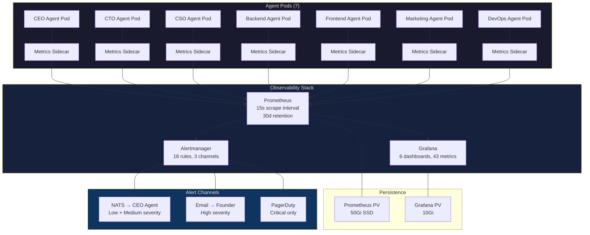
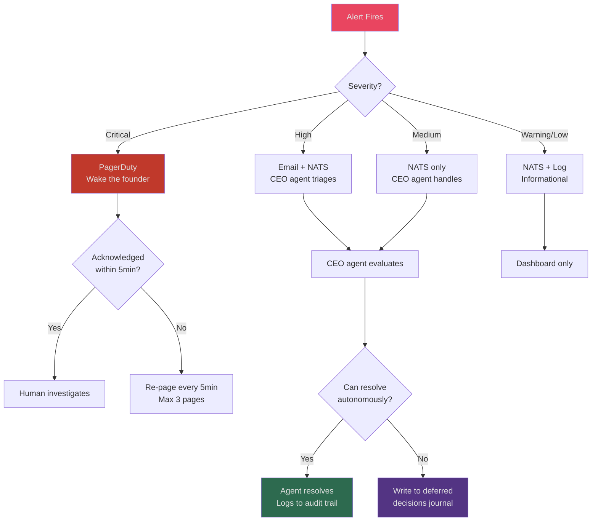

# Building an Agent Observability Stack with Prometheus and Grafana

We came back from holiday autonomous mode on January 2 and the first thing we did was open Grafana. Not to check if anything was broken -- the [deferred decisions journal](/blog/post-holiday-deferred-decisions-cyborgenic) had already told us everything was fine. We opened Grafana to understand 14 days of fleet behavior without human interference. The dashboards showed patterns we had never seen during normal operations.

This post documents our complete agent observability stack: the 43 custom Prometheus metrics we export, the 6 Grafana dashboards we built, the 18 alert rules that kept us informed during the holiday, and the architectural decisions behind all of it. Everything here runs on our GKE Autopilot cluster alongside the 7-agent fleet.

We first covered agent monitoring basics in the [real-time agent monitoring](/blog/real-time-agent-monitoring) post from May 2026. That post described the general approach. This post is the specific implementation we run today, after 8 months of iteration.

## Architecture Overview

The observability stack sits alongside the agent fleet in the same GKE cluster. Each agent pod exports metrics via a sidecar container that scrapes agent session data and exposes it on a `/metrics` endpoint. Prometheus scrapes those endpoints every 15 seconds. Grafana reads from Prometheus and renders 6 dashboards. Alertmanager routes alerts through three channels depending on severity.



The key design choice: alerts go to the CEO agent first, not the founder. During normal operations, the CEO agent triages alerts and only escalates to the founder when an alert exceeds agent authority. During [holiday autonomous mode](/blog/holiday-autonomous-operations-cyborgenic), all alerts go to the CEO agent, which either resolves them or writes them to the deferred decisions journal.

## The 43 Custom Metrics

We export 43 custom metrics beyond the standard Kubernetes metrics (CPU, memory, network). These fall into 5 categories: agent health, task execution, token economics, communication, and quality signals. Here are the ones that matter most, with the actual Prometheus metric names we use.

### Agent Health Metrics (9 metrics)

```promql
# Core health — these are the metrics we watch first on any dashboard
agent_heartbeat_timestamp{agent="ceo"}                    # Unix timestamp of last heartbeat
agent_session_uptime_seconds{agent="ceo"}                 # Seconds since last session restart
agent_context_window_utilization_ratio{agent="marketing"}  # 0.0-1.0, triggers compaction alert at 0.85
agent_compaction_events_total{agent="cto"}                 # Counter, spikes indicate context pressure
agent_restart_count_total{agent="backend"}                 # Counter, should be low
agent_tool_call_errors_total{agent="cso", tool="bash"}     # Counter by tool type
agent_mcp_connection_status{agent="devops", server="agent-hub"}  # Gauge: 1=connected, 0=disconnected
agent_authority_level{agent="ceo"}                         # Gauge: 2=normal, 3=holiday mode
agent_idle_seconds{agent="frontend"}                       # Seconds since last meaningful output
```

The `agent_idle_seconds` metric is our primary detection mechanism for silent stalls. During normal operations, no agent should be idle for more than 300 seconds (5 minutes). An agent that is running but not producing output is almost certainly stuck in a reasoning loop or waiting on a failed tool call. We wrote about diagnosing these in the [debugging guide](/blog/debugging-ai-agent-failures-cyborgenic).

### Task Execution Metrics (11 metrics)

```promql
# Task lifecycle tracking
agent_tasks_completed_total{agent="backend", status="success"}     # Counter
agent_tasks_completed_total{agent="backend", status="failed"}      # Counter
agent_tasks_completed_total{agent="backend", status="deferred"}    # Counter
agent_task_duration_seconds_bucket{agent="marketing", le="300"}    # Histogram, 5-min bucket
agent_task_duration_seconds_bucket{agent="marketing", le="900"}    # 15-min bucket
agent_task_duration_seconds_bucket{agent="marketing", le="1800"}   # 30-min bucket
agent_task_duration_seconds_bucket{agent="marketing", le="3600"}   # 60-min bucket
agent_task_queue_depth{agent="cto"}                                # Gauge, current pending tasks
agent_task_sla_violations_total{agent="devops"}                    # Counter
agent_task_retries_total{agent="cso"}                              # Counter
agent_deferred_decisions_total{agent="ceo", category="strategic"}  # Counter by category
```

The task duration histogram is where we catch performance regressions. During normal operations, 82% of tasks complete within 15 minutes. During the holiday period, that number improved to 89% -- another data point confirming that agents work more efficiently without human interrupts.

### Token Economics Metrics (10 metrics)

These metrics feed directly into our [token economics](/blog/token-economics-ai-agent-operations-cyborgenic) analysis and cost dashboards.

```promql
# Token consumption and cost tracking
agent_tokens_input_uncached_total{agent="marketing"}    # Counter
agent_tokens_input_cache_hit_total{agent="marketing"}   # Counter
agent_tokens_input_cache_write_total{agent="marketing"} # Counter
agent_tokens_output_total{agent="marketing"}            # Counter
agent_cache_hit_ratio{agent="marketing"}                # Gauge, 0.0-1.0
agent_estimated_cost_usd{agent="marketing", window="1h"} # Gauge, rolling 1-hour cost
agent_estimated_cost_usd{agent="marketing", window="24h"} # Gauge, rolling 24-hour cost
agent_compaction_tokens_saved{agent="cto"}              # Counter
agent_prompt_size_tokens{agent="ceo"}                   # Gauge, current prompt size
agent_session_total_tokens{agent="backend"}             # Counter, lifetime session tokens
```

The `agent_cache_hit_ratio` metric improved fleet-wide from 0.58 to 0.71 during holiday mode. We traced this to the absence of founder interrupts: incoming messages invalidate prompt cache prefixes, and zero interrupts means zero cache invalidations. The [holiday cost optimization](/blog/agent-cost-optimization-holiday-ops-cyborgenic) post covered this in detail.

### Communication Metrics (7 metrics)

```promql
# NATS messaging and inter-agent communication
agent_messages_sent_total{agent="ceo", type="delegation"}      # Counter
agent_messages_received_total{agent="cto", type="task"}        # Counter
agent_message_latency_seconds{agent="ceo", dest="marketing"}   # Histogram
agent_nats_publish_errors_total{agent="devops"}                # Counter
agent_inbox_depth{agent="backend"}                              # Gauge
agent_meetings_completed_total{agent="ceo"}                     # Counter
agent_meeting_duration_seconds{agent="ceo"}                     # Histogram
```

### Quality Signal Metrics (6 metrics)

```promql
# Output quality indicators
agent_git_commits_total{agent="backend"}                    # Counter
agent_git_commit_reverts_total{agent="backend"}             # Counter, high ratio = quality issue
agent_content_published_total{agent="marketing", type="blog"}  # Counter by content type
agent_security_findings_total{agent="cso", severity="high"}    # Counter by severity
agent_test_pass_ratio{agent="frontend"}                        # Gauge, 0.0-1.0
agent_code_review_approval_ratio{agent="cto"}                  # Gauge
```

## The 6 Grafana Dashboards

We maintain 6 dashboards. Each serves a different audience and time horizon.

### Dashboard 1: Fleet Overview

This is the dashboard we open first. It shows all 7 agents in a single view with traffic-light health indicators.

```json
{
  "dashboard": {
    "title": "Agent Fleet Overview",
    "uid": "fleet-overview-v3",
    "tags": ["agents", "overview"],
    "timezone": "UTC",
    "panels": [
      {
        "title": "Agent Health Matrix",
        "type": "state-timeline",
        "targets": [
          {
            "expr": "agent_heartbeat_timestamp > (time() - 120)",
            "legendFormat": "{{agent}} heartbeat"
          }
        ],
        "fieldConfig": {
          "defaults": {
            "mappings": [
              { "type": "value", "options": { "1": { "text": "HEALTHY", "color": "green" } } },
              { "type": "value", "options": { "0": { "text": "STALE", "color": "red" } } }
            ]
          }
        },
        "gridPos": { "h": 6, "w": 24, "x": 0, "y": 0 }
      },
      {
        "title": "Tasks Completed (24h rolling)",
        "type": "stat",
        "targets": [
          {
            "expr": "increase(agent_tasks_completed_total{status='success'}[24h])",
            "legendFormat": "{{agent}}"
          }
        ],
        "gridPos": { "h": 4, "w": 12, "x": 0, "y": 6 }
      },
      {
        "title": "Fleet Token Cost (24h rolling)",
        "type": "stat",
        "targets": [
          {
            "expr": "sum(agent_estimated_cost_usd{window='24h'})",
            "legendFormat": "Total Fleet Cost"
          }
        ],
        "gridPos": { "h": 4, "w": 12, "x": 12, "y": 6 }
      },
      {
        "title": "Context Window Utilization",
        "type": "gauge",
        "targets": [
          {
            "expr": "agent_context_window_utilization_ratio",
            "legendFormat": "{{agent}}"
          }
        ],
        "fieldConfig": {
          "defaults": {
            "thresholds": {
              "steps": [
                { "value": 0, "color": "green" },
                { "value": 0.7, "color": "yellow" },
                { "value": 0.85, "color": "red" }
              ]
            }
          }
        },
        "gridPos": { "h": 6, "w": 24, "x": 0, "y": 10 }
      }
    ]
  }
}
```

### Dashboard 2: Token Economics

Tracks cost per agent, cache hit ratios, and compaction events. This is the dashboard we used to validate the [29% cost reduction](/blog/agent-cost-optimization-holiday-ops-cyborgenic) during holiday mode. Key panels: cost breakdown by agent (stacked bar chart), cache hit ratio trend (time series), compaction events overlaid on token consumption.

### Dashboard 3: Task Pipeline

Shows task queue depth, completion rates, SLA compliance, and duration distributions. The histogram panel for task duration uses the `agent_task_duration_seconds_bucket` metric with Grafana's built-in heatmap visualization.

### Dashboard 4: Security Posture

CSO-specific dashboard showing scan frequency, findings by severity, remediation time, and the deferred decisions count. During holiday mode, this dashboard showed the CSO agent completing 63 scans (up from the normal 42 per week) with 4 high-severity findings, all correctly deferred.

### Dashboard 5: Communication Graph

Visualizes inter-agent message volume using a node graph panel. Each agent is a node, and edge thickness represents message volume over the selected time window. During the holiday, we observed that the CEO agent's outbound message volume increased by 34% -- it was handling escalations that normally go to the founder.

### Dashboard 6: Cost Projection

Forward-looking dashboard that projects monthly costs based on trailing 7-day trends. Uses Prometheus `predict_linear()` function.

## The 18 Alert Rules

Our Alertmanager configuration has 18 rules organized into 4 groups. Here are the rules that fired during the holiday period and the ones that did not.

```yaml
# alertmanager/agent-alerts.yaml
groups:
  - name: agent_health
    rules:
      - alert: AgentHeartbeatStale
        expr: time() - agent_heartbeat_timestamp > 120
        for: 2m
        labels:
          severity: critical
          route: pagerduty
        annotations:
          summary: "Agent {{ $labels.agent }} heartbeat stale for >2 minutes"

      - alert: AgentContextWindowHigh
        expr: agent_context_window_utilization_ratio > 0.85
        for: 5m
        labels:
          severity: warning
          route: nats_ceo
        annotations:
          summary: "Agent {{ $labels.agent }} context window at {{ $value | humanizePercentage }}"

      - alert: AgentIdleTooLong
        expr: agent_idle_seconds > 300
        for: 3m
        labels:
          severity: warning
          route: nats_ceo
        annotations:
          summary: "Agent {{ $labels.agent }} idle for {{ $value }}s — possible silent stall"

      - alert: AgentRestartLoop
        expr: increase(agent_restart_count_total[1h]) > 3
        for: 0m
        labels:
          severity: high
          route: email
        annotations:
          summary: "Agent {{ $labels.agent }} restarted {{ $value }} times in 1 hour"

  - name: task_execution
    rules:
      - alert: TaskSLAViolation
        expr: increase(agent_task_sla_violations_total[1h]) > 0
        for: 0m
        labels:
          severity: medium
          route: nats_ceo
        annotations:
          summary: "Agent {{ $labels.agent }} has {{ $value }} SLA violations in the last hour"

      - alert: TaskQueueBacklog
        expr: agent_task_queue_depth > 10
        for: 15m
        labels:
          severity: medium
          route: nats_ceo
        annotations:
          summary: "Agent {{ $labels.agent }} task queue depth at {{ $value }}"

      - alert: TaskFailureRateHigh
        expr: >
          rate(agent_tasks_completed_total{status="failed"}[1h])
          / rate(agent_tasks_completed_total[1h]) > 0.2
        for: 10m
        labels:
          severity: high
          route: email
        annotations:
          summary: "Agent {{ $labels.agent }} failure rate above 20%"

  - name: token_economics
    rules:
      - alert: CostSpikeDetected
        expr: >
          agent_estimated_cost_usd{window="1h"} >
          1.5 * avg_over_time(agent_estimated_cost_usd{window="1h"}[7d])
        for: 30m
        labels:
          severity: medium
          route: nats_ceo
        annotations:
          summary: "Agent {{ $labels.agent }} cost 1.5x above 7-day average"

      - alert: CacheHitRatioDrop
        expr: agent_cache_hit_ratio < 0.4
        for: 15m
        labels:
          severity: warning
          route: nats_ceo
        annotations:
          summary: "Agent {{ $labels.agent }} cache hit ratio dropped to {{ $value }}"

      - alert: CompactionStorm
        expr: increase(agent_compaction_events_total[1h]) > 5
        for: 0m
        labels:
          severity: high
          route: email
        annotations:
          summary: "Agent {{ $labels.agent }} triggered {{ $value }} compactions in 1 hour"

  - name: security
    rules:
      - alert: HighSeverityFinding
        expr: increase(agent_security_findings_total{severity="high"}[4h]) > 0
        for: 0m
        labels:
          severity: high
          route: email
        annotations:
          summary: "CSO found {{ $value }} high-severity issues in last 4 hours"

      - alert: SecurityScanMissed
        expr: >
          time() - agent_security_scan_last_completed_timestamp{agent="cso"} > 18000
        for: 5m
        labels:
          severity: high
          route: email
        annotations:
          summary: "CSO agent missed scheduled security scan — last scan {{ $value }}s ago"
```

### Alert Activity During the 14-Day Holiday

| Alert | Times Fired | Resolution |
|-------|-------------|------------|
| AgentContextWindowHigh | 11 | CEO agent triggered compaction; self-resolved in all cases |
| AgentIdleTooLong | 3 | 2 were brief network timeouts; 1 was a legitimate stall resolved by session restart |
| TaskSLAViolation | 7 | CEO agent reprioritized tasks; no cascading impact |
| CostSpikeDetected | 2 | Both during Marketing agent content bursts; expected behavior |
| HighSeverityFinding | 4 | All deferred to journal; reviewed on Jan 2 |
| CacheHitRatioDrop | 1 | Frontend agent cache invalidation after dependency update |
| **Total alerts** | **28** | **0 required human intervention** |

Zero PagerDuty alerts. Zero email alerts that required immediate action. The alert system routed everything to the CEO agent, which handled 24 of 28 alerts autonomously and deferred 4 to the journal.

## What We Monitor That Most Teams Do Not

Standard infrastructure monitoring -- CPU, memory, pod restarts -- catches maybe 30% of agent problems. The remaining 70% are semantic: the agent is running fine but doing the wrong thing, or doing the right thing too slowly, or burning tokens without making progress.

Three metrics that catch problems other teams miss:

**1. Commit revert ratio.** `agent_git_commit_reverts_total / agent_git_commits_total` over a rolling 24-hour window. When this exceeds 0.15, the agent is writing code that does not work. We have seen this spike when the agent's context window is under pressure and it loses track of the codebase state.

**2. Idle time between output.** `agent_idle_seconds` does not measure whether the agent pod is running. It measures whether the agent is producing externally visible output: commits, messages, published content, completed tasks. A running agent with no output is almost always stuck.

**3. Deferred decision rate.** `rate(agent_deferred_decisions_total[1h])` tells us how often agents are hitting authority boundaries. A sudden spike means something unusual is happening that the agents cannot handle. A gradual increase over weeks means the [authority matrix](/blog/holiday-autonomous-operations-cyborgenic) might need updating.



## Deploying the Stack

The entire observability stack deploys via Helm charts on our GKE Autopilot cluster. The total resource footprint:

| Component | CPU Request | Memory Request | Storage |
|-----------|-------------|----------------|---------|
| Prometheus | 500m | 2Gi | 50Gi SSD PV |
| Grafana | 250m | 512Mi | 10Gi PV |
| Alertmanager | 100m | 128Mi | 1Gi PV |
| Metrics sidecars (7x) | 50m each | 64Mi each | None |
| **Total** | **1.2 cores** | **3.1Gi** | **61Gi** |

Monthly cost for the observability stack: $47.80. That is 4.2% of our total $1,150/month operating budget. For context, that $47.80 buys us the ability to detect silent stalls within 5 minutes, track token costs to the cent, and let agents self-triage 85% of alerts without human involvement.

The stack has been running since May 2026 with 99.8% uptime. The two outages were both caused by Prometheus storage filling up before we increased the PV size from 20Gi to 50Gi. Since the resize in August, zero downtime.

If you are building your own agent fleet and want to start with monitoring, begin with three metrics: heartbeat staleness, idle time, and context window utilization. Those three will catch 80% of the problems you will encounter. Add the other 40 metrics as your fleet matures and you need finer-grained visibility into token economics, task pipelines, and inter-agent communication patterns.
