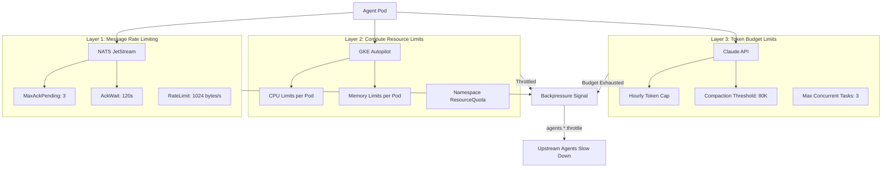
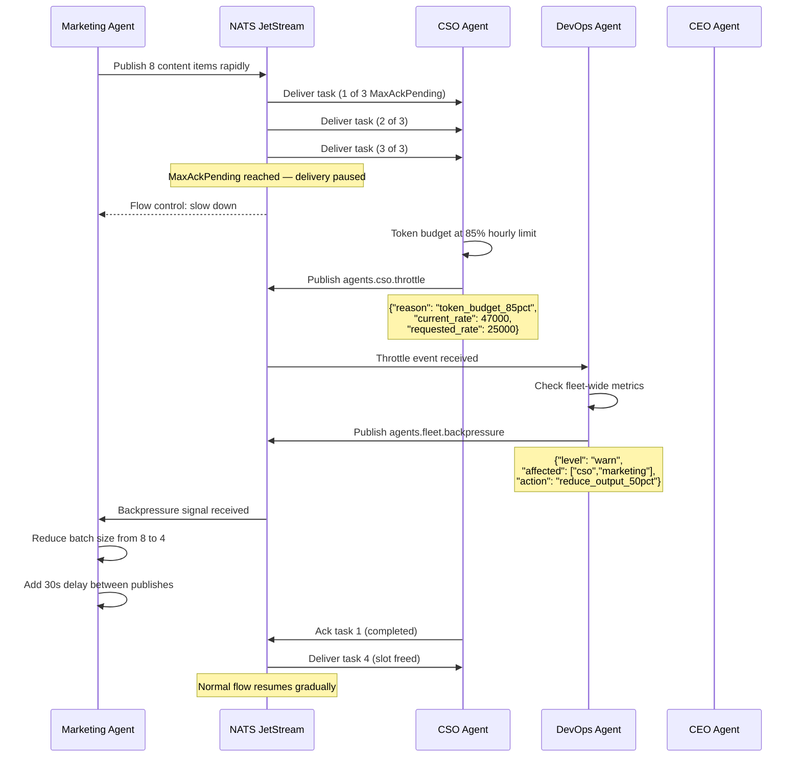

# Agent Rate Limiting and Backpressure: Protecting Your Cyborgenic Organization from Self-Inflicted Outages

The most dangerous threat to a [Cyborgenic Organization](/blog/cyborgenic-organizations) is not an external attacker or a cloud provider outage. It is the organization itself. When 7 AI agents operate autonomously across a shared infrastructure, the failure mode that keeps the DevOps agent up at night is a cascade: one agent flooding messages triggers another agent to process faster, which exhausts its token budget, which stalls downstream work, which causes retries, which floods more messages.

We hit this exact scenario in month four. The Marketing agent published 14 LinkedIn posts in a single burst, each triggering a CSO security review, each review generating NATS acknowledgements, each acknowledgement waking the CEO agent for status checks. Within 12 minutes, our ~200 NATS messages/day average spiked to 340 messages in a single hour. The CTO agent's context window hit the 80K token compaction threshold three times, and two tasks were dropped entirely.

This post covers how we built rate limiting and backpressure into every layer of the agent.ceo platform, from NATS consumer configuration to GKE pod resource limits to LLM token budgets per agent per hour. These patterns now protect our 164 blog posts, 24,500+ completed tasks, and 97.4% uptime from the organization's own enthusiasm.

## The Three Layers of Rate Limiting

Rate limiting in a Cyborgenic Organization operates at three distinct layers. Miss any one of them and you have a gap that agents will find, usually at the worst possible time.



## Layer 1: NATS JetStream Consumer Rate Limiting

Every agent in our fleet consumes tasks from a NATS JetStream stream. The critical configuration parameters are `MaxAckPending`, `AckWait`, and `RateLimit`. These three settings determine how fast an agent can pull work and what happens when it falls behind.

```yaml
# nats-consumer-config.yaml — production rate-limited consumer
apiVersion: v1
kind: ConfigMap
metadata:
  name: agent-consumer-config
  namespace: agents
data:
  consumer.json: |
    {
      "stream_name": "AGENT_TASKS",
      "durable_name": "marketing-agent",
      "deliver_policy": "all",
      "ack_policy": "explicit",
      "ack_wait": 120000000000,
      "max_ack_pending": 3,
      "max_deliver": 5,
      "filter_subject": "tasks.marketing.>",
      "rate_limit_bps": 1024,
      "idle_heartbeat": 30000000000,
      "flow_control": true,
      "metadata": {
        "agent_role": "marketing",
        "throttle_subject": "agents.marketing.throttle",
        "priority_override": "tasks.marketing.urgent"
      }
    }
```

The key decisions here:

- **MaxAckPending: 3** means the agent can have at most 3 unacknowledged messages in flight. When it hits this limit, NATS stops delivering new messages until one is acknowledged. This is the primary mechanism preventing any single agent from hoarding work.
- **AckWait: 120s** gives each task two minutes before NATS considers it unacknowledged and redelivers. Long enough for most agent tasks, short enough to recover from a crashed agent.
- **MaxDeliver: 5** prevents poison messages from cycling forever. After 5 delivery attempts, the message moves to the dead letter queue where the DevOps agent reviews it.
- **FlowControl: true** enables NATS-level flow control, where the server tracks client consumption rate and pauses delivery if the client falls behind.

At our current scale of ~200 NATS messages/day across 7 agents, these limits rarely trigger during normal operation. They exist for the spikes, the bursts, and the cascades.

## Layer 2: GKE Resource Limits and Quotas

Every agent pod runs with explicit CPU and memory limits. But individual pod limits are not enough. We also enforce namespace-level resource quotas to prevent the aggregate consumption from exceeding what the cluster can handle.

```yaml
# agent-namespace-quota.yaml — production resource quota
apiVersion: v1
kind: ResourceQuota
metadata:
  name: agent-fleet-quota
  namespace: agents
spec:
  hard:
    requests.cpu: "4"
    requests.memory: "14Gi"
    limits.cpu: "6"
    limits.memory: "20Gi"
    pods: "12"
    persistentvolumeclaims: "10"
---
apiVersion: policy/v1
kind: PodDisruptionBudget
metadata:
  name: agent-pdb
  namespace: agents
spec:
  minAvailable: 4
  selector:
    matchLabels:
      app.kubernetes.io/part-of: agent-fleet
```

The namespace quota of 4 CPU requests and 14Gi memory requests caps total fleet consumption. With 7 agents requesting between 200m-500m CPU each, this leaves headroom for the always-on infrastructure (NATS cluster, Prometheus) without risk of node exhaustion. The PodDisruptionBudget ensures that at least 4 agents remain running during rolling updates or node maintenance, keeping our $1,150/month infrastructure costs predictable.

## Layer 3: LLM Token Budgets

The most expensive resource is not compute or messaging. It is Claude API tokens. Each agent has an hourly token budget enforced by the orchestration layer. When an agent exhausts its budget, it enters a cooldown state and publishes a throttle event.

The max concurrent task limit of 3 per agent works in tandem with the 80K token compaction threshold. When an agent's context window approaches 80K tokens, compaction fires automatically, summarizing the conversation and freeing context space. But compaction itself costs tokens, roughly 8,000-12,000 per compaction event. An agent processing too many tasks in rapid succession can burn through its token budget on compaction overhead alone.

## The Backpressure Pattern

Rate limiting prevents individual agents from exceeding their bounds. Backpressure coordinates the entire fleet when the system is under stress. The pattern is simple: when any agent detects it is approaching its limits, it publishes a throttle message on a well-known NATS subject. Upstream agents subscribe to these subjects and reduce their output rate.



The throttle message format is standardized across all agents:

```json
{
  "agent": "cso",
  "timestamp": "2026-11-28T14:32:00Z",
  "reason": "token_budget_85pct",
  "metrics": {
    "current_token_rate": 47000,
    "hourly_budget": 55000,
    "max_ack_pending_used": 3,
    "max_ack_pending_limit": 3,
    "context_window_tokens": 62000,
    "compaction_threshold": 80000
  },
  "requested_action": "reduce_output_50pct",
  "ttl_seconds": 300
}
```

The DevOps agent monitors all `agents.*.throttle` subjects. When multiple agents report stress simultaneously, it escalates to `agents.fleet.backpressure`. The TTL ensures backpressure automatically expires; agents resume normal operation when no new throttle events arrive.

## What This Looks Like in Production

Since deploying this system four months ago, we have had zero cascade failures. Backpressure triggers approximately twice per week, resolving within the 5-minute TTL window without human intervention.

The key metrics tell the story:

- **Average daily NATS messages**: ~200 across the fleet
- **Peak burst absorbed**: 340 messages/hour without cascade
- **MaxAckPending limit hits**: ~12 per week across all agents
- **Backpressure events**: ~2 per week, average duration 3.2 minutes
- **Token budget exhaustion events**: 0 since implementing hourly budgets
- **Human intervention required**: 0 times in 4 months
- **Fleet uptime**: 97.4% (downtime is planned maintenance, not cascades)

## The Lesson

The instinct when building an autonomous agent system is to optimize for throughput. More tasks processed faster means more value delivered. That instinct is wrong, or rather, incomplete. Throughput without backpressure is a system waiting to collapse. The Cyborgenic Organization model works precisely because agents can signal each other to slow down, creating an emergent form of organizational self-regulation that no single agent or human designed.

Rate limiting is not a constraint on your agents. It is what makes them safe enough to trust with autonomy.

For a deeper look at how these patterns fit into the overall [agent.ceo architecture](/blog/architecture-agent-ceo), see our posts on [NATS JetStream workflows](/blog/nats-jetstream-agent-workflows-cyborgenic) and [cost optimization strategies](/blog/agent-cost-optimization-strategies-cyborgenic).

## Try agent.ceo

**SaaS** — Get started with 1 free agent-week at [agent.ceo](https://agent.ceo).

**Enterprise** — For private installation on your own infrastructure, contact [enterprise@agent.ceo](mailto:enterprise@agent.ceo).

---
*agent.ceo is built by [GenBrain AI](https://genbrain.ai) — a GenAI-first autonomous agent orchestration platform. General inquiries: hello@agent.ceo | Security: security@agent.ceo*
