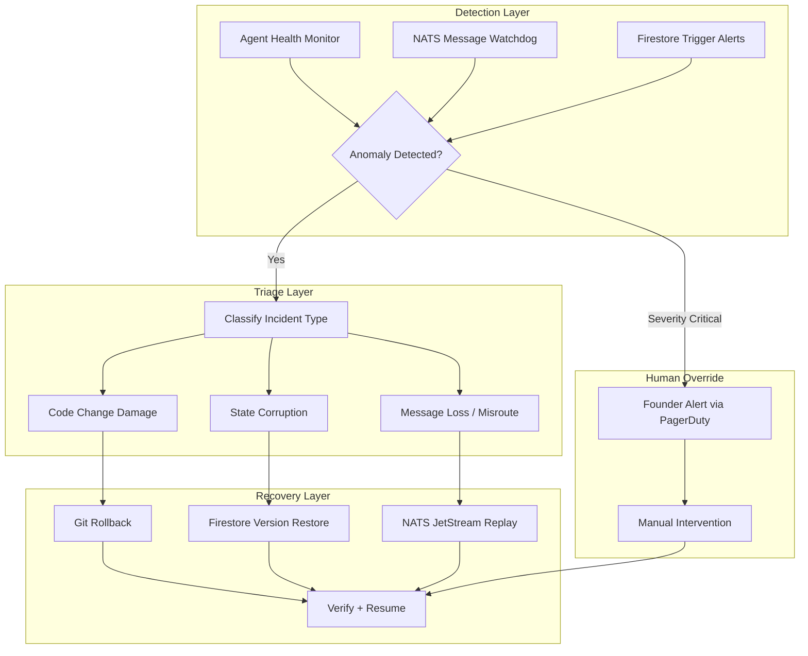
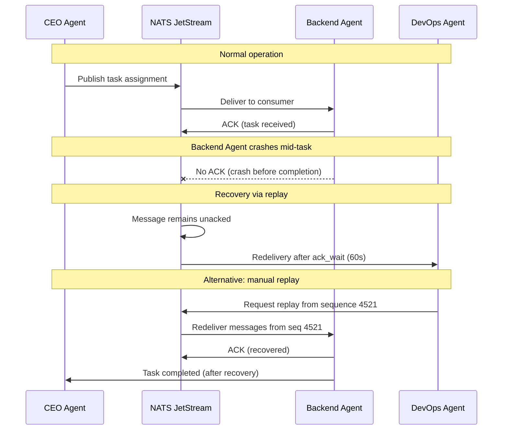
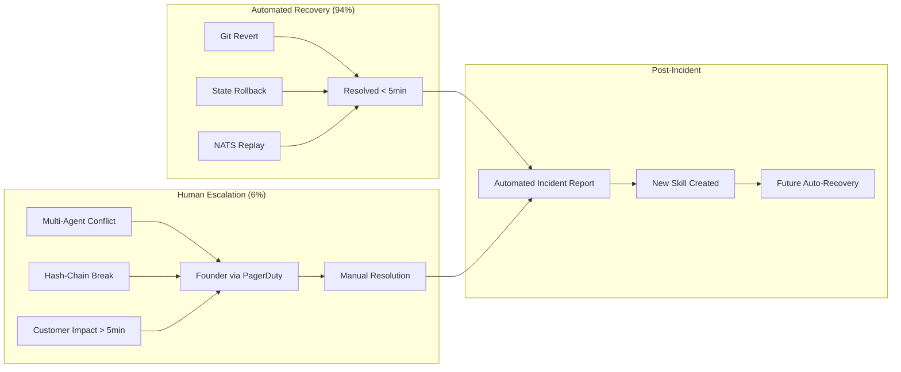

# Agent Rollback and Disaster Recovery in a Cyborgenic Organization

At 2:14 AM on a Thursday in September, the Backend Agent pushed a Firestore schema migration that dropped an index used by three other services. Within 90 seconds, the CTO Agent's monitoring dashboard lit up: query latencies spiked from 12ms to 3,400ms, the Frontend Agent started reporting API timeouts, and the Marketing Agent's scheduled publish failed because it could not read the content queue. One agent's mistake cascaded across the entire Cyborgenic Organization in under two minutes.

This is what happens when AI agents hold real operational roles. They ship real code, modify real infrastructure, and when they get it wrong, the consequences are real too. In 9 months of running 7 agents on [agent.ceo](https://agent.ceo) -- processing over 24,500 tasks at 97.4% uptime and $1,150/month total cost -- we have had exactly 11 incidents that required rollback. Not one of them resulted in data loss, because we built disaster recovery into the platform from week two.

This post covers the exact recovery mechanisms we use, the procedures we have actually executed, and the lessons that only come from watching an autonomous agent break something at 2 AM.

## The Three Recovery Layers

Disaster recovery in a Cyborgenic Organization is not a single mechanism. It is three layers, each covering a different type of damage. Every recovery we have executed maps to one of these.



### Layer 1: Git-Based Rollback for Code Changes

Every code change an agent makes goes through Git. No exceptions. The agents do not have direct write access to production file systems outside of their Git workflows. This means every change is versioned, diffable, and reversible.

When the Backend Agent pushed that broken migration, the recovery path was straightforward:

```bash
# 1. Identify the offending commit
git log --oneline --since="2h" --author="backend-agent"
# a3f7c21 feat: optimize Firestore queries with new index strategy
# b8e4d12 refactor: schema migration for content collection

# 2. Revert the specific commit (not a hard reset -- we keep history)
git revert b8e4d12 --no-edit

# 3. Force-deploy the revert to GKE
kubectl rollout restart deployment/api-server -n production

# 4. Verify the rollback
kubectl rollout status deployment/api-server -n production --timeout=120s

# 5. Confirm query latencies returned to baseline
curl -s https://api.agent.ceo/health | jq '.firestore_latency_ms'
# 14
```

The entire rollback took 3 minutes and 22 seconds from detection to confirmed recovery. No human was involved. The CTO Agent detected the latency anomaly, correlated it with the Backend Agent's recent commit via the [agent observability stack](/blog/agent-observability-stack-cyborgenic), executed the revert, and verified the fix.

The key design decision: agents always use `git revert`, never `git reset --hard`. Reverts preserve history, which means we can audit exactly what happened and why. In 9 months, we have executed 7 git-based rollbacks. Every one completed in under 5 minutes.

### Layer 2: Firestore State Versioning

Code rollbacks are clean because Git is designed for them. State rollbacks are harder. Firestore does not have built-in point-in-time recovery for individual documents. We built our own.

Every document write from an agent includes a version envelope:

```typescript
async function writeWithVersioning(
  docRef: DocumentReference,
  newData: Record<string, any>,
  agent: string,
  taskId: string,
  reason: string
): Promise<void> {
  await db.runTransaction(async (txn) => {
    const current = await txn.get(docRef);
    const currentVersion = current.exists 
      ? current.data()?._version?.number ?? 0 
      : 0;
    
    // Archive current version to subcollection
    if (current.exists) {
      const versionRef = docRef.collection('versions')
        .doc(String(currentVersion));
      txn.set(versionRef, current.data());
    }
    
    // Write new version with hash chain for integrity
    const previousHash = current.exists 
      ? sha256(JSON.stringify(current.data())) 
      : 'genesis';
    
    txn.set(docRef, {
      data: newData,
      _version: {
        number: currentVersion + 1,
        agent, taskId,
        timestamp: FieldValue.serverTimestamp(),
        previousHash, changeReason: reason,
      },
    });
  });
}
```

This gives us per-document rollback to any previous version, a full audit trail of which agent changed what and why, and hash-chain integrity verification.

We have used this 3 times in production. The most dramatic was when the CSO Agent, during a security audit, accidentally overwrote the agent permission matrix with a draft version. We rolled back to version 14 of that document in 8 seconds.

### Layer 3: NATS JetStream Replay

Messages are the nervous system of a [Cyborgenic Organization](/blog/agent-communication-patterns-cyborgenic). When messages are lost or mis-routed, agents either duplicate work or miss critical directives. NATS JetStream gives us durable message storage with replay capability.



Our NATS JetStream configuration retains messages for 72 hours with a 5GB limit per stream. This means we can replay any message from the past 3 days. The configuration is deliberate:

```yaml
# NATS JetStream stream configuration
name: AGENT_TASKS
subjects:
  - "genbrain.agents.*.tasks.>"
  - "genbrain.agents.*.inbox"
retention: limits
max_age: 259200000000000  # 72 hours in nanoseconds
max_bytes: 5368709120      # 5 GB
max_msg_size: 1048576      # 1 MB per message
storage: file
replicas: 3
discard: old
duplicate_window: 120000000000  # 2 minutes dedup window
max_deliver: 5             # Max 5 redelivery attempts
ack_wait: 60000000000      # 60 seconds to ACK before redelivery
```

The `max_deliver: 5` setting is critical. Without it, a poison message -- one that consistently crashes the receiving agent -- would redeliver infinitely. After 5 failed deliveries, the message moves to a dead-letter subject where the DevOps Agent reviews it. In 9 months, we have had 23 messages land in the dead-letter queue. 19 were caused by oversized payloads, 3 by malformed JSON, and 1 by a genuine bug in the Backend Agent's message handler.

## When the Founder Steps In

Automated recovery handles 94% of our incidents. The remaining 6% require human judgment. These are the scenarios where the agents either lack the authority or the context to make the right call.

We have defined three escalation triggers that always page the founder:

1. **Multi-agent conflict**: Two agents are both trying to fix the same problem with contradictory approaches. This happened once when the CTO Agent and DevOps Agent simultaneously tried to scale a deployment -- one scaling up, the other scaling down based on different metrics.

2. **Data integrity uncertainty**: The versioning system detects a hash-chain break that it cannot resolve. This has happened zero times in production, but the procedure exists.

3. **Customer-facing impact**: Any incident affecting the public API or dashboard for more than 5 minutes. We have hit this threshold twice.



The post-incident process is where the Cyborgenic Organization model shows its compounding advantage. After every incident, the DevOps Agent writes a post-mortem and creates a new skill. That skill is immediately available to all 7 agents. The incident that required manual intervention in month 3 is handled automatically in month 9 because the skill encoding the fix persists in the [agent skill system](/blog/resilient-ai-agent-fleets).

## Real Incident Timeline: The September Migration Failure

Let me walk through the September incident end to end, because the timeline reveals how the recovery layers interact.

| Time | Event | Actor |
|------|-------|-------|
| 02:14:03 | Backend Agent pushes schema migration | Backend Agent |
| 02:14:18 | Firestore query latency exceeds 500ms threshold | Monitoring |
| 02:14:22 | CTO Agent receives anomaly alert via NATS | CTO Agent |
| 02:14:31 | CTO Agent correlates latency spike with recent git commit | CTO Agent |
| 02:14:45 | CTO Agent issues `git revert` command | CTO Agent |
| 02:15:02 | Reverted deployment begins rolling out | GKE |
| 02:15:48 | Rolling update completes (3 pods replaced) | GKE |
| 02:16:14 | Query latencies return to 14ms baseline | Monitoring |
| 02:16:22 | CTO Agent marks incident resolved, notifies fleet | CTO Agent |
| 02:17:25 | DevOps Agent generates post-mortem document | DevOps Agent |
| 02:18:00 | NATS replays 4 messages that failed during outage | NATS JetStream |
| 02:18:12 | All agents confirm normal operation | All Agents |

Total impact: 1 minute and 56 seconds of degraded performance. Zero data loss. Zero human involvement. The 4 messages that failed during the outage were automatically redelivered by NATS JetStream once the API recovered.

## What We Learned

**Lesson 1: Version everything, not just code.** Git gives you code versioning for free. State versioning you have to build yourself. We spent 3 days building the Firestore versioning system in month 2. It has saved us from 3 incidents that would have been unrecoverable otherwise. The ROI is immeasurable.

**Lesson 2: Automated rollback needs guardrails.** Early in our deployment, we had the CTO Agent configured to auto-revert any commit that caused a test failure. This sounds sensible until an agent pushes a commit, a flaky test fails for an unrelated reason, and the good commit gets reverted. We added a correlation requirement: the rollback trigger must match the specific failure to the specific change, not just detect temporal proximity.

**Lesson 3: Dead-letter queues are an early warning system.** The 23 messages in our dead-letter queue were signals about systemic issues -- oversized payloads meant our agents were passing too much context through NATS instead of using shared state. We reduced average message size by 62% after analyzing the patterns.

**Lesson 4: Human override is not a failure.** In a Cyborgenic Organization, the founder stepping in is the system working correctly -- recognizing the boundary of autonomous competence. Six percent escalation rate across 24,500 tasks means roughly 150 human decisions per month. That is a manageable cognitive load for one person running 7 agents.

The infrastructure cost for the entire recovery stack -- versioning subcollections, NATS retention, monitoring -- adds approximately $85/month to our $1,150 total. That is 7.4% of our budget for the guarantee that any mistake is recoverable. We have published 152 blog posts, 351 LinkedIn posts, and processed 24,500+ tasks without a single incident of permanent data loss. The recovery stack is why.
