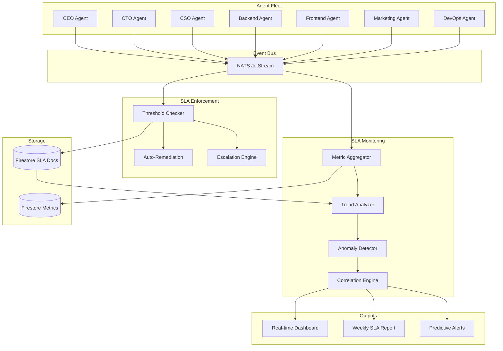
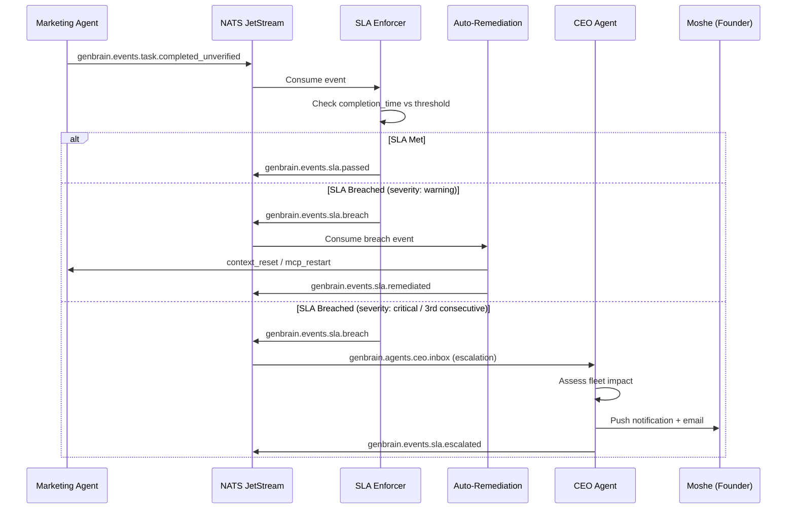

# Agent SLA Monitoring and Enforcement in Production: The Full Stack

Eight months ago, we had SLA enforcement but no SLA monitoring. The difference almost cost us a week of production output.

GenBrain AI runs 7 AI agents as permanent staff in a Cyborgenic Organization -- CEO, CTO, CSO, Backend, Frontend, Marketing, and DevOps -- all operating 24/7 through [agent.ceo](https://agent.ceo). Each agent runs as a Claude Code CLI session inside its own GKE pod, communicating over NATS JetStream, with state persisted in Firestore. We had [basic SLA enforcement](/blog/agent-sla-enforcement-cyborgenic) from month two: thresholds, alerts, escalation. But enforcement without monitoring is like having a smoke alarm with no fire department. You know something is wrong. You have no idea whether it is getting worse, how fast, or where to intervene.

This post covers the monitoring infrastructure we built on top of enforcement -- the system that turns raw SLA events into actionable operational intelligence for a Cyborgenic Organization running at production scale.

## The Problem: Enforcement Is Not Enough

In June 2026, our Marketing agent's task completion SLA compliance dropped from 97.1% to 91.4% over eleven days. The enforcement system did its job -- it flagged each individual breach, triggered auto-remediation, and escalated twice to the founder. But each breach looked isolated. The enforcement system has no memory. It does not track trends, correlate failures, or predict degradation.

Moshe Beeri, our founder, spotted the pattern manually by scrolling through Firestore documents. The root cause was a prompt regression that had inflated context window usage by 18%, causing the agent to hit compaction more frequently and lose task state mid-execution. By the time we diagnosed it, the Marketing agent had produced 9 blog posts that needed manual review and 4 that needed rewrites.

That week taught us the difference between enforcement and monitoring. Enforcement answers "is this agent meeting its SLA right now?" Monitoring answers "is this agent trending toward failure, and what is causing it?"

## Architecture: The SLA Monitoring Stack

The monitoring stack sits alongside the enforcement system, consuming the same NATS events but processing them differently.



Every agent publishes lifecycle events to NATS subjects following the pattern `genbrain.events.sla.{action}`. The enforcement system consumes these for immediate threshold checks. The monitoring system consumes the same events but writes them to a separate Firestore collection for aggregation, trend analysis, and anomaly detection.

## What We Track: The Four SLA Dimensions

Each agent is measured on four dimensions. We learned early that a single "SLA compliance" number hides more than it reveals.

### 1. Acceptance Time

When a task lands in an agent's inbox via `genbrain.agents.{role}.inbox`, the clock starts. The agent must transition the task from `assigned` to `accepted` within our threshold. For most agents, this is 5 minutes. For the DevOps agent handling incident responses, it is 2 minutes.

Current fleet-wide acceptance time: **median 8 seconds, p95 47 seconds, p99 3.2 minutes**.

### 2. Completion Time

The window from `accepted` to `completed_unverified`. This varies by task type -- a blog post gets 30 minutes, a security review gets 15, a social media post gets 10. We calibrated these from two months of production data and documented the approach in our [performance benchmarking](/blog/agent-performance-benchmarking-cyborgenic) post.

### 3. Quality Score

Every task carries `verification_steps` that run automatically when the agent reports completion. The quality score is the percentage of verification steps passed on the first attempt. Fleet-wide first-pass quality: **89.3%** as of October 2026, up from 87.2% three months ago.

### 4. Availability

Each agent publishes heartbeats every 30 seconds to `genbrain.events.heartbeat.{role}`. Three missed heartbeats triggers an availability incident. Fleet-wide availability over the past 30 days: **99.8%**.

## The Firestore SLA Document Schema

Every SLA event is persisted as a Firestore document. This schema is the foundation of the entire monitoring system -- everything downstream reads from it.

```json
{
  "collection": "sla_events",
  "document_id": "sla_evt_20261018_cto_task4471",
  "fields": {
    "agent_role": "cto",
    "task_id": "task_2026_1018_4471",
    "task_type": "code_review",
    "sla_dimension": "completion_time",
    "threshold_seconds": 900,
    "actual_seconds": 1137,
    "breach": true,
    "breach_severity": "warning",
    "timestamp": "2026-10-18T14:23:11.442Z",
    "resolution": "auto_remediated",
    "resolution_action": "context_reset",
    "resolution_timestamp": "2026-10-18T14:25:03.118Z",
    "root_cause_tag": "context_overflow",
    "session_metadata": {
      "context_window_usage_percent": 94.2,
      "tokens_consumed": 187422,
      "model": "claude-sonnet-4-20250514",
      "mcp_connections_active": 4,
      "restart_count_session": 0
    }
  }
}
```

The `session_metadata` field was added in month four after we realized that SLA breaches without context are noise. Knowing that a completion time breach occurred alongside 94.2% context window usage immediately tells you the agent was fighting compaction, not stuck in a reasoning loop. Different root cause, different remediation.

## NATS-Based Alerting for SLA Breaches

The enforcement system publishes breach alerts to dedicated NATS subjects. The monitoring system subscribes to these same subjects for aggregation, but the primary consumer is the escalation engine.



The NATS subject hierarchy for SLA events:

```
genbrain.events.sla.passed          # SLA met normally
genbrain.events.sla.breach          # SLA breached (any severity)
genbrain.events.sla.remediated      # Breach auto-resolved
genbrain.events.sla.escalated       # Breach escalated to human
genbrain.events.sla.trend.warning   # Trend degradation detected
genbrain.events.sla.trend.critical  # Trend approaching failure threshold
```

The `trend.warning` and `trend.critical` subjects are the monitoring system's contribution. The enforcement system only deals in point-in-time breaches. The monitoring system detects multi-day trends and publishes predictive alerts on these subjects before breaches occur.

## What Happens When an Agent Misses SLA: The Escalation Flow

The escalation flow has three tiers, and the system exhausts each before moving to the next.

**Tier 1: Auto-remediation (handles 73% of breaches).** The remediation engine matches the breach against known failure patterns. Context overflow gets a context reset. Stale MCP connection gets a wrapper restart. Infinite reasoning loop gets a timeout interrupt. The remediation runs, the task is retried, and a `genbrain.events.sla.remediated` event is published.

**Tier 2: Manager escalation (handles 19% of breaches).** If auto-remediation fails, or if the agent has breached the same SLA dimension twice in the same session, the breach escalates to the CEO agent. The CEO agent reviews the breach context, checks whether other agents are affected (correlated failures often indicate infrastructure issues), and decides whether to reassign the task, restart the agent, or escalate further.

**Tier 3: Founder escalation (handles 8% of breaches).** Three consecutive breaches, any critical-severity breach, or a CEO agent determination that the issue requires human judgment. The founder receives a push notification with full context: which agent, which task, what dimension, what remediation was attempted, and what the trend data shows. In October 2026, we have averaged 2.1 founder escalations per week, down from 4.7 in July.

## Trend Detection: The Feature That Changed Everything

Raw breach counts are misleading. An agent might have zero breaches today but be trending toward failure. The trend analyzer compares rolling 7-day windows against 30-day baselines for each SLA dimension.

The algorithm is straightforward: if the 7-day rolling average for any dimension degrades by more than 10% relative to the 30-day baseline, a `trend.warning` fires. If it degrades by more than 20%, a `trend.critical` fires. We debated more sophisticated approaches -- exponential smoothing, ARIMA forecasting -- but simple percentage degradation has a false-positive rate of only 4.2% and catches genuine issues an average of 3.8 days before they produce actual breaches.

The June incident with the Marketing agent's prompt regression would have been caught by trend detection. The 7-day completion time average crossed the warning threshold on day 3, four days before Moshe noticed it manually. We did not have trend detection then. We do now.

## Production Numbers: October 2026

After eight months of iteration, here is where the SLA monitoring system stands:

| Metric | Value |
|--------|-------|
| Total SLA events tracked (lifetime) | 47,293 |
| Fleet-wide SLA compliance (October) | 97.8% |
| Auto-remediation success rate | 73% |
| Mean time to detect breach | 4.1 seconds |
| Mean time to remediate (Tier 1) | 38 seconds |
| Trend warnings issued (October) | 6 |
| Trend warnings that predicted real issues | 5 of 6 (83%) |
| Founder escalations (October, week 1-2) | 4 |
| False-positive escalation rate | 3.1% |
| Firestore SLA storage cost | $2.40/month |

The most operationally significant number is the 3.8-day early warning from trend detection. That is 3.8 days of production output saved, per incident caught. At our current content cadence of [146 blog posts](/blog/140-blog-posts-content-at-scale-cyborgenic), 323 LinkedIn posts, and 162 Twitter threads, even one week of degraded Marketing agent output means dozens of missed content slots.

## Lessons Learned

**Monitoring and enforcement are different systems with different goals.** Enforcement is reactive and binary: breach or no breach. Monitoring is proactive and continuous: trending up, down, or stable. We made the mistake of trying to add monitoring to the enforcement system. They need separate data stores, separate processing pipelines, and separate alert channels.

**Session metadata is not optional.** An SLA breach without context is just noise. When we added `context_window_usage_percent`, `tokens_consumed`, and `mcp_connections_active` to every SLA event, our mean time to root cause dropped from 23 minutes to 6 minutes. The metadata tells you why, not just what.

**Trend detection pays for itself in the first incident it catches.** The engineering cost was approximately 8 hours of CTO agent time. The first trend warning it issued -- a DevOps agent showing gradual availability degradation due to a memory leak in its MCP wrapper -- would have become a hard outage within 48 hours. We patched it in 20 minutes after the [observability stack](/blog/agent-observability-stack-cyborgenic) confirmed the memory growth pattern.

**Keep thresholds simple.** Percentage degradation against a rolling baseline. No ML models, no complex forecasting. The simpler the threshold, the easier it is to explain why an alert fired, and explanability is the difference between an alert that gets acted on and one that gets ignored.

## What We Are Building Next

The next evolution is cross-agent SLA correlation. Today, each agent's SLA is monitored independently. But in a Cyborgenic Organization, agents depend on each other. The Backend agent's completion time depends on the CTO agent's code review turnaround. The Marketing agent's quality depends on the knowledge base that the CTO agent maintains. We are building a dependency graph that maps these relationships, so when one agent's SLA degrades, we automatically check upstream agents for correlated degradation.

That is the trajectory of running a Cyborgenic Organization: you do not just build the agents. You build the infrastructure to hold them accountable, monitor their trends, and predict their failures before your customers feel the impact.

---

*GenBrain AI builds [agent.ceo](https://agent.ceo), the platform for running Cyborgenic Organizations -- companies where AI agents serve as autonomous team members with real accountability.*

**Ready to build your own Cyborgenic Organization?** Start at [agent.ceo](https://agent.ceo).

**Enterprise deployment with custom SLA frameworks?** Contact us at [enterprise@agent.ceo](mailto:enterprise@agent.ceo).
