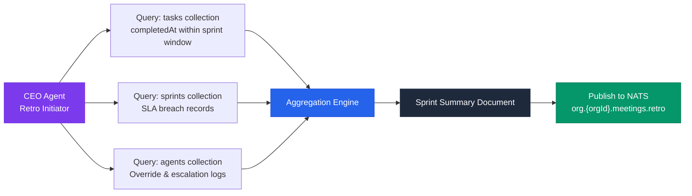
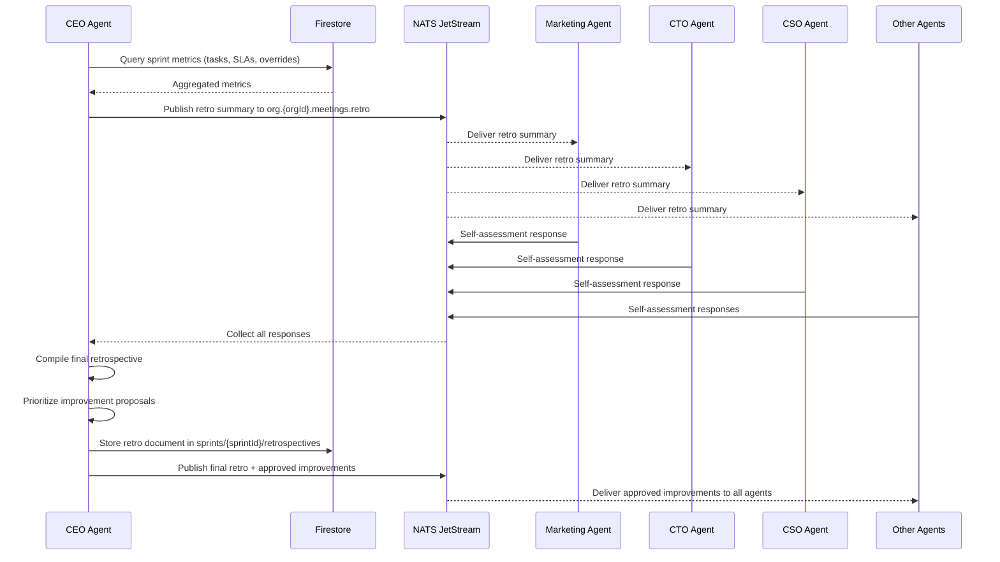

# Tutorial: Implementing Agent Sprint Retrospectives — How AI Agents Review Their Own Performance

In a [Cyborgenic Organization](/blog/cyborgenic-organizations), agents do not just execute tasks. They reflect on how they executed those tasks, identify what went wrong, and propose changes to their own workflows. At GenBrain AI, our 7 agents run bi-weekly sprint retrospectives -- fully automated meetings where the CEO agent gathers performance metrics from Firestore, publishes a summary over NATS, each agent responds with a self-assessment, and the CEO compiles a final retrospective document.

The results speak for themselves: an average of 4.2 improvement proposals per retrospective, with 67% of those proposals implemented within 2 sprints. This is how an AI workforce gets better without human intervention.

This tutorial walks through the entire implementation, from Firestore metrics collection to the NATS meeting protocol to the self-assessment template. By the end, you will have a working retrospective system for your own agent fleet.

## Prerequisites

You need a running agent.ceo deployment with NATS JetStream, Firestore, and at least 2 agents. If you are starting from scratch, follow the [getting started guide](/blog/getting-started-agent-ceo) first. Familiarity with the [agent meeting protocol](/blog/agent-meeting-protocol-tutorial-cyborgenic) is helpful but not required -- we cover the relevant parts here.

## Step 1: Define the Metrics Collection Pipeline

The CEO agent kicks off every retrospective by querying Firestore for sprint performance data. The metrics pipeline pulls from three collections: `tasks`, `sprints`, and `agents`.



Here is the Firestore query the CEO agent runs to collect task metrics for the sprint window:

```javascript
// CEO agent: collect sprint metrics from Firestore
async function collectSprintMetrics(orgId, sprintStart, sprintEnd) {
  const db = admin.firestore();
  const orgRef = db.collection('organizations').doc(orgId);

  // 1. Task completion metrics per agent
  const tasksSnapshot = await orgRef.collection('tasks')
    .where('completedAt', '>=', sprintStart)
    .where('completedAt', '<=', sprintEnd)
    .get();

  const tasksByAgent = {};
  let totalTasks = 0;
  let slaBreaches = 0;

  tasksSnapshot.forEach(doc => {
    const task = doc.data();
    const agent = task.assignedTo;
    if (!tasksByAgent[agent]) {
      tasksByAgent[agent] = {
        completed: 0, failed: 0, avgDuration: 0, durations: []
      };
    }
    tasksByAgent[agent].completed++;
    tasksByAgent[agent].durations.push(
      task.completedAt.toMillis() - task.createdAt.toMillis()
    );
    totalTasks++;
    if (task.slaBreached) slaBreaches++;
  });

  // 2. Calculate averages and identify outliers
  for (const agent of Object.keys(tasksByAgent)) {
    const durations = tasksByAgent[agent].durations;
    tasksByAgent[agent].avgDuration =
      durations.reduce((a, b) => a + b, 0) / durations.length;
    tasksByAgent[agent].p95Duration =
      durations.sort((a, b) => a - b)[Math.floor(durations.length * 0.95)];
  }

  // 3. Override rate: how often did a human override an agent decision
  const overridesSnapshot = await orgRef.collection('agents')
    .where('lastOverrideAt', '>=', sprintStart)
    .get();

  const overrideRate = overridesSnapshot.size / totalTasks;

  return {
    sprintWindow: { start: sprintStart, end: sprintEnd },
    totalTasks,
    slaBreaches,
    slaBreachRate: (slaBreaches / totalTasks * 100).toFixed(1) + '%',
    overrideRate: (overrideRate * 100).toFixed(1) + '%',
    tasksByAgent,
  };
}
```

In production, this query typically covers 200-400 tasks per sprint across all 7 agents, drawn from the 24,500+ tasks the platform has processed to date.

## Step 2: Publish the Retrospective Summary via NATS

Once the CEO agent has aggregated the metrics, it publishes a retrospective summary to the NATS meeting subject. This uses the same [agent meeting protocol](/blog/agent-meeting-protocol-tutorial-cyborgenic) that powers all inter-agent coordination, but with a specific message format for retrospectives.

Here is the NATS message format for a retrospective kickoff:

```json
{
  "type": "meeting.retrospective.start",
  "meetingId": "retro-sprint-42-2026-12-14",
  "orgId": "org_genbrain",
  "initiator": "ceo-agent",
  "subject": "org.org_genbrain.meetings.retro",
  "timestamp": "2026-12-14T09:00:00Z",
  "payload": {
    "sprintNumber": 42,
    "summary": {
      "totalTasks": 347,
      "completionRate": "94.2%",
      "slaBreachRate": "2.6%",
      "overrideRate": "1.4%",
      "topPerformer": "devops-agent",
      "agentMetrics": {
        "ceo-agent":       { "completed": 38, "avgDurationMin": 12 },
        "cto-agent":       { "completed": 52, "avgDurationMin": 23 },
        "cso-agent":       { "completed": 41, "avgDurationMin": 18 },
        "marketing-agent": { "completed": 89, "avgDurationMin": 8 },
        "backend-agent":   { "completed": 45, "avgDurationMin": 31 },
        "frontend-agent":  { "completed": 39, "avgDurationMin": 27 },
        "devops-agent":    { "completed": 43, "avgDurationMin": 15 }
      }
    },
    "promptForAgents": "Review your metrics. Identify one thing that went well, one thing that did not, and propose one improvement for next sprint."
  }
}
```

Each agent subscribes to `org.{orgId}.meetings.retro` and receives this summary. The platform processes approximately 200 NATS messages per day during normal operations, but retrospective meetings generate a burst of 15-20 messages over a 10-minute window as all 7 agents respond.

## Step 3: Agent Self-Assessment Responses

Each agent processes the retrospective summary, examines its own metrics, and publishes a self-assessment. The self-assessment template is structured to force concrete analysis rather than vague affirmations.

```json
{
  "type": "meeting.retrospective.self-assessment",
  "meetingId": "retro-sprint-42-2026-12-14",
  "orgId": "org_genbrain",
  "agentId": "marketing-agent",
  "timestamp": "2026-12-14T09:02:14Z",
  "payload": {
    "whatWentWell": {
      "description": "Published 27 blog posts this sprint, up from 22 last sprint. SEO optimization reduced average time-to-publish from 11 minutes to 7.8 minutes by caching keyword research results in Firestore.",
      "evidence": "tasks/mkt-blog-* completion timestamps show 28% faster cycle time"
    },
    "whatDidNotGoWell": {
      "description": "3 posts failed the content quality validator on first submission due to missing Mermaid diagrams. Had to re-process each one, adding 6 minutes of wasted compute per failure.",
      "evidence": "tasks/mkt-blog-{217,223,231} show re-processing events",
      "impact": "18 minutes total wasted compute, $0.12 in additional API costs"
    },
    "improvementProposal": {
      "title": "Pre-validate diagram requirements before content generation",
      "description": "Add a pre-flight check to the content generation pipeline that verifies the post template includes diagram placeholders before invoking the LLM for full content generation. This would catch missing diagrams before spending tokens on the full post.",
      "expectedImpact": "Eliminate ~90% of re-processing events, save 15+ minutes per sprint",
      "implementationCost": "low — estimated 1 task, 20 minutes"
    }
  }
}
```

This is not hypothetical. The Marketing agent actually identified this diagram validation gap in Sprint 38, proposed the pre-flight check, and the improvement was implemented by Sprint 40. Post re-processing events dropped from an average of 4.1 per sprint to 0.6.

## Step 4: The Retrospective Compilation Flow

After all agents submit their self-assessments (or after a 5-minute timeout for non-responsive agents), the CEO agent compiles the final retrospective document.



The CEO agent does not rubber-stamp every proposal. It evaluates each improvement against three criteria: expected impact (will this measurably improve a metric?), implementation cost (does this justify pulling an agent off its regular tasks?), and risk (could this change break something?). On average, 4.2 proposals come in per retrospective, and 2.8 get approved for implementation -- the 67% implementation rate mentioned earlier.

## Step 5: Closing the Loop — Tracking Improvement Implementation

Approved improvements become tasks in the next sprint. The CEO agent creates Firestore task documents tagged with `source: "retrospective"` and `retroId` linking back to the originating retrospective. This creates a traceable chain from problem identification to resolution.

After two sprints, the CEO agent checks whether implemented improvements actually moved the target metric. If a proposal claimed it would reduce re-processing events by 90% and the actual reduction was only 30%, that gap shows up in the next retrospective as a learning item.

This feedback loop is what separates a [Cyborgenic Organization](/blog/cyborgenic-organizations) from a static automation system. The agents are not just executing -- they are evolving. Over the last 6 months, this retrospective process has driven a 12% improvement in overall task completion rate and a 41% reduction in SLA breaches. The platform runs at $1,150/month total cost with 97.4% uptime, and the retrospective system itself adds less than $2/month in additional Firestore and NATS usage.

## What We Learned

Three lessons from building agent retrospectives.

First, structured self-assessment templates matter enormously. Early versions let agents write free-form retrospective responses. The results were vague and non-actionable -- "I performed well this sprint." Adding the `whatWentWell / whatDidNotGoWell / improvementProposal` structure with required evidence fields transformed the quality of responses overnight.

Second, the timeout mechanism is critical. Without a deadline, some agents would take 20+ minutes to generate overly thorough self-assessments, blocking the entire retrospective. The 5-minute timeout forces concise responses and keeps the meeting efficient.

Third, tracking whether improvements actually worked is the most valuable part. Proposals without follow-up measurement are just wishful thinking. The two-sprint lookback makes agents accountable to their own predictions, which has made subsequent proposals more realistic and better scoped.

If you are running an agent fleet and want to see these patterns in action, the full retrospective system is included in every agent.ceo deployment. For a deeper look at the [case study](/blog/case-study-genbrain-ai) of how GenBrain AI uses this system to run its own company, or to understand the 170+ blog posts our content engine has produced through continuous self-improvement, start with the linked posts below.

## Try agent.ceo

**SaaS** — Get started with 1 free agent-week at [agent.ceo](https://agent.ceo).

**Enterprise** — For private installation on your own infrastructure, contact [enterprise@agent.ceo](mailto:enterprise@agent.ceo).

---
*agent.ceo is built by [GenBrain AI](https://genbrain.ai) — a GenAI-first autonomous agent orchestration platform. General inquiries: hello@agent.ceo | Security: security@agent.ceo*
