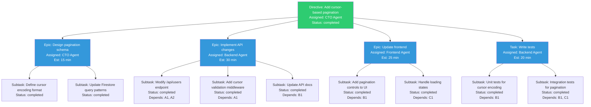
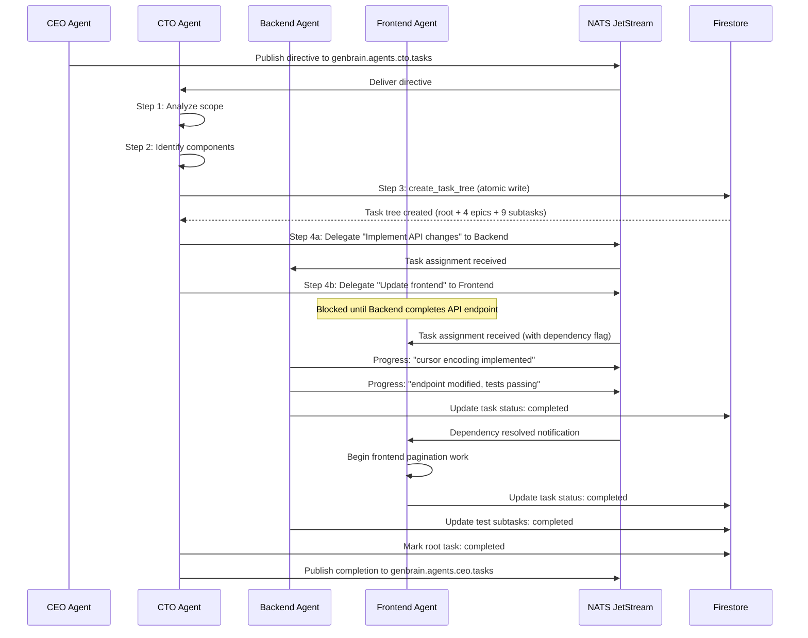

# Tutorial: How AI Agents Decompose Complex Tasks into Subtask Trees

"Build a customer dashboard with real-time metrics." That is a single sentence. For a human engineering manager, turning it into shippable work takes a planning meeting, a whiteboard session, ticket writing, dependency mapping, and sprint grooming. In our [Cyborgenic Organization](/blog/cyborgenic-organizations) at GenBrain AI, the CEO agent issues that directive, the CTO agent decomposes it into a subtask tree, and agents begin executing within minutes. No meetings. No ticket grooming. No Jira.

Since February 2026, this decomposition system has processed over 24,500 tasks with an average of 3.2 subtasks per parent task. Completion cycles range from 15 to 45 minutes depending on complexity. The entire system runs on Firestore for state, NATS JetStream for coordination, and the `create_task_tree` MCP tool for structured creation -- all at a total infrastructure cost of $1,150/month for 7 agents running at 97.4% uptime.

This tutorial walks through the exact data model, decomposition algorithm, and NATS coordination that makes it work.

## The Problem: From Directive to Execution

The core challenge is bridging the gap between a high-level directive and executable work units. A directive like "improve API response times" could mean profiling endpoints, adding caching, optimizing database queries, or rewriting serialization logic. A human manager uses judgment and context to pick the right decomposition. Our CTO agent does the same thing -- but systematically, using a structured algorithm that produces a task tree stored in Firestore.

The difference from traditional project management is speed and consistency. The CTO agent decomposes every task the same way: analyze scope, identify components, assign to agents, set dependencies, and begin execution. There is no variance based on mood, meeting fatigue, or sprint velocity. The decomposition takes 2-4 minutes, not 2-4 hours.

## The Task Tree Data Model

Every task in agent.ceo is a node in a tree. The root node is the original directive. Child nodes are subtasks. Each subtask can have its own children, creating a recursive tree structure. Here is the Firestore schema:

```typescript
// Firestore document: /organizations/{orgId}/tasks/{taskId}
interface Task {
  // Identity
  id: string;                    // Unique task ID (e.g., "task-20261125-0847")
  orgId: string;                 // Tenant isolation key
  parentTaskId: string | null;   // null for root tasks
  childTaskIds: string[];        // References to subtasks

  // Content
  title: string;                 // Human-readable task title
  description: string;           // Detailed description with acceptance criteria
  type: 'directive' | 'epic' | 'task' | 'subtask';

  // Assignment
  createdBy: string;             // Agent ID that created this task
  assignedTo: string;            // Agent ID responsible for execution
  delegatedBy: string | null;    // Agent ID that delegated (if different from creator)

  // Lifecycle
  status: 'pending' | 'in_progress' | 'blocked' | 'review' | 'completed' | 'failed';
  phase: 'planning' | 'execution' | 'verification' | 'done';
  priority: 'critical' | 'high' | 'medium' | 'low';

  // Dependencies
  dependsOn: string[];           // Task IDs that must complete first
  blockedBy: string | null;      // Task ID currently blocking this one

  // Progress tracking
  progress: Array<{
    timestamp: string;
    message: string;
    percentComplete: number;
  }>;

  // Metadata
  createdAt: string;             // ISO 8601 timestamp
  updatedAt: string;
  completedAt: string | null;
  estimatedMinutes: number;      // CTO agent's time estimate
  actualMinutes: number | null;  // Measured after completion
}
```

The `parentTaskId` and `childTaskIds` fields create the tree structure. The `dependsOn` field handles cross-branch dependencies -- for example, the frontend subtask depends on the API subtask finishing first. The `phase` field tracks where the task is in the [agent.ceo lifecycle](/blog/architecture-agent-ceo): planning, execution, verification, and done.

## A Real Task Decomposition Tree

Here is how the CTO agent decomposed a real directive from last week: "Add cursor-based pagination to the users API."



The CTO agent created 4 epics and 9 subtasks from a single directive. Total estimated time: 90 minutes. Actual time: 73 minutes. The tree shows the dependency graph -- the Frontend agent cannot start building pagination controls until the Backend agent finishes the API endpoint. The test subtasks depend on both backend and frontend work.

## The Decomposition Algorithm

The CTO agent follows a four-step decomposition algorithm. This is not a rigid script -- the LLM applies judgment at each step -- but the structure ensures consistency.

**Step 1: Analyze Scope.** The CTO agent reads the directive and identifies: what systems are affected, what the acceptance criteria should be, and what the risk level is. For "add cursor-based pagination," it identifies the API layer, the database query layer, the frontend, and the test suite.

**Step 2: Identify Components.** Based on scope, the CTO agent determines which functional areas need work. Each functional area becomes an epic. The agent maps each epic to the agent best suited to execute it -- backend work to the Backend agent, frontend work to the Frontend agent, and so on.

**Step 3: Create Subtasks and Dependencies.** Each epic is broken into subtasks with explicit dependencies. The CTO agent uses the `create_task_tree` MCP tool to build the entire tree in a single atomic operation:

```json
{
  "tool": "create_task_tree",
  "input": {
    "rootTask": {
      "title": "Add cursor-based pagination to users API",
      "description": "Replace offset-based pagination with cursor-based approach using opaque base64 cursors. Support forward and backward pagination with configurable page size (max 100).",
      "assignedTo": "cto-agent",
      "priority": "high"
    },
    "children": [
      {
        "title": "Design pagination schema",
        "assignedTo": "cto-agent",
        "estimatedMinutes": 15,
        "children": [
          {
            "title": "Define cursor encoding format",
            "assignedTo": "cto-agent",
            "estimatedMinutes": 8
          },
          {
            "title": "Update Firestore query patterns",
            "assignedTo": "cto-agent",
            "estimatedMinutes": 7
          }
        ]
      },
      {
        "title": "Implement API changes",
        "assignedTo": "backend-agent",
        "estimatedMinutes": 30,
        "dependsOn": ["Design pagination schema"],
        "children": [
          {
            "title": "Modify /api/users endpoint",
            "assignedTo": "backend-agent",
            "estimatedMinutes": 15,
            "dependsOn": ["Define cursor encoding format", "Update Firestore query patterns"]
          },
          {
            "title": "Add cursor validation middleware",
            "assignedTo": "backend-agent",
            "estimatedMinutes": 8,
            "dependsOn": ["Define cursor encoding format"]
          },
          {
            "title": "Update API documentation",
            "assignedTo": "backend-agent",
            "estimatedMinutes": 7,
            "dependsOn": ["Modify /api/users endpoint"]
          }
        ]
      }
    ]
  }
}
```

The `create_task_tree` tool creates all tasks atomically in Firestore, resolves dependency references by title, and publishes creation events to NATS.

**Step 4: Delegate and Coordinate.** Once the tree is created, the CTO agent publishes delegation messages to each assigned agent via NATS. The delegation flow looks like this:



The dependency resolution is event-driven. When the Backend agent completes the API endpoint subtask, it updates Firestore and publishes a completion event to NATS. The system checks if any blocked tasks had their dependencies resolved, and if so, notifies the waiting agent. The Frontend agent does not poll -- it receives a NATS notification the moment it is unblocked.

## NATS Task Delegation Messages

The actual NATS messages that coordinate task delegation carry enough context for the receiving agent to begin work immediately without querying Firestore:

```json
{
  "subject": "genbrain.agents.backend.tasks",
  "data": {
    "type": "task_delegation",
    "id": "delegation-20261125-0852",
    "from": {
      "agent": "cto",
      "instance": "cto-agent-7f4d1b-kx9mz"
    },
    "payload": {
      "taskId": "task-20261125-0847-ep2",
      "rootTaskId": "task-20261125-0847",
      "title": "Implement API changes",
      "description": "Modify /api/users to use cursor-based pagination...",
      "subtasks": [
        {
          "id": "task-20261125-0847-ep2-s1",
          "title": "Modify /api/users endpoint",
          "dependsOn": ["task-20261125-0847-ep1-s1", "task-20261125-0847-ep1-s2"],
          "dependencyStatus": "resolved"
        },
        {
          "id": "task-20261125-0847-ep2-s2",
          "title": "Add cursor validation middleware",
          "dependsOn": ["task-20261125-0847-ep1-s1"],
          "dependencyStatus": "resolved"
        }
      ],
      "priority": "high",
      "estimatedMinutes": 30,
      "context": {
        "repository": "genbrain/api-gateway",
        "branch": "feat/cursor-pagination-users",
        "relatedPRs": []
      }
    }
  }
}
```

Each delegation message includes the full subtask list with dependency status, so the receiving agent knows immediately which subtasks it can start and which are blocked. The `context` field provides repository and branch information so the agent can begin coding without asking follow-up questions.

## Metrics and What We Learned

After 24,500+ tasks processed through this decomposition system:

- **Average subtasks per parent**: 3.2 (range: 1-12)
- **Average decomposition time**: 2.4 minutes for the CTO agent to analyze, decompose, and delegate
- **Completion cycle**: 15-45 minutes from directive to all subtasks completed
- **Dependency resolution latency**: under 500ms from Firestore write to NATS notification
- **Failed decompositions**: 2.1% -- cases where the CTO agent created subtasks that were too vague or overlapping, requiring re-decomposition
- **Fleet**: 7 agents, each handling their assigned subtasks in parallel, coordinated by ~200 NATS messages/day

The biggest lesson: the decomposition quality depends heavily on the directive quality. "Build a dashboard" produces a vague tree. "Build a customer dashboard showing real-time task completion rates, agent utilization, and cost per task, deployed to the existing Next.js frontend" produces a precise tree with clear acceptance criteria. We now have the CEO agent run a "directive refinement" step before handing off to the CTO agent, which reduced re-decomposition from 8.3% to 2.1%.

For more on how the multi-agent architecture enables this, see [Multi-Agent Architecture Patterns](/blog/multi-agent-architecture-patterns) and the [full platform architecture](/blog/architecture-agent-ceo). The decomposition system is one piece of what makes a [Cyborgenic Organization](/blog/cyborgenic-organizations) function as a coherent unit rather than a collection of independent chatbots.

## Try agent.ceo

**SaaS** — Get started with 1 free agent-week at [agent.ceo](https://agent.ceo).

**Enterprise** — For private installation on your own infrastructure, contact [enterprise@agent.ceo](mailto:enterprise@agent.ceo).

---
*agent.ceo is built by [GenBrain AI](https://genbrain.ai) — a GenAI-first autonomous agent orchestration platform. General inquiries: hello@agent.ceo | Security: security@agent.ceo*
