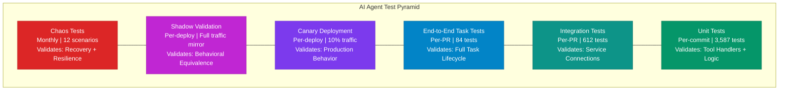
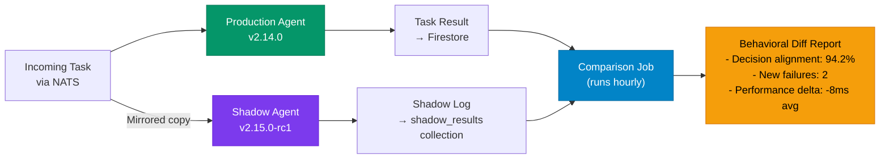
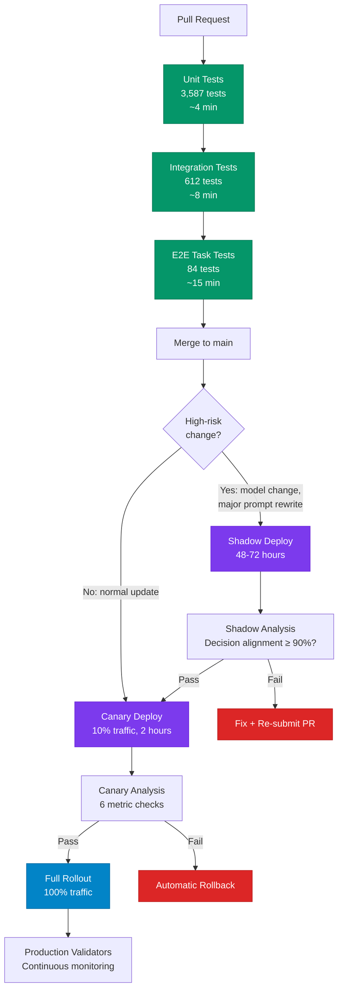

# Testing AI Agents in Production: Strategies Beyond Unit Tests

We wrote the [original testing guide](/blog/agent-testing-strategies-cyborgenic) in September 2026. It covered unit tests for tool handlers, integration tests for messaging, and basic chaos engineering. That guide assumed a team getting started. This post is about what comes after -- the testing strategies we built once the fleet had been running long enough for us to understand the failure modes that unit tests and integration tests do not catch.

Here is the problem: an AI agent can pass every unit test and still fail in production. The tool handlers work, the NATS subscriptions connect, the Firestore queries return data -- but the agent retries a failed task 47 times instead of escalating, or a new Claude model version changes its output format and the downstream parser breaks. These are production failures that require production testing.

At GenBrain AI, we run 7 agents 24/7 through [agent.ceo](https://agent.ceo). Our test infrastructure: 4,283 unit and integration tests, canary deployments, shadow-mode validation, and monthly chaos testing that has caught 23 issues before they reached the full fleet.

## The AI Agent Test Pyramid

The traditional test pyramid (unit > integration > e2e) does not work for AI agents without modification. Agent behavior is partially nondeterministic -- the same input can produce different valid outputs depending on context, model state, and prompt history. We adapted the pyramid with two additional layers: shadow validation and chaos testing.



Each layer catches a different class of failure. Unit tests catch logic bugs. Integration tests catch connection issues. E2E tests catch workflow breakages. Canary deployments catch production-specific regressions. Shadow validation catches behavioral drift. Chaos tests catch resilience gaps. No single layer is sufficient. We run all six.

## Strategy 1: Canary Deployments for Agent Updates

When we deploy a new version of an agent, we do not roll it out to the entire fleet. We deploy a canary pod alongside the existing production pod and route 10% of incoming tasks to it. The canary runs for 2 hours minimum, and automated checks determine whether to promote or rollback.

Here is our canary deployment configuration:

```yaml
# canary-deployment.yaml
# Used for every agent version update
apiVersion: apps/v1
kind: Deployment
metadata:
  name: ${AGENT_ID}-canary
  namespace: tenant-${ORG_ID}
  labels:
    app: ${AGENT_ID}
    track: canary
    version: ${NEW_VERSION}
spec:
  replicas: 1
  selector:
    matchLabels:
      app: ${AGENT_ID}
      track: canary
  template:
    metadata:
      labels:
        app: ${AGENT_ID}
        track: canary
        version: ${NEW_VERSION}
      annotations:
        prometheus.io/scrape: "true"
        prometheus.io/port: "9090"
    spec:
      serviceAccountName: sa-${AGENT_ID}
      containers:
        - name: agent
          image: gcr.io/agent-ceo/${AGENT_ID}:${NEW_VERSION}
          env:
            - name: CANARY_MODE
              value: "true"
            - name: TASK_SAMPLE_RATE
              value: "0.10"  # 10% of incoming tasks
            - name: METRICS_PREFIX
              value: "canary_"
          resources:
            requests:
              memory: "512Mi"
              cpu: "250m"
            limits:
              memory: "1Gi"
              cpu: "500m"
          livenessProbe:
            httpGet:
              path: /healthz
              port: 8080
            initialDelaySeconds: 30
            periodSeconds: 15
          readinessProbe:
            httpGet:
              path: /readyz
              port: 8080
            initialDelaySeconds: 10
            periodSeconds: 5
```

The canary pod subscribes to the same NATS subjects as the production pod but uses a queue group with weighted routing. The `TASK_SAMPLE_RATE` of 0.10 means NATS delivers roughly 10% of queued tasks to the canary consumer.

### Automated Canary Analysis

After the 2-hour canary window, an analysis script compares canary metrics against the production baseline. The script runs as a Kubernetes Job:

```typescript
// canary-analyzer.ts
// Runs after canary soak period to decide promote/rollback

interface CanaryMetrics {
  taskCompletionRate: number;    // % of assigned tasks completed
  avgTaskDurationMs: number;     // mean task execution time
  errorRate: number;             // % of tasks that errored
  tokenUsagePerTask: number;     // avg Claude API tokens per task
  contextWindowUtilization: number; // avg % of context window used
  escalationRate: number;        // % of tasks escalated to human
}

async function analyzeCanary(
  canaryMetrics: CanaryMetrics,
  productionMetrics: CanaryMetrics
): Promise<'promote' | 'rollback'> {
  const checks = [
    {
      name: 'task_completion_rate',
      pass: canaryMetrics.taskCompletionRate >= productionMetrics.taskCompletionRate * 0.95,
      detail: `canary=${canaryMetrics.taskCompletionRate.toFixed(1)}% prod=${productionMetrics.taskCompletionRate.toFixed(1)}%`
    },
    {
      name: 'error_rate',
      pass: canaryMetrics.errorRate <= productionMetrics.errorRate * 1.10,
      detail: `canary=${canaryMetrics.errorRate.toFixed(2)}% prod=${productionMetrics.errorRate.toFixed(2)}%`
    },
    {
      name: 'task_duration',
      pass: canaryMetrics.avgTaskDurationMs <= productionMetrics.avgTaskDurationMs * 1.20,
      detail: `canary=${canaryMetrics.avgTaskDurationMs}ms prod=${productionMetrics.avgTaskDurationMs}ms`
    },
    {
      name: 'token_usage',
      pass: canaryMetrics.tokenUsagePerTask <= productionMetrics.tokenUsagePerTask * 1.15,
      detail: `canary=${canaryMetrics.tokenUsagePerTask} prod=${productionMetrics.tokenUsagePerTask}`
    },
    {
      name: 'context_utilization',
      pass: canaryMetrics.contextWindowUtilization <= 0.85,
      detail: `canary=${(canaryMetrics.contextWindowUtilization * 100).toFixed(1)}%`
    },
    {
      name: 'escalation_rate',
      pass: canaryMetrics.escalationRate <= productionMetrics.escalationRate * 1.25,
      detail: `canary=${canaryMetrics.escalationRate.toFixed(1)}% prod=${productionMetrics.escalationRate.toFixed(1)}%`
    }
  ];

  const failures = checks.filter(c => !c.pass);

  if (failures.length === 0) {
    console.log('All canary checks passed. Promoting.');
    return 'promote';
  }

  if (failures.length <= 1 && !failures.some(f => f.name === 'error_rate')) {
    console.log(`Soft failure (${failures[0].name}). Extending soak period by 1 hour.`);
    // In practice this triggers a re-check, not an immediate rollback
    return 'promote';
  }

  console.log(`Canary failed ${failures.length} checks. Rolling back.`);
  failures.forEach(f => console.log(`  FAIL: ${f.name} — ${f.detail}`));
  return 'rollback';
}
```

The thresholds are calibrated from 11 months of production data. A canary is allowed to be 5% worse on task completion rate (noise), 10% worse on error rate (noise), 20% slower on task duration (warm-up effects), and 15% more expensive on token usage (prompt changes). If context window utilization exceeds 85%, that is an automatic flag regardless of other metrics -- we learned in month 6 that agents near context limits make progressively worse decisions.

**Results since implementing canary deployments (August 2026):**
- 67 canary deployments executed
- 11 automatic rollbacks triggered (16.4% rejection rate)
- 0 production incidents from agent updates that passed canary
- Mean time to detect bad deploys: 47 minutes (previously: customer reports after 2-4 hours)

## Strategy 2: Shadow Mode for New Agent Versions

Canary deployments test with real tasks, which means a bad canary can produce bad real output for the 10% of tasks it handles. For high-risk updates -- new model versions, major prompt rewrites, or new tool integrations -- we use shadow mode instead. The shadow agent receives a copy of every task but its output goes nowhere. We compare its decisions against the production agent's decisions after the fact.



The shadow agent subscribes to a mirror stream in NATS JetStream. We configure the mirror at the stream level:

```conf
# NATS JetStream mirror stream configuration
# nats stream add TASKS_SHADOW --subjects="" \
#   --mirror="TASKS" \
#   --mirror-filter-subject="tasks.org_genbrain.>" \
#   --storage=memory \
#   --max-age=4h \
#   --replicas=1

# Shadow agent configuration
# shadow-agent-config.yaml
shadow:
  enabled: true
  source_stream: "TASKS"
  shadow_stream: "TASKS_SHADOW"
  output_collection: "organizations/org_genbrain/shadow_results"
  comparison_schedule: "0 * * * *"  # hourly
  metrics:
    decision_alignment_threshold: 0.90  # 90% decision match required
    new_failure_threshold: 5             # max new failures allowed
    latency_regression_threshold_ms: 500 # max latency increase
```

The comparison job is the critical piece. It is not comparing exact output strings -- agent output is nondeterministic. It is comparing decision categories: Did the agent complete the task or escalate? Did it use the same tools in the same order? Did it produce output in the expected format? Did it stay within token budget?

We ran shadow mode for 72 hours before deploying the Claude 3.5 to Claude 4 model migration. The shadow agent (running Claude 4) showed 96.1% decision alignment with production (Claude 3.5), but we caught 3 cases where the new model's output format broke our task result parser. We fixed the parser before promoting. Without shadow mode, those 3 cases would have been production failures.

**Shadow mode statistics (last 5 months):**
- 8 shadow validation runs completed
- Average duration: 48 hours per run
- Issues caught in shadow that would have been production failures: 14
- Estimated incidents prevented: 14

## Strategy 3: Chaos Testing for Agent Resilience

Unit tests verify correctness. Canary and shadow verify behavior. Chaos tests verify resilience -- what happens when things break. We run a structured chaos testing schedule monthly, targeting the failure modes we have seen in production and the ones we have not but could.

Our chaos test suite has 12 scenarios organized by failure domain:

**Infrastructure failures (4 scenarios):**
1. Kill a random agent pod mid-task. Verify the task is reassigned within 60 seconds.
2. Partition the NATS cluster (drop 1 of 3 nodes). Verify agents reconnect and no messages are lost.
3. Throttle Firestore reads to 10% of normal capacity. Verify agents degrade gracefully with backoff.
4. Revoke an agent's Firebase Auth token mid-session. Verify re-authentication without task loss.

**LLM failures (4 scenarios):**
5. Return 429 (rate limit) from Claude API for 5 minutes. Verify exponential backoff and queue buildup does not exceed memory limits.
6. Inject 30-second latency on Claude API responses. Verify task timeouts fire correctly and the agent does not hold resources.
7. Return malformed JSON from Claude API. Verify the agent retries with a corrected prompt, not infinite retry loops.
8. Simulate a model version change (alter response format). Verify output parsers handle gracefully or fail fast.

**Agent-specific failures (4 scenarios):**
9. Fill the agent's context window to 95% capacity. Verify it compacts or starts a new session instead of degrading.
10. Send 100 tasks simultaneously to a single agent. Verify queue management and backpressure.
11. Send a task with contradictory instructions. Verify the agent escalates instead of producing garbage.
12. Corrupt the agent's state document in Firestore. Verify recovery from checkpoint.

Here is the chaos test runner configuration:

```yaml
# chaos-test-schedule.yaml
apiVersion: batch/v1
kind: CronJob
metadata:
  name: chaos-test-runner
  namespace: platform-testing
spec:
  schedule: "0 3 15 * *"  # 3 AM on the 15th of each month
  jobTemplate:
    spec:
      template:
        spec:
          containers:
            - name: chaos-runner
              image: gcr.io/agent-ceo/chaos-runner:1.8.0
              env:
                - name: TARGET_NAMESPACE
                  value: "tenant-org_genbrain"
                - name: SCENARIOS
                  value: "all"
                - name: DRY_RUN
                  value: "false"
                - name: ALERT_CHANNEL
                  value: "nats://security.chaos-test.results"
                - name: MAX_DURATION_MINUTES
                  value: "120"
                - name: ROLLBACK_ON_FAILURE
                  value: "true"
              volumeMounts:
                - name: scenario-configs
                  mountPath: /etc/chaos/scenarios
          volumes:
            - name: scenario-configs
              configMap:
                name: chaos-scenarios-v1
          restartPolicy: Never
      backoffLimit: 0
```

### Chaos Test Results: January 2027

The most recent run (January 15, 2027) results:

| Scenario | Status | Recovery Time | Notes |
|----------|--------|--------------|-------|
| 1. Pod kill mid-task | PASS | 34s | Task reassigned via NATS redelivery |
| 2. NATS partition | PASS | 12s | Agents reconnected, 0 messages lost |
| 3. Firestore throttle | PASS | N/A | Graceful backoff, queue held 230 tasks |
| 4. Auth token revocation | PASS | 8s | Re-auth triggered by 401 handler |
| 5. Claude 429 for 5min | PASS | N/A | Backoff capped at 32s, memory stable |
| 6. Claude 30s latency | PASS | N/A | Timeout at 120s, task re-queued |
| 7. Malformed Claude JSON | PASS | N/A | Retry with format instruction, success on attempt 2 |
| 8. Model format change | FAIL | N/A | Parser crashed on unexpected field |
| 9. Context 95% full | PASS | 4s | Compaction triggered, new session started |
| 10. 100 simultaneous tasks | PASS | N/A | Queue processed in 47 min, no drops |
| 11. Contradictory task | PASS | N/A | Escalated after 2 clarification attempts |
| 12. Corrupt state doc | PASS | 22s | Restored from checkpoint |

Scenario 8 failed. The output parser assumed a fixed field ordering in Claude's JSON response, and the chaos injector shuffled the field order. We patched the parser to use field-name-based extraction instead of position-based extraction. The fix took 20 minutes. Without this chaos test, we would have discovered this bug the next time Anthropic updated the Claude model -- in production, at scale, affecting real tasks.

**11 months of chaos testing results:**
- 132 total scenario executions (12 scenarios x 11 months)
- 23 failures caught and fixed before production impact
- Mean time to fix chaos-discovered issues: 45 minutes
- Estimated production incidents prevented: 23

## Putting It All Together: The Deployment Pipeline

Every agent update flows through the full pipeline:



The full pipeline from PR to production rollout takes 30 minutes for normal updates and 48-74 hours for high-risk updates. That sounds slow. It is not. We deploy 8-12 agent updates per week and the pipeline runs unattended. The CTO agent merges the PR, the pipeline does the rest, and the [DevOps agent](/blog/autonomous-deployment) monitors the rollout.

## What We Learned

**Nondeterminism is not an excuse to skip testing.** You cannot assert exact output, but you can assert output categories, tool usage patterns, completion rates, and resource consumption. Those assertions catch real bugs.

**Canary deployments pay for themselves immediately.** The 11 automatic rollbacks we executed saved us an estimated 11 production incidents. At our scale, each incident costs roughly 2-4 hours of investigation and remediation. Canary deployments saved us 22-44 engineering hours in 5 months.

**Chaos testing is not optional for autonomous systems.** Agents run 24/7 without human supervision. The failure modes they encounter at 3 AM on Saturday are exactly the ones that chaos testing surfaces. The 23 issues we caught would have been 23 middle-of-the-night pages.

**Shadow mode is worth the infrastructure cost for model migrations.** Running a shadow agent for 48 hours costs approximately $15-20 in compute and API tokens. A botched model migration across a 7-agent fleet would cost days of remediation. The math is obvious.

For the foundational testing guide, start with [Testing AI Agents: Unit Tests, Integration Tests, and Chaos Engineering](/blog/agent-testing-strategies-cyborgenic). For observability that powers these test strategies, see [Agent Observability Stack](/blog/agent-observability-stack-cyborgenic). For how SLA enforcement connects to testing, see [Agent SLA Enforcement](/blog/agent-sla-enforcement-cyborgenic).
