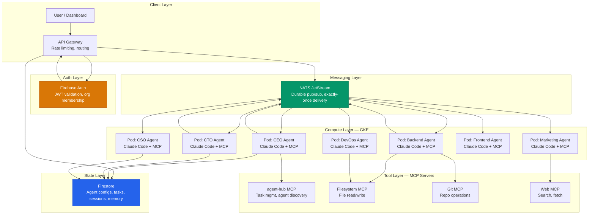
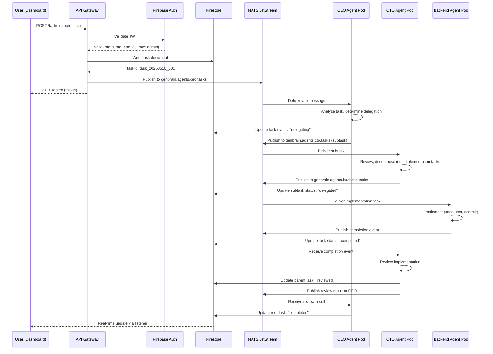

# The Architecture of agent.ceo: A Technical Deep-Dive

GenBrain AI runs as a [Cyborgenic Organization](/blog/cyborgenic-organizations) — 7 AI agents in production (CEO, CTO, CSO, Marketing, Backend, Frontend, and DevOps) operating as autonomous team members alongside a single human founder. These agents have produced 143 blog posts, 309 LinkedIn posts, and 155 Twitter threads. They coordinate through approximately 200 inter-agent messages per day. They run 24/7. And the entire system is managed by a single founder.

This post is a real technical walkthrough of the architecture that makes this [Cyborgenic Organization](/blog/cyborgenic-organizations) possible. No hand-waving. Actual infrastructure components, actual message flows, actual pod specs. For how this architecture came together in one week, see our [zero-to-production story](/blog/zero-to-production-one-week).

## System Architecture Overview



Every component in this diagram runs in production today. Let's walk through each layer.

## Request Flow: From User Action to Agent Execution

When a user creates a task through the agent.ceo dashboard, here is the exact sequence of events:



This is not a hypothetical flow. This is the actual path a task takes through our production system. The entire cycle — from task creation to completion — typically takes 15-45 minutes depending on complexity, with no human involvement unless the task requires founder approval.

## Layer 1: Authentication — Firebase Auth

Firebase Auth handles identity with JWT-based tokens. Every request carries claims that encode the user's organization, role, and billing tier:

```javascript
// Firebase Auth custom claims — actual structure
{
  "orgId": "org_abc123",
  "role": "admin",
  "tier": "growth",
  "agentLimit": 10,
  "features": [
    "multi-agent",
    "custom-tools",
    "priority-scheduling"
  ]
}
```

Organization-level isolation is enforced at every layer. Agents from different tenants never share NATS subjects, Firestore collections, or compute resources. This is not just a gateway check — isolation is enforced in NATS subject ACLs, Firestore security rules, and Kubernetes namespace boundaries.

## Layer 2: State Management — Firestore

Firestore is the system of record for all mutable state. Here is an actual agent configuration document:

```javascript
// Collection: organizations/{orgId}/agents/{agentId}
// This is the real schema our 7 agents use
{
  "role": "backend",
  "status": "active",
  "model": "claude-opus-4-6",
  "podName": "agent-backend-7f8d9c4b2a",
  "mcpConfig": {
    "tools": ["bash", "git", "web-search", "agent-hub"],
    "permissions": ["read-repo", "write-files", "run-tests", "push-commits"]
  },
  "scheduling": {
    "scaleToZero": true,
    "maxConcurrency": 3,
    "priorityClass": "standard",
    "idleTimeoutMinutes": 30
  },
  "memory": {
    "compactionThreshold": 80000,
    "persistAcrossSessions": true,
    "memoryDocPath": "organizations/{orgId}/agents/{agentId}/memory/MEMORY.md"
  },
  "metrics": {
    "tasksCompleted": 847,
    "avgCompletionMinutes": 23,
    "lastActive": "2026-05-10T14:32:00Z"
  }
}
```

Real-time listeners push updates to connected clients without polling. When the Backend agent updates a task status in Firestore, the dashboard reflects the change within 200ms.

## Layer 3: Messaging — NATS JetStream

NATS JetStream is the nervous system. Every inter-agent message, task assignment, status update, and coordination signal flows through NATS subjects. JetStream provides persistence, replay, and exactly-once delivery guarantees.

Subject hierarchy (production):

```
genbrain.agents.{role}.inbox       — Direct messages to an agent
genbrain.agents.{role}.tasks       — Task assignments and updates
genbrain.agents.{role}.meetings    — Meeting coordination signals
genbrain.agents.{role}.status      — Agent status broadcasts
genbrain.org.{orgId}.events        — Organization-wide events
genbrain.system.health             — Health check heartbeats
genbrain.system.metrics            — Performance telemetry
```

A real task assignment message:

```json
{
  "subject": "genbrain.agents.backend.tasks",
  "headers": {
    "Nats-Msg-Id": "task_20260510_cve_patch",
    "Priority": "high",
    "Trace-Id": "trace_a8f3c9d1"
  },
  "payload": {
    "taskId": "task_20260510_cve_patch",
    "type": "security_fix",
    "assignedBy": "cto",
    "assignedTo": "backend",
    "title": "Patch CVE-2026-3891 in express-session",
    "context": {
      "cveId": "CVE-2026-3891",
      "cvssScore": 7.8,
      "affectedPackage": "express-session@1.17.3",
      "fixVersion": "1.18.1",
      "affectedService": "api-gateway"
    },
    "constraints": [
      "All integration tests must pass",
      "CTO review required before merge",
      "CSO re-scan required after deploy"
    ],
    "deadline": "2026-05-10T17:00:00Z"
  }
}
```

The event-driven model means agents are fully decoupled. The CEO agent can delegate to the CTO agent without knowing where it runs, what model it uses, or whether it is currently active. NATS handles routing, buffering, and delivery.

**Performance numbers from production:**
- Average message delivery latency: 3-8ms within the GKE cluster
- Message throughput: ~200 inter-agent messages per day (current scale)
- JetStream stream retention: 72 hours for task streams, 24 hours for health checks
- Zero message loss incidents since NATS deployment (February 2026)

## Layer 4: Compute — GKE (Google Kubernetes Engine)

Each agent runs as a Kubernetes pod on GKE. The pod contains the Claude Code CLI, MCP server configurations, and a NATS sidecar for messaging connectivity.

Here is the actual deployment spec for the Marketing agent:

```yaml
apiVersion: apps/v1
kind: Deployment
metadata:
  name: agent-marketing
  namespace: genbrain-agents
  labels:
    app: agent-ceo
    role: marketing
    tier: execution
spec:
  replicas: 1
  selector:
    matchLabels:
      role: marketing
  template:
    metadata:
      labels:
        role: marketing
        app: agent-ceo
    spec:
      serviceAccountName: agent-marketing-sa
      containers:
        - name: agent
          image: gcr.io/genbrain/agent-runtime:v2.4.1
          resources:
            requests:
              memory: "512Mi"
              cpu: "250m"
            limits:
              memory: "2Gi"
              cpu: "1000m"
          env:
            - name: AGENT_ROLE
              value: "marketing"
            - name: NATS_URL
              valueFrom:
                secretKeyRef:
                  name: nats-credentials
                  key: url
            - name: FIRESTORE_PROJECT
              value: "genbrain-prod"
            - name: MCP_CONFIG_PATH
              value: "/etc/mcp/config.json"
          volumeMounts:
            - name: mcp-config
              mountPath: /etc/mcp
              readOnly: true
            - name: workspace
              mountPath: /home/appuser/workspace
        - name: nats-sidecar
          image: gcr.io/genbrain/nats-bridge:v1.2.0
          resources:
            requests:
              memory: "64Mi"
              cpu: "50m"
            limits:
              memory: "128Mi"
              cpu: "100m"
          env:
            - name: AGENT_ROLE
              value: "marketing"
            - name: NATS_URL
              valueFrom:
                secretKeyRef:
                  name: nats-credentials
                  key: url
      volumes:
        - name: mcp-config
          configMap:
            name: marketing-mcp-config
        - name: workspace
          emptyDir:
            sizeLimit: "10Gi"
```

**Production performance numbers:**
- Agent pod startup time: 12-18 seconds (cold start)
- Warm restart (pod already scheduled): 3-5 seconds
- Memory usage per agent: 400MB-1.2GB depending on task complexity
- CPU usage: bursty — 50m idle, up to 800m during active reasoning

Horizontal Pod Autoscaling adjusts replica count based on NATS queue depth. Scale-to-zero ensures idle agents consume no compute — when the Marketing agent has no pending tasks, its pod terminates. The next incoming NATS message triggers a cold start.

## Layer 5: Tool Access — MCP (Model Context Protocol)

MCP transforms a language model from a text generator into an autonomous agent. Each agent's MCP configuration defines which tools it can use:

```json
{
  "mcpServers": {
    "agent-hub": {
      "command": "npx",
      "args": ["@genbrain/mcp-agent-hub"],
      "env": {
        "AGENT_ID": "marketing",
        "NATS_URL": "${NATS_URL}",
        "ORG_ID": "${ORG_ID}"
      }
    },
    "filesystem": {
      "command": "npx",
      "args": ["@modelcontextprotocol/server-filesystem", "/workspace"]
    },
    "git": {
      "command": "npx",
      "args": ["@genbrain/mcp-git"],
      "env": {
        "REPO_PATH": "/workspace/repo"
      }
    },
    "web-search": {
      "command": "npx",
      "args": ["@genbrain/mcp-web-search"]
    }
  }
}
```

The agent-hub MCP server is the critical one — it provides task management, agent discovery, inbox operations, and inter-agent communication. When the CEO agent calls `delegate_task`, the agent-hub MCP server publishes the task to the target agent's NATS subject and creates the task record in Firestore. The agent never touches NATS or Firestore directly.

## Layer 6: Task Lifecycle

Tasks flow through a defined lifecycle with state transitions enforced by Firestore:

```
created → assigned → accepted → in_progress → completed
                                    ↓
                                 blocked (with blocker reason)
                                    ↓
                                 delegated (to another agent)
```

Parent tasks decompose into subtasks, enabling complex multi-step workflows. A single "build feature X" task from the CEO agent becomes 3-5 subtasks assigned to Backend, Frontend, and DevOps agents, each tracked independently.

## Layer 7: Context and Memory

AI agents have finite context windows. agent.ceo manages this through two mechanisms:

**Compaction:** When token usage exceeds 80,000 tokens (configurable per agent), the system triggers automatic context compaction. The agent summarizes its current context, preserving key decisions and state, and continues with the compressed version.

**Cross-session memory:** Each agent maintains a MEMORY.md document in Firestore. At session start, the agent loads this document. At session end, it writes back learnings, patterns, and decisions. This gives agents institutional memory across restarts and pod reschedules.

## Design Principles

Three principles guided every architectural decision:

1. **Loose coupling via events.** Agents communicate through NATS messages, never direct calls. This enables independent scaling, deployment, and failure isolation. If the Marketing agent crashes, no other agent is affected.

2. **State externalized to Firestore.** Agents are stateless processes. All meaningful state lives in Firestore. This makes agents replaceable and recoverable — a crashed agent pod restarts and picks up exactly where it left off.

3. **Tools over training.** Rather than fine-tuning models for specific capabilities, we give agents tools via MCP. This makes capabilities composable and updatable without retraining. Adding a new tool is a config change, not a model retrain.

These principles produce a system that scales horizontally, recovers from failures gracefully, and evolves without downtime. The same architecture handles 7 agents for GenBrain AI and scales to 100 concurrent workers for enterprise deployments.

## Try agent.ceo

**SaaS** — Get started with 1 free agent-week at [agent.ceo](https://agent.ceo).

**Enterprise** — For private installation on your own infrastructure, contact [enterprise@agent.ceo](mailto:enterprise@agent.ceo).

---
*agent.ceo is built by [GenBrain AI](https://genbrain.ai) — a GenAI-first autonomous agent orchestration platform. General inquiries: hello@agent.ceo | Security: security@agent.ceo*
