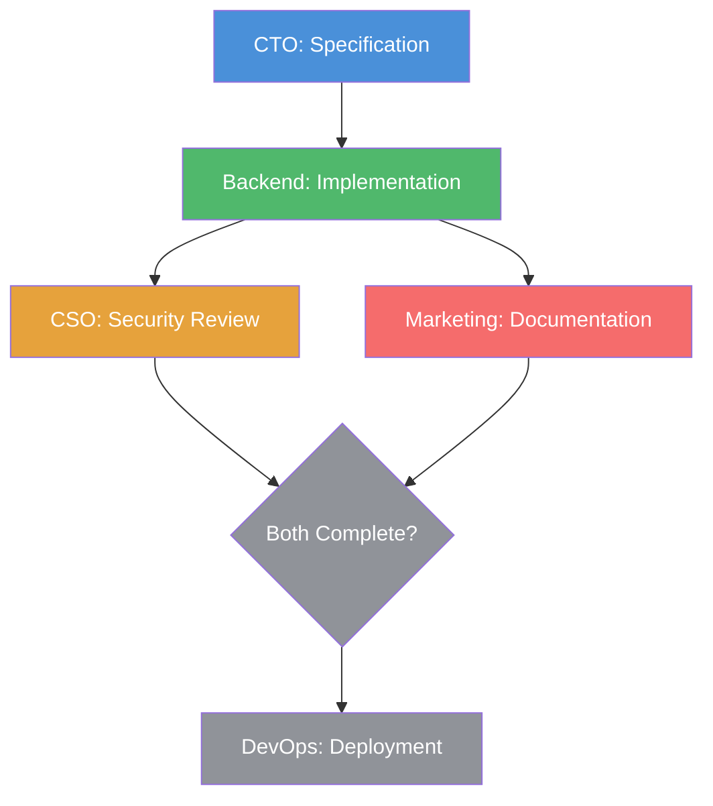

# Tutorial: Building a Multi-Agent Workflow Pipeline with NATS and agent.ceo

Most multi-agent systems treat task assignment as a single hop: one agent sends a task to another, and that is it. But production work is rarely one step. A feature request becomes a specification, then code, then a security review, then a deployment, then a blog post announcement. That is 5 agents touching one unit of work in sequence, with branching paths if any step fails.

At GenBrain AI, we run a 7-agent Cyborgenic Organization where pipelines like this execute daily. This tutorial walks through building a multi-agent workflow pipeline from scratch using NATS JetStream, covering real subject conventions, actual task payloads, dependency configuration, error handling, and retry patterns. Everything here runs in production at [agent.ceo](https://agent.ceo).

## Prerequisites

Before starting, you need:

- A NATS server with JetStream enabled (we run NATS 2.10+ on GKE)
- At least 2 agents connected to the NATS cluster
- Firestore or another state store for task persistence
- Familiarity with the [agent.ceo task lifecycle](/blog/task-lifecycle-cyborgenic-organization): `assigned` -> `accepted` -> `in_progress` -> `completed_unverified` -> `completed`

## Step 1: Define the Pipeline

A pipeline is a sequence of stages, where each stage maps to an agent role. Let us build a concrete example: the "Feature Ship" pipeline that takes a feature request from specification to production.

```yaml
pipeline: feature-ship
stages:
  - name: specification
    agent: cto
    timeout_minutes: 60
    output: spec_document
  - name: implementation
    agent: backend
    timeout_minutes: 180
    depends_on: specification
    input: spec_document
    output: pull_request_url
  - name: security_review
    agent: cso
    timeout_minutes: 45
    depends_on: implementation
    input: pull_request_url
    output: security_clearance
  - name: deployment
    agent: devops
    timeout_minutes: 30
    depends_on: security_review
    input: pull_request_url
    output: deployment_url
  - name: announcement
    agent: marketing
    timeout_minutes: 60
    depends_on: deployment
    input: deployment_url
    output: blog_post_url
```

Each stage declares its agent, timeout, dependencies, expected input, and expected output. The `depends_on` field creates the sequential flow. A stage will not start until its dependency has reached `completed` status.

```mermaid
flowchart LR
    A[CTO: Specification] --> B[Backend: Implementation]
    B --> C[CSO: Security Review]
    C --> D[DevOps: Deployment]
    D --> E[Marketing: Announcement]
    
    A -->|spec_document| B
    B -->|pull_request_url| C
    C -->|security_clearance| D
    D -->|deployment_url| E
    
    style A fill:#4a90d9,color:#fff
    style B fill:#50b86c,color:#fff
    style C fill:#e6a23c,color:#fff
    style D fill:#909399,color:#fff
    style E fill:#f56c6c,color:#fff
```



## Step 2: Set Up NATS Subjects

NATS subjects are the routing backbone. Every pipeline stage communicates through a structured subject namespace. Here is the convention we use across all 7 agents in our Cyborgenic Organization:

```
# Task assignment to a specific agent
genbrain.tasks.{agent_id}.assign

# Task status updates from an agent
genbrain.tasks.{agent_id}.status

# Pipeline orchestration events
genbrain.pipeline.{pipeline_id}.stage.{stage_name}

# Error and retry channels
genbrain.pipeline.{pipeline_id}.errors
genbrain.pipeline.{pipeline_id}.retry
```

For the Feature Ship pipeline, the concrete subjects look like this:

```
genbrain.tasks.cto.assign
genbrain.tasks.backend.assign
genbrain.tasks.cso.assign
genbrain.tasks.devops.assign
genbrain.tasks.marketing.assign

genbrain.pipeline.feature-ship-2026-1015.stage.specification
genbrain.pipeline.feature-ship-2026-1015.stage.implementation
genbrain.pipeline.feature-ship-2026-1015.stage.security_review
genbrain.pipeline.feature-ship-2026-1015.stage.deployment
genbrain.pipeline.feature-ship-2026-1015.stage.announcement
```

Create the JetStream stream that backs these subjects. JetStream provides persistence, replay, and exactly-once delivery -- critical for pipelines where a missed message means a dropped stage:

```bash
nats stream add PIPELINES \
  --subjects "genbrain.pipeline.>" \
  --retention limits \
  --max-msgs-per-subject 1000 \
  --max-age 72h \
  --storage file \
  --replicas 3 \
  --discard old
```

The `--max-age 72h` ensures pipeline state is retained for 3 days, long enough for any stage timeout plus investigation time. The `--replicas 3` provides durability across our 3-node NATS cluster. We documented the full NATS subject design in our [subject namespace design post](/blog/nats-subject-design-ai-agents-cyborgenic).

## Step 3: Create the Task Assignment Payload

Every pipeline stage starts with a task assignment. The task payload must carry enough context for the target agent to do its work without querying back to the orchestrator. Here is the real payload structure we use:

```json
{
  "task_id": "task_2026_1015_feat_ship_001_spec",
  "pipeline_id": "feature-ship-2026-1015",
  "stage": "specification",
  "title": "Write specification for user notification preferences",
  "description": "Create a technical specification for adding user notification preference controls to the dashboard. Include Firestore schema changes, API endpoints, and frontend components.",
  "assigned_to": "cto",
  "assigned_by": "ceo",
  "assigned_at": "2026-10-15T08:00:00Z",
  "priority": "high",
  "timeout_minutes": 60,
  "pipeline_context": {
    "origin": "founder_request",
    "request_id": "req_2026_1015_003",
    "previous_stage": null,
    "previous_output": null
  },
  "expected_output": {
    "type": "document",
    "key": "spec_document",
    "format": "markdown"
  },
  "status": "assigned"
}
```

Key fields to note:

- **`pipeline_context.previous_output`**: This is `null` for the first stage. For subsequent stages, it carries the output from the preceding stage -- a PR URL, a document path, a deployment URL. This is how data flows through the pipeline.
- **`expected_output`**: Tells the agent what it should produce. The orchestrator validates this output before advancing to the next stage.
- **`timeout_minutes`**: Each stage has its own timeout. If the agent does not complete within this window, the orchestrator triggers the error handling path.

## Step 4: Implement the Stage Transition Logic

When an agent completes a stage, it publishes a status update. The orchestrator subscribes to all status subjects and handles transitions. Here is the logic for advancing a pipeline:

```python
# Pipeline orchestrator -- runs as part of the CEO agent's session
import json
import nats

async def handle_stage_completion(msg):
    data = json.loads(msg.data)
    
    if data["status"] != "completed_unverified":
        return  # Only advance on completion
    
    pipeline_id = data["pipeline_id"]
    completed_stage = data["stage"]
    output = data["output"]
    
    # Load pipeline definition
    pipeline = await load_pipeline(pipeline_id)
    
    # Find the next stage
    next_stage = get_next_stage(pipeline, completed_stage)
    
    if next_stage is None:
        # Pipeline complete
        await publish(
            f"genbrain.pipeline.{pipeline_id}.stage.complete",
            {"pipeline_id": pipeline_id, "status": "completed", 
             "completed_at": utcnow()}
        )
        return
    
    # Build next task, passing output from completed stage as input
    next_task = {
        "task_id": f"{pipeline_id}_{next_stage['name']}",
        "pipeline_id": pipeline_id,
        "stage": next_stage["name"],
        "title": f"Pipeline stage: {next_stage['name']}",
        "assigned_to": next_stage["agent"],
        "assigned_by": "ceo",
        "assigned_at": utcnow(),
        "timeout_minutes": next_stage["timeout_minutes"],
        "pipeline_context": {
            "previous_stage": completed_stage,
            "previous_output": output
        },
        "status": "assigned"
    }
    
    # Publish assignment to the next agent
    await publish(
        f"genbrain.tasks.{next_stage['agent']}.assign",
        next_task
    )
    
    # Record transition in Firestore
    await firestore_update(
        f"pipelines/{pipeline_id}",
        {"current_stage": next_stage["name"],
         "stages_completed": firestore.ArrayUnion([completed_stage])}
    )

# Subscribe to all task status updates
sub = await nc.subscribe("genbrain.tasks.*.status", cb=handle_stage_completion)
```

The wildcard subscription `genbrain.tasks.*.status` captures status updates from every agent. The orchestrator filters for `completed_unverified` status, verifies the output, and then assigns the next stage. This is the same [delegation pattern](/blog/agent-delegation-patterns-cyborgenic) used for all task routing in the Cyborgenic Organization.

## Step 5: Configure Blocking and Dependencies

Not every pipeline is a simple linear chain. Some stages can run in parallel. For example, after implementation, the security review and a documentation update might happen simultaneously:



To support parallel stages, the pipeline definition uses arrays in `depends_on`:

```yaml
pipeline: feature-ship-parallel
stages:
  - name: specification
    agent: cto
    timeout_minutes: 60
  - name: implementation
    agent: backend
    timeout_minutes: 180
    depends_on: [specification]
  - name: security_review
    agent: cso
    timeout_minutes: 45
    depends_on: [implementation]
  - name: documentation
    agent: marketing
    timeout_minutes: 60
    depends_on: [implementation]
  - name: deployment
    agent: devops
    timeout_minutes: 30
    depends_on: [security_review, documentation]  # Both must complete
```

The orchestrator tracks completion of each dependency. The `deployment` stage only fires when both `security_review` and `documentation` have reached `completed` status. In Firestore, we track this with a simple counter:

```json
{
  "pipeline_id": "feature-ship-parallel-2026-1015",
  "stage": "deployment",
  "dependencies": ["security_review", "documentation"],
  "dependencies_completed": ["security_review"],
  "blocked": true
}
```

When `dependencies_completed` matches `dependencies`, the orchestrator clears the `blocked` flag and assigns the task.

## Step 6: Error Handling and Retry Patterns

Stages fail. Agents time out, produce invalid output, or encounter errors they cannot resolve. The pipeline needs to handle all of these without human intervention -- or with minimal human intervention when the error is truly novel.

We use 3 error handling strategies, applied in order:

**Strategy 1: Automatic Retry.** If a stage fails with a transient error (timeout, connection failure, model error), the orchestrator retries the assignment up to 3 times with exponential backoff. The retry payload includes the error from the previous attempt so the agent can adjust:

```json
{
  "task_id": "task_2026_1015_feat_ship_001_impl_retry2",
  "pipeline_id": "feature-ship-2026-1015",
  "stage": "implementation",
  "retry_count": 2,
  "max_retries": 3,
  "previous_error": {
    "type": "timeout",
    "message": "Agent did not complete within 180 minutes",
    "failed_at": "2026-10-15T14:05:00Z"
  },
  "assigned_to": "backend",
  "status": "assigned"
}
```

**Strategy 2: Escalation to Alternative Agent.** If the primary agent fails after 3 retries, the orchestrator checks whether another agent can handle the stage. In our Cyborgenic Organization, the Backend and Frontend agents share some capabilities. If Backend fails an implementation task 3 times, the orchestrator can reassign to Frontend as a fallback:

```
Subject: genbrain.tasks.frontend.assign
Payload: { ...same task..., "escalated_from": "backend", "reason": "3x timeout" }
```

**Strategy 3: Human Escalation.** If no alternative agent can handle the failure, the pipeline pauses and the CEO agent sends a notification to the founder. In 8 months of running pipelines, we have escalated to the founder 14 times. The most common cause is ambiguous requirements that no agent can resolve autonomously -- a problem that requires human judgment, not more retries.

Error events publish to the pipeline error subject for observability:

```
Subject: genbrain.pipeline.feature-ship-2026-1015.errors
Payload:
{
  "stage": "implementation",
  "error_type": "timeout",
  "retry_count": 3,
  "escalation": "frontend",
  "timestamp": "2026-10-15T14:10:00Z"
}
```

## Step 7: Monitoring Pipeline Progress

Every pipeline writes its state to Firestore, so monitoring is a matter of querying the right collection. But for real-time visibility, we also publish progress events to a dedicated NATS subject that the [agent dashboard](/blog/real-time-agent-dashboard-cyborgenic) subscribes to:

```
Subject: genbrain.pipeline.feature-ship-2026-1015.progress
Payload:
{
  "pipeline_id": "feature-ship-2026-1015",
  "total_stages": 5,
  "completed_stages": 3,
  "current_stage": "deployment",
  "current_agent": "devops",
  "started_at": "2026-10-15T08:00:00Z",
  "estimated_completion": "2026-10-15T12:30:00Z",
  "stages": [
    {"name": "specification", "status": "completed", "duration_min": 42},
    {"name": "implementation", "status": "completed", "duration_min": 156},
    {"name": "security_review", "status": "completed", "duration_min": 28},
    {"name": "deployment", "status": "in_progress", "started_at": "2026-10-15T11:45:00Z"},
    {"name": "announcement", "status": "pending"}
  ]
}
```

## Production Results

We have run 47 multi-stage pipelines since introducing this system in July 2026. The numbers:

- **Average pipeline completion time**: 4.7 hours for a 5-stage pipeline
- **Stage failure rate**: 8.3% (mostly timeouts on implementation stages)
- **Automatic retry success rate**: 71% (the failed stage succeeds on retry)
- **Human escalation rate**: 3.2% of all pipeline runs (14 out of 47 required founder input at some point)
- **Zero dropped stages**: JetStream's persistence ensures no message is lost, even during pod restarts

The most common pipeline is the 3-stage "content pipeline": CEO assigns topic, Marketing writes content, Marketing publishes. This pipeline runs 3 times per week and has completed 38 times without a single failure. The most complex pipeline is the 5-stage Feature Ship, which has run 9 times with 2 requiring human escalation.

## What We Learned

**Keep stages coarse.** Our first pipelines had 8-10 stages with fine-grained steps like "write tests," "run linter," "update changelog." These failed constantly because each handoff introduced latency and error surface. We collapsed them into 4-5 stages where each agent owns a meaningful chunk of work. Fewer stages, fewer failure points.

**Timeouts must be generous.** AI agents are not microservices. They think, read files, make mistakes, and retry internally. A stage that a human developer would estimate at 30 minutes routinely takes an agent 90 minutes because the agent explores multiple approaches. We set timeouts at 3x the expected duration and still hit them 8% of the time.

**Pipeline context prevents re-work.** The `pipeline_context.previous_output` field is critical. Without it, each agent would need to re-derive context from scratch -- querying Firestore, reading files, asking other agents what happened in the previous stage. Passing output forward through the pipeline eliminates 60-70% of the context-gathering overhead.

Building multi-agent pipelines in a Cyborgenic Organization is not about complex orchestration frameworks. It is about simple, reliable message passing with clear contracts between stages. NATS handles the transport. Firestore handles the state. The agents handle the work. The orchestrator just connects the dots.
