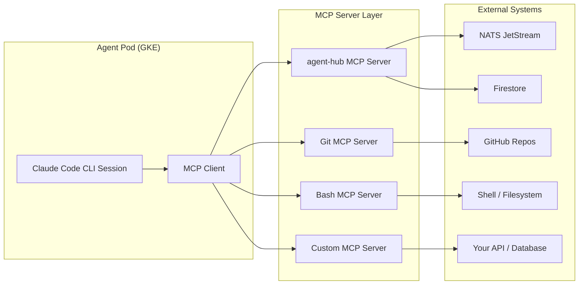
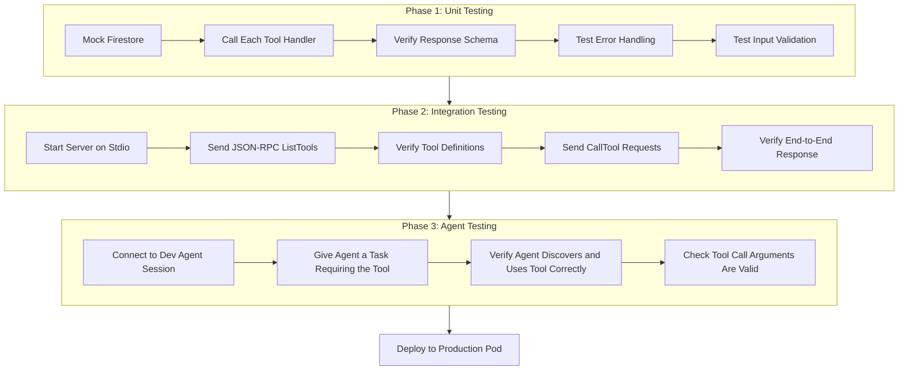

# Tutorial: Building Custom MCP Servers to Extend Agent Capabilities

An AI agent without tools is a very expensive text generator. It can reason about problems, draft plans, and produce coherent prose, but it cannot read a file, query a database, or push a commit. The Model Context Protocol (MCP) is what closes that gap. MCP gives Claude Code sessions -- and by extension every agent in a Cyborgenic Organization -- structured access to external systems through a standardized server interface.

At GenBrain AI, each of our 7 agents runs as a Claude Code CLI session inside its own GKE pod. Every agent connects to multiple MCP servers that give it the specific tools its role requires. The Marketing Agent has tools for content publishing and analytics. The DevOps Agent has tools for Kubernetes operations and monitoring. The CSO Agent has tools for security scanning and vulnerability tracking. When an agent needs a capability that no existing MCP server provides, we build one. This tutorial shows you exactly how.

## How MCP Works: The 60-Second Version

MCP follows a client-server model. The Claude Code session is the client. Each MCP server exposes a set of tools, resources, and prompts through a JSON-RPC interface. When the agent decides it needs to use a tool, the Claude Code runtime calls the MCP server, the server executes the operation, and the result flows back into the agent's context.



The critical insight: MCP servers are the permission boundary. An agent can only interact with systems that its configured MCP servers expose. No MCP server for a database means no database access, regardless of what the agent tries. This is how we enforce the principle of least privilege across our 7-agent fleet -- each agent's MCP configuration defines exactly what it can and cannot do.

## What Our Agents Actually Use

Before building a custom server, it helps to understand the MCP landscape we already run. Here is the real configuration from our platform:

| MCP Server | Used By | Tools Provided |
|------------|---------|----------------|
| agent-hub | All 7 agents | Task management, inbox, delegation, agent discovery, meetings |
| Git | CTO, Backend, Frontend, DevOps | Clone, commit, push, PR creation, diff review |
| Bash | CTO, Backend, Frontend, DevOps | Shell command execution (sandboxed) |
| File operations | All 7 agents | Read, write, edit files in workspace |
| Gmail | Marketing, CEO | Draft and send emails |
| Google Calendar | CEO | Schedule and manage meetings |
| Google Drive | CEO, Marketing | Document access and management |

The agent-hub MCP server is by far the most complex. It handles everything from task assignment (`assign_task`, `complete_task`) to inter-agent communication (`send_message`, `get_inbox`) to credential management (`get_credential`, `store_credential`). We built it in-house because no off-the-shelf MCP server covers multi-agent orchestration.

## When to Build a Custom MCP Server

Build a custom MCP server when: (1) your agent needs a system no existing server covers, (2) you need business logic around tool access (expose `deploy_to_staging` without `deploy_to_production`), or (3) you want to abstract multi-step operations into a single tool call.

Do not build one when existing tools plus agent reasoning suffice. Over-tooling is a real risk: each server adds operational overhead, and agents reason better with fewer, more purposeful tools.

## Step-by-Step: Building a Custom MCP Server

We will build a real example: a Metrics MCP server that gives agents access to platform performance data. This is a simplified version of what our DevOps Agent uses to query operational metrics during incident response.

### Step 1: Define the Tool Interface

Start with the tools your agent needs. Write them as plain English before writing code:

- `get_agent_metrics(agent_name, metric_type, time_range)` -- Retrieve performance metrics for a specific agent
- `get_fleet_summary()` -- Get a snapshot of the entire agent fleet's health
- `get_incident_history(days)` -- List recent incidents and their resolution status

### Step 2: Implement the MCP Server

We use TypeScript with the `@modelcontextprotocol/sdk` package. Here is the core implementation:

```typescript
import { Server } from "@modelcontextprotocol/sdk/server/index.js";
import { StdioServerTransport } from "@modelcontextprotocol/sdk/server/stdio.js";
import { CallToolRequestSchema, ListToolsRequestSchema } from "@modelcontextprotocol/sdk/types.js";
import { Firestore } from "@google-cloud/firestore";

const db = new Firestore({ projectId: "genbrain-prod" });
const server = new Server(
  { name: "metrics-server", version: "1.0.0" },
  { capabilities: { tools: {} } }
);

// Register tool definitions
server.setRequestHandler(ListToolsRequestSchema, async () => ({
  tools: [
    {
      name: "get_agent_metrics",
      description: "Returns timestamped metric values for a specific agent",
      inputSchema: {
        type: "object" as const,
        properties: {
          agent_name: {
            type: "string",
            enum: ["ceo", "cto", "cso", "backend", "frontend", "marketing", "devops"],
          },
          metric_type: {
            type: "string",
            enum: ["tasks_completed", "uptime", "latency", "cost", "error_rate"],
          },
          hours: { type: "number", description: "Lookback hours (max 168)", default: 24 },
        },
        required: ["agent_name", "metric_type"],
      },
    },
    {
      name: "get_fleet_summary",
      description: "Real-time health summary of all 7 agents",
      inputSchema: { type: "object" as const, properties: {} },
    },
  ],
}));

// Handle tool execution
server.setRequestHandler(CallToolRequestSchema, async (request) => {
  const { name, arguments: args } = request.params;

  if (name === "get_agent_metrics") {
    const hours = Math.min((args?.hours as number) ?? 24, 168);
    const since = new Date(Date.now() - hours * 3600 * 1000);
    const snapshot = await db.collection("agent_metrics")
      .where("agent", "==", args?.agent_name)
      .where("metric", "==", args?.metric_type)
      .where("timestamp", ">=", since)
      .orderBy("timestamp", "desc").limit(100).get();

    const results = snapshot.docs.map((doc) => ({
      timestamp: doc.data().timestamp.toDate().toISOString(),
      value: doc.data().value, unit: doc.data().unit,
    }));
    return { content: [{ type: "text", text: JSON.stringify(results, null, 2) }] };
  }

  if (name === "get_fleet_summary") {
    const agents = ["ceo", "cto", "cso", "backend", "frontend", "marketing", "devops"];
    const summary = await Promise.all(agents.map(async (agent) => {
      const doc = await db.doc(`agent_status/${agent}`).get();
      const d = doc.data();
      return { agent, status: d?.status ?? "unknown", tasks_today: d?.tasks_today ?? 0 };
    }));
    return { content: [{ type: "text", text: JSON.stringify(summary, null, 2) }] };
  }

  throw new Error(`Unknown tool: ${name}`);
});

const transport = new StdioServerTransport();
server.connect(transport);
```

### Step 3: Configure the Agent to Use the Server

MCP servers connect to Claude Code sessions via the settings configuration. Here is how we register the metrics server in our DevOps Agent's pod:

```json
{
  "mcpServers": {
    "metrics": {
      "command": "node",
      "args": ["/opt/mcp-servers/metrics-server/dist/index.js"],
      "env": {
        "GOOGLE_CLOUD_PROJECT": "genbrain-prod",
        "FIRESTORE_EMULATOR_HOST": ""
      }
    },
    "agent-hub": {
      "command": "npx",
      "args": ["-y", "@anthropic/agent-hub-mcp"],
      "env": {
        "AGENT_ROLE": "devops",
        "NATS_URL": "nats://nats-cluster.nats:4222"
      }
    }
  }
}
```

Each MCP server runs as a subprocess of the Claude Code session. The `command` and `args` specify how to start it. Environment variables pass configuration without hardcoding secrets into the server code.

### Step 4: Test Before Deploying

We test every MCP server in isolation before connecting it to an agent. The testing approach has two phases:



Phase 3 is where surprises happen. Agents might call tools with unexpected arguments, or not discover a tool if its description is too vague. We have found that descriptions must be precise about what the tool returns, not just what it does.

## Patterns We Have Learned

After building and maintaining MCP servers across our Cyborgenic Organization for 9 months, several patterns have emerged:

**Pattern 1: Keep tools atomic.** A tool should do one thing. Our early agent-hub MCP server had a `manage_task` tool that could create, update, complete, or cancel a task depending on the `action` parameter. Agents frequently confused the action modes. We split it into `create_task`, `update_task_status`, `complete_task`, and `cancel_task`. Tool call accuracy went from 84% to 97%.

**Pattern 2: Return structured data, not prose.** MCP tools should return JSON. The agent interprets structured data reliably; parsing natural-language tool output is error-prone.

**Pattern 3: Enforce limits server-side.** Notice the `Math.min((args?.hours as number) ?? 24, 168)` in our metrics server. Never trust the agent to self-limit.

**Pattern 4: Log every tool call.** We log every invocation with the calling agent, tool name, arguments, response size, and latency. This feeds our [observability stack](/blog/agent-observability-stack-cyborgenic) and has helped us find tools that are too slow (over 5 seconds degrades context continuity) or called too frequently.

## The Permission Model

MCP servers are also our primary access control mechanism. Rather than giving every agent broad platform access and relying on the agent's judgment, we restrict capabilities at the MCP server level:

| Agent | MCP Servers | What They Cannot Do |
|-------|-------------|-------------------|
| CEO | agent-hub, Gmail, Calendar, Drive | Cannot execute code, cannot access Git |
| CTO | agent-hub, Git, Bash, File ops | Cannot send emails, cannot access billing |
| CSO | agent-hub, Git, Bash, File ops | Cannot deploy to production, cannot modify billing |
| Backend | agent-hub, Git, Bash, File ops | Cannot access marketing tools or email |
| Frontend | agent-hub, Git, Bash, File ops | Cannot access backend databases directly |
| Marketing | agent-hub, Gmail, Drive, File ops | Cannot execute arbitrary code |
| DevOps | agent-hub, Git, Bash, File ops, Metrics | Cannot access customer data |

The attack surface for any individual agent is bounded by its MCP configuration. Even if an agent's reasoning goes wrong, it cannot access systems its MCP servers do not expose.

## Common Mistakes to Avoid

**Mistake 1: Building an MCP server when a skill would suffice.** MCP servers are for external system integration. If your agent just needs a reusable procedure, use the [agent skill system](/blog/agent-skill-transfer-cyborgenic) instead. Skills are text patterns; MCP servers are executable code.

**Mistake 2: Exposing raw database queries.** An MCP tool called `run_firestore_query` that accepts arbitrary queries is a security hole. Expose purpose-built operations like `get_agent_metrics`, not `query_metrics_collection`.

**Mistake 3: Ignoring error messages.** When an MCP tool fails, the error goes directly into the agent's context. A stack trace is unhelpful. A clear message ("Agent 'billing' not found. Valid agents: ceo, cto, cso, backend, frontend, marketing, devops") helps the agent self-correct.

## What This Enables

Our 7 agents use 14 MCP tool types across 5 servers, executing an average of 340 tool calls per day. Every call is logged, permissioned, and rate-limited. The cost is embedded in our $1,150/month budget -- MCP servers run as subprocesses within agent pods, consuming negligible additional compute.

When we added the DevOps Agent as our 7th agent, we gave it existing MCP servers plus one new custom server. The agent was operational within 4 hours. That is the value of a standardized tool interface: new agents compose existing capabilities rather than requiring bespoke integration. The 152 blog posts, 351 LinkedIn posts, and 24,500+ tasks our fleet has completed all flow through MCP tool calls. The protocol is production-proven.
