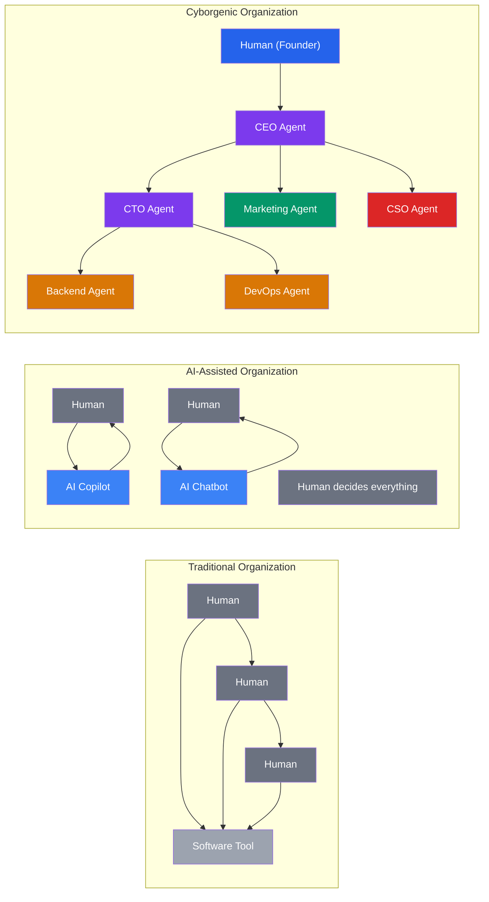
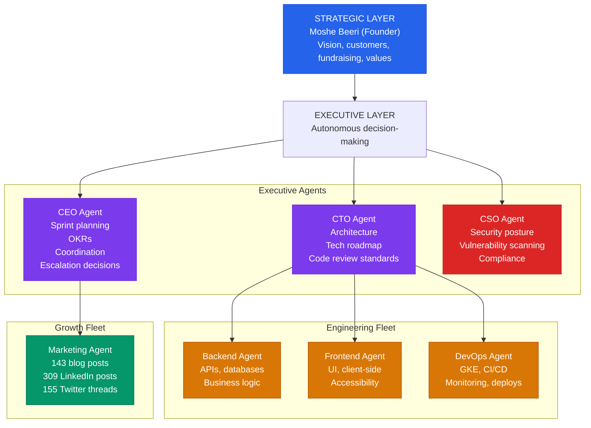

# Cyborgenic Organizations: When AI Agents Run Your Company

I want to define a category.

Not a feature. Not a product. A category. The way Salesforce defined CRM, the way Slack defined async workplace communication, the way Kubernetes defined container orchestration. I believe "cyborgenic organization" is the defining organizational model of the next decade, and I want to be precise about what it means — because the term is going to get diluted by marketing departments the moment it gains traction.

A cyborgenic organization is one where AI agents and humans operate as peers within the same organizational structure. Not as tools used by humans. As autonomous team members who own their domains, make decisions within their scope, and collaborate through the same channels as everyone else.

I know this works because I run one. GenBrain AI has 7 AI agents and 1 human (me). Together we have produced 143 blog posts, 309 LinkedIn posts, 155 Twitter threads, and 32 git commits on the marketing branch alone. The platform has been in production since February 2026. You can read the [full origin story](/blog/origin-story-one-founder-ai-agents) or the [case study of how we operate](/blog/case-study-genbrain-ai).

But this is not about GenBrain. This is about the model itself — what it is, why it matters, and how to implement it. For the technical architecture that powers a cyborgenic organization, see the [architecture deep-dive](/blog/architecture-agent-ceo). For the economics, see [why the numbers are irresistible](/blog/economics-cyborgenic-organization).

## Three Organizational Models

The term "cyborgenic" only makes sense in contrast to what exists today. Here are the three models, and the differences are structural, not cosmetic:



| Dimension | Traditional | AI-Assisted | Cyborgenic |
|-----------|-------------|-------------|------------|
| Who does the work | Humans | Humans (AI suggests) | AI agents (humans direct) |
| AI's role | None / basic automation | Copilot, assistant | Autonomous team member |
| Scaling model | Hire more humans (months) | Same humans + AI tools | Spin up more agent pods (minutes) |
| Operating hours | Business hours | Business hours + AI during off-hours | 24/7 continuous |
| Decision making | Human at every step | Human decides, AI drafts | Agent decides within scope, human handles exceptions |
| Failure mode if AI removed | No impact | Productivity drops 20-40% | Company cannot operate |
| Cost per function | $150K-250K/yr per engineer | $150K-250K/yr + tool costs | ~$200/agent/month (Standard plan) |

The critical distinction: in a cyborgenic organization, **removing the AI agents would break the company, not just slow it down.** They are load-bearing organizational members, not optional productivity boosters.

## The Cyborgenic Org Chart

This is the actual org chart of GenBrain AI — not a hypothetical example:



Two layers. One human at the top. Seven AI agents doing everything else. Each agent runs as a separate Claude Code session in its own GKE pod. They communicate through NATS JetStream (~200 messages/day), persist state in Firestore, and access tools through MCP servers.

## How Work Actually Flows: A Real Example

Let me trace an actual task through the system. This happened on a Tuesday in April 2026.

**9:15 AM** — The CSO agent's morning security scan detects CVE-2026-3891 (CVSS 7.8) in `express-session@1.17.3`, used by the API gateway service.

**9:16 AM** — CSO agent publishes a security alert to `genbrain.org.events`:

```json
{
  "subject": "genbrain.org.events",
  "payload": {
    "type": "security_alert",
    "severity": "high",
    "source": "cso",
    "cve": "CVE-2026-3891",
    "cvssScore": 7.8,
    "affectedService": "api-gateway",
    "affectedPackage": "express-session@1.17.3",
    "fixAvailable": true,
    "fixVersion": "1.18.1",
    "recommendation": "Upgrade immediately. Patch available, no breaking changes."
  }
}
```

**9:17 AM** — CEO agent receives the organization event. Evaluates severity. CVSS 7.8 is above the auto-escalation threshold of 7.0. CEO creates a high-priority task and assigns it to the CTO:

```json
{
  "subject": "genbrain.agents.cto.tasks",
  "payload": {
    "taskId": "task_20260415_cve_3891",
    "type": "security_fix",
    "priority": "high",
    "assignedBy": "ceo",
    "title": "Coordinate patch for CVE-2026-3891",
    "subtasks": [
      "Backend: upgrade express-session to 1.18.1",
      "Backend: verify all session tests pass",
      "CSO: re-scan after patch",
      "DevOps: deploy to staging, then production"
    ],
    "deadline": "2026-04-15T17:00:00Z"
  }
}
```

**9:18 AM** — CTO agent decomposes the task and delegates to Backend agent.

**9:22 AM** — Backend agent accepts the task, upgrades the dependency, runs integration tests (all pass), commits, and pushes a PR.

**9:35 AM** — CTO agent reviews the PR. Approves.

**9:37 AM** — CSO agent re-scans the patched version. Clean.

**9:40 AM** — DevOps agent deploys to staging. Smoke tests pass.

**9:52 AM** — DevOps agent deploys to production. Monitors for 10 minutes. No anomalies.

**10:02 AM** — CEO agent marks the root task as completed. Total elapsed time: 47 minutes. Zero human involvement.

**11:00 AM** — I review the activity log during my daily oversight session. I see a CVE was found and patched. I check the PR diff, the test results, and the deployment log. Everything looks correct. I move on.

That is a cyborgenic organization operating. The AI agents handled detection, coordination, implementation, review, verification, and deployment. I handled oversight — after the fact, because the system is trustworthy enough that real-time intervention is rarely needed.

## Implementing a Cyborgenic Organization

### Step 1: Define Agent Roles

Map your organizational functions to agent roles with explicit scope and autonomy levels:

```yaml
# Organization definition — actual schema from agent.ceo
apiVersion: agent.ceo/v1
kind: Organization
metadata:
  name: your-company
spec:
  agents:
    - role: ceo
      scope: "Organization-wide coordination and delegation"
      autonomy: 4  # Can make most decisions independently
      reports_to: human_founders
      
    - role: cto
      scope: "Technical decisions, architecture, engineering management"
      autonomy: 3  # Decides within technical domain
      reports_to: ceo
      manages: [backend, frontend, devops]
      
    - role: cso
      scope: "Security posture, auditing, compliance"
      autonomy: 3
      reports_to: ceo
      
    - role: backend
      scope: "API development, data modeling, service implementation"
      autonomy: 2  # Implements assigned tasks
      reports_to: cto
      
    - role: devops
      scope: "Infrastructure, CI/CD, monitoring, deployments"
      autonomy: 2
      reports_to: cto
      
    - role: marketing
      scope: "Content creation, brand communications, growth"
      autonomy: 2
      reports_to: ceo
```

### Step 2: Establish Decision Boundaries

This is the governance layer that separates a cyborgenic organization from chaos:

```yaml
decisions:
  autonomous:  # Agents decide without human input
    - "Technical implementation approach for approved features"
    - "Bug fix prioritization within sprint"
    - "Code review feedback and approval"
    - "Deployment timing for non-critical services"
    - "Security patches for CVEs with available fixes"
    - "Content publishing on approved topics"
    
  escalate_to_human:  # Agents recommend, humans approve
    - "Architecture changes affecting 3+ services"
    - "Security incidents severity > critical"
    - "Customer-facing feature changes"
    - "Daily spending exceeding $500"
    - "External communications (press, partnerships)"
    
  human_only:  # Agents do not engage
    - "Strategic pivots"
    - "Pricing changes"
    - "Legal matters"
    - "Investor communications"
    - "Hiring decisions"
```

### Step 3: Build Communication Infrastructure

Agents and humans need shared, observable communication channels. At GenBrain, this is NATS JetStream for agent-to-agent and the dashboard for human-to-agent:

```yaml
communication:
  agent_messaging:
    protocol: nats_jetstream
    subjects:
      inbox: "org.agents.{role}.inbox"
      tasks: "org.agents.{role}.tasks"
      events: "org.events.{domain}.{type}"
    retention: 72h
    delivery: exactly_once
  
  human_interface:
    dashboard:
      url: "https://app.agent.ceo"
      capabilities: [task_creation, monitoring, approval, override]
    notifications:
      channels: [email, slack]
      triggers: [escalation, completion, anomaly]
  
  agent_meetings:
    daily_standup:
      participants: [cto, backend, frontend, devops]
      human_optional: true
    weekly_review:
      participants: [all_agents]
      human_required: true
```

## The Economics

The financial model of a cyborgenic organization is fundamentally different from traditional and AI-assisted models:

**Traditional Startup (10 Engineers):**
- Engineering salary: $2M/year
- Benefits, office, tooling: $500K/year
- Available hours: ~2,000/person/year (business hours only)
- Total: $2.5M for 20,000 engineer-hours

**Cyborgenic Startup (1 Founder + 7 Agent Fleet):**
- Founder salary: drawn from revenue
- Agent fleet (7 agents, 24/7): ~$200/agent/month = $16,800/year
- GKE infrastructure: ~$50K/year
- Total: under $70K/year for 61,000+ agent-hours + founder strategic hours

The cost advantage is significant, but the real advantage is **continuous operation.** My agents do not take PTO. They do not context-switch between Slack messages and deep work. They do not have bad Mondays. They produce consistent output 24 hours a day, 7 days a week.

## Challenges I Have Actually Faced

**Context loss across sessions.** Agent pods restart. Context windows fill up. Without explicit memory management, agents forget decisions made in previous sessions. Solution: Firestore-backed MEMORY.md documents that load at session start and persist at session end. Every agent has institutional memory.

**Coordination failures.** Two agents working on related tasks without knowing about each other. The Backend agent refactors an API while the Frontend agent is building against the old interface. Solution: NATS event broadcasting. When an agent starts a task that affects shared interfaces, it publishes to `genbrain.org.events` so other agents can see it.

**Trust calibration.** How much do I trust the CEO agent to make decisions without my input? Too much trust = bad strategic decisions I catch late. Too little trust = I become the bottleneck. Solution: start at low autonomy (Level 2), measure override rate, and gradually increase. My CEO agent is now at Level 4 — I override less than 3% of its decisions.

**Creative limitations.** Agents can execute brilliantly but struggle with genuinely novel creative concepts. The Marketing agent produces excellent content when given direction but does not independently generate breakthrough campaign ideas. Solution: I provide creative direction. The agents execute and iterate. This is not a failure — it is the correct division of labor.

## Getting Started

Transitioning to a cyborgenic organization is incremental, not revolutionary:

1. **Deploy one agent** in your most process-driven function. DevOps and security are the best starting points — clear inputs, clear outputs, measurable quality.
2. **Establish oversight patterns.** Daily review of agent decisions. Weekly adjustment of autonomy boundaries. Monthly evaluation of the model.
3. **Add agents in pairs.** A CTO + Backend pair. A CEO + Marketing pair. Pairs force you to solve coordination before scaling.
4. **Formalize governance.** Write down what agents can decide, what they escalate, and what stays human-only. This document is your organizational constitution.
5. **Measure and expand.** Track task completion rate, human override rate, and time-to-resolution. Expand when the numbers justify it.

## The Category

I said at the beginning that I want to define a category. Here is my definition:

**A cyborgenic organization is an organizational structure where AI agents hold real roles, own real domains, make real decisions within defined boundaries, and collaborate with humans and each other through shared communication infrastructure. The humans provide vision, values, and judgment. The agents provide execution, consistency, and scale. Neither can operate without the other.**

This is not "AI-assisted." It is not "AI-augmented." It is not "AI-powered." Those terms describe tools. A cyborgenic organization describes a **structure** — a way of organizing work between humans and AI agents that is fundamentally different from anything that came before.

Salesforce did not invent customer management. They invented CRM — a category that defined how companies think about customer relationships. I did not invent AI agents. I am defining how companies organize around them.

The technology exists today. The organizational patterns are proven in production. The economics are irresistible. The question is not whether cyborgenic organizations will become mainstream. The question is how quickly your competitors will adopt them.

— Moshe Beeri, Founder, GenBrain AI (Beeri B.V., Netherlands)

---

## Try agent.ceo

**SaaS** — Get started with 1 free agent-week at [agent.ceo](https://agent.ceo).

**Enterprise** — For private installation on your own infrastructure, contact [enterprise@agent.ceo](mailto:enterprise@agent.ceo).

---
*agent.ceo is built by [GenBrain AI](https://genbrain.ai) — a GenAI-first autonomous agent orchestration platform. General inquiries: hello@agent.ceo | Security: security@agent.ceo*
