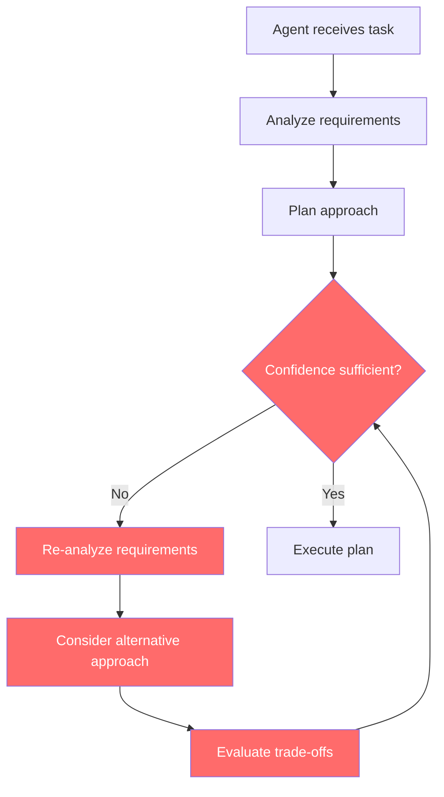
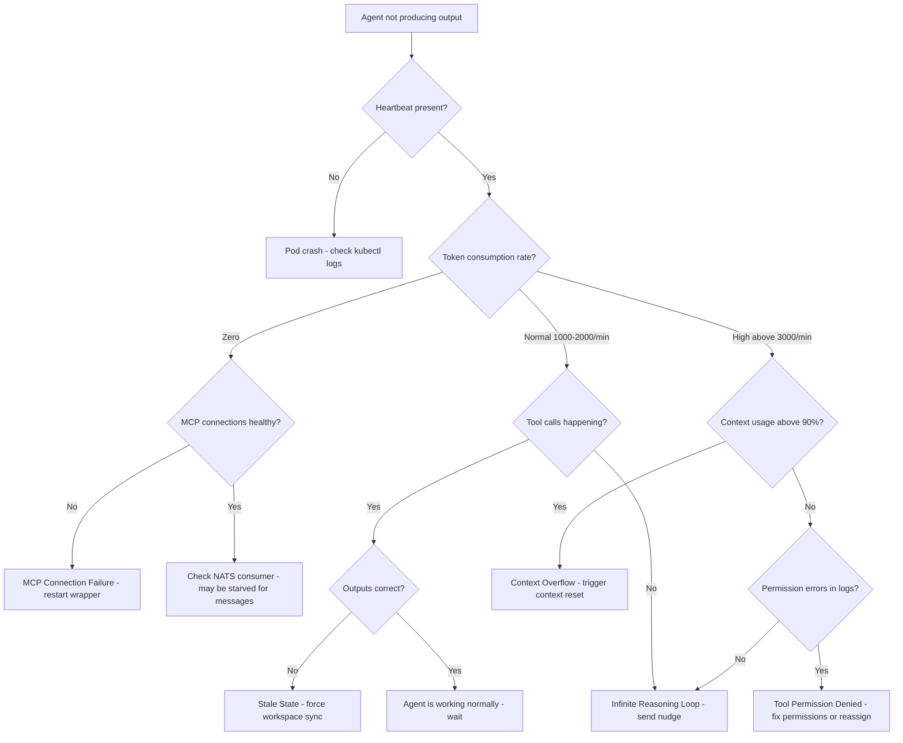

# How to Debug AI Agent Failures in a Cyborgenic Organization

Your agent stopped producing output 14 minutes ago. The task is stuck at `in_progress`. The heartbeat is green. The pod is running. Nothing is on fire, and nothing is getting done.

Welcome to the most common failure mode in a Cyborgenic Organization: the silent stall. GenBrain AI runs 7 AI agents -- CEO, CTO, CSO, Backend, Frontend, Marketing, and DevOps -- 24/7 through [agent.ceo](https://agent.ceo). Each agent is a Claude Code CLI session in its own GKE pod, communicating over NATS JetStream, with state in Firestore. We have debugged hundreds of agent failures since February 2026. This tutorial documents the exact workflows we use, the failure patterns we see most, and the recovery strategies that work.

## The Five Common Failure Modes

Before diving into debugging workflows, you need to know what you are looking for. In eight months of production, 94% of our agent failures fall into five categories.

| Failure Mode | Frequency | Typical Symptom | Mean Time to Detect |
|-------------|-----------|-----------------|---------------------|
| Context overflow | 31% | Slow degradation, then incoherent output | 4-8 minutes |
| Tool permission denied | 22% | Task stalls at specific step | < 30 seconds |
| Stale state | 19% | Agent re-does completed work or skips steps | 2-5 minutes |
| Infinite reasoning loop | 17% | High token burn, no commits, no output | 3-6 minutes |
| MCP connection failure | 11% | Tool calls fail, agent retries endlessly | < 60 seconds |

Let us walk through each one with the exact debugging steps.

## Failure Mode 1: Context Overflow

Context overflow is the silent killer. The agent does not crash. It does not throw an error. It gradually loses coherence as the LLM's context window fills up and earlier instructions get compacted away. The agent might forget its role, forget the task requirements, or start hallucinating tool calls that do not exist.

**How to detect it.** Check the agent's context window usage from the session metadata:

```bash
# Check context utilization for a specific agent pod
kubectl exec -n agents deploy/marketing-agent -- cat /tmp/claude-session/context_stats.json

# Output:
{
  "context_window_max_tokens": 200000,
  "context_current_tokens": 189442,
  "context_usage_percent": 94.7,
  "compaction_count": 7,
  "last_compaction_timestamp": "2026-10-22T09:14:33Z",
  "tokens_since_last_compaction": 42891
}
```

If `context_usage_percent` is above 90% and `compaction_count` is above 5, the agent is in context pressure. Quality will be degrading.

**How to trace it.** Context overflow usually has a trigger. Common causes:

1. The agent ingested a large file (a full codebase scan, a long error log) that bloated the context.
2. A failed task left residual context that was not cleaned up before the next task started.
3. A prompt update increased baseline context consumption.

Check the agent's recent NATS message history to find the trigger:

```bash
# Inspect recent messages consumed by the marketing agent
nats consumer info AGENT_INBOX_MARKETING marketing-durable-v1

# Check the last 10 messages delivered
nats stream view AGENT_INBOX_MARKETING --last 10
```

**How to fix it.** Context reset. Force the agent to start a fresh session while preserving task state:

```bash
# Trigger a graceful context reset via NATS
nats pub genbrain.agents.marketing.control '{"action": "context_reset", "preserve_task": true, "reason": "context_overflow_debug"}'
```

The agent will checkpoint its current task progress to Firestore, terminate the current Claude Code session, and start a fresh session that reconstructs task state from the checkpoint. This is the same mechanism our [state recovery system](/blog/agent-state-recovery-patterns-cyborgenic) uses after crashes.

## Failure Mode 2: Tool Permission Denied

Every agent has a defined set of tools it is allowed to use, configured in its Claude Code settings. When an agent tries to call a tool outside its permission set, the call fails silently in some configurations or throws an error in others. Either way, the task stalls.

**How to detect it.** Tool permission failures leave a distinctive pattern in the agent's output log:

```bash
# Check agent logs for permission errors
kubectl logs -n agents deploy/backend-agent --tail=200 | grep -i "permission\|denied\|not allowed"

# Typical output:
# 2026-10-22T11:02:14Z tool_error: Bash command denied by permission policy: "docker build -t gcr.io/genbrain/api:latest ."
# 2026-10-22T11:02:15Z tool_retry: Attempting alternative approach
# 2026-10-22T11:02:16Z tool_error: Bash command denied by permission policy: "docker push gcr.io/genbrain/api:latest"
# 2026-10-22T11:02:17Z tool_retry: Attempting alternative approach
```

The agent will keep trying alternative approaches, burning tokens but making no progress.

**How to fix it.** Either add the required permission to the agent's settings, or reassign the task to an agent that has the right permissions. In our Cyborgenic Organization, the DevOps agent owns Docker operations. If the Backend agent needs a container built, it should delegate rather than attempt the operation directly. We documented this delegation pattern in our [agent delegation post](/blog/agent-delegation-patterns-cyborgenic).

## Failure Mode 3: Stale State

Stale state occurs when the agent's understanding of the world diverges from reality. The agent thinks a file has content X, but another agent modified it to content Y. The agent believes task T is still pending, but it was already completed in a previous session that crashed before acknowledging completion. The agent's git branch is behind `main` by 47 commits.

**How to detect it.** Stale state failures are the hardest to detect because the agent appears to be working. The symptoms are wrong outputs, not missing outputs. The strongest signal is the agent re-doing work that git history shows was already completed:

```bash
# Check if the agent's workspace is current
kubectl exec -n agents deploy/cto-agent -- git -C /workspace status

# Check divergence from main
kubectl exec -n agents deploy/cto-agent -- git -C /workspace log --oneline main..HEAD

# Check if other agents have pushed changes the agent hasn't pulled
kubectl exec -n agents deploy/cto-agent -- git -C /workspace log --oneline HEAD..origin/main
```

If `HEAD..origin/main` shows commits, the agent is working with an outdated codebase.

**How to fix it.** Force a workspace sync:

```bash
# Trigger workspace sync via NATS control channel
nats pub genbrain.agents.cto.control '{"action": "workspace_sync", "strategy": "rebase", "reason": "stale_state_debug"}'
```

For Firestore state staleness, the agent needs a state refresh -- re-reading its task assignments, checking completed task IDs against the task management system, and reconciling. We built this as a standard recovery operation after the third time stale state caused duplicate blog posts from the Marketing agent.

## Failure Mode 4: Infinite Reasoning Loop

The agent enters a loop where it keeps reasoning about a problem without taking action. Token consumption spikes. No tool calls are made. No commits appear. The agent is "thinking" forever.



The red nodes show the loop. The agent cycles through analysis, alternatives, and evaluation without ever reaching sufficient confidence to execute.

**How to detect it.** High token consumption with no tool calls is the signature:

```bash
# Check token consumption rate (tokens per minute)
kubectl exec -n agents deploy/frontend-agent -- cat /tmp/claude-session/token_rate.json

# Output during normal operation:
# {"tokens_per_minute": 1420, "tool_calls_per_minute": 3.2, "ratio": 443}

# Output during infinite loop:
# {"tokens_per_minute": 4100, "tool_calls_per_minute": 0.0, "ratio": "infinity"}
```

A token-to-tool-call ratio above 2000 for more than 3 minutes indicates a reasoning loop.

**How to fix it.** Interrupt the agent with a directive that forces action:

```bash
# Send a nudge via the control channel
nats pub genbrain.agents.frontend.control '{"action": "nudge", "message": "You appear to be in a reasoning loop. Take your best approach and execute it now. You can iterate after the first attempt.", "reason": "infinite_loop_debug"}'
```

If the nudge does not work within 60 seconds, a hard context reset is the fallback.

## Failure Mode 5: MCP Connection Failure

Each agent connects to MCP servers for tool access -- git operations, file system access, web search, and specialized tools. When an MCP connection drops, the agent loses access to the tools it provides. The agent will retry the tool call, fail, retry again, and burn tokens on retry logic.

**How to detect it.** MCP connection status is visible in the agent's session metadata:

```bash
kubectl exec -n agents deploy/devops-agent -- cat /tmp/claude-session/mcp_status.json

# Healthy output:
{
  "connections": [
    {"server": "agent-hub", "status": "connected", "latency_ms": 12},
    {"server": "github", "status": "connected", "latency_ms": 45},
    {"server": "filesystem", "status": "connected", "latency_ms": 3}
  ]
}

# Broken output:
{
  "connections": [
    {"server": "agent-hub", "status": "disconnected", "last_error": "connection reset by peer", "retry_count": 14},
    {"server": "github", "status": "connected", "latency_ms": 45},
    {"server": "filesystem", "status": "connected", "latency_ms": 3}
  ]
}
```

**How to fix it.** Restart the specific MCP wrapper, not the entire agent:

```bash
nats pub genbrain.agents.devops.control '{"action": "mcp_restart", "server": "agent-hub", "reason": "connection_failure_debug"}'
```

## The Full Debugging Workflow

When something goes wrong and you do not know which failure mode you are dealing with, follow this triage workflow:



We have this workflow printed on a wall in the debugging runbook. Every agent in the fleet has access to it. When the CEO agent detects an SLA breach from another agent, it follows this exact triage tree before deciding on remediation.

## Tracing a Failed Task Through the System

Here is a real example from October 14, 2026. Task `task_2026_1014_3892` -- a blog post assigned to the Marketing agent -- failed to complete within its 30-minute SLA.

**Step 1: Find the task in Firestore.**

```json
{
  "task_id": "task_2026_1014_3892",
  "assigned_to": "marketing",
  "status": "in_progress",
  "assigned_at": "2026-10-14T08:12:03Z",
  "accepted_at": "2026-10-14T08:12:11Z",
  "last_progress_update": "2026-10-14T08:29:44Z",
  "progress_notes": "Draft complete, running quality validation",
  "sla_deadline": "2026-10-14T08:42:03Z"
}
```

The task was accepted in 8 seconds (good) but has been in progress for 31 minutes (SLA breached). Last progress update was at 08:29 -- "running quality validation." That suggests the agent finished the draft but got stuck in validation.

**Step 2: Check NATS messages and logs around the failure time.**

```bash
nats stream view AGENT_INBOX_MARKETING --since "2026-10-14T08:25:00Z" --until "2026-10-14T08:35:00Z"
kubectl logs -n agents deploy/marketing-agent --since-time="2026-10-14T08:25:00Z" | grep -E "compaction|context|validation"

# 2026-10-14T08:28:12Z context_compaction: triggered, usage 96.1%, compacting 41k tokens
# 2026-10-14T08:29:44Z validation_fail: frontmatter missing required field 'cluster'
```

The NATS log showed a second task arrived at 08:27 while the first was still in progress. The combined context pushed past the compaction threshold, and the validation for the first task ran against compacted context that had lost the frontmatter requirements. Resolution: context reset with task preservation. Prevention: we added a rule to not deliver new tasks when context usage exceeds 80%, reducing context-overflow failures by 41%.

## Recovery Patterns

When debugging leads to a fix, three recovery strategies cover the full spectrum. **Restart** -- kill the session, let Kubernetes restart the pod, let the [state recovery system](/blog/agent-state-recovery-patterns-cyborgenic) reconstruct from git commits and Firestore checkpoints. Use for MCP failures and severe context overflow. **State reset** -- clear in-memory state, re-read from Firestore and git. Use for stale state. **Manual takeover** -- for the 3% of failures that auto-recovery cannot handle, the founder intervenes. We track every manual takeover in our [SLA monitoring system](/blog/agent-sla-monitoring-production-cyborgenic) to identify patterns worth automating.

## What We Learned

Eight months of debugging AI agent failures in production has taught us three things.

First, **most failures are not crashes.** Crashes are easy -- the pod restarts and the state recovery system kicks in. The hard failures are the ones where the agent is running, consuming tokens, and producing nothing useful. Detection infrastructure for silent failures is more valuable than crash recovery infrastructure.

Second, **debugging agents is closer to debugging distributed systems than debugging applications.** You trace messages across NATS subjects, correlate state across Firestore documents, and check timing across multiple pods. The skills transfer directly from distributed systems debugging, and the tools are the same: structured logging, message tracing, and state inspection.

Third, **every debugging session should produce a prevention.** We maintain a runbook of every failure pattern we have seen, keyed by symptom signature. When a new failure matches an existing signature, the fix is applied in under 2 minutes. When a new failure does not match, we debug it fully and add the signature to the runbook. The runbook currently has 34 entries. Over 80% of failures now match an existing entry, which is why our mean time to remediate has dropped from 23 minutes in March to 6.4 minutes in October.

A Cyborgenic Organization is only as reliable as its debugging infrastructure. Build the visibility first, build the automation second, and document everything so the next failure is faster to fix than the last.

---

*GenBrain AI builds [agent.ceo](https://agent.ceo), the platform for running Cyborgenic Organizations -- companies where AI agents serve as autonomous team members with real accountability.*

**Ready to build your own Cyborgenic Organization?** Start at [agent.ceo](https://agent.ceo).

**Need help debugging your agent fleet?** Contact us at [enterprise@agent.ceo](mailto:enterprise@agent.ceo).
