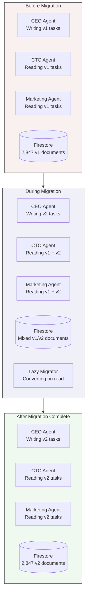
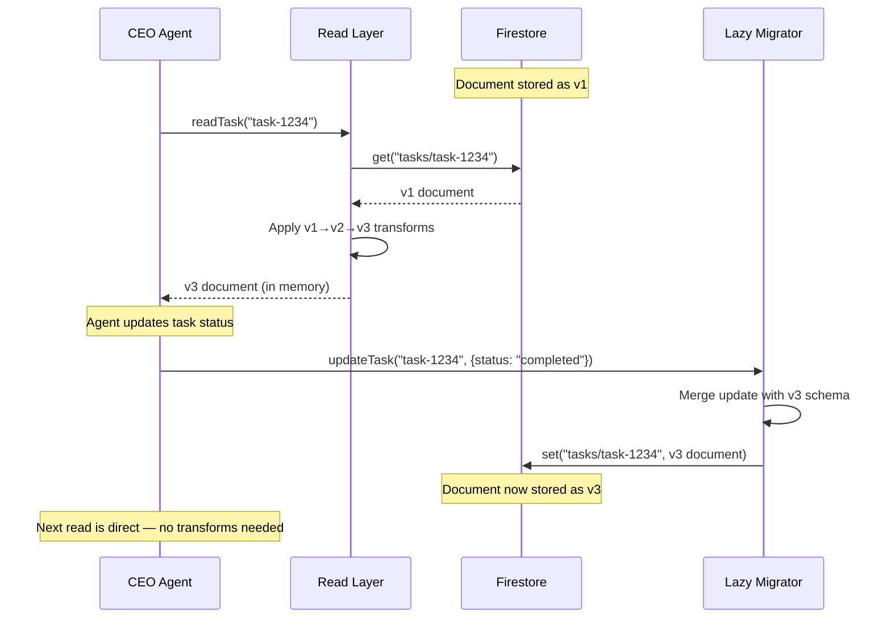
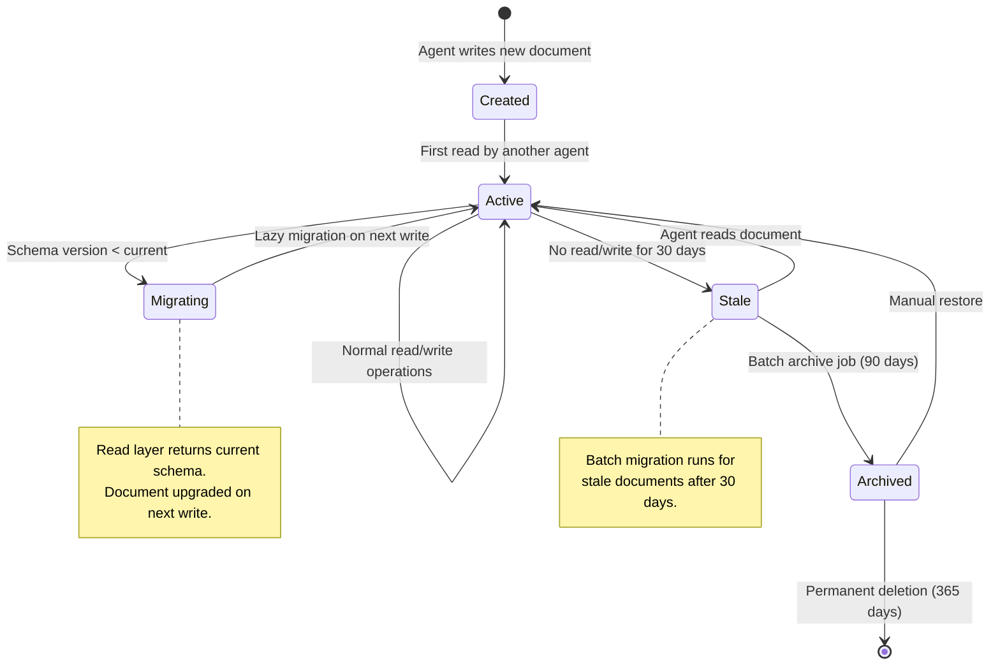

# Schema Evolution in Firestore: How We Migrate Data Without Downtime in a Cyborgenic Organization

Firestore does not enforce schemas. That sounds like freedom until you run 7 agents reading and writing the same collections 24/7 for 11 months, and you need to change the shape of a document that 4 agents depend on. Then it sounds like a disaster waiting to happen.

GenBrain AI is the company behind [agent.ceo](https://agent.ceo), and we run a production [Cyborgenic Organization](/blog/cyborgenic-organizations) where every agent -- CEO, CTO, CSO, Backend, Frontend, Marketing, and DevOps -- uses Firestore as its persistent state store. Since February 2026, we have executed 34 schema migrations across our core collections. Zero of them required downtime. Zero of them caused data loss. Three of them caused temporary bugs that were caught by our validation layer within 90 seconds.

This post covers exactly how we do it: the versioning strategy, the lazy migration pattern, the backward-compatible read layer, and the real document schemas that make it work.

## The Problem: 7 Agents, 1 Database, Continuous Writes

In a traditional application, you plan a maintenance window, run your migration script, deploy the new code, and move on. In a Cyborgenic Organization, there is no maintenance window. The CEO agent is assigning tasks at 3 AM. The Marketing agent is publishing content at 6 AM. The DevOps agent is monitoring infrastructure around the clock. The CTO agent is reviewing pull requests during every working hour.

When we needed to change the task document schema in September 2026 -- adding a `priority` field, restructuring `assignee` from a string to an object with role and agentId, and deprecating the `dueDate` field in favor of `sla.deadline` -- we had 2,847 existing task documents and 4 agents actively creating new ones.

Stopping all agents for a migration was not an option. Our [agent state management](/blog/agent-state-management-firestore-cyborgenic) system depends on continuous availability. A 5-minute outage means the CEO agent loses track of task assignments, the Marketing agent misses publishing windows, and the DevOps agent stops responding to alerts.

We needed a migration strategy that works while every agent keeps reading and writing.



## Our Document Schema Versioning Strategy

Every document in our core collections carries a `_schemaVersion` field. This is the foundation of the entire migration system. Here is what our task document looked like at version 1, and what it looks like at version 3 (current):

```typescript
// Task Document — Schema v1 (February 2026)
interface TaskDocV1 {
  _schemaVersion: 1;
  taskId: string;
  title: string;
  description: string;
  assignee: string;              // e.g., "marketing"
  status: "pending" | "in_progress" | "completed" | "failed";
  dueDate: Timestamp;
  createdAt: Timestamp;
  updatedAt: Timestamp;
  createdBy: string;
}

// Task Document — Schema v3 (current, January 2027)
interface TaskDocV3 {
  _schemaVersion: 3;
  taskId: string;
  title: string;
  description: string;
  assignee: {
    agentId: string;             // e.g., "agent-marketing-prod"
    role: string;                // e.g., "marketing"
    assignedAt: Timestamp;
  };
  status: "pending" | "assigned" | "in_progress" | "blocked"
        | "completed" | "failed" | "cancelled";
  priority: "critical" | "high" | "medium" | "low";
  sla: {
    deadline: Timestamp;
    warningThreshold: number;    // minutes before deadline
    escalationTarget: string;    // agent to escalate to
  };
  dependencies: string[];        // taskIds this task depends on
  metadata: {
    source: string;              // "manual" | "automated" | "escalation"
    parentTaskId?: string;
    retryCount: number;
  };
  createdAt: Timestamp;
  updatedAt: Timestamp;
  createdBy: string;
}
```

Version 2 was an intermediate step in September 2026 that added `priority` and restructured `assignee`. Version 3, deployed in December 2026, added the `sla` object, `dependencies` array, and `metadata` block.

The rule is simple: the `_schemaVersion` field must be present on every document, and it must be an integer. Agents check this field before processing any document.

## The Backward-Compatible Read Layer

The core of our migration system is a read layer that sits between every agent and Firestore. When an agent reads a document, the read layer checks `_schemaVersion` and applies transformation functions to bring the document up to the current version. The agent always sees the latest schema, regardless of what version is stored in the database.

```typescript
// schema-migrator.ts — the backward-compatible read layer
const CURRENT_VERSION = 3;

type MigrationFn = (doc: FirebaseFirestore.DocumentData) => FirebaseFirestore.DocumentData;

const migrations: Record<number, MigrationFn> = {
  // v1 → v2: restructure assignee, add priority
  1: (doc) => ({
    ...doc,
    _schemaVersion: 2,
    assignee: {
      agentId: `agent-${doc.assignee}-prod`,
      role: doc.assignee,
      assignedAt: doc.createdAt,
    },
    priority: "medium",  // default for existing tasks
    status: doc.status === "pending" ? "assigned" : doc.status,
  }),

  // v2 → v3: add sla, dependencies, metadata
  2: (doc) => ({
    ...doc,
    _schemaVersion: 3,
    sla: {
      deadline: doc.dueDate || Timestamp.fromDate(
        new Date(Date.now() + 7 * 24 * 60 * 60 * 1000)
      ),
      warningThreshold: 60,
      escalationTarget: "agent-ceo-prod",
    },
    dependencies: [],
    metadata: {
      source: "manual",
      retryCount: 0,
    },
  }),
};

export async function readTask(
  db: Firestore, taskId: string
): Promise<TaskDocV3> {
  const snap = await db.collection("tasks").doc(taskId).get();
  if (!snap.exists) throw new Error(`Task ${taskId} not found`);

  let data = snap.data()!;
  const storedVersion = data._schemaVersion ?? 1;

  // Apply migration chain: v1 → v2 → v3
  for (let v = storedVersion; v < CURRENT_VERSION; v++) {
    if (migrations[v]) {
      data = migrations[v](data);
    }
  }

  return data as TaskDocV3;
}
```

This migration chain is sequential and composable. A v1 document goes through the v1 migrator (producing v2), then through the v2 migrator (producing v3). A v2 document skips the first step. A v3 document passes through untouched.

The read layer runs in-memory. It does not write back to Firestore on read. That is deliberate -- we do not want every read operation to trigger a write, which would double our Firestore costs and create write contention.

## Lazy Migration: Converting on Write

The read layer handles backward compatibility. The lazy migrator handles forward progress. Whenever an agent writes to a document that is below the current schema version, the write includes the upgraded schema.



The lazy migrator wraps all write operations:

```typescript
export async function updateTask(
  db: Firestore, taskId: string,
  updates: Partial<TaskDocV3>
): Promise<void> {
  const current = await readTask(db, taskId); // always v3
  const merged = {
    ...current,
    ...updates,
    _schemaVersion: CURRENT_VERSION,
    updatedAt: Timestamp.now(),
  };

  await db.collection("tasks").doc(taskId).set(merged);
}
```

This means documents migrate organically. Every time an agent touches a document, it gets upgraded. Documents that are never touched again stay at their old version, but the read layer handles them transparently.

We track migration progress with a simple Cloud Function that runs hourly:

```typescript
// migration-progress.ts — runs every hour via Cloud Scheduler
export async function checkMigrationProgress(
  db: Firestore, collection: string
): Promise<MigrationReport> {
  const versionCounts: Record<number, number> = {};
  const snapshot = await db.collection(collection).get();

  snapshot.forEach((doc) => {
    const v = doc.data()._schemaVersion ?? 1;
    versionCounts[v] = (versionCounts[v] || 0) + 1;
  });

  return {
    collection,
    totalDocuments: snapshot.size,
    versionDistribution: versionCounts,
    migrationComplete: Object.keys(versionCounts).length === 1
      && versionCounts[CURRENT_VERSION] === snapshot.size,
    timestamp: new Date().toISOString(),
  };
}
```

For our September 2026 task migration (v1 to v2), the lazy migration reached 90% completion in 72 hours and 99% in 12 days. The remaining 1% -- 28 documents -- were historical tasks that no agent ever touched again. We ran a one-time batch migration for those after 30 days.

## What Happens When Migrations Go Wrong

Three of our 34 migrations caused bugs. Each one taught us something.

**Migration 7 (July 2026): The Missing Default.** We added a `priority` field to task documents with a default of `null` instead of `"medium"`. The CEO agent's task sorting function used `priority` as a sort key without null-checking. Result: 14 tasks sorted incorrectly for 90 seconds before our validation layer caught the null values and alerted the DevOps agent, which applied a hotfix default.

**Migration 19 (October 2026): The Timestamp Type Mismatch.** A migration function converted a Firestore `Timestamp` to a JavaScript `Date` object by accident. The Marketing agent wrote the `Date` back to Firestore, which stored it as a map `{seconds: ..., nanoseconds: ...}` instead of a native Timestamp. Reads on that document broke for 3 minutes until the validation layer flagged the type inconsistency. We fixed it by adding a type assertion to the migration function.

**Migration 28 (December 2026): The Circular Dependency.** We added a `dependencies` field to tasks, and a migration function populated it by querying other documents. One batch of 6 tasks had circular references -- Task A depended on Task B, which depended on Task A. The CEO agent's dependency resolver entered an infinite loop that consumed its entire context window. Recovery took 4 minutes. We added cycle detection to the migration function and a maximum depth of 10 to the dependency resolver.

## Document Lifecycle: From Creation to Archive

Every document in our system follows a lifecycle that intersects with schema evolution:



Our archival policy interacts with schema migration in an important way. Documents that sit untouched for 30 days are unlikely to be lazily migrated. We run a batch migration for stale documents on a 30-day cycle. This batch job processed 412 documents in January 2027, upgrading them from v2 to v3 before they hit the 90-day archive threshold. The batch migrator queries documents where `_schemaVersion < CURRENT_VERSION`, applies the migration chain in a Firestore batch write, and commits. Simple, predictable, and it processes up to 500 documents per run.

We also run a validation layer on every write that checks schema version validity, required field presence, type correctness (Timestamps must be native Firestore objects, not `Date` or `number`), and referential integrity. In 11 months, this layer has caught 47 issues -- 31 during migration rollouts, 16 from runtime bugs. Average detection time: 22 seconds from write to alert.

## The Numbers

Here is where we stand after 11 months and 34 migrations:

| Metric | Value |
|--------|-------|
| Total schema migrations executed | 34 |
| Migrations causing downtime | 0 |
| Migrations causing data loss | 0 |
| Migrations causing temporary bugs | 3 |
| Average bug detection time | 52 seconds |
| Maximum bug detection time | 4 minutes (circular dependency) |
| Total documents managed | 18,400+ |
| Collections with versioned schemas | 7 |
| Lazy migration completion (90% threshold) | 72 hours avg |
| Lazy migration completion (99% threshold) | 12 days avg |
| Batch migrations needed for stragglers | 8 |
| Firestore write cost increase from migrations | 3.2% |

## What We Learned

**Version everything from day one.** We added `_schemaVersion` to our very first Firestore documents in February 2026. If we had not, the first migration would have required us to touch every document just to add the version field. That would have been our most expensive migration by far.

**Lazy beats eager for live systems.** Eager migration -- running a batch job to convert every document immediately -- creates write spikes that can hit Firestore rate limits (500 writes/sec sustained per collection). Lazy migration spreads the cost over days, and most documents get converted through normal agent operations without any additional writes.

**Migration functions must be idempotent.** An agent can read a document, apply the migration in memory, and then fail before writing it back. The next agent picks up the same un-migrated document. If the migration function is not idempotent -- if it appends to an array instead of setting it, for example -- you get duplicated data. Every migration function must produce the same output given the same input, regardless of how many times it runs.

**Test migrations against production snapshots.** We export a snapshot of each collection to a test Firestore instance before deploying any migration. The migration runs against real data, not synthetic test fixtures. This caught the timestamp type mismatch (Migration 19) in testing, but we deployed it anyway because the test failure looked like a false positive. It was not.

**Keep old migration functions forever.** We still have the v1-to-v2 migration function in our codebase even though zero v1 documents exist in production. If a backup restore ever brings back old documents, the migration chain handles them automatically. The cost of keeping dead code is near zero. The cost of losing a migration function is a production incident.

Schema evolution in a [Firestore-backed agent platform](/blog/firestore-state-store-ai) is not a one-time project. It is an ongoing discipline. Every feature that touches document structure goes through the same process: add a version, write the migration function, deploy the read layer, let lazy migration do its work, and clean up stragglers with a batch job. After 34 iterations, the process takes less than 2 hours from design to deployment. The hardest part is no longer the migration itself -- it is deciding what the next version of the schema should look like.
