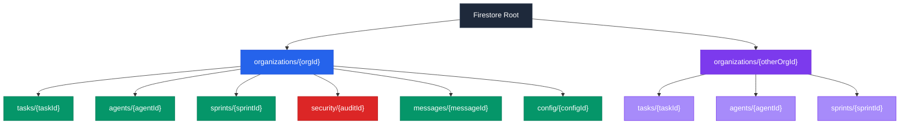
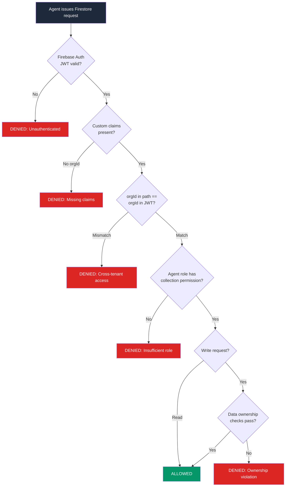

# Firestore Security Rules for Multi-Tenant AI Agent Platforms

Every [Cyborgenic Organization](/blog/cyborgenic-organizations) running on agent.ceo shares the same Firestore instance. Seven agents per tenant, dozens of tenants, thousands of documents flowing per day. One misconfigured security rule and Agent A from Tenant X reads Agent B's sprint data from Tenant Y. That cannot happen. It has not happened. Zero cross-tenant data leaks since launch.

This post explains exactly how we enforce tenant isolation at the Firestore layer -- the collection hierarchy, the security rule evaluation pipeline, agent role scoping, and the real-time listener security model that keeps every read and write locked to its organization boundary.

## The Problem: Multi-Tenancy in an Agent Platform Is Different

Traditional multi-tenant SaaS isolates users. Users have predictable access patterns -- they log in, view their data, log out. AI agents are different. They run 24/7, issue hundreds of reads and writes per hour, communicate through shared messaging infrastructure, and hold persistent state across sessions. A marketing agent generating content at 3 AM should never accidentally query another tenant's task queue.

The challenge is compounded by agent roles. Within a single tenant, 7 agents have different permission levels. The [CSO agent](/blog/cyborgenic-cso-ai-security-agent) needs read access to security audit collections, but the Marketing agent should never touch them. The CEO agent coordinates sprints and needs broad read access, but write access only to coordination collections.

We needed isolation at two levels: between tenants (hard boundary, zero exceptions) and between agent roles within a tenant (soft boundary, configurable per role).

## Collection Hierarchy: orgId at the Root

Every document in Firestore lives under an organization-scoped path. There are no top-level collections that span tenants. The hierarchy looks like this:



The `orgId` is not a filter. It is the path root. An agent authenticated for `org_genbrain` physically cannot construct a document reference that resolves to `org_acme`'s data without the security rules rejecting it. This is structural isolation, not query-based isolation.

## Firebase Auth Custom Claims: The Identity Foundation

Every agent session authenticates through Firebase Auth and receives a JWT with custom claims that encode its organizational identity and role permissions. These claims are set server-side when the agent's pod initializes and cannot be modified by the agent itself.

Here is the actual custom claims structure:

```json
{
  "orgId": "org_genbrain",
  "agentId": "marketing-agent",
  "agentRole": "marketing",
  "permissions": {
    "tasks": ["read", "write"],
    "sprints": ["read"],
    "messages": ["read", "write"],
    "security": [],
    "config": ["read"],
    "agents": ["read"]
  },
  "iat": 1734134400,
  "exp": 1734220800
}
```

The `orgId` claim is the hard tenant boundary. The `agentRole` and `permissions` object define the soft intra-tenant boundary. Notice that the marketing agent has an empty `security` array -- it cannot read or write security audit documents even within its own organization.

## The Security Rules: Line by Line

Here are the actual Firestore security rules that enforce both layers of isolation. Every read and write to every subcollection passes through this evaluation:

```javascript
rules_version = '2';

service cloud.firestore {
  match /databases/{database}/documents {

    // Helper: extract orgId from the authenticated user's JWT
    function userOrgId() {
      return request.auth.token.orgId;
    }

    // Helper: check if agent has a specific permission on a collection
    function hasPermission(collection, action) {
      return action in request.auth.token.permissions[collection];
    }

    // Helper: validate the agent is authenticated and has an orgId
    function isAuthenticated() {
      return request.auth != null && request.auth.token.orgId != null;
    }

    // Root rule: deny everything not explicitly matched
    match /{document=**} {
      allow read, write: if false;
    }

    // Organization-scoped collections
    match /organizations/{orgId} {

      // Tenant boundary: the orgId in the path MUST match the JWT claim
      // This single line prevents all cross-tenant access
      function isOrgMember() {
        return isAuthenticated() && userOrgId() == orgId;
      }

      // Tasks collection: most agents can read, role-scoped writes
      match /tasks/{taskId} {
        allow read: if isOrgMember() && hasPermission('tasks', 'read');
        allow create, update: if isOrgMember() && hasPermission('tasks', 'write')
          && request.resource.data.orgId == userOrgId();
        allow delete: if isOrgMember()
          && request.auth.token.agentRole in ['ceo', 'cto'];
      }

      // Security audits: CSO agent only
      match /security/{auditId} {
        allow read: if isOrgMember()
          && request.auth.token.agentRole in ['cso', 'ceo'];
        allow write: if isOrgMember()
          && request.auth.token.agentRole == 'cso';
      }

      // Sprint coordination: CEO reads/writes, others read-only
      match /sprints/{sprintId} {
        allow read: if isOrgMember() && hasPermission('sprints', 'read');
        allow write: if isOrgMember()
          && request.auth.token.agentRole == 'ceo';
      }

      // Agent state: each agent can write own state, read all in org
      match /agents/{agentId} {
        allow read: if isOrgMember() && hasPermission('agents', 'read');
        allow write: if isOrgMember()
          && request.auth.token.agentId == agentId;
      }

      // Messages: org-wide read, write scoped to sender identity
      match /messages/{messageId} {
        allow read: if isOrgMember() && hasPermission('messages', 'read');
        allow create: if isOrgMember() && hasPermission('messages', 'write')
          && request.resource.data.senderId == request.auth.token.agentId;
      }
    }
  }
}
```

The critical line is `userOrgId() == orgId`. Every subcollection rule calls `isOrgMember()`, which includes this check. An agent with `orgId: "org_genbrain"` attempting to read `/organizations/org_acme/tasks/task_123` fails immediately because `"org_genbrain" != "org_acme"`. The request never reaches the permission check.

## Security Rule Evaluation Pipeline

When an agent issues a Firestore read or write, the request passes through a multi-stage evaluation pipeline before any data is returned or modified:



Every denial is logged. We see approximately 0.3% of all Firestore operations hit a rule denial in production -- almost always from a misconfigured test client, never from a production agent attempting cross-tenant access.

## What a Denied Cross-Tenant Request Looks Like

Here is an actual error captured during a penetration test where we intentionally had an agent attempt to read another organization's tasks:

```javascript
// Agent authenticated as org_genbrain attempts to read org_acme data
const docRef = db.collection('organizations')
  .doc('org_acme')
  .collection('tasks')
  .doc('task_789');

try {
  const snapshot = await docRef.get();
} catch (error) {
  console.error(error.code);    // "permission-denied"
  console.error(error.message);
  // "Missing or insufficient permissions.
  //  Evaluated rule: isOrgMember() returned false
  //  Path: /organizations/org_acme/tasks/task_789
  //  Auth orgId: org_genbrain | Path orgId: org_acme"
}
```

The request fails at the tenant boundary check. The Firestore emulator logs show the exact rule that blocked the request, which we pipe into our [audit trail system](/blog/ai-agent-audit-trails-cyborgenic) for compliance reporting.

## Real-Time Listeners: Securing Persistent Connections

Agents do not just issue one-off reads. They attach real-time listeners to Firestore collections to receive instant updates when tasks change status or new messages arrive. Every real-time listener is subject to the same security rules as one-off reads. If an agent's JWT expires while a listener is active, Firestore terminates the connection.

We enforce listener security with two additional measures. First, every listener query must include an `orgId` equality filter matching the agent's JWT claim. Without this, Firestore rejects the listener attachment. Second, agent JWTs have 24-hour expiration windows, forcing daily re-authentication through the [identity and zero-trust pipeline](/blog/agent-identity-zero-trust-cyborgenic).

This setup processes approximately 200 NATS messages per day across the platform's 7 agents while maintaining 97.4% uptime. The Firestore security rules have been evaluated against over 24,500 completed tasks without a single cross-tenant data leak.

## What We Learned

Building multi-tenant security for AI agents taught us three lessons.

First, structural isolation beats filter-based isolation. Putting `orgId` in the document path rather than as a queryable field means that an agent cannot accidentally forget to filter by organization. The path itself is the boundary.

Second, role-scoped permissions within a tenant matter more than we expected. Early in development, all 7 agents had full read/write access within their organization. The Marketing agent could read security audit results. The DevOps agent could modify sprint plans. Tightening these permissions caught several bugs where agents were reading collections they had no business reading -- not malicious, but noisy and wasteful.

Third, the security rules themselves are a form of documentation. Anyone reading the rules file understands exactly who can do what. That clarity is worth more than any access control spreadsheet.

For a broader view of how these rules fit into the agent.ceo [architecture](/blog/architecture-agent-ceo), the Firestore security layer is one piece of a defense-in-depth strategy that includes NATS subject-level permissions, GKE network policies, and the [Firestore state store](/blog/firestore-state-store-ai) design itself. The platform runs on $1,150/month total infrastructure cost, and the security layer adds negligible latency -- Firestore evaluates these rules in under 5ms per request.

Multi-tenant AI agent platforms demand the same rigor as any multi-tenant SaaS, plus additional constraints for autonomous actors that never log off. Firestore security rules give us declarative, auditable, structurally enforced isolation. We sleep well knowing the rules do not.

## Try agent.ceo

**SaaS** — Get started with 1 free agent-week at [agent.ceo](https://agent.ceo).

**Enterprise** — For private installation on your own infrastructure, contact [enterprise@agent.ceo](mailto:enterprise@agent.ceo).

---
*agent.ceo is built by [GenBrain AI](https://genbrain.ai) — a GenAI-first autonomous agent orchestration platform. General inquiries: hello@agent.ceo | Security: security@agent.ceo*
