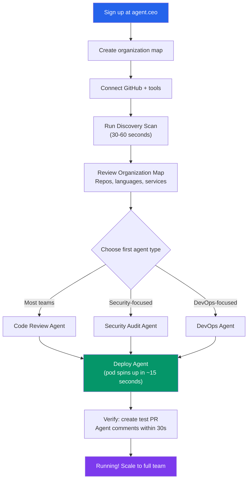
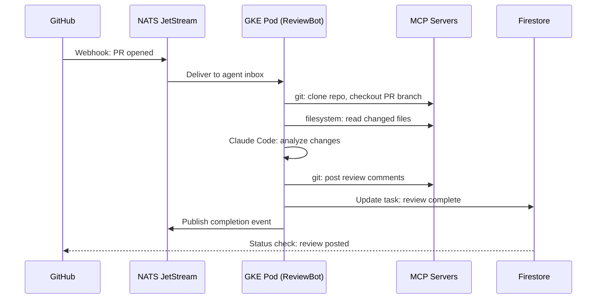

# Getting Started with agent.ceo in 5 Minutes

This is a hands-on tutorial. By the end, you will have a running AI agent reviewing pull requests, scanning code for security issues, or monitoring infrastructure, connected to your real tools and placed inside your organization map.

The sequence matters: create the organization, map how work moves, connect tools, then deploy the first agent. Agents become more useful when they know who owns what before they start acting.

## What You Will Build



Total time: under 5 minutes. No infrastructure to provision. No YAML to write (unless you want to). Everything runs on agent.ceo's managed GKE infrastructure.

## Prerequisites

- A GitHub account with at least one active repository
- A work email address
- 5 minutes

Optional but recommended:
- Slack workspace access (for agent notifications)
- Jira or Linear project board (for ticket integration)

## Step 1: Create Your Account

Navigate to [agent.ceo](https://agent.ceo) and click **Get Started Free**.

```bash
# Direct signup URL
https://agent.ceo/signup
```

Enter your work email and create your organization. Firebase Auth handles identity — you will get a JWT with your organization ID and role encoded as custom claims:

```json
{
  "orgId": "org_yourcompany",
  "role": "admin",
  "tier": "free_trial",
  "agentLimit": 1,
  "features": ["discovery-scan", "code-review", "dashboard"]
}
```

The free tier includes:
- 1 agent-week (one agent running continuously for 7 days)
- Full discovery scan
- All integrations
- Dashboard access
- No credit card required

## Step 2: Build the Organization Map

Before connecting tools, open `agent.ceo/map` and add the minimum structure agents need:

| Map Item | First-Pass Setup |
|----------|------------------|
| Teams | Engineering, Operations, Security, or the first team using agents |
| Users | Admin, operators, reviewers, and approvers |
| Agents | Planned agent roles, even before deployment |
| Systems | Repositories, services, cloud projects, or content workspaces |
| Escalations | Who gets asked when an agent is blocked or detects high risk |

You do not need a perfect org chart. You need enough operating context for the first agent to know where work belongs. Read the full breakdown in [How agent.ceo/map Turns an Org Chart into Agent Context](/blog/agent-ceo-organization-map).

## Step 3: Connect GitHub

From the Integrations dashboard, click **Connect GitHub** and authorize via OAuth.

```bash
# Permissions requested:
# - repo          (read/write for PR reviews and fixes)
# - read:org      (to map your team structure)
# - workflow      (to trigger and monitor CI runs)
# - read:packages (to scan dependencies)
```

You can grant access to specific repositories or your entire organization. For this tutorial, connecting 1-2 active repositories is enough.

**Optional integrations** (connect now or later):
- **Slack** — Agent sends status updates, asks clarifying questions, notifies on completed work
- **Jira/Linear** — Agent reads tickets, updates statuses, creates sub-tasks
- **GCP/AWS** — For infrastructure agents that manage cloud resources

## Step 4: Run the Discovery Scan

Click **Run Discovery Scan**. This takes 30-60 seconds and maps your engineering environment.

Here is what the scan actually analyzes:

```bash
$ agent-ceo discovery scan --org org_yourcompany

[1/6] Scanning repositories...
  Found 12 repositories across 2 GitHub orgs
  Languages: TypeScript (45%), Python (30%), Go (25%)

[2/6] Analyzing CI/CD pipelines...
  Found 3 pipeline configs (GitHub Actions)
  Build frequency: 8.3 builds/day average

[3/6] Mapping team structure...
  Found 8 contributors with commit activity in last 30 days
  Identified 3 code ownership areas

[4/6] Scanning infrastructure configs...
  Found: Dockerfile (4), docker-compose.yml (2), k8s manifests (7)
  Deployment targets: GKE (production), Docker Compose (dev)

[5/6] Analyzing PR patterns...
  Open PRs: 14
  Average review time: 18.4 hours
  PRs with no reviewer assigned: 6

[6/6] Identifying opportunities...
  HIGH: 6 PRs awaiting review (Code Review Agent recommended)
  HIGH: No automated security scanning detected (Security Agent recommended)
  MEDIUM: Manual deployments detected (DevOps Agent recommended)

Discovery complete. Organization map saved.
```

## Step 5: Review Your Organization Map

After the scan, you see a visual organization map. This is what the agent uses to understand your codebase and make contextual decisions.

```yaml
# Example organization map output
organization:
  name: "Acme Corp Engineering"
  repositories:
    total: 12
    active_last_30d: 8
  languages:
    - name: TypeScript
      percentage: 45
      repos: [web-app, api-gateway, shared-types, admin-panel]
    - name: Python
      percentage: 30
      repos: [ml-pipeline, data-ingestion, analytics-api]
    - name: Go
      percentage: 25
      repos: [auth-service, notification-service]
  services:
    - name: api-gateway
      language: Go
      deployment: GKE
      last_deploy: "2026-05-09T14:30:00Z"
    - name: web-app
      language: TypeScript
      deployment: Vercel
      last_deploy: "2026-05-10T09:15:00Z"
    - name: ml-pipeline
      language: Python
      deployment: "AWS Lambda"
      last_deploy: "2026-05-08T22:00:00Z"
  team:
    contributors: 8
    open_prs: 14
    avg_review_time_hours: 18.4
  opportunities:
    - type: code_review
      priority: high
      reason: "6 PRs have no reviewer assigned. Average review time is 18.4 hours."
    - type: security
      priority: high
      reason: "No automated security scanning detected in CI pipelines."
    - type: devops
      priority: medium
      reason: "Deployments appear manual. No GitOps or automated deploy pipeline."
```

Review this map. Edit anything the scan got wrong. This context shapes how your agent operates.

## Step 6: Deploy Your First Agent

Click **Deploy First Agent**. The platform recommends an agent type based on your scan results. For most teams, a Code Review Agent is the highest-impact starting point.

```yaml
# Default Code Review Agent configuration
agent:
  role: "code-reviewer"
  name: "ReviewBot"
  repositories:
    - all-connected
  triggers:
    - event: pull_request.opened
    - event: pull_request.synchronize
  capabilities:
    - code-review        # Line-by-line review with reasoning
    - style-check        # Consistency with codebase patterns
    - security-scan      # Dependency CVE checks, secret detection
    - test-coverage      # Identify untested code paths
  review_standards:
    max_review_time: "5m"          # Target: review within 5 minutes
    comment_style: "constructive"  # Suggest fixes, don't just flag
    auto_approve: false            # Always require human merge
  notifications:
    slack_channel: "#engineering"
    notify_on: [review_complete, issue_found]
```

Click **Deploy**. Behind the scenes, agent.ceo:

1. Creates a Firestore document for the agent config
2. Publishes an activation message to NATS JetStream
3. Spins up a GKE pod with the Claude Code CLI and MCP tools
4. Configures MCP servers for GitHub, filesystem, and git access
5. Agent loads its CLAUDE.md instructions and begins monitoring

Pod startup takes 12-18 seconds for a cold start.

```bash
$ agent-ceo agents status

AGENT        STATUS    POD                          UPTIME    TASKS
ReviewBot    Active    agent-reviewer-7f8d9c4b2a    2m        0 pending
```

## Step 7: Verify It Works

Create a test pull request and watch the agent respond.

```bash
# Create a test branch
git checkout -b test/agent-verification

# Make a change (intentionally imperfect for the agent to catch)
cat > test-handler.js << 'EOF'
const express = require('express');
const app = express();

// TODO: add input validation
app.post('/api/users', (req, res) => {
  const { email, password } = req.body;
  // Storing password in plain text - agent should flag this
  db.users.insert({ email, password, created: Date.now() });
  res.json({ success: true });
});

app.listen(3000);
EOF

git add test-handler.js
git commit -m "feat: add user creation endpoint"
git push origin test/agent-verification

# Create the PR
gh pr create \
  --title "feat: add user creation endpoint" \
  --body "Adding basic user creation. Please review."
```

Within 30 seconds, the agent comments on your PR:

```markdown
## Code Review — ReviewBot

### Security Issues (2 found)

**CRITICAL: Plain-text password storage** (line 8)
Password is stored directly without hashing. Use bcrypt or argon2:
```suggestion
const hashedPassword = await bcrypt.hash(password, 12);
db.users.insert({ email, password: hashedPassword, created: Date.now() });
```

**HIGH: No input validation** (line 6)
`req.body` is used without validation. Missing email format check
and password strength requirements.

### Recommendations
- Add `express-validator` or `zod` for input validation
- Add rate limiting to prevent brute-force account creation
- Return 201 status code for resource creation (not 200)
- Add error handling for database failures

_Reviewed by ReviewBot (agent.ceo) in 12 seconds_
```

The agent caught the plain-text password, missing validation, and incorrect status code — in 12 seconds, not 18.4 hours.

## What Happens Under the Hood

When you deployed the agent, here is the actual infrastructure that was created:



Each agent runs in an isolated Kubernetes pod with its own Claude Code CLI instance. The agent has a full development environment — it can clone repos, run tests, execute scripts, and submit changes. MCP servers provide structured tool access with per-agent permission boundaries.

## Scaling Beyond One Agent

Once your first agent is running, here is the path to a full team:

**Week 1:** Code Review Agent reviews all PRs. You build confidence in agent quality.

**Week 2:** Add a Security Agent. It runs continuous dependency scans and posts alerts. At GenBrain, our CSO agent found 14 HIGH severity vulnerabilities in its first overnight scan.

**Week 3:** Add a DevOps Agent. Automated deployments, infrastructure monitoring, scaling. The agent handles the 3 AM pages so your team can sleep.

**Month 2:** Consider executive agents (CEO, CTO) for coordination across the fleet. This is where you transition from "AI-assisted" to "cyborgenic" — agents coordinating with each other, not just executing human-assigned tasks.

GenBrain AI runs 7 agents this way: CEO, CTO, CSO, Backend, Frontend, DevOps, and Marketing. Together they have produced 143 blog posts, 309 LinkedIn posts, 155 Twitter threads, and manage the entire engineering lifecycle. One founder provides direction. The agents execute.

## Troubleshooting

**Agent shows "Pending" for more than 60 seconds:**
- Check GitHub OAuth permissions — the agent needs `repo`, `read:org`, and `workflow` scopes
- Run `agent-ceo agents logs ReviewBot` to see pod startup logs
- Verify NATS connectivity: `agent-ceo system health`

**Discovery scan finds no repositories:**
- Re-authorize GitHub with organization access enabled
- Check Settings > Integrations > GitHub > Connected Repositories

**Agent does not comment on PRs:**
- Verify the agent watches the correct repository: `agent-ceo agents config ReviewBot`
- Check that PR triggers include `pull_request.opened`
- Look for webhook delivery failures in GitHub Settings > Webhooks

**Agent comments are too generic:**
- Update the agent's CLAUDE.md with your team's code review standards
- Add repository-specific context (architecture docs, style guides)
- The agent improves as it learns your codebase patterns across sessions (memory persists in Firestore)

## Next Steps

- **[Build Your First AI Agent Team](/blog/first-ai-agent-team)** — Scale from 1 agent to a coordinated fleet
- **[Organization Map](/blog/agent-ceo-organization-map)** — Model users, teams, systems, and escalation paths
- **[Architecture Deep-Dive](/blog/architecture-agent-ceo)** — Understand GKE, NATS, Firestore, and MCP under the hood
- **[Cyborgenic Organizations](/blog/cyborgenic-organizations)** — The organizational model behind agent.ceo
- **[Security Review Setup](/blog/setting-up-ai-security-reviews)** — Add automated security auditing

---

## Try agent.ceo

**SaaS** — Get started with 1 free agent-week at [agent.ceo](https://agent.ceo).

**Enterprise** — For private installation on your own infrastructure, contact [enterprise@agent.ceo](mailto:enterprise@agent.ceo).

---
*agent.ceo is built by [GenBrain AI](https://genbrain.ai) — a GenAI-first autonomous agent orchestration platform. General inquiries: hello@agent.ceo | Security: security@agent.ceo*
